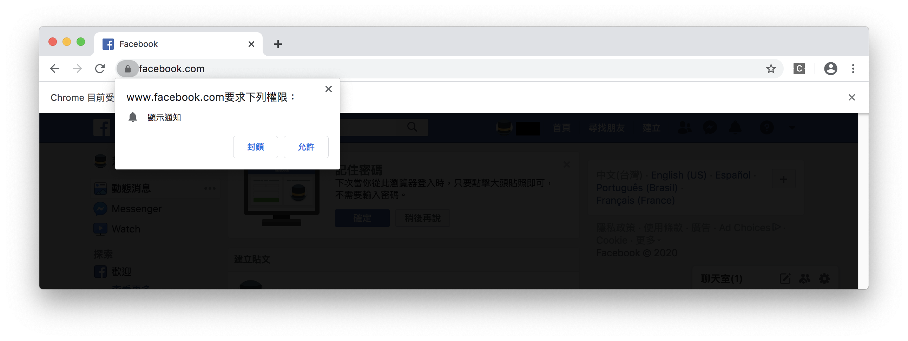
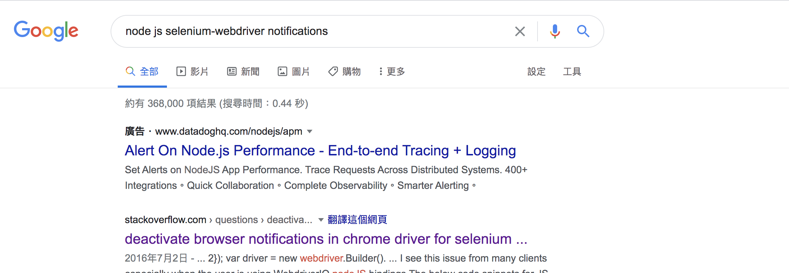
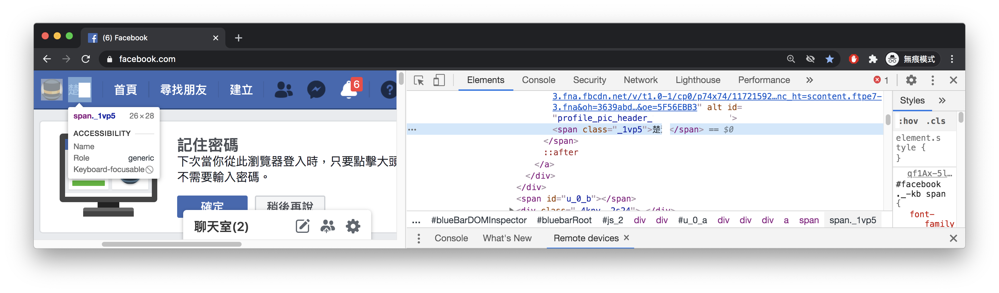
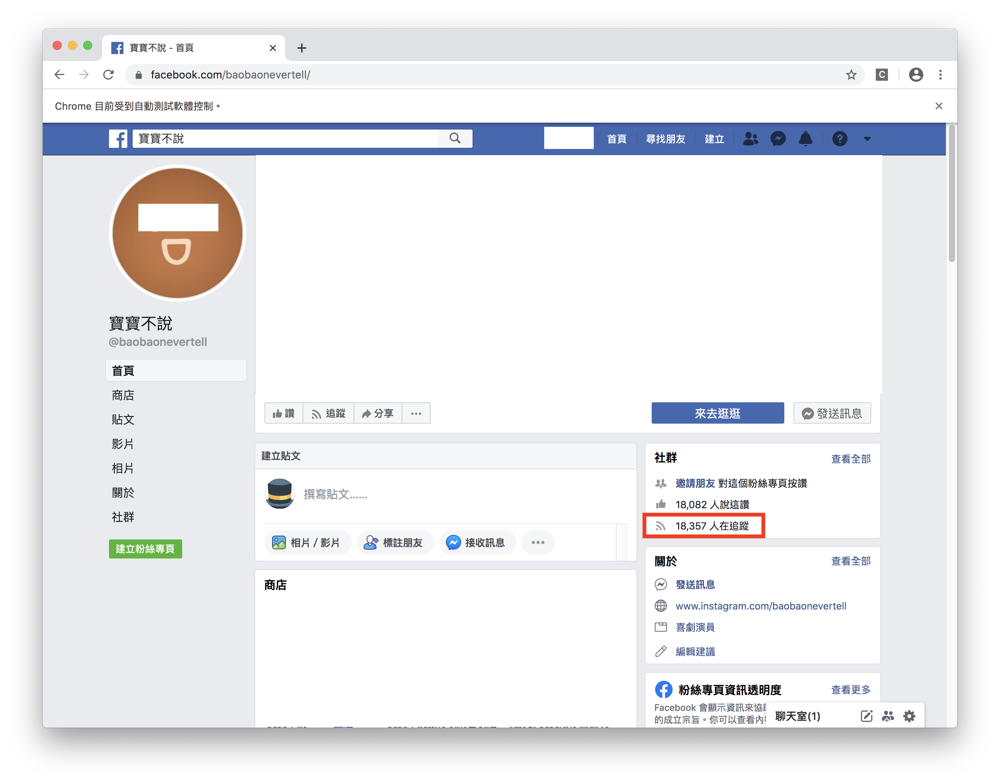
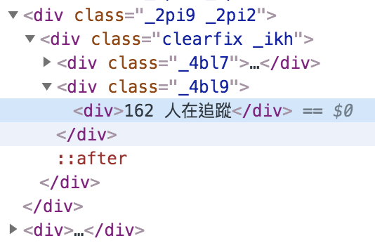
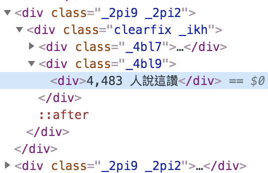
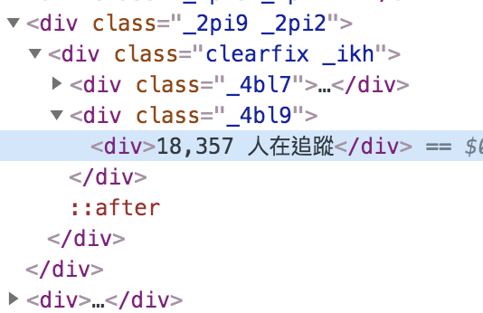

#### [回目錄](../README.md)
## Day10 關閉擾人彈窗，分析FB粉專結構並取得追蹤人數資訊

🤔 閱讀文章的方式？
----
從今天開始的實作會越來越複雜，與其用上帝視角提供一套完美的解決方案，我認為向讀者呈現前進每一步會遇到的問題更有意義  
因此知識會分散在解決問題的過程中，就像這個系列文撰寫的初衷並不是教一個技術而是培養你解決問題的能力

🏆 今日目標
----
1. 關閉擾人彈窗
2. 分析FB粉專結構並取得追蹤人數資訊
    * 學會判斷使用者是否登入成功
    * 學會使用class找出網頁元件
    * 關閉瀏覽器

🚫關閉擾人彈窗
----
昨天登入FB的時候應該大部分的人畫面都會長這樣  
  

在彈窗存在的狀態下是無法抓取網頁元件的(充滿嘗試精神的讀者的可以嘗試看看)，所以你必須要關閉這個彈窗  
>建議你可以先在Google下關鍵字： **nodejs selenium-webdriver notifications**  
想要解決一個問題，通常直接搜尋網路資源會比看官方文件來的更快，像是關閉通知這個屬於常見問題，Google的前幾結果通常就能找到解答  
 

1. 在這我們要更改chrome這個瀏覽器notifications的設定
    ```js
    const chrome = require('selenium-webdriver/chrome');
    const options = new chrome.Options();
    options.setUserPreferences({ 'profile.default_content_setting_values.notifications': 1 });//因為FB會有notifications干擾到爬蟲，所以要先把它關閉
    ```
2. 並且讓chrome瀏覽器會依照這個設定建立
    ```js
    let driver = new webdriver.Builder().forBrowser("chrome").withCapabilities(options).build();// 建立這個broswer的類型
    ```
加入上面對瀏覽器的設定後在終端機(Terminal)執行 **yarn start** 你會發現彈窗提示不見了

分析FB粉專結構並取得追蹤人數資訊
------------------------
* 我們先將**粉絲團取資料**分成幾個步驟：
    1. 進入粉絲團網頁
    2. 找出追蹤者人數的元件位置
    3. 關閉瀏覽器

    >建議大家可以自己先按照昨天所提供的方法來實做看看會遇到什麼樣的問題，再來看下面我我所遇到的狀況及解決方式  

1. **進入粉絲團網頁**  
    登入後導向網頁到粉絲專頁非常簡單，兩行程式碼就解決
    ```js
    //登入成功後要前往粉專頁面
    const fanpage = "https://www.facebook.com/baobaonevertell/" // 筆者是寶寶不說的狂熱愛好者
    await driver.get(fanpage)
    ```
    但實際執行後你會發現很詭異的事情，就是在你登入成功前你的網頁就直接導向到粉絲專頁了  
    這是因為FB在執行登入作業時需要**等待server回應資料確認使用者身份**，所以你在按下登入的按鈕後要先給瀏覽器一些時間回應  
    * **判斷使用者是否登入成功**  
        * 從FB有什麼元件是**登入後才有可能出現**的這個方向去思考，你就能想到一定要在登入後Facebook才會有名字顯示這件事 
          
        * 只要加上 **判斷名字區塊已經存在才能繼續** 這個邏輯就能保證我們成功登入後再前往粉絲頁  
            ```js
            //因為登入這件事情要等server回應，你直接跳轉粉絲專頁會導致登入失敗
            await driver.wait(until.elementLocated(By.xpath(`//*[contains(@class,"_1vp5")]`)))//登入後才會有右上角的名字，我們以這個來判斷是否登入

            //登入成功後要前往粉專頁面
            const fanpage = "https://www.facebook.com/baobaonevertell/" // 筆者是寶寶不說的狂熱愛好者
            await driver.get(fanpage)
            ```
2. **找出追蹤者人數的元件位置**
      
    你把紅框位置的Xpath複製出來會長這樣
    ```
    //*[@id="PagesProfileHomeSecondaryColumnPagelet"]/div/div[1]/div/div[1]/div[4]/div/div[2]/div
    ```
    如果你只要爬這個粉絲團的話用這個Xpath就足夠了，但你如果常逛粉絲團，你會發現每個粉絲團顯示追蹤人數的Xpath位置都不一樣  
    * 下面提供幾個粉絲團網址你可以點進去試試看  
        [小姐非常有事](https://www.facebook.com/missunexpected2015/)
        ```
        //*[@id="PagesProfileHomeSecondaryColumnPagelet"]/div/div[1]/div/div[2]/div[4]/div/div[2]/div
        ```
        [人類圖澳洲](https://www.facebook.com/HumanDesignAu/)
        ```
        //*[@id="PagesProfileHomeSecondaryColumnPagelet"]/div/div[3]/div/div[2]/div[4]/div/div[2]/div
        ```
    你仔細看會發現 **每個Xpath都會有細微的不同** ，所以昨天教的Xpath在這裡就失靈了，我們需要換一個方法來判斷，也就是該元件的class結構  
    * **使用class找出網頁元件**  
        * 下面的幾張圖你可以觀察到這個追蹤者的資訊都在相同的 **class="_4bl9"** 之下  
        
        
          
        * 但是Facebook有很多的元件都使用到這個class所以我們需要把所有符合的class都抓下來，透過分析字串(xxx人在追蹤)來抓取正確的資訊  

        #### index.js
        ```js
        ...
        let fb_trace = 0;//這是紀錄FB追蹤人數
        //因為考慮到登入之後每個粉專顯示追蹤人數的位置都不一樣，所以就採用全抓在分析
        const fb_trace_xpath = `//*[@id="PagesProfileHomeSecondaryColumnPagelet"]//*[contains(@class,"_4bl9")]`
        const fb_trace_eles = await driver.wait(until.elementsLocated(By.xpath(fb_trace_xpath)), 5000)//我們採取5秒內如果抓不到該元件就跳出的條件
        for (const fb_trace_ele of fb_trace_eles) {
            const fb_text = await fb_trace_ele.getText()
            if (fb_text.includes('人在追蹤')) {
                fb_trace = fb_text
                break
            }
        }
        console.log(`追蹤人數：${fb_trace}`)
        ...
        ```
        * 因為迴圈中用到await，所以這裡使用的是 **for/of迴圈**
        >儘量不要在forEach中使用 aysnc/await，因為他還需要透過一個callback函式才能使用，邏輯表現不如for/of來的直觀

3. **關閉瀏覽器**  
    如果你執行完後想要關閉瀏覽器只需要加入這行程式  
    ```js
    driver.quit();
    ```
🚀執行程式
----
在專案資料夾的終端機(Terminal)執行指令
```sh
yarn start
```
你會看到Facebook自動登入 &rarr; 跳轉到粉絲頁 &rarr; 關閉，如果能正確輸出該粉專的追蹤人數你就成功嚕～  


相信到這裡大家都能成功地抓出粉專的追蹤者人數了，並對於這個爬蟲專案應該充滿了信心吧！


ℹ️ 專案原始碼
----
* 今天的完整程式碼可以在[這裡](https://github.com/dean9703111/ithelp_30days/day10)找到喔
* 我也貼心地把昨天的把昨天的程式碼打包成[壓縮檔](https://github.com/dean9703111/ithelp_30days/sampleCode/day9_sample_code.zip)，你可以用裡面乾淨的環境來實作今天的功能喔
    * 請記得在終端機下指令 **yarn** 才會把之前的套件安裝
    * 調整你.env檔填上FB登入資訊
    
📖 參考資源
----
1. [Using async/await with a forEach loop](https://stackoverflow.com/questions/37576685/using-async-await-with-a-foreach-loop)
2. [JavaScript 的 4 種陣列遍歷方法： for VS forEach() VS for/in VS for/of](https://www.jishuwen.com/d/2M0c/zh-tw)
### [Day11 依樣畫葫蘆，完成Instagram登入並取得追蹤人數](/day11/README.md)