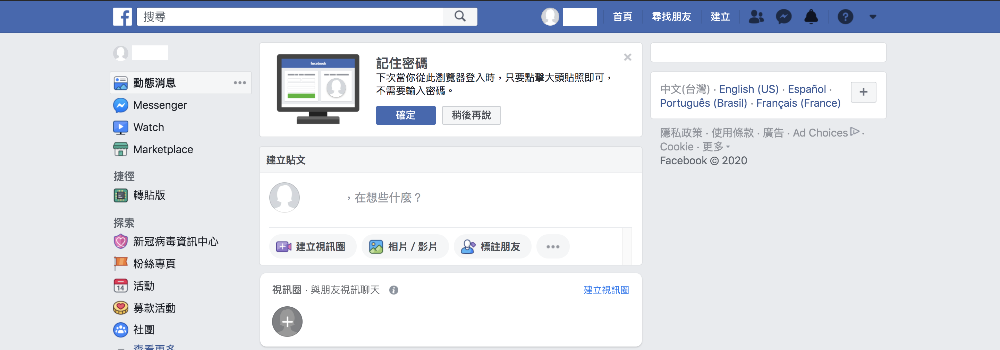
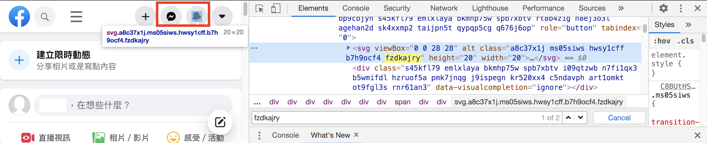
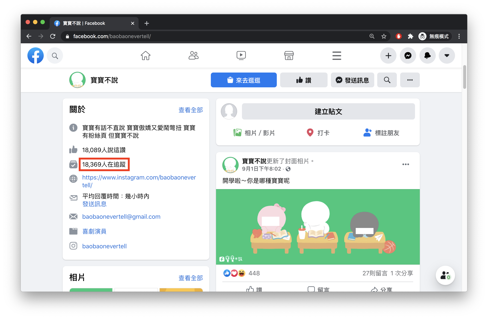
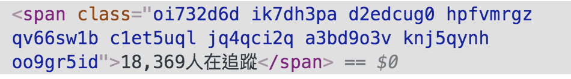

#### [回目錄](../README.md)
## Day10 關閉擾人彈窗，分析FB粉專結構並取得追蹤人數資訊

🤔 筆者有話先說
----
從今天開始的實作會越來越複雜，與其用上帝視角提供一套完美的解決方案，我認為向讀者呈現前進每一步會遇到的問題更有意義  
因此知識會分散在解決問題的過程中，就像這個系列文撰寫的初衷並不是教一個技術而是培養你解決問題的能力

🏆 今日目標
----
1. 關閉擾人彈窗
2. 知道自己的FB是經典版本還是新版
3. 分析FB粉專結構並取得追蹤人數資訊
    * 學會判斷使用者是否登入成功
    * 學會使用class找出網頁元件
    * 關閉瀏覽器


🚫關閉擾人彈窗
----
昨天登入FB的時候應該大部分的人畫面都會長這樣  
  

在彈窗存在的狀態下是無法抓取網頁元件的(充滿嘗試精神的讀者的可以嘗試看看)，所以你必須要關閉這個彈窗  
>建議你可以先在Google下關鍵字： **nodejs selenium-webdriver notifications**  
想要解決一個問題，通常直接搜尋網路資源會比看官方文件來的更快，像是關閉通知這個屬於常見問題，Google的前幾結果通常就能找到解答  

1. 更改chrome這個瀏覽器notifications的設定
    ```js
    const chrome = require('selenium-webdriver/chrome');
    const options = new chrome.Options();
    options.setUserPreferences({ 'profile.default_content_setting_values.notifications': 1 });//因為FB會有notifications干擾到爬蟲，所以要先把它關閉
    ```
2. 並且讓chrome瀏覽器會依照這個設定建立
    ```js
    let driver = new webdriver.Builder().forBrowser("chrome").withCapabilities(options).build();// 建立這個broswer的類型
    ```
3. index.js加入上面對瀏覽器的設定後在終端機(Terminal)執行指令
    ```sh
    yarn start
    ```
    你會發現彈窗提示不見了!

❗ 知道自己的FB是經典版本還是新版
----
FB網頁更新非常頻繁，到現在更**有經典版以及新版的區別**，如果不清楚自己是什麼版本可以看下面的畫面做判斷
* 經典版
      
* 新版
      

因為有經典版(classic)及新版(new)的區別，所以我們在env環境設定檔需要增加一個參數(**FB_VERSION**)來識別，檔案調整如下：
#### .env
```env
#填寫自己登入FB的真實資訊(建議開小帳號來實驗，因為帳號使用太頻繁會被官方鎖住)
FB_USERNAME='fb username'
FB_PASSWORD='fb password'

#FB跑經典版還是新版(classic/new)
FB_VERSION='new'
```

**接下來的畫面也會依據經典版以及新版做相關的說明**

📄 分析FB粉專結構並取得追蹤人數資訊
------------------------
面對所有的問題，我一律建議把大問題先拆解成小問題，小問題再細分成功能項目，這樣同一時間只需集中注意力完成一個功能，這樣的做法能帶給你階段性成就感，也讓你大腦有喘息的空間  

像是今天要做的功能 **粉絲團取資料** 可以拆分成幾個步驟：
1. 進入粉專頁面
2. 找出追蹤者人數的元件位置
3. 關閉瀏覽器
>建議大家可以自己先按照昨天所提供的方法來實做看看會遇到什麼樣的問題，再來看下面我我所遇到的狀況及解決方式  


🤔 進入粉專頁面
----
登入後導向網頁到粉絲專頁非常簡單，兩行程式碼就解決
```js
//登入成功後要前往粉專頁面
const fanpage = "https://www.facebook.com/baobaonevertell/" // 筆者是寶寶不說的狂熱愛好者
await driver.get(fanpage)
```
但實際執行後你會發現很詭異的事情，在你登入成功前網頁就直接導向到粉絲專頁了😱  
這是因為FB在執行登入作業時需要**等待server回應資料確認使用者身份**，所以要在按下登入的按鈕後**判斷使用者登入成功後才能再進入下一個步驟**
* **判斷使用者是否登入成功**  
    * 從FB有什麼元件是**登入後才有可能出現**的這個方向去思考 
        * 經典版：一定要在登入後Facebook才會有名字顯示，class為**_1vp5**
              
        * 新版：一定要在登入後Facebook才會有訊息及通知區塊顯示，共同的class為**fzdkajry**
              
        * 為了方便區分經典版/新版的FB，我們增加一個函式來回傳各自的爬蟲路徑
            ```js
            function getCrawlerPath () {
                if (process.env.FB_VERSION === 'new') {//如果是新版FB
                    return {
                        "fb_head_path": `//*[contains(@class,"fzdkajry")]`
                    }
                } else {//如果為設定皆默認為舊版
                    return {
                        "fb_head_path": `//*[contains(@class,"_1vp5")]`
                    }
                }
            }
            ```
    * 加上 **判斷顯示名字的元件已經存在才能繼續** 這個邏輯就能保證我們成功登入後再前往粉絲頁  
        ```js
        // FB有經典版以及新版的區分，兩者的爬蟲路徑不同，我們藉由函式取得各自的路徑
        const { fb_head_path } = getCrawlerPath();

        //因為登入這件事情要等server回應，你直接跳轉粉絲專頁會導致登入失敗
        await driver.wait(until.elementLocated(By.xpath(fb_head_path)))//登入後才會有右上角的名字，我們以這個來判斷是否登入

        //登入成功後要前往粉專頁面
        const fanpage = "https://www.facebook.com/baobaonevertell/" // 筆者是寶寶不說的狂熱愛好者
        await driver.get(fanpage)
        ```

🔍找出追蹤者人數的元件位置
----
* 先在粉專頁面找出追蹤人數在哪個位置
    * 經典版
          
        * 紅框位置Xpath的路徑
            ```
            //*[@id="PagesProfileHomeSecondaryColumnPagelet"]/div/div[1]/div/div[1]/div[4]/div/div[2]/div
            ```
        * 如果你只要爬這個粉絲團的話用這個Xpath就足夠了，但你如果常逛粉絲團，你會發現**不是每個粉絲團顯示追蹤人數的Xpath位置都一樣**，下面的粉絲團網址你可以點進去試試看：  
            * [小姐非常有事](https://www.facebook.com/missunexpected2015/)
            ```
            //*[@id="PagesProfileHomeSecondaryColumnPagelet"]/div/div[1]/div/div[2]/div[4]/div/div[2]/div
            ```
            * [人類圖澳洲](https://www.facebook.com/HumanDesignAu/)
            ```
            //*[@id="PagesProfileHomeSecondaryColumnPagelet"]/div/div[3]/div/div[2]/div[4]/div/div[2]/div
            ```
            仔細一看就會發現 **每個Xpath都會有細微的不同** ，所以昨天教的Xpath在這裡就失靈了，我們需要換一個方法來判斷，也就是該元件的class結構  
        * **使用class找出網頁元件**  
            * 下面的幾張圖你可以觀察到這個追蹤者的資訊都在相同的 **class="_4bl9"** 之下  
            
            
            

            * 但是Facebook有很多的元件都使用到這個class所以我們需要**把所有符合的class都抓下來，透過分析字串(xxx人在追蹤)來得到正確的資訊**  
    * 新版
          
        * 紅框位置Xpath的路徑
            ```
            //*[@id="mount_0_0"]/div/div[1]/div[1]/div[3]/div/div/div[1]/div[1]/div[4]/div[2]/div/div[1]/div[2]/div[1]/div/div/div/div[2]/div[4]/div/div/div/div[2]/div/div/span/span
            ```
        * **與經典版相同的邏輯**：不是每個粉絲團的Xpath都一樣，所以我們需要改用class結構來分析
        * **與經典版相同的邏輯**：你會很崩潰的發現他的class有夠多...
            
            * **在發現這些class都與很多facebook元件共用的狀態下，你要思考的是哪個元件被共用的次數是最少的**，經由這樣的邏輯思考後，發現 **class="knvmm38d"** 是裡面共用次數最少的
    * 為了方便區分經典版/新版的FB，我們將上面的路徑新增到 **getCrawlerPath** 回傳參數中
        ```js
        function getCrawlerPath () {
            if (process.env.FB_VERSION === 'new') {//如果是新版FB
                return {
                    "fb_head_path": `//*[contains(@class,"fzdkajry")]`,
                    "fb_trace_path": `//*[contains(@class,"knvmm38d")]`
                }
            } else {//如果為設定皆默認為舊版
                return {
                    "fb_head_path": `//*[contains(@class,"_1vp5")]`,
                    "fb_trace_path": `//*[@id="PagesProfileHomeSecondaryColumnPagelet"]//*[contains(@class,"_4bl9")]`
                }
            }
        }
        ```
    * 在確認需要分析的class之後，只要把對應的class全部取出來轉換成文字，**在for/of迴圈用字串分析**來判定是否為我們需要的資訊
        ```js
        ...
        let fb_trace = 0;//這是紀錄FB追蹤人數
        //因為考慮到登入之後每個粉專顯示追蹤人數的位置都不一樣，所以就採用全抓在分析
        const fb_trace_eles = await driver.wait(until.elementsLocated(By.xpath(fb_trace_path)), 5000)//我們採取5秒內如果抓不到該元件就跳出的條件條件
        for (const fb_trace_ele of fb_trace_eles) {
            const fb_text = await fb_trace_ele.getText()
            if (fb_text.includes('人在追蹤')) {
                fb_trace = fb_text
                break
            }
        }
        console.log(`追蹤人數：${fb_trace}`)
        ...
        ```
    >儘量不要在forEach中使用 aysnc/await，因為他還需要透過一個callback函式才能使用，邏輯表現不如for/of來的直觀
    
👌完成爬蟲後關閉瀏覽器
----
確認爬蟲都執行完畢後，用下面這行程式即可關閉瀏覽器
```js
driver.quit();
```

🚀執行程式
----
在專案資料夾的終端機(Terminal)執行指令
```sh
yarn start
```
你會看到Facebook自動登入 &rarr; 跳轉到粉絲頁 &rarr; 關閉，如果能正確輸出該粉專的追蹤人數你就成功嚕～  


相信到這裡大家都能成功地抓出粉專的追蹤者人數了，並對於這個爬蟲專案應該充滿了信心吧！


ℹ️ 專案原始碼
----
* 今天的完整程式碼可以在[這裡](https://github.com/dean9703111/ithelp_30days/tree/master/day10)找到喔
* 我也貼心地把昨天的把昨天的程式碼打包成[壓縮檔](https://github.com/dean9703111/ithelp_30days/tree/master/sampleCode/day9_sample_code.zip)，你可以用裡面乾淨的環境來實作今天的功能喔
    * 請記得在終端機下指令 **yarn** 才會把之前的套件安裝
    * 調整.env檔
        * 填上FB登入資訊
        * 填上FB版本(classic/new)
    
📖 參考資源
----
1. [Using async/await with a forEach loop](https://stackoverflow.com/questions/37576685/using-async-await-with-a-foreach-loop)
2. [JavaScript 的 4 種陣列遍歷方法： for VS forEach() VS for/in VS for/of](https://www.jishuwen.com/d/2M0c/zh-tw)
<br>

>*免責聲明:文章技術僅抓取公開數據作爲研究，任何組織和個人不得以此技術盜取他人智慧財產、造成網站損害，否則一切后果由該組織或個人承擔。作者不承擔任何法律及連帶責任！*
### [Day11 依樣畫葫蘆，完成Instagram登入並取得追蹤人數](/day11/README.md)