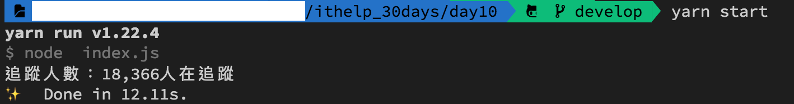

#### [回目錄](../README.md)
### Day10 小孩子才選擇，我要一隻程式爬完FB & IG粉專

不知道有沒有讀者一隻程式爬完 FB & IG 的粉專呢?  
* 如果你是把兩天文章複製貼上直接爬的話我想會遇到很多問題，如果你是一次跳出兩個瀏覽器在跑，我想會因為其中一個瀏覽器先觸發了**driver.quit()**而導致另一個還沒跑完的瀏覽器無法讀取元件而掛掉  
```
WebDriverError: element not interactable
```
* 如果你把他改成一個瀏覽器，跑完FB粉專再跑IG粉專應該又會套出跨網域(CORS)問題的錯誤(目前只有windows作業系統才會遇到)  
跨網域的問題是網域切換時會因為一些安全性的疑慮而拒絕跳轉，像是從 https://www.facebook.com/ 跳轉到 https://www.instagram.com 就會遇到這個問題  
這個問題可以在你建立瀏覽器的時候加上設定如下
```js
let driver = new webdriver.Builder().forBrowser("chrome").withCapabilities(options,
    { acceptSslCerts: true, acceptInsecureCerts: true }//這是為了解決跨網域問題
  ).build();
```

如果你沒有遇到以上的問題，你可以參考一下我目前的解法，我偏向開一個瀏覽器來處理，因為跑爬蟲是會消耗你電腦本身的記憶體以及網路流量  
我希望電腦再跑爬蟲的時候不要影響我做其他事情的效率，同時一個瀏覽器在跑如果遇到問題你也更方便去進行除錯  
下面是我目前的範例程式，雖然他的確可以正常運作，但是對程式有敏感度的小夥伴應該已經發現這隻程式哪裡需要優化了  

```js
require('dotenv').config(); //載入.env環境檔
const path = require('path');//載入路徑
const fs = require("fs");//讀取檔案用
//請在.env檔案填寫自己登入FB的真實資訊(建議開小帳號，因為如果爬蟲使用太頻繁你的帳號會被鎖住)
const ig_username = process.env.IG_USERNAME
const ig_userpass = process.env.IG_PASSWORD
const fb_username = process.env.FB_USERNAME
const fb_userpass = process.env.FB_PASSWORD

const webdriver = require('selenium-webdriver'), // 加入虛擬網頁套件
    By = webdriver.By,//你想要透過什麼方式來抓取元件，通常使用xpath、css
    until = webdriver.until;//直接抓到這個元件

const chrome = require('selenium-webdriver/chrome');
const options = new chrome.Options();
options.setUserPreferences({ 'profile.default_content_setting_values.notifications': 1 });//因為FB會有notifications干擾到爬蟲，所以要先把它關閉

async function loginFacebookGetTrace (driver, By, until) {
    const web = 'https://www.facebook.com/login';//我們要前往FB
    await driver.get(web)//在這裡要用await確保打開完網頁後才能繼續動作

    //填入fb登入資訊
    const fb_email_ele = await driver.wait(until.elementLocated(By.xpath(`//*[@id="email"]`)));
    fb_email_ele.sendKeys(fb_username)
    const fb_pass_ele = await driver.wait(until.elementLocated(By.xpath(`//*[@id="pass"]`)));
    fb_pass_ele.sendKeys(fb_userpass)

    //抓到登入按鈕然後點擊
    const login_elem = await driver.wait(until.elementLocated(By.xpath(`//*[@id="loginbutton"]`)))
    login_elem.click()

    //因為登入這件事情要等server回應，你直接跳轉粉絲專頁會導致登入失敗
    await driver.wait(until.elementLocated(By.xpath(`//*[contains(@class,"_1vp5")]`)))//登入後才會有右上角的名字，我們以這個來判斷是否登入

    //登入成功後要前往粉專頁面
    const fanpage = "https://www.facebook.com/baobaonevertell/" // 筆者是寶寶不說的狂熱愛好者
    await driver.get(fanpage)
    let fb_trace = 0;//這是紀錄FB追蹤人數
    //因為考慮到登入之後每個粉專顯示追蹤人數的位置都不一樣，所以就採用全抓在分析
    const fb_trace_xpath = `//*[@id="PagesProfileHomeSecondaryColumnPagelet"]//*[contains(@class,"_4bl9")]`
    const fb_trace_eles = await driver.wait(until.elementsLocated(By.xpath(fb_trace_xpath)), 5000)//我們採取5秒內如果抓不到該元件就跳出的條件
    for (const fb_trace_ele of fb_trace_eles) {
        const fb_text = await fb_trace_ele.getText()
        if (fb_text.includes('人在追蹤')) {
            fb_trace = fb_text
            break
        }
    }
    console.log(`FB追蹤人數：${fb_trace}`)
}
async function loginInstagramGetTrace (driver, By, until) {
    const web = 'https://www.instagram.com/accounts/login';//前往IG登入頁面
    await driver.get(web)//在這裡要用await確保打開完網頁後才能繼續動作

    //填入ig登入資訊
    let ig_username_ele = await driver.wait(until.elementLocated(By.css("input[name='username']")));
    ig_username_ele.sendKeys(ig_username)
    let ig_password_ele = await driver.wait(until.elementLocated(By.css("input[name='password']")));
    ig_password_ele.sendKeys(ig_userpass)

    //抓到登入按鈕然後點擊
    const login_elem = await driver.wait(until.elementLocated(By.css("button[type='submit']")))
    login_elem.click()

    //登入後才會有右上角的頭像，我們以這個來判斷是否登入
    await driver.wait(until.elementLocated(By.xpath(`//*[@id="react-root"]//*[contains(@class,"_47KiJ")]`)))

    //登入成功後要前往粉專頁面
    const fanpage = "https://www.instagram.com/baobaonevertell/" // 筆者是寶寶不說的狂熱愛好者
    await driver.get(fanpage)

    let ig_trace = 0;//這是紀錄IG追蹤人數
    const ig_trace_xpath = `//*[@id="react-root"]/section/main/div/header/section/ul/li[2]/a/span`
    const ig_trace_ele = await driver.wait(until.elementLocated(By.xpath(ig_trace_xpath)), 5000)//我們採取5秒內如果抓不到該元件就跳出的條件    
    // ig因為當人數破萬時文字不會顯示，所以改抓title
    ig_trace = await ig_trace_ele.getAttribute('title')
    console.log(`IG追蹤人數：${ig_trace}`)
}

function checkDriver () {
    try {
        chrome.getDefaultService()//確認是否有預設        
    } catch {
        console.log('找不到預設driver!');
        const file_path = '../chromedriver.exe'//'../chromedriver.exe'是我的路徑
        console.log(path.join(__dirname, file_path));//請確認印出來日誌中的位置是否與你路徑相同
        if (fs.existsSync(path.join(__dirname, file_path))) {//確認路徑下chromedriver.exe是否存在            
            const service = new chrome.ServiceBuilder(path.join(__dirname, file_path)).build();//設定driver路徑
            chrome.setDefaultService(service);
            console.log('設定driver路徑');
        } else {
            console.log('無法設定driver路徑');
        }
    }
}

async function crawler () {
    checkDriver()// 檢查Driver是否是設定

    let driver = new webdriver.Builder().forBrowser("chrome").withCapabilities(options).build();// 建立這個broswer的類型
    //考慮到ig在不同螢幕寬度時的Xpath不一樣，所以我們要在這裡設定統一的視窗大小
    driver.manage().window().setRect({ width: 1280, height: 800, x: 0, y: 0 });

    //因為有些人是用FB帳號登入IG，為了避免增加FB登出的動作，所以採取先對IG進行爬蟲
    await loginInstagramGetTrace(driver, By, until)
    await loginFacebookGetTrace(driver, By, until)

    driver.quit();
}

crawler()
```
接下來在終端機輸入 **yarn start** 指令，你就能夠看到FB & IG的追蹤人數嚕～  
  

歡迎大家在下方留言你覺得這隻程式你認為應該要優化的地方(請鞭小力一點QQ)  
明天會講程式碼的**重構**，透過重構我們可以更有效率的掌握程式

上面這的程式碼可以在[這裡](https://github.com/dean9703111/ithelp_30days/day10)找到喔
你可以整個專案clone下來  
```
git clone https://github.com/dean9703111/ithelp_30days.git
```
如果你已經clone過了，那你每天pull就能取得更新的資料嚕  
```
git pull origin master
cd day10
調整你.env檔填上 FB & IG 登入資訊
yarn
yarn start
```
### [Day11 重構程式碼，讓合作夥伴對你比讚](../day11/README.md)