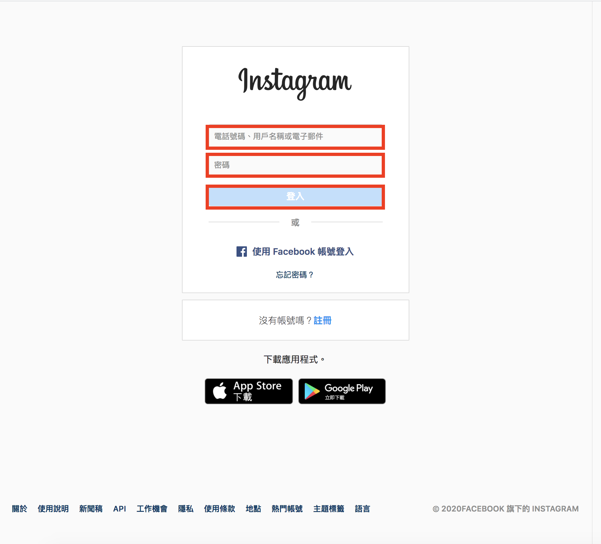
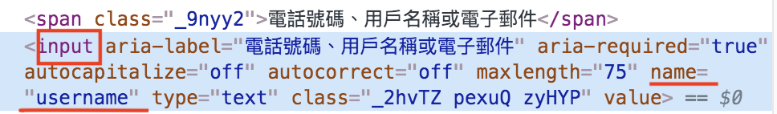
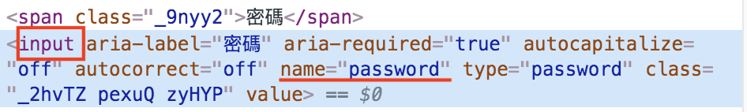
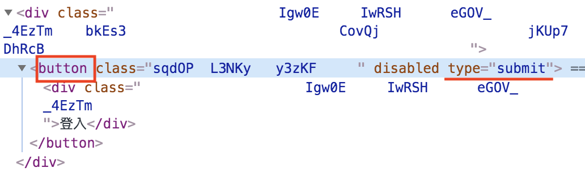
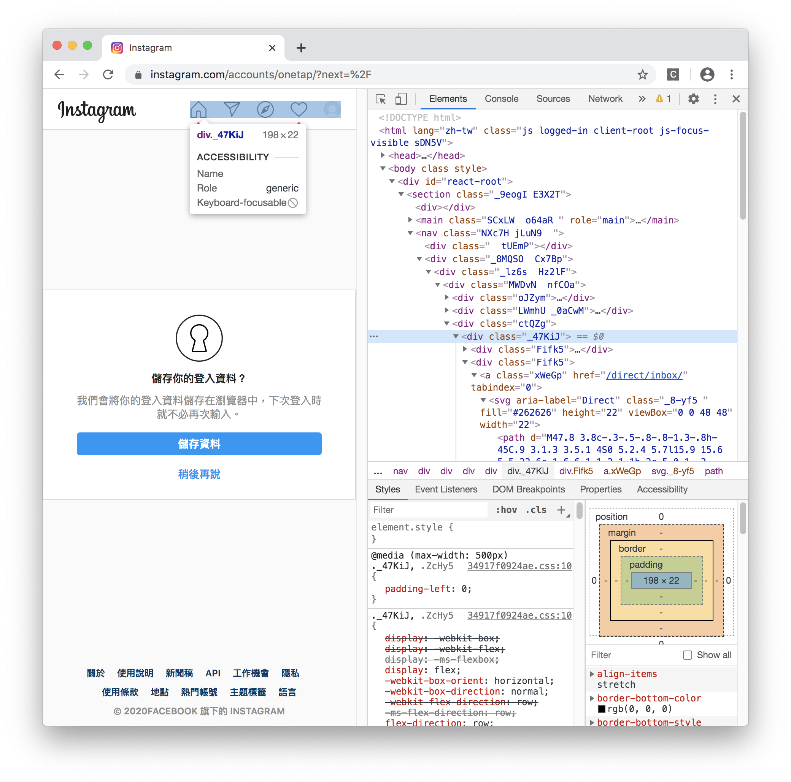
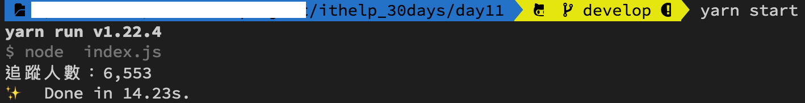

#### [回目錄](../README.md)
## Day11 依樣畫葫蘆，完成Instagram登入並取得追蹤人數

🤔 筆者有話先說
----
有了Facebook爬蟲的經驗後，其實我覺得這篇大家應該是有能力獨自完成的  
建議大家先嘗試看看能否登入Instagram並抓出粉專追蹤人數  
這篇文章建議實作遇到問題或是你完成後過來印證我們的思路是否相同

🏆 今日目標
----
1. 完成IG自動登入
    * 找出登入所需要填寫的位置
    * 學會使用css找出元件
2. 判斷使用者是否登入成功
3. 抓出IG追蹤人數
    * 了解在網頁寬度不同時會造成元素路徑的不同
    * 學會設定瀏覽器大小

🤖 IG自動登入
----
* 我在使用IG登入的[網址](https://www.instagram.com/accounts/login)時發現他登入的畫面偶爾會長不一樣(如下圖)導致Xpath路徑錯誤  
    
      
* 所以這裡我們要用不一樣的方式來抓取紅框內元件  
      
    * 進入開發者模式後我們觀察到 **電話號碼、用戶名稱或電子郵件** 以及 **密碼** 這些要操作的網頁元件有幾格 **共通點**：
        1. 使用 **input** 的html標籤
        2. 他們用 **name** 這個attribute來表示他們的作用
          
          

    * 登入的按鈕則用以下條件來取出元件：
        1. 使用 **button** 的html標籤
        2. 用 **type** 這個attribute來表示他要執行的動作
          

* 根據上面的分析後我們**改用css的方式來抓取IG登入的元件**，並操作它
    ```js
    //填入ig登入資訊
    let ig_username_ele = await driver.wait(until.elementLocated(By.css("input[name='username']")));
    ig_username_ele.sendKeys(ig_username)
    let ig_password_ele = await driver.wait(until.elementLocated(By.css("input[name='password']")));
    ig_password_ele.sendKeys(ig_userpass)

    //抓到登入按鈕然後點擊
    const login_elem = await driver.wait(until.elementLocated(By.css("button[type='submit']")))
    login_elem.click()
    ```
🤔 判斷使用者是否登入成功
----
* 與FB類似，IG要登入之後才會有右上角的頭像，這裡我使用他作為判斷登入與否  
      

    ```js
    //登入後才會有右上角的頭像的區塊，我們以這個來判斷是否登入
    await driver.wait(until.elementLocated(By.xpath(`//*[@id="react-root"]//*[contains(@class,"_47KiJ")]`)))
    ```
🔍抓出IG追蹤人數
----
>響應式網頁設計(RWD):網頁會根據瀏覽器解析度的不同而有不同的呈現，就像同一個網頁你在手機、平板、電腦看到的畫面配置都是不一樣的
* 如果你跟我一樣充滿實驗精神，你會發現IG粉專的頁面會隨著螢幕寬度更改而更改Xpath的路徑  
    * 寬螢幕的Xpath  
          
        ```
        //*[@id="react-root"]/section/main/div/header/section/ul/li[2]/a/span
        ```
    * 窄螢幕的Xpath  
          
        ```
        //*[@id="react-root"]/section/main/div/ul/li[2]/a/span
        ```
* 為了避免因為螢幕寬度不一樣造成Xpath不同，所以我們要在 **一開始打開瀏覽器的時候設定他的視窗大小** (本專案以寬螢幕作為範例)，所以請在打開瀏覽器的下方加上視窗大小的設定  
    ```js
    let driver = new webdriver.Builder().forBrowser("chrome").withCapabilities(options).build();// 建立這個broswer的類型
    //考慮到ig在不同螢幕寬度時的Xpath不一樣，所以我們要在這裡設定統一的視窗大小
    driver.manage().window().setRect({ width: 1280, height: 800, x: 0, y: 0 });
    ```
* 在固定螢幕寬度後，使用Xpath就能輕鬆的抓出追蹤人數元件，下面是跳轉到粉專帳號抓取追蹤人數的程式
    ```js
    //登入成功後要前往粉專頁面
    const fanpage = "https://www.instagram.com/baobaonevertell/" // 筆者是寶寶不說的狂熱愛好者
    await driver.get(fanpage)

    let ig_trace = 0;//這是紀錄IG追蹤人數
    const ig_trace_xpath = `//*[@id="react-root"]/section/main/div/header/section/ul/li[2]/a/span`
    const ig_trace_ele = await driver.wait(until.elementLocated(By.xpath(ig_trace_xpath)), 5000)//我們採取5秒內如果抓不到該元件就跳出的條件    
    // ig因為當人數破萬時文字不會顯示，所以改抓title
    ig_trace = await ig_trace_ele.getAttribute('title')
    console.log(`追蹤人數：${ig_trace}`)
    driver.quit();
    ```

🚀執行程式
----
在專案資料夾的終端機(Terminal)執行指令
```sh
yarn start
```
你會看到Instagram自動登入 &rarr; 跳轉到指定帳號 &rarr; 關閉，如果能正確輸出該粉專的追蹤人數你就成功嚕～  


到目前為止我們已經可以抓出 FB & IG 粉專的追蹤人數了，充滿好奇心的讀者可以先試著看看利用爬蟲爬完FB粉專後繼續爬IG  

ℹ️ 專案原始碼
----
* 今天的完整程式碼可以在[這裡](https://github.com/dean9703111/ithelp_30days/day10)找到喔
* 我也貼心地把昨天的把昨天FB爬蟲的程式碼打包成[壓縮檔](https://github.com/dean9703111/ithelp_30days/sampleCode/day10_sample_code.zip)，你可以用裡面乾淨的環境來實作今天的功能喔
    * 請記得在終端機下指令 **yarn** 才會把之前的套件安裝
    * 調整你.env檔填上IG登入資訊


參考資源 : 
1. [Filling in login forms in Instagram using selenium and webdriver (chrome) python OSX](https://stackoverflow.com/a/49940401)  
### [Day12小孩子才選擇，我要一隻程式爬完FB & IG粉專](/day12/README.md)