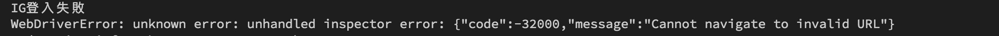
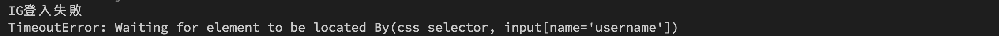
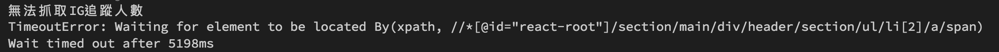

#### [回目錄](../README.md)
## Day12 try-catch讓程式更穩定

在[Day6 selenium-爬蟲起手式](../day6/README.md)有使用到try-catch來解決如果抓不到chrome driver的例外事件，今天我們會更清楚的說明如何讓try-catch幫助你更高效的debug以及增加程式穩定性  

try-catch使用情境
----
實際上我們現在的程式是非常脆落的，只要發生例外事件很容易就會崩潰，下面讓我舉例讓程式崩潰(或是卡住)的方式：  
1. 把Facebook跟Instagram網址改成不存在的網址 &rarr; 會因為網頁不存在而卡在那個畫面
2. 把粉專的網址改成不存在的網址 &rarr; 程式會因為無法抓到要讀取的元件而崩潰
3. 把粉專的網址改成不存在的粉專(或是移除的粉專) &rarr; 程式會因為無法抓到要讀取的元件而崩潰

以上舉例幾個最直覺讓程式壞掉的案例，為了避免這些悲劇的發生，try-catch就是我們的好朋友，以下是要注意的地方：  
1. 你的try-catch建議不要一次包含太多的程式碼，過於冗長的程式碼會增加你除錯難度
2. 除了系統自行吐出的exception以外，建議你也要附上console.error('我在哪個步驟錯了')
3. 因為我們在抓網頁元件時用了wait...until的結構，如果我們沒有設定他最多等待幾秒，他會等到天荒地老，所以請全部加上等待的時間，否則try-catch也幫不了你
4. 能透過例外處理減少多餘的步驟，像是Instagram我們一定要登入後才能爬蟲，所以我們就可以設定當登入失敗時(讓函式return false)不會執行後續步驟

try-catch實作
----
* 下面以IG爬蟲舉例，大家可以參考看看並思考FB爬蟲的部分你要如何改寫，若其中有一個條件錯誤就會拋出錯誤訊息
    1. **登入Instagram函式(loginInstagram)**
        * 登入的網址是否為網址  
            ex : 將 *const web = 'https://www.instagram.com/accounts/login';* 這段改為*const web = 'error'; 會因不符合網址格式跳錯誤訊息
            
        * 登入頁面是否有username、password、submit的元件  
            ex : 將 *const web = 'https://www.instagram.com/accounts/login';* 這段改為*const web = 'https://www.google.com'; 會因找不到元件超時而跳錯誤訊息)
            
        * 若用到driver.wait皆需要設定最多等待時間否則會卡住
        * 登入成功後是否有_47KiJ的class
        ```js
        async function loginInstagram (driver) {
            const web = 'https://www.instagram.com/accounts/login';//前往IG登入頁面
            try {
                await driver.get(web)//在這裡要用await確保打開完網頁後才能繼續動作

                //填入ig登入資訊
                let ig_username_ele = await driver.wait(until.elementLocated(By.css("input[name='username']")), 3000);
                ig_username_ele.sendKeys(ig_username)
                let ig_password_ele = await driver.wait(until.elementLocated(By.css("input[name='password']")), 3000);
                ig_password_ele.sendKeys(ig_userpass)

                //抓到登入按鈕然後點擊
                const login_elem = await driver.wait(until.elementLocated(By.css("button[type='submit']")), 3000)
                login_elem.click()

                //登入後才會有右上角的頭像，我們以這個來判斷是否登入
                await driver.wait(until.elementLocated(By.xpath(`//*[@id="react-root"]//*[contains(@class,"_47KiJ")]`)), 3000)
                return true
            } catch (e) {
                console.error('IG登入失敗')
                console.error(e)
                return false
            }
        }
        ```
    2. **前往Instagram帳號函式(goFansPage)**
        * 確認網址是否有效  
            ex : 若 *web_url* 傳入參數並非網址(如：xzz://error_page)則會因不符合網址格式跳錯誤訊息
        ```js
        async function goFansPage (driver, web_url) {
            //登入成功後要前往粉專頁面
            try {
                await driver.get(web_url)
            } catch (e) {
                console.error('無效的網址')
                console.error(e)
                return false
            }
        }
        ```
    3. **獲取Instagram帳號追蹤人數函式(getTrace)**
        * 確認追蹤人數的元件是否存在
            ex : 當導向的並非Instagram帳號頁面，或者該帳號不存在時，會因找不到元件超時而跳錯誤訊息
            
            
        * 確認該元件是否有title的Attribute
        ```js
        async function getTrace (driver) {
            let ig_trace = 0;//這是紀錄IG追蹤人數
            try {
                const ig_trace_xpath = `//*[@id="react-root"]/section/main/div/header/section/ul/li[2]/a/span`
                const ig_trace_ele = await driver.wait(until.elementLocated(By.xpath(ig_trace_xpath)), 5000)//我們採取5秒內如果抓不到該元件就跳出的條件    
                // ig因為當人數破萬時文字不會顯示，所以改抓title
                ig_trace = await ig_trace_ele.getAttribute('title')
                ig_trace = ig_trace.replace(/\D/g, '')//只取數字

                return ig_trace
            } catch (e) {
                console.error('無法抓取IG追蹤人數')
                console.error(e)
                return null
            }
        }
        ```


>**筆者碎碎念**  
try-catch的機制在程式越龐大的越重要，因為隨著開發的時間軸拉的越長，你對過去撰寫的程式掌握度會越來越低，甚至會忘記自己曾經寫了這一段程式碼；萬一在遙遠的某一天運轉好好的程式突然崩潰了，沒有撰寫try-catch的人在debug會浪費非常多的時間，因為他無法掌握是哪裡出錯了，所以建議大家培養撰寫try-catch的好習慣

如果有時麼解釋不夠清楚的歡迎在下方留言討論喔    

加入try-catch過的程式碼在[這裡](https://github.com/dean9703111/ithelp_30days/day12)喔
你可以整個專案clone下來  
```
git clone https://github.com/dean9703111/ithelp_30days.git
```
如果你已經clone過了，那你每天pull就能取得更新的資料嚕  
```
git pull origin master
cd day12
調整你.env檔填上 FB & IG 登入資訊
yarn
yarn start
```
### [Day13 善用json讓你批量爬蟲](../day13/README.md)