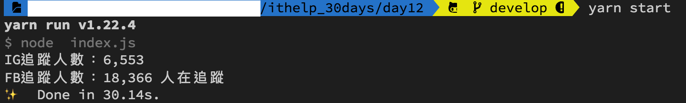

#### [回目錄](../README.md)
## Day12 selenium-webdriver：一隻程式爬完FB & IG粉專

>有些需求不是複製貼上就能解決的

🏆 今日目標
----
### 1. 分析實作過程中可能會遇到的問題
1.1 瀏覽器關閉導致無法讀取網頁元件
1.2 跨網域(CORS)錯誤

### 2. 一隻程式爬完FB & IG粉專
2.1 分析程式結構邏輯
2.2 思考程式上有什麼地方需要改進

----

# 1. 實作過程中可能會遇到的問題
### 1.1 瀏覽器關閉導致無法讀取網頁元件
如果你直接把兩天文章複製貼上爬的話一定會看到這個錯誤訊息
```
WebDriverError: element not interactable
```
* 這是因為**一次跳出兩個瀏覽器**在執行，只要其中一個瀏覽器完成爬蟲任務觸發 **driver.quit()** 就會導致另一個還沒爬蟲完畢的**瀏覽器因無法讀取元件而掛掉**  
* 如果你遇到以上問題，我建議**開一個瀏覽器**來處理：
    1. 因為`跑爬蟲會消耗電腦的記憶體以及網路流量`，我希望電腦跑爬蟲的時候不要影響我做其他事情的效率
    2. 使用一個瀏覽器在跑`遇到問題時方便除錯`

### 1.2 跨網域(CORS)錯誤
如果你把他**改成一個瀏覽器**執行，跑完FB粉專再跑IG粉專應該又會出現**跨網域(CORS)問題**的錯誤(目前只有windows作業系統才會遇到)  
* 這是`網域切換時因為一些安全性的疑慮而拒絕跳轉`，像是從 https://www.facebook.com/ 跳轉到 https://www.instagram.com 就會遇到這個問題  
* 這個問題在建立瀏覽器時加上設定 `{ acceptSslCerts: true, acceptInsecureCerts: true }` 即可解決
    ```js
    let driver = new webdriver.Builder().forBrowser("chrome").withCapabilities(options,
        { acceptSslCerts: true, acceptInsecureCerts: true }//這是為了解決跨網域問題
    ).build();
    ```

----

# 2. 一隻程式爬完FB & IG粉專
### 2.1 分析程式結構邏輯
為了幫助讀者能較快掌握程式的邏輯，我根據每個函式所做的功能以及執行步驟列出結構如下：
* **crawler** : 觸發爬蟲的函式
    1. 檢查Driver是否是設定
    2. 建立這個broswer的類型
    3. 設定broswer的視窗大小
    4. **loginInstagramGetTrace** : 登入IG並取得指定帳號的追蹤人數
        >先執行IG爬蟲是因為有些人登入IG的方式是綁定FB帳號，這會導致我們程式需要判斷更多狀況；而讓IG先爬蟲就能避免這個問題嚕～
        1. 前往IG登入頁，填入登入資訊
        2. 點擊登入按紐
        3. 判斷是否登入成功
        4. 登入成功後跳轉指定帳號頁面
        5. 獲取指定帳號追蹤人數
    5. **loginFacebookGetTrace** : 登入FB並取得粉絲專業的追蹤人數
        1. 前往FB登入頁，填入登入資訊
        2. 點擊登入按紐
        3. 判斷是否登入成功
        4. 登入成功後跳轉指定粉專頁面
        5. 獲取指定粉專追蹤人數
    6. 關閉browser
>寫程式如同拼積木，隨著功能的增加程式的體積會越來越大，這裡我建議你寫一份程式架構圖的文件來輔助，未來遇到需求變更時看架構圖就能迅速修改

#### index.js
```js
require('dotenv').config(); //載入.env環境檔
const path = require('path');//用於處理文件路徑的小工具
const fs = require("fs");//讀取檔案用
//取出.env檔案的FB、IG資訊
const ig_username = process.env.IG_USERNAME
const ig_userpass = process.env.IG_PASSWORD
const fb_username = process.env.FB_USERNAME
const fb_userpass = process.env.FB_PASSWORD

const webdriver = require('selenium-webdriver'), // 加入虛擬網頁套件
    By = webdriver.By,//你想要透過什麼方式來抓取元件，通常使用xpath、css
    until = webdriver.until;//直到抓到元件才進入下一步(可設定等待時間)

const chrome = require('selenium-webdriver/chrome');
const options = new chrome.Options();
options.setUserPreferences({ 'profile.default_content_setting_values.notifications': 1 });//因為FB會有notifications干擾到爬蟲，所以要先把它關閉

function getCrawlerPath () {
    if (process.env.FB_VERSION === 'new') {//如果是新版FB
        return {
            "fb_head_path": `//*[contains(@class,"fzdkajry")]`,
            "fb_trace_path": `//*[contains(@class,"knvmm38d")]`
        }
    } else {//如果為設定皆默認為舊版
        return {
            "fb_head_path": `//*[contains(@class,"_1vp5")]`,
            "fb_trace_path": `//*[@id="PagesProfileHomeSecondaryColumnPagelet"]//*[contains(@class,"_4bl9")]`
        }
    }
}

async function loginFacebookGetTrace (driver) {
    const web = 'https://www.facebook.com/login';//我們要前往FB
    await driver.get(web)//在這裡要用await確保打開完網頁後才能繼續動作

    //填入fb登入資訊
    const fb_email_ele = await driver.wait(until.elementLocated(By.xpath(`//*[@id="email"]`)));
    fb_email_ele.sendKeys(fb_username)
    const fb_pass_ele = await driver.wait(until.elementLocated(By.xpath(`//*[@id="pass"]`)));
    fb_pass_ele.sendKeys(fb_userpass)

    //抓到登入按鈕然後點擊
    const login_elem = await driver.wait(until.elementLocated(By.xpath(`//*[@id="loginbutton"]`)))
    login_elem.click()

    // FB有經典版以及新版的區分，兩者的爬蟲路徑不同，我們藉由函式取得各自的路徑
    const { fb_head_path, fb_trace_path } = getCrawlerPath();
    //因為登入這件事情要等server回應，你直接跳轉粉絲專頁會導致登入失敗
    await driver.wait(until.elementLocated(By.xpath(fb_head_path)))//用登入後才有的元件，來判斷是否登入

    //登入成功後要前往粉專頁面
    const fanpage = "https://www.facebook.com/baobaonevertell/" // 筆者是寶寶不說的狂熱愛好者
    await driver.get(fanpage)
    let fb_trace = 0;//這是紀錄FB追蹤人數
    //因為考慮到登入之後每個粉專顯示追蹤人數的位置都不一樣，所以就採用全抓在分析
    
    const fb_trace_eles = await driver.wait(until.elementsLocated(By.xpath(fb_trace_path)), 5000)//我們採取5秒內如果抓不到該元件就跳出的條件
    for (const fb_trace_ele of fb_trace_eles) {
        const fb_text = await fb_trace_ele.getText()
        if (fb_text.includes('人在追蹤')) {
            fb_trace = fb_text
            break
        }
    }
    console.log(`FB追蹤人數：${fb_trace}`)
}
async function loginInstagramGetTrace (driver) {
    const web = 'https://www.instagram.com/accounts/login';//前往IG登入頁面
    await driver.get(web)//在這裡要用await確保打開完網頁後才能繼續動作

    //填入ig登入資訊
    let ig_username_ele = await driver.wait(until.elementLocated(By.css("input[name='username']")));
    ig_username_ele.sendKeys(ig_username)
    let ig_password_ele = await driver.wait(until.elementLocated(By.css("input[name='password']")));
    ig_password_ele.sendKeys(ig_userpass)

    //抓到登入按鈕然後點擊
    const login_elem = await driver.wait(until.elementLocated(By.css("button[type='submit']")))
    login_elem.click()

    //登入後才會有右上角功能列，我們以這個來判斷是否登入
    await driver.wait(until.elementLocated(By.xpath(`//*[@id="react-root"]//*[contains(@class,"_47KiJ")]`)))

    //登入成功後要前往粉專頁面
    const fanpage = "https://www.instagram.com/baobaonevertell/" // 筆者是寶寶不說的狂熱愛好者
    await driver.get(fanpage)

    let ig_trace = 0;//這是紀錄IG追蹤人數
    const ig_trace_xpath = `//*[@id="react-root"]/section/main/div/header/section/ul/li[2]/a/span`
    const ig_trace_ele = await driver.wait(until.elementLocated(By.xpath(ig_trace_xpath)))
    // ig因為當人數破萬時文字不會顯示，所以改抓title
    ig_trace = await ig_trace_ele.getAttribute('title')
    console.log(`IG追蹤人數：${ig_trace}`)
}

function checkDriver() {
    try {
        chrome.getDefaultService()//確認是否有預設
    } catch {
        console.log('找不到預設driver!');
        const file_path = '../chromedriver.exe'//'../chromedriver.exe'記得調整成自己的路徑
        console.log(path.join(__dirname, file_path));//請確認印出來日誌中的位置是否與你路徑相同
        if (fs.existsSync(path.join(__dirname, file_path))) {//確認路徑下chromedriver.exe是否存在            
            const service = new chrome.ServiceBuilder(path.join(__dirname, file_path)).build();//設定driver路徑
            chrome.setDefaultService(service);
            console.log('設定driver路徑');
        } else {
            console.log('無法設定driver路徑');
            return false
        }
    }
    return true
}

async function crawler () {
    if (!checkDriver()) {// 檢查Driver是否是設定，如果無法設定就結束程式
        return
    }

    let driver = new webdriver.Builder().forBrowser("chrome").withCapabilities(options).build();// 建立這個broswer的類型
    //考慮到ig在不同螢幕寬度時的Xpath不一樣，所以我們要在這裡設定統一的視窗大小
    driver.manage().window().setRect({ width: 1280, height: 800, x: 0, y: 0 });

    //因為有些人是用FB帳號登入IG，為了避免增加FB登出的動作，所以採取先對IG進行爬蟲
    await loginInstagramGetTrace(driver)
    await loginFacebookGetTrace(driver)

    driver.quit();
}

crawler()
```

### 2.2 思考程式上有什麼地方需要改進
看完上面的程式後，我想大部分的人都有點暈了XD，如果你有認真看程式應該有以下體會：
1. 閱讀起來有點吃力
2. 遇到錯誤時不好找問題
3. 很難掌握每個函式的功能
4. 幾個月後回來看這隻程式估計一臉茫然

如果還有更多的體會歡迎大家在下方留言(請鞭小力一點QQ)  
明天會講程式碼的`重構`，透過重構我們可以更有效率的掌握程式；後天會講`try-catch`在本專案的應用，方便日後的除錯

----

執行程式
----
在專案資料夾的終端機(Terminal)執行指令
```vim
yarn start
```
畫面執行順序：Instagram自動登入 &rarr; 跳轉到指定帳號 &rarr; Facebook自動登入 &rarr; 跳轉到粉絲頁 &rarr; 關閉

爬完資料關閉後，你就能看到FB & IG的追蹤人數嚕～  
  

>PS.如果想要中斷終端機(Terminal)執行的程式，可以用下面按鍵組合:
>* Windows: Ctrl + c
>* Mac: control + c

----

ℹ️ 專案原始碼
----
* 今天的完整程式碼可以在[這裡](https://github.com/dean9703111/ithelp_30days/tree/master/day12)找到喔
* 我也貼心地把昨天的把昨天的程式碼打包成[壓縮檔](https://github.com/dean9703111/ithelp_30days/raw/master/sampleCode/day11_sample_code.zip)，你可以用裡面乾淨的環境來實作今天的功能喔
    * 請記得在終端機下指令 **yarn** 才會把之前的套件安裝
    * 調整.env檔
        * 填上FB登入資訊
        * 填上FB版本(classic/new)
        * 填上IG登入資訊
<br>

>*免責聲明:文章技術僅抓取公開數據作爲研究，任何組織和個人不得以此技術盜取他人智慧財產、造成網站損害，否則一切后果由該組織或個人承擔。作者不承擔任何法律及連帶責任！*
### [Day13 refactor-重構程式碼，讓合作夥伴對你比讚](/day13/README.md)