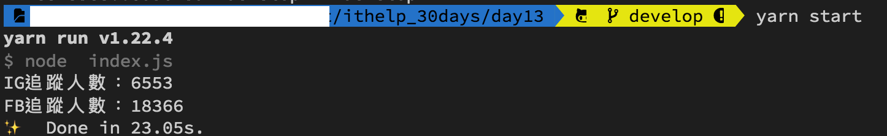

#### [回目錄](../README.md)
## Day13 refactor-重構程式碼，讓合作夥伴對你比讚

>數據顯示，工程師完成最後 20% 的工作時間跟之前的 80% 一樣多

🤔 完成功能後，重構是另一個開始
----
昨天我們完成了一個**跑得動的程式**，但很明顯並**不是一個好的程式**  
大家應該有感受到隨著程式越來越長，我們對他的掌握力逐步下降  
根據clean code的原則而言就是說這**程式寫得很爛XD**  
很多人為了盡快完成功能而埋頭狂寫，但這樣容易導致你日後維護以及交接的困難性，你所負責的專案越大這個感受會更明顯  
所以在完成功能後**重構是必要的任務，他能提升你日後解決bug、需求變更的工作效率**  
接下來就以昨天的程式為範例來重構吧！

----

🏆 今日目標
----
了解 & 修正目前專案所犯下的錯誤
1. 主程式做了太多事情
2. 一個函式做了太多事情
3. 物件宣告的方式太複雜且多次被使用

----

# 1. 主程式做了太多事情
主程式就像是專案的總經理，他只需要知道大方向的架構；而架構裡面的細節就交給各部門處理，他只是溝通資料的橋樑

根據上述的邏輯，我們應該把在主程式中的函式轉移到另外的資料夾(ex:tools)，依據功能去命名檔名，範例如下:  
1. 主程式 - index.js
2. 初始化瀏覽器 - tools/initDrive.js
3. Facebook爬蟲 - tools/crawlerFB.js
3. Instagram爬蟲 - tools/crawlerIG.js  
在這樣的分工後我們的主程式是不是變得很乾淨呢？
#### index.js
```js
require('dotenv').config(); //載入.env環境檔
const { initDrive } = require("./tools/initDrive.js");
const { crawlerFB } = require("./tools/crawlerFB.js");
const { crawlerIG } = require("./tools/crawlerIG.js");

async function crawler () {

    const driver = initDrive();
    if (!driver) {//driver不存在就結束程式
        return
    }
    //因為有些人是用FB帳號登入IG，為了避免增加FB登出的動作，所以採取先對IG進行爬蟲
    await crawlerIG(driver)
    await crawlerFB(driver)

    driver.quit();
}

crawler()
```

----

# 2. 一個函式做了太多事情
`記住一個大原則：一個函式只需要做一件事情！`

現在我們把FB的登入並取得追蹤人數寫在同一隻函式，這樣會增加你日後維護的困難度，因為`函式越長，你越難除錯(debug)`；以 **loginFacebookGetTrace** 這隻函式舉例，它實際上可以解構成好幾個功能：  
1. 取得 Facebook(經典版/新版) 的爬蟲路徑 - getCrawlerPath
2. Facebook爬蟲 - crawlerFB
3. 登入Facebook - loginFacebook
4. 前往粉絲頁 - goFansPage
5. 取得追蹤人數 - getTrace  
把每個功能獨立成函式，你就能輕鬆除錯(debug)。下面程式以FB解構作為範例，你可以自己練習改寫IG的部分喔  
#### crawlerFB.js
```js
const fb_username = process.env.FB_USERNAME
const fb_userpass = process.env.FB_PASSWORD
const { By, until } = require('selenium-webdriver') // 從套件中取出需要用到的功能
exports.crawlerFB = crawlerFB;//讓其他程式在引入時可以使用這個函式

// FB有經典版以及新版的區分，兩者的爬蟲路徑不同，我們藉由函式取得各自的路徑
const { fb_head_path, fb_trace_path } = getCrawlerPath();

function getCrawlerPath () {
    if (process.env.FB_VERSION === 'new') {//如果是新版FB
        return {
            "fb_head_path": `//*[contains(@class,"fzdkajry")]`,
            "fb_trace_path": `//*[contains(@class,"knvmm38d")]`
        }
    } else {//如果為設定皆默認為舊版
        return {
            "fb_head_path": `//*[contains(@class,"_1vp5")]`,
            "fb_trace_path": `//*[@id="PagesProfileHomeSecondaryColumnPagelet"]//*[contains(@class,"_4bl9")]`
        }
    }
}

async function crawlerFB(driver) {    
    await loginFacebook(driver)
    const fanpage = "https://www.facebook.com/baobaonevertell/"
    await goFansPage(driver, fanpage)
    await driver.sleep(3000)
    await getTrace(driver)
}

async function loginFacebook(driver) {
    const web = 'https://www.facebook.com/login';//我們要前往FB
    await driver.get(web)//在這裡要用await確保打開完網頁後才能繼續動作

    //填入fb登入資訊
    const fb_email_ele = await driver.wait(until.elementLocated(By.xpath(`//*[@id="email"]`)));
    fb_email_ele.sendKeys(fb_username)
    const fb_pass_ele = await driver.wait(until.elementLocated(By.xpath(`//*[@id="pass"]`)));
    fb_pass_ele.sendKeys(fb_userpass)

    //抓到登入按鈕然後點擊
    const login_elem = await driver.wait(until.elementLocated(By.xpath(`//*[@id="loginbutton"]`)))
    login_elem.click()

    //因為登入這件事情要等server回應，你直接跳轉粉絲專頁會導致登入失敗
    await driver.wait(until.elementLocated(By.xpath(fb_head_path)))//用登入後才有的元件，來判斷是否登入
}

async function goFansPage(driver, web_url) {
    //登入成功後要前往粉專頁面
    await driver.get(web_url)
}

async function getTrace(driver) {
    let fb_trace = 0;//這是紀錄FB追蹤人數
    //因為考慮到登入之後每個粉專顯示追蹤人數的位置都不一樣，所以就採用全抓在分析
    
    const fb_trace_eles = await driver.wait(until.elementsLocated(By.xpath(fb_trace_path)))
    for (const fb_trace_ele of fb_trace_eles) {
        const fb_text = await fb_trace_ele.getText()
        if (fb_text.includes('人在追蹤')) {
            fb_trace = fb_text.replace(/\D/g, '')//只取數字
            break
        }
    }
    console.log(`FB追蹤人數：${fb_trace}`)
}
```

----

# 3. 物件宣告的方式太複雜且多次被使用
我們要將`建立瀏覽器的部分獨立成一隻js`，原因如下
* 建立瀏覽器前需要做事前確認及複雜的設定
* 這個瀏覽器作為物件會被多次使用
* 如果瀏覽器的參數需要變更可以在一個檔案集中管理  

基於上述原因，我們**應該把他獨立出來**，這樣你只需要`在一個檔案管理你宣告的物件(瀏覽器)設定，而主程式很單純的使用回傳的物件(瀏覽器)即可`
#### initDrive.js
```js
exports.initDrive = initDrive;//讓其他程式在引入時可以使用這個函式

const webdriver = require('selenium-webdriver') // 加入虛擬網頁套件
const chrome = require('selenium-webdriver/chrome');
const options = new chrome.Options();
options.setUserPreferences({ 'profile.default_content_setting_values.notifications': 1 });//因為FB會有notifications干擾到爬蟲，所以要先把它關閉

const path = require('path');//用於處理文件路徑的小工具
const fs = require("fs");//讀取檔案用

function initDrive () {
    if (!checkDriver()) {// 檢查Driver是否是設定，如果無法設定就結束程式
        return
    }

    let driver = new webdriver.Builder().forBrowser("chrome").withCapabilities(options).build();// 建立這個broswer的類型
    //考慮到ig在不同螢幕寬度時的Xpath不一樣，所以我們要在這裡設定統一的視窗大小
    driver.manage().window().setRect({ width: 1280, height: 800, x: 0, y: 0 });

    return driver
}

function checkDriver() {
    try {
        chrome.getDefaultService()//確認是否有預設
    } catch {
        console.log('找不到預設driver!');
        const file_path = '../chromedriver.exe'//'../chromedriver.exe'記得調整成自己的路徑
        console.log(path.join(__dirname, file_path));//請確認印出來日誌中的位置是否與你路徑相同
        if (fs.existsSync(path.join(__dirname, file_path))) {//確認路徑下chromedriver.exe是否存在            
            const service = new chrome.ServiceBuilder(path.join(__dirname, file_path)).build();//設定driver路徑
            chrome.setDefaultService(service);
            console.log('設定driver路徑');
            return true
        } else {
            console.log('無法設定driver路徑');
            return false
        }
    }
    return true
}
```

這篇文章是以自己的程式作為範例講解，如果你想更深入了解重構請，請閱讀[重構—改善既有的程式設計](https://medium.com/%E5%BE%8C%E7%AB%AF%E6%96%B0%E6%89%8B%E6%9D%91/%E7%AD%86%E8%A8%98-%E9%87%8D%E6%A7%8B-chapter-1-2-%E7%AC%AC%E4%B8%80%E5%80%8B%E7%AF%84%E4%BE%8B-%E9%87%8D%E6%A7%8B%E5%8E%9F%E5%89%87-ca57a6d40f42)，他深入淺出說明重構的原則讓我受益良多
>程式碼往往沒有所謂最好的寫法，只有當下最合理的選擇。而需求永遠在變動，就算當下重構到很滿意，可能下個月再回來看又覺得不夠了。 - YH Yu


執行程式
----
在專案資料夾的終端機(Terminal)執行指令
```vim
yarn start
```
畫面執行順序：Instagram自動登入 &rarr; 跳轉到指定帳號 &rarr; Facebook自動登入 &rarr; 跳轉到粉絲頁 &rarr; 關閉

爬完資料關閉後，你就能看到FB & IG的追蹤人數嚕～  
  

如果你還有什麼問題或是覺得有可以改善的地方歡迎在下方留言討論  

ℹ️ 專案原始碼
----
* 今天的完整程式碼可以在[這裡](https://github.com/dean9703111/ithelp_30days/tree/master/day13)找到喔
* 我也貼心地把昨天的把昨天的程式碼打包成[壓縮檔](https://github.com/dean9703111/ithelp_30days/raw/master/sampleCode/day12_sample_code.zip)，你可以用裡面乾淨的環境來實作今天的重構喔
    * 請記得在終端機下指令 **yarn** 才會把之前的套件安裝
    * 調整.env檔
        * 填上FB登入資訊
        * 填上FB版本(classic/new)
        * 填上IG登入資訊

📖 參考資源
----
1. [[Nodejs] module.exports 與 exports 的差別](https://blog.camel2243.com/2017/06/24/nodejs-module-exports-%E8%88%87-exports-%E7%9A%84%E5%B7%AE%E5%88%A5/)  
2. [重構—改善既有的程式設計](https://medium.com/%E5%BE%8C%E7%AB%AF%E6%96%B0%E6%89%8B%E6%9D%91/%E7%AD%86%E8%A8%98-%E9%87%8D%E6%A7%8B-chapter-1-2-%E7%AC%AC%E4%B8%80%E5%80%8B%E7%AF%84%E4%BE%8B-%E9%87%8D%E6%A7%8B%E5%8E%9F%E5%89%87-ca57a6d40f42)
<br>

>*免責聲明:文章技術僅抓取公開數據作爲研究，任何組織和個人不得以此技術盜取他人智慧財產、造成網站損害，否則一切后果由該組織或個人承擔。作者不承擔任何法律及連帶責任！*
### [Day14 程式又又又崩潰了嗎？來點try-catch吧](/day14/README.md)