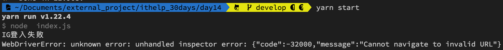
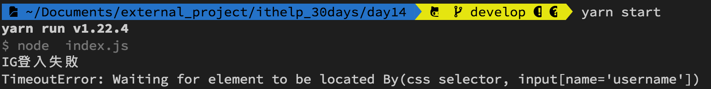
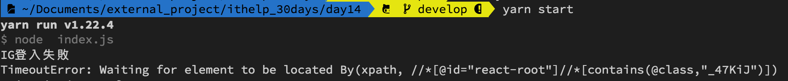
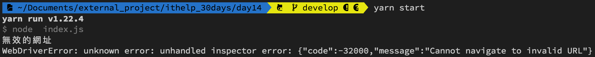
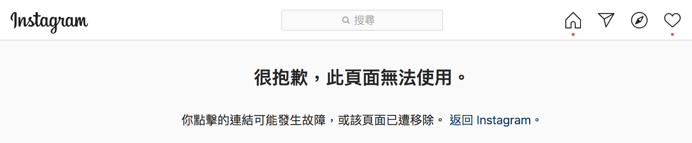
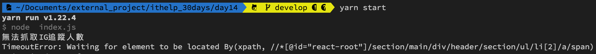

#### [回目錄](../README.md)
## Day14 try-catch讓程式更穩定

🤔 回憶一下我們之前的應用場景
----
在[Day7 selenium-爬蟲起手式](../day7/README.md)有使用到try-catch來**解決如果抓不到chrome driver的例外事件**，今天我們會更清楚的說明如何**讓try-catch幫助你更高效的debug以及增加程式穩定性**  

🏆 今日目標
----
1. 了解什麼情境下需要用到try-catch
2. 在專案中應用try-catch實作
    1. 登入Instagram的函式：loginInstagram
    2. 前往Instagram帳號的函式：goFansPage
    3. 獲取Instagram帳號追蹤人數的函式：getTrace

🤔 什麼情境下需要用到try-catch?
----
* 程式在缺乏try-catch的機制下是非常脆落的，只要發生例外事件就容易崩潰，下面讓我舉例讓程式崩潰或是卡住的方式：  
    1. 把Facebook跟Instagram登入網址改成不存在的網址 &rarr; 會因為網頁不存在而卡在那個畫面
    2. 把粉專的網址改成不存在的網址 &rarr; 會因為無法抓到要讀取的元件而崩潰
    3. 把粉專的網址改成不存在的粉專(或是移除的粉專) &rarr; 會因為無法抓到要讀取的元件而崩潰

* 為了避免這些悲劇的發生，try-catch就是我們的好朋友，以下是應用上要注意的地方：  
    1. **一個try-catch的區塊不要判斷多個不相關的事件**
        * 與[上一篇重構](/day13/README.md)提到的概念類似，一個函式專注做好一件事，try-catch也是專注在確認這一件事執行時有沒有發生意外
    2. **除了系統自行吐出的exception以外，建議你也要加上console.error('我在哪個步驟錯了')**
        * 在程式結構龐大且長時間執行的狀態下，系統吐出的exception有時多到你眼花，這時你撰寫的console.error可以幫助你對發生錯誤的位置快速定位
    3. **程式需要設計中斷邏輯避免進入無窮的等待**
        * 我們在抓網頁元件時用了wait...until的結構，如果我們沒有設定最多等待幾秒，你等到天荒地老，因為他永遠停在try的區塊出不去，所以try-catch也幫不了你
    4. **透過例外處理減少多餘的步驟**
        * 像是Instagram我們一定要登入後才能爬蟲，所以我們就可以設定當登入失敗時(讓函式return false)不會執行後續步驟

🕸️在專案中應用try-catch實作
----
實踐出真知，下面以IG爬蟲舉例，我會將每個函式抽出來逐一講解，並透過參數的調整讓你理解try-catch的運作邏輯，大家理解後可以嘗試修改FB爬蟲的部分(當然文末的原始碼還是有完整解答啦😅)
1. **登入Instagram的函式：loginInstagram**
    * 😱讓程式執行時卡住的操作
        1. 把IG的登入網址改成非網址格式的字串(如：'error')
            * 程式會crash
        2. 把IG的登入網址改成其他網址
            * 找不到網頁上帳號密碼的文字輸入框、點擊登入的按鈕元件
        3. 輸入錯誤的登入帳密
            * 因為登入失敗網頁右上角永遠不會出現頭像元件
    * 👌解決方式
        1. 把這段登入的邏輯用try-catch包起來
        2. 執行成功時回傳true，如果執行上發生錯誤則回傳false，終止後續爬蟲動作
        3. 為driver.wait加上合理的等待時間(3秒鐘)
        >PS.在程式的世界中通常時間都是以毫秒為單位，所以我們填上3000
        
        ```js
        async function loginInstagram (driver) {
            const web = 'https://www.instagram.com/accounts/login';//前往IG登入頁面
            try {
                await driver.get(web)//在這裡要用await確保打開完網頁後才能繼續動作

                //填入ig登入資訊
                let ig_username_ele = await driver.wait(until.elementLocated(By.css("input[name='username']")), 3000);
                ig_username_ele.sendKeys(ig_username)
                let ig_password_ele = await driver.wait(until.elementLocated(By.css("input[name='password']")), 3000);
                ig_password_ele.sendKeys(ig_userpass)

                //抓到登入按鈕然後點擊
                const login_elem = await driver.wait(until.elementLocated(By.css("button[type='submit']")), 3000)
                login_elem.click()

                //登入後才會有右上角的頭像，我們以這個來判斷是否登入
                await driver.wait(until.elementLocated(By.xpath(`//*[@id="react-root"]//*[contains(@class,"_47KiJ")]`)), 3000)
                return true
            } catch (e) {
                console.error('IG登入失敗')
                console.error(e)
                return false
            }
        }
        ```
    * 🆗實際測試確認結果是否符合預期
        1. 將 **const web = 'https://www.instagram.com/accounts/login';** 這段改為 **const web = 'error';** 
            *  會因不符合網址格式跳錯誤訊息
            
        2. 將 **const web = 'https://www.instagram.com/accounts/login';** 這段改為 **const web = 'https://www.google.com';**          
            * 會因找不到使用者輸入框元件超時而跳錯誤訊息  
            
        3. 把.env環境檔裡面的登入帳號密碼改成錯誤的
            * 會因找不到頭像元件超時而跳錯誤訊息
            
            <br>
2. **前往Instagram帳號的函式：goFansPage**
    * 😱讓程式執行時卡住的操作
        1. 傳入的**web_url**改成非網址格式的字串(如：'error_page')
            * 程式會crash
    * 👌解決方式
        1. 把這段登入的邏輯用try-catch包起來
    ```js
    async function goFansPage (driver, web_url) {
        //登入成功後要前往粉專頁面
        try {
            await driver.get(web_url)
        } catch (e) {
            console.error('無效的網址')
            console.error(e)
            return false
        }
    }
    ```
    * 🆗實際測試確認結果是否符合預期
        1. 將 **const fanpage = "https://www.instagram.com/baobaonevertell/"** 改為非網址格式的字串 **const fanpage = "error_page"** 
            *  會因不符合網址格式跳錯誤訊息
                   
            <br>   
3. **獲取Instagram帳號追蹤人數的函式：getTrace**
    * 😱讓程式執行時卡住的操作
        1. 上一步goFansPage的函式導向的並非Instagram帳號網址，或者該IG帳號不存在時
            * 找不到網頁上追蹤人數的元件
                    
    * 👌解決方式
        1. 把這段登入的邏輯用try-catch包起來
        2. 為driver.wait加上合理的等待時間(3秒鐘)
        ```js
        async function getTrace (driver) {
            let ig_trace = 0;//這是紀錄IG追蹤人數
            try {
                const ig_trace_xpath = `//*[@id="react-root"]/section/main/div/header/section/ul/li[2]/a/span`
                const ig_trace_ele = await driver.wait(until.elementLocated(By.xpath(ig_trace_xpath)), 5000)//我們採取5秒內如果抓不到該元件就跳出的條件    
                // ig因為當人數破萬時文字不會顯示，所以改抓title
                ig_trace = await ig_trace_ele.getAttribute('title')
                ig_trace = ig_trace.replace(/\D/g, '')//只取數字

                return ig_trace
            } catch (e) {
                console.error('無法抓取IG追蹤人數')
                console.error(e)
                return null
            }
        }
        ```
    * 🆗實際測試確認結果是否符合預期
        1. 將 **const fanpage = "https://www.instagram.com/baobaonevertell/"** 改為非網址格式的字串 **const fanpage = "https://www.instagram.com/error_page_ex/"** 
            *  會因找不到追蹤人數的元件而跳錯誤訊息
            
    

>**筆者碎碎念**  
try-catch的機制在程式越龐大的越重要，因為隨著開發的時間軸拉的越長，你對過去撰寫的程式掌握度會越來越低，甚至會忘記自己曾經寫了這一段程式碼；萬一在遙遠的某一天運轉好好的程式突然崩潰了，沒有撰寫try-catch的人在debug會浪費非常多的時間，因為他無法掌握是哪裡出錯了，所以建議大家培養撰寫try-catch的好習慣

如果有時麼解釋不夠清楚的歡迎在下方留言討論喔    

ℹ️ 專案原始碼
----
* 今天的完整程式碼可以在[這裡](https://github.com/dean9703111/ithelp_30days/day14)找到喔
* 我也貼心地把昨天的把昨天的程式碼打包成[壓縮檔](https://github.com/dean9703111/ithelp_30days/sampleCode/day13_sample_code.zip)，你可以用裡面乾淨的環境來實作今天try-catch的部分喔
    * 請記得在終端機下指令 **yarn** 才會把之前的套件安裝
    * 調整你.env檔填上IG、FB登入資訊

### [Day15 善用json讓你批量爬蟲](/day15/README.md)