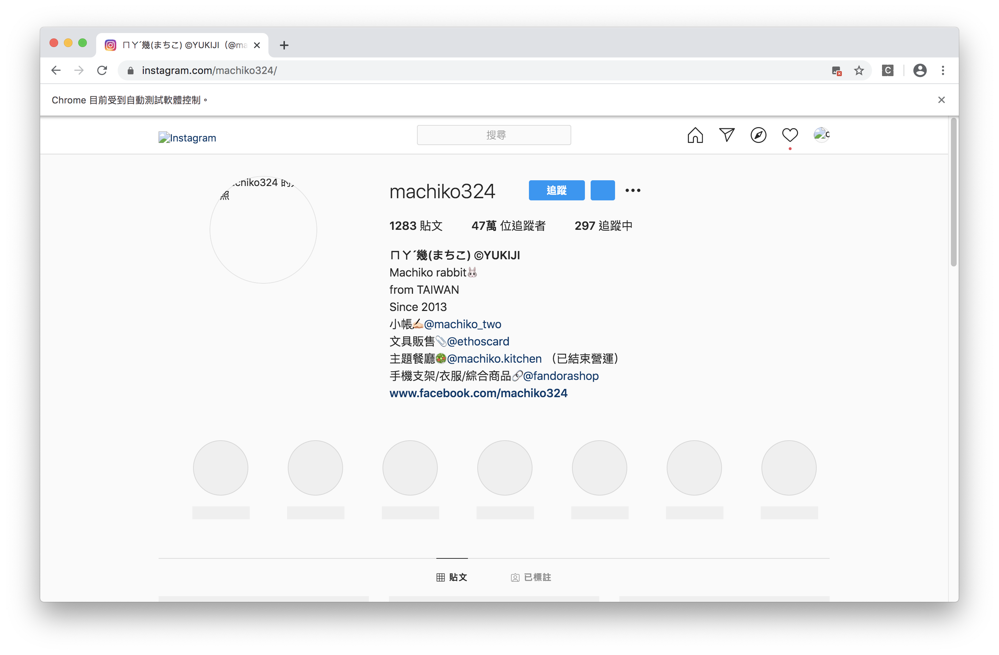

#### [回目錄](../README.md)
### Day14 優化爬蟲體驗 && 思路分享

優化爬蟲體驗
----
原則上我們已經完成爬蟲這一段的功能了，接下來是處理優化的部分  
前面[Day11 重構程式碼](../day15/README.md)讓你開發上更有效率，而優化是一個非常複雜的問題，常見需要的優化如：
1. 更好地執行效率
2. 使用更少的記憶體
3. 使用者操作難易度
...  

優化是一條沒有盡頭的路，我相信除了我所提出的優化方案外，一定還有很多是我所忽略的，歡迎大家腦力激盪提供想法  

* 首先我想到的是我所分析的內容都跟圖片無關，但偏偏**最浪費流量及載入時間的都是圖片**，所以我在chrome這個瀏覽器增加了下面的配置便可有以下好處：
    1. 減少瀏覽器使用流量
    2. 減少瀏覽器載入時間
#### initDrive.js
```js
options.addArguments('blink-settings=imagesEnabled=false')//不加載圖片提高效率
```
你加上後跑爬蟲可以很明顯的感受到速度變快很多，跑起來可看到所有圖片都沒有載入(下圖)  
  

* 在每個爬蟲的步驟及功能都很穩定後，其實我不需要這個視窗來看他的動作了，背景跑就夠惹
#### initDrive.js
```js
options.addArguments('--headless')//瀏覽器不提供頁面觀看，linux下如果系統是純文字介面不加這條會啓動失敗
// 下面三個建議一起加入，因為有朋友遇到一些奇怪錯誤
options.addArguments('--no-sandbox')//取消沙盒模式
options.addArguments('--disable-dev-shm-usage')//使用共享內存RAM
options.addArguments('--disable-gpu')//規避部分bug
```
設定完這些後執行程式是不是就不會跳出瀏覽器了呢?  
[這篇文章](https://stackoverflow.max-everyday.com/2019/12/selenium-chrome-options/)有提供selenium啓動Chrome的進階配置參數，對效能有狂熱的朋友們可以來仔細研究看看    

思路分享
------------------------
>授人以魚不如授人以漁

經過反覆的思慮後我把文章中對粉專文章爬蟲的程式碼拿掉了，最主要的原因是如果提供了解答就很少人會去思考  
所以粉專文章爬蟲這塊我不會附上程式碼，但我會提供給你們完整的思路，如果你們有認真讀完這幾天的文章一定能獨立完成  

**目標：** 能抓到 FB & IG 粉專當日貼文  
**問題分析：** FB & IG 版型不同，故需要分開撰寫，先思考以操作者而言如何找出當日貼文，因為我們的瀏覽器就是在模擬你的真實操作
**問題拆解：**   
* FB:
    1. 因為FB版型差異很大，最上面的貼文可能是置頂貼文而非最新貼文，所以你要先**模擬頁面下滑**事件才能抓到最新貼文
    2. 要找出貼文的共通class，因為你是要抓當日貼文，所以你要抓**貼文時間的class**
    3. 你可以發現當日貼文都是直接標明時間，你可以用這個當成區隔的條件；或者去**抓元件attribute的data-utime**的真實時間來換算
    4. 判斷貼文時間軸是否符合，符合就儲存，如果直到最後一篇都符合當日貼文就**再次觸發頁面下滑**事件；否則就往下判斷下個粉專頁面
* IG:
    1. 單純從粉專頁面是無法判斷時間的，所以我們要抓出粉專頁面中**每個貼文的連結**，這一樣用class去抓
    2. **依序前往**每個貼文並抓**貼文時間的class**
    3. 抓到class後**抓元件attribute的datetime**來判斷是否為當日貼文，符合就儲存；如果不是就跳出往下判斷下個粉專頁面

原則上我就是依照上面的邏輯來撰寫這個爬蟲的，這應該**不是最好的解法**，我相信讀者會有更好的邏輯來完成這個題目  

>**筆者碎碎念**
我希望看完文章的讀者能夠吸收到思考問題的方式，不要只是單純的 copy & paste ，這樣對技術長期來講是在累積負債  
如果你是程式的新手，你可以透過修改一些參數來看看結果會有什麼樣的變化  
不要害怕犯錯，因為在學習程式的路上幾乎不存在一條完美的道路  
你現在滿意的程式往往在幾個月後你會覺得當時怎麼寫的這麼爛  
我想你誕生出這個想法的時候就是成長了  

優化過的程式碼在[這裡](https://github.com/dean9703111/ithelp_30days/day14)喔
你可以整個專案clone下來  
```
git clone https://github.com/dean9703111/ithelp_30days.git
```
如果你已經clone過了，那你每天pull就能取得更新的資料嚕  
```
git pull origin master
cd day14
調整你.env檔填上 FB & IG 登入資訊
yarn
yarn start
```
### [Day15 google sheets起手式，取得寫入google sheets的權杖(token)](../day15/README.md)