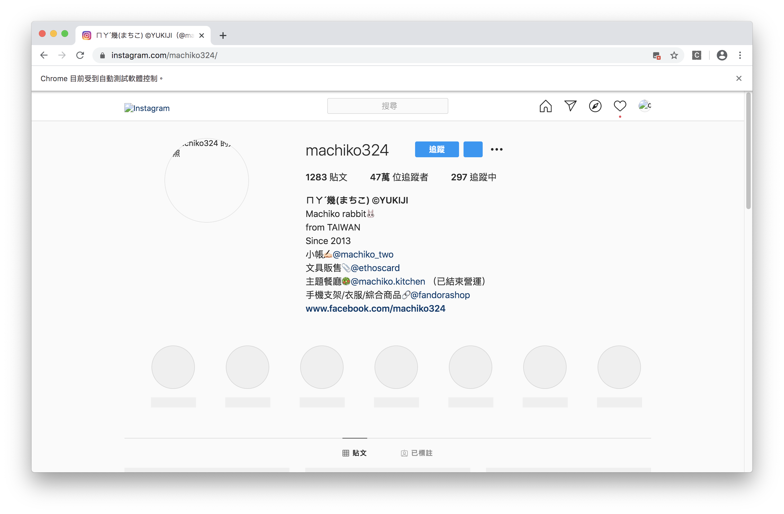

#### [回目錄](../README.md)
## Day15 優化爬蟲體驗 && 思路分享

優化爬蟲體驗
----
原則上我們已經完成爬蟲這一段的功能了，接下來是處理優化的部分  
前面[Day11 重構程式碼](../day15/README.md)讓你開發上更有效率，而優化是一個非常複雜的問題，常見需要的優化如：
1. 更好地執行效率
2. 使用更少的記憶體
3. 使用者操作難易度
...  

優化是一條沒有盡頭的路，我相信除了我所提出的優化方案外，一定還有很多是我所忽略的，歡迎大家腦力激盪提供想法  

* 首先我想到的是我所分析的內容都跟圖片無關，但偏偏**最浪費流量及載入時間的都是圖片**，所以我在chrome這個瀏覽器增加了下面的配置便可有以下好處：
    1. 減少瀏覽器使用流量
    2. 減少瀏覽器載入時間
    請你打開initDrive.js並在chrome的option加入不載入圖片的選項
    ```js
    options.addArguments('blink-settings=imagesEnabled=false')//不加載圖片提高效率
    ```
    加上這段程式後，在專案資料夾的終端機(Terminal)執行指令 **yarn start** 指令，便可以很明顯的感受到速度變快很多，跑起來可看到所有圖片都沒有載入(下圖)  
      

* 在每個爬蟲的步驟及功能都很穩定後，其實我不需要跳出瀏覽器視窗來看他的動作，背景跑就夠惹  
    請你打開initDrive.js並在chrome的option加入不打開瀏覽器視窗的選項如下
    ```js
    options.addArguments('--headless')//瀏覽器不提供頁面觀看，linux下如果系統是純文字介面不加這條會啓動失敗
    options.addArguments('--log-level=3')//這個option可以讓你跟headless時網頁端的console.log說掰掰
    //下面參數能提升爬蟲穩定性    
    options.addArguments('--disable-dev-shm-usage')//使用共享內存RAM
    options.addArguments('--disable-gpu')//規避部分chrome gpu bug
    ```
    設定完這些後，在專案資料夾的終端機(Terminal)執行指令 **yarn start** 指令是不是就不會跳出瀏覽器了呢?  
    [這篇文章](https://stackoverflow.max-everyday.com/2019/12/selenium-chrome-options/)有提供selenium啓動Chrome的進階配置參數，對效能有狂熱的朋友們可以來仔細研究看看    

思路分享
------------------------
>**授人以魚不如授人以漁**  
使用模擬瀏覽器來爬蟲我認為是最符合初學者的，你不用去分析複雜的api，去猜裡面的參數是甚麼意義  
你需要做的只是把你平常操作的流程用程式的方式來替你做一遍，然後抓取你所需要的資訊  
我寫的文章只是爬蟲的技巧的冰山一角，但只要有了開頭以及研究的方向我相信你是有能力獨立完成其他網頁的爬蟲  

現在人工智慧流行，大數據當道，爬蟲是取得大數據的方法之一，你能透過這些數據分析的東西太多了，我在這裡簡單舉例：
* 追蹤人數爆減/爆增
    * 是因為某一篇貼文引起的嗎?
    * 當天是否有媒體新聞的報導?
    * 粉專經營者是否有特殊決策?
* 發文頻率與追蹤人數的關係
    * 發文頻率是否與追蹤人數成長正相關
    * 怎麼樣的發文頻率是最恰當的
    * 不同行業的發文頻率比較
* 貼文按讚與回應
    * 什麼樣的貼文會獲得最多迴響
    * 獲得最多讚的貼文有什麼共同特徵  

透過數據你能夠做到的事情實在太多了，每一個獨立出來都能成為一篇論文或是商品，爬蟲是一個很強的武器，但這把武器的強度要看使用者如何發揮他  

*再次提醒，技術沒有善惡，人的使用方式才會有善惡，希望這份技術可以幫大家節省時間以及避免重工；如果你把它拿來盜取智慧財產、個人檔案及機敏資訊請自行負擔後續法律責任*
*聲明:本技術使用時請遵守相關[社群規範](https://www.facebook.com/apps/site_scraping_tos_terms.php)，若有違反後果自負*

>**筆者碎碎念**  
我希望看完文章的讀者能夠吸收到思考問題的方式，不要只是單純的 copy & paste ，這樣對技術長期來講是在累積負債  
如果你是程式的新手，你可以透過修改一些參數來看看結果會有什麼樣的變化，少加哪些參數是不是真的會有錯誤  
不要害怕犯錯，因為在學習程式的路上幾乎不存在一條完美的道路  
你現在滿意的程式往往在幾個月後你會覺得當時怎麼寫的這麼爛  
當你誕生出這個想法的時候就是成長了  

下個階段
------------------------
關於使用網頁爬蟲的技術文章就分享到今天，接下來我們要把這些爬下來的**資訊儲存到Google Sheets**，敬請期待

專案原始碼
----
優化過的程式碼在[這裡](https://github.com/dean9703111/ithelp_30days/day15)喔
你可以整個專案clone下來  
```
git clone https://github.com/dean9703111/ithelp_30days.git
```
如果你已經clone過了，那你每天pull就能取得更新的資料嚕  
```
git pull origin master
cd day15
調整你.env檔填上 FB & IG 登入資訊
yarn
yarn start
```
### [Day16 google sheets-起手式，取得寫入google sheets的權杖(token)](/day16/README.md)