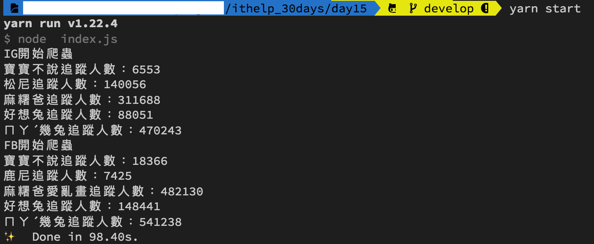

#### [回目錄](../README.md)
## Day15 善用json讓你批量爬蟲

🤔 這個檔案要給非工程師填寫，為什麼是使用json而不是txt或是excel?
----
專案在需求規格中有一條是**在自己的電腦執行**，在分析完各種檔案格式的優缺點後我決定使用json格式：
* txt
    * 優點：在所有作業系統中都能夠打開做編輯
    * 缺點：格式難以律定，只要使用者多個空格、表點符號...都容易造成程式的誤判
* excel
    * 優點：這是對使用者而言最友善的一種編輯器了，視覺化良好、操作友善
    * 缺點：並不是所有人電腦都有安裝 excel 編輯器(像我朋友就沒有)
* json
    * 優點：在所有作業系統中都能夠打開做編輯，key-value 的格式易於理解、程式可直接讀取
    * 缺點：使用者需要花幾分鐘時間理解 json 格式的規則

🏆 今日目標
----
1. 了解json格式與基本規則，並建立json格式的粉專清單
2. 將粉專爬蟲的程式改寫為讀取json檔裡面的資料

🤔 了解json格式與基本規則，並建立一份json格式的粉專清單
----
今天說的這個部分應該是大部分小編最關心的，要每天手動瀏覽那麼多的粉專想想都很崩潰  
所以要來跟大家介紹的一個很棒的文本格式 **json** (JavaScript Object Notation) ，他同時也是網頁api回傳最常見的一種格式  

#### json格式與基本規則
json 可以包含 **object (物件)** 與 **array (陣列)** 
* 物件
    * 為 key-value 的格式
        ```js
        { "key" : "value" }

        { "姓名" : "寶寶不說" } //通常用於描寫一項屬性的數值
        ```
    * 多個物件使用 , 做為分隔
        ```js
        { "key" : "value" , "key" : "value" }

        { "姓名" : "寶寶不說" , "性別" : "不明" } //多個物件可表達一個東西的多種屬性
        ```
* 陣列
    * 多個 value 之間使用 , 分隔
        ```js
        [ value, value ]

        // 陣列與物件裡面value可以使用多種資料型態如下
        [ 0 , { "傳奇寶寶" : null } , "string" , false , ['test'] ]
        ```

#### 建立json格式的粉專清單
**建構邏輯：**
1. 我們有許多粉專需要去追蹤，所以最外層會用 **陣列(array)**  
2. 而每個粉專都有自己的屬性(title為粉專名稱、url為粉專網址)，所以陣列裡面的 value 採用 **物件(object)** 
    ```json
    [
        {
            "title": "粉專A",
            "url": "粉專A連結"
        },
        {
            "title": "粉專B",
            "url": "粉專B連結"
        }  
    ]
    ```
**在專案建立的步驟：**
1. 在專案資料夾中建立 **fanspages** 的資料夾，專門存放粉專頁面爬蟲要使用的json檔案
2. 在fanspages資料夾中新增 **ig.json、fb.json** 這兩個檔案，並依照上述json結構填上你要爬蟲的資訊  
3. 你可以先複製下方範例做測試(筆者是以下貼圖的狂熱愛好者，歡迎一起追蹤按愛心XD)
#### ig.json
```json
[
    {
        "title": "寶寶不說",
        "url": "https://www.instagram.com/baobaonevertell/"
    },
    {
        "title": "松尼",
        "url": "https://www.instagram.com/sweethouse.sl/"
    },
    {
        "title": "麻糬爸",
        "url": "https://www.instagram.com/mochi_dad/"
    },
    {
        "title": "好想兔",
        "url": "https://www.instagram.com/chien_chien0608/"
    },
    {
        "title": "ㄇㄚˊ幾兔",
        "url": "https://www.instagram.com/machiko324/"
    }
]
```

將粉專爬蟲的程式改寫為讀取json檔裡面的資料
----
* 只需要把這份json給引入(請注意路徑)就可以直接使用了  
    ```js
    const fanpage_array = require('../fanspages/ig.json');
    ```
* 將前往粉專頁面與爬蟲的部分用 **for/of迴圈** 包起來，讓他依序前往粉專頁面抓資料
    ```js
    for (fanpage of fanpage_array) {
        // 撰寫你要對fanpage做的事       
    }
    ```
* 我們要當個好爬蟲，每個頁面設定爬蟲間隔3-6秒(這裡我們使用Math.random()取得區間亂數)，不要因為自己的爬蟲造成別人伺服器的負擔
    ```js
    await driver.sleep((Math.floor(Math.random()*4)+3)*1000)//每個頁面爬蟲間隔3~6秒，不要造成別人的伺服器負擔
    ```
* 統整後完整程式如下
    #### crawlerIG.js
    ```js
    const fanpage_array = require('../fanspages/ig.json');
    const ig_username = process.env.IG_USERNAME
    const ig_userpass = process.env.IG_PASSWORD
    const { By, until } = require('selenium-webdriver') // 從套件中取出需要用到的功能
    exports.crawlerIG = crawlerIG;//讓其他程式在引入時可以使用這個函式

    async function crawlerIG (driver) {
        const isLogin = await loginInstagram(driver, By, until)
        if (isLogin) {//如果登入成功才執行下面的動作
            console.log(`IG開始爬蟲`)
            for (fanpage of fanpage_array) {
                await goFansPage(driver, fanpage.url)
                const trace = await getTrace(driver, By, until)
                if (trace === null) {
                    console.log(`${fanpage.title}無法抓取追蹤人數`)
                } else {
                    console.log(`${fanpage.title}追蹤人數：${trace}`)
                }
                await driver.sleep((Math.floor(Math.random()*4)+3)*1000)//每個頁面爬蟲間隔3~6秒，不要造成別人的伺服器負擔
            }
        }
    }
    ...//後面程式一樣
    ```

🚀 執行程式
----
在專案資料夾的終端機(Terminal)執行指令
```sh
yarn start
```
畫面執行順序：Instagram自動登入 &rarr; 依序跳轉到指定帳號 &rarr; Facebook自動登入 &rarr; 依序跳轉到粉絲頁 &rarr; 關閉

大概裝完一壺水的時間後，你就能看到FB & IG的追蹤人數嚕～  
  

搭配上json後有沒有覺得自己功力大增XD，上面的是IG的範例，大家可以自己嘗試看看FB部分的如何改寫喔～


ℹ️ 專案原始碼
----
* 今天的完整程式碼可以在[這裡](https://github.com/dean9703111/ithelp_30days/day15)找到喔
* 我也貼心地把昨天的把昨天的程式碼打包成[壓縮檔](https://github.com/dean9703111/ithelp_30days/sampleCode/day14_sample_code.zip)，你可以用裡面乾淨的環境來實作今天json改寫的部分喔
    * 請記得在終端機下指令 **yarn** 才會把之前的套件安裝
    * 調整.env檔
        * 填上FB登入資訊
        * 填上FB版本(classic/new)
        * 填上IG登入資訊
    * 調整fanspages資料夾內目標爬蟲的粉專網址

📖參考資源
----
1. [JSON 格式與 JavaScript 解析教學範例](https://www.footmark.info/programming-language/javascript/json-format-and-javascript/)
2. [用Math.random()取得亂數的技巧](https://ithelp.ithome.com.tw/articles/10197904)
<br>

>*免責聲明:文章技術僅抓取公開數據作爲研究，任何組織和個人不得以此技術盜取他人智慧財產、造成網站損害，否則一切后果由該組織或個人承擔。作者不承擔任何法律及連帶責任！*
### [Day16 優化爬蟲體驗 & 思路分享](/day16/README.md)