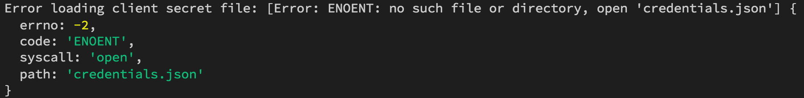
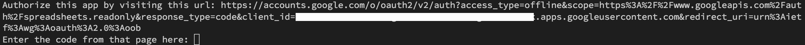

#### [回目錄](../README.md)
### Day14 google sheets起手式，取得寫入google sheets的憑證(credentials)

使用原因
----
一般來說這些爬蟲的資料都是儲存到資料庫，但是我相信絕大多數的人不太可能隨時隨地打開資料庫觀看  
而且存在資料庫除非你請網頁工程師幫你完成前端視覺化，不然資料庫絕對可以讓你看到眼脫XD  

經過多方思慮我最後採用Google Sheets的服務，主要理由：
1. 只要有網路我就能看
2. 絕大多數人都有使用Google Sheets的經驗
3. Google Sheets轉化成圖表相對容易
4. 你不需要一台Server專門來存這些資料
5. ~~免費~~

儘管Google Sheets並不完美，但他真的很適合用在這個專案上面  

取得憑證(credentials)
------------------------
如果把Google Sheets想像成一個藏寶庫，憑證(credentials)就像是一把鑰匙，只有擁有這把鑰匙的人才有打開門的資格；不然這個藏寶庫誰都能任意進出起不是很危險？  

* 憑證(credentials)取得的步驟
    1. 請先確認已經安裝過Node.js & npm(跟著教學走的人都安裝過)，有Goolge帳號
    2. 進入Google Sheet Node.js申請憑證(credentials)的[網頁](https://developers.google.com/sheets/api/quickstart/nodejs)  
      
    這個自己命名
      
    選擇Desktop app即可
      
    千萬不要忘記下載這個憑證，下面的Client ID、Client Secret可以忽略
      
    在專案下開一個credentials資料夾，把下載好的憑證重新命名成googleSheets.json放進去
    3. 下載googleapis套件
    ```
    yarn add googleapis@39
    ```  
    4. 在專案tools資料夾中新增googleSheets.js檔案，並複製Google範例程式碼貼上
    ```js
    const fs = require('fs');
    const readline = require('readline');
    const {google} = require('googleapis');

    // If modifying these scopes, delete token.json.
    const SCOPES = ['https://www.googleapis.com/auth/spreadsheets.readonly'];
    // The file token.json stores the user's access and refresh tokens, and is
    // created automatically when the authorization flow completes for the first
    // time.
    const TOKEN_PATH = 'token.json';

    // Load client secrets from a local file.
    fs.readFile('credentials.json', (err, content) => {
    if (err) return console.log('Error loading client secret file:', err);
    // Authorize a client with credentials, then call the Google Sheets API.
    authorize(JSON.parse(content), listMajors);
    });

    /**
    * Create an OAuth2 client with the given credentials, and then execute the
    * given callback function.
    * @param {Object} credentials The authorization client credentials.
    * @param {function} callback The callback to call with the authorized client.
    */
    function authorize(credentials, callback) {
    const {client_secret, client_id, redirect_uris} = credentials.installed;
    const oAuth2Client = new google.auth.OAuth2(
        client_id, client_secret, redirect_uris[0]);

    // Check if we have previously stored a token.
    fs.readFile(TOKEN_PATH, (err, token) => {
        if (err) return getNewToken(oAuth2Client, callback);
        oAuth2Client.setCredentials(JSON.parse(token));
        callback(oAuth2Client);
    });
    }

    /**
    * Get and store new token after prompting for user authorization, and then
    * execute the given callback with the authorized OAuth2 client.
    * @param {google.auth.OAuth2} oAuth2Client The OAuth2 client to get token for.
    * @param {getEventsCallback} callback The callback for the authorized client.
    */
    function getNewToken(oAuth2Client, callback) {
    const authUrl = oAuth2Client.generateAuthUrl({
        access_type: 'offline',
        scope: SCOPES,
    });
    console.log('Authorize this app by visiting this url:', authUrl);
    const rl = readline.createInterface({
        input: process.stdin,
        output: process.stdout,
    });
    rl.question('Enter the code from that page here: ', (code) => {
        rl.close();
        oAuth2Client.getToken(code, (err, token) => {
        if (err) return console.error('Error while trying to retrieve access token', err);
        oAuth2Client.setCredentials(token);
        // Store the token to disk for later program executions
        fs.writeFile(TOKEN_PATH, JSON.stringify(token), (err) => {
            if (err) return console.error(err);
            console.log('Token stored to', TOKEN_PATH);
        });
        callback(oAuth2Client);
        });
    });
    }

    /**
    * Prints the names and majors of students in a sample spreadsheet:
    * @see https://docs.google.com/spreadsheets/d/1BxiMVs0XRA5nFMdKvBdBZjgmUUqptlbs74OgvE2upms/edit
    * @param {google.auth.OAuth2} auth The authenticated Google OAuth client.
    */
    function listMajors(auth) {
    const sheets = google.sheets({version: 'v4', auth});
    sheets.spreadsheets.values.get({
        spreadsheetId: '1BxiMVs0XRA5nFMdKvBdBZjgmUUqptlbs74OgvE2upms',
        range: 'Class Data!A2:E',
    }, (err, res) => {
        if (err) return console.log('The API returned an error: ' + err);
        const rows = res.data.values;
        if (rows.length) {
        console.log('Name, Major:');
        // Print columns A and E, which correspond to indices 0 and 4.
        rows.map((row) => {
            console.log(`${row[0]}, ${row[4]}`);
        });
        } else {
        console.log('No data found.');
        }
    });
    }
    ```
    5. 測試能否運行
    ```
    node tools/googleSheets.js
    ```
    如果沒意外你應該會遇到如下錯誤  
      
    請將下面程式 **'credentials.json'** 修改成自己的路徑 **'credentials/googleSheets.json'** 
    ```js
    fs.readFile('credentials.json', (err, content) => {
        if (err) return console.log('Error loading client secret file:', err);
        // Authorize a client with credentials, then call the Google Sheets API.
        authorize(JSON.parse(content), listMajors);
    });
    ```
    然後再執行一次 **node tools/googleSheets.js** 時下面會有連結請你打開
      
    打開後的網頁會要你選擇登入的Google帳號，看到下面的網頁時別害怕，點擊**進階**然後再點擊**前往「Quickstart」(不安全)**
      
    然後所有的授權都必須按允許後你會看到一組授權碼，把他複製下來貼回終端視窗就完成惹
      
    如果終端機有輸出類似下面的東西時就代表你成功了
    ```
    Name, Major:
    Alexandra, English
    Andrew, Math
    Anna, English
    Becky, Art
    Benjamin, English
    Carl, Art
    Carrie, English
    Dorothy, Math
    ...
    ```
編輯.gitignore
--------------------------------------------------------
無論是最後產生的token.json還是在credentials資料夾裡面的憑證都不適合上傳到git上面，所以你要調整.gitignore如下  
```
node_modules
.env
chromedriver.exe
debug.log
credentials
token.json
```

完整的程式碼在[這裡](https://github.com/dean9703111/ithelp_30days/day15)喔
你可以整個專案clone下來  
```
git clone https://github.com/dean9703111/ithelp_30days.git
```
如果你已經clone過了，那你每天pull就能取得更新的資料嚕  
```
git pull origin master
cd day15
yarn
在credentials資料夾放上自己的憑證
node tools/googleSheets.js
```
### [Day16 Google Sheets-讀取自己的sheet](/day16/README.md)