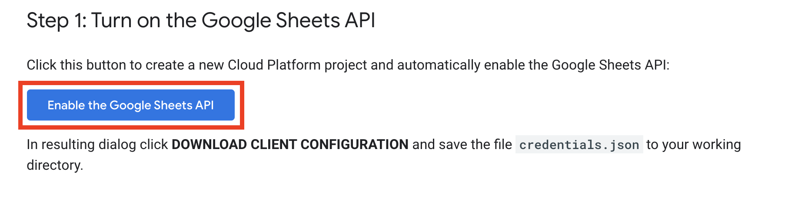
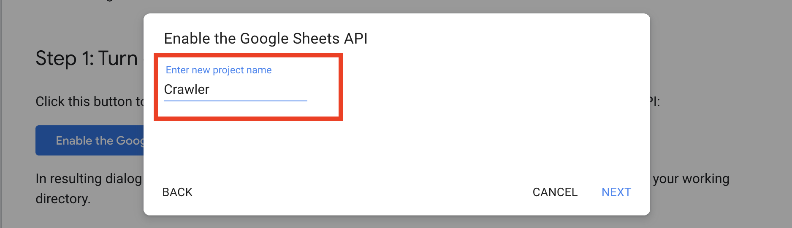
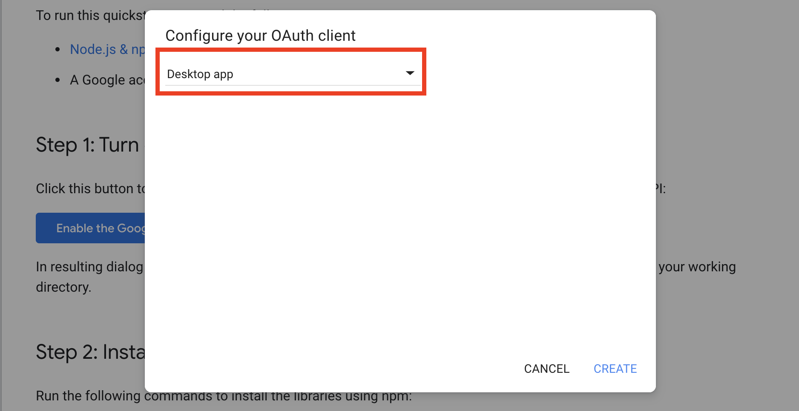
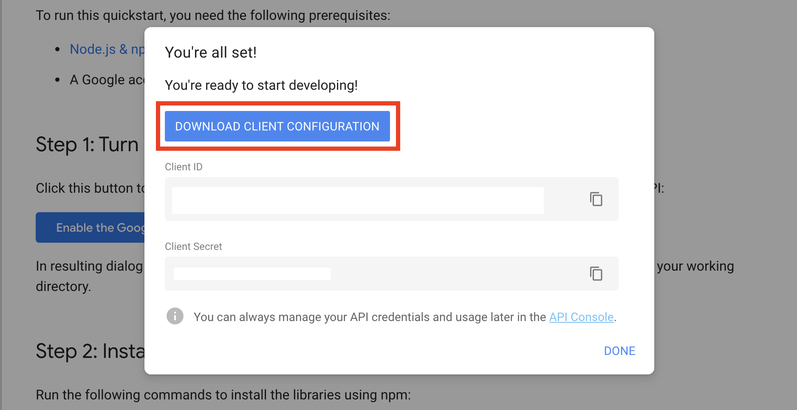
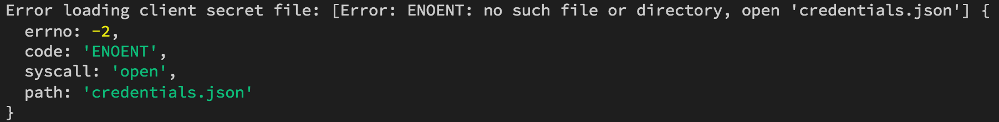
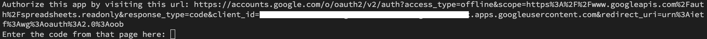
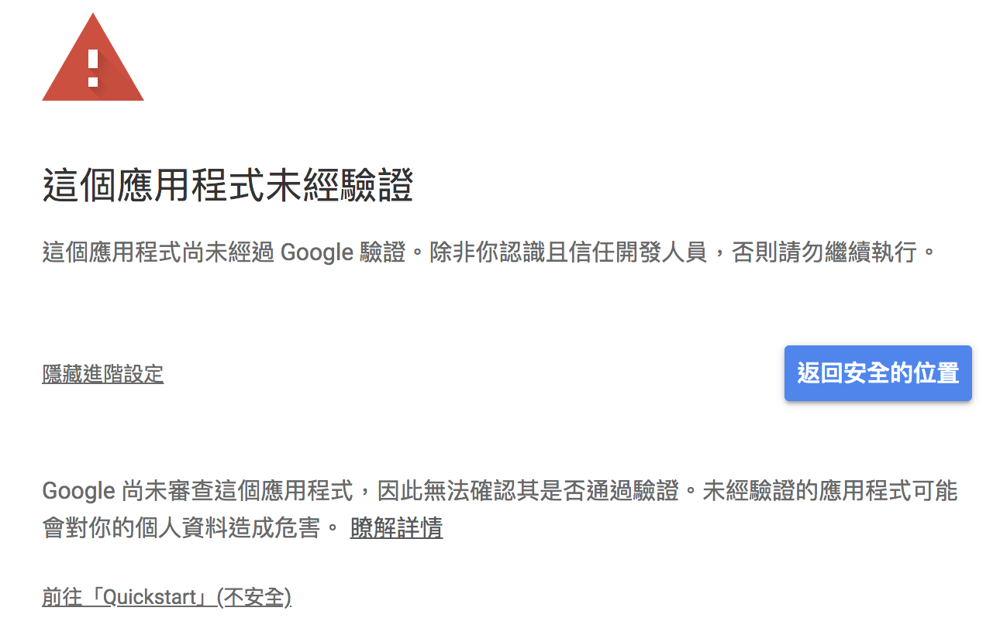
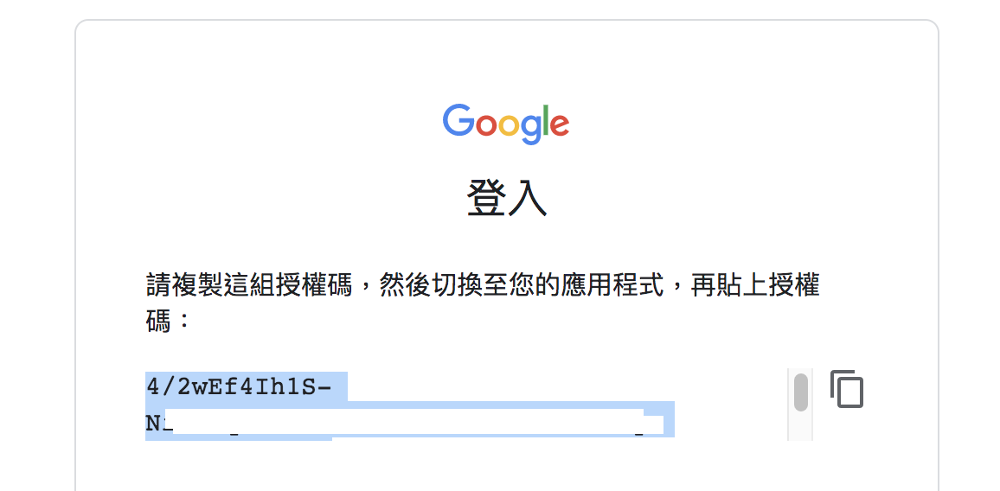

#### [回目錄](../README.md)
## Day17 Google Sheets-免費儲存資料的好選擇，一起進入省錢起手式

>專案最基本的就是：**符合客戶預算與實際使用需求**  

🤔 為什麼選擇Google Sheets作為資料載體?
----
一般來說爬蟲的資料都是儲存到資料庫，但是我相信絕大多數的人不太可能隨時隨地打開資料庫觀看  
而且存在資料庫除非你請網頁工程師幫你完成前端視覺化，不然資料庫絕對可以讓你看到懷疑人生XD  

經過多方思慮我最後採用Google Sheets的服務，主要理由：
1. 只要有網路我就能看
2. 絕大多數人都有使用Google Sheets的經驗
3. Google Sheets轉化成圖表相對容易
4. 你不需要一台Server專門來存這些資料
5. **`免費`**

儘管Google Sheets並不完美，但他真的很適合用在這個專案上面  

----

🏆 今日目標
----
1. 取得google sheeet憑證(credentials)
2. 在專案加入官方提供的範例程式做測試
3. 將Google Sheets的憑證、授權檔加入.gitignore列表

----

# 1. 取得google sheeet憑證(credentials)
如果把Google Sheets想像成一個藏寶庫，憑證(credentials)就像是一把鑰匙，只有擁有這把鑰匙的人才有打開門的資格；不然這個藏寶庫誰都能任意進出豈不是很危險？  

#### 憑證(credentials)取得的步驟
1. 請先確認`已經安裝過Node.js & npm`(跟著教學走的人都安裝過)，`有Goolge帳號`
2. 進入Google Sheet Node.js申請憑證(credentials)的[網頁](https://developers.google.com/sheets/api/quickstart/nodejs)  
    1. 按下紅框處按鈕 **Enable theGoogle Sheets API**
          
    2. 輸入專案的名稱，建議**填寫符合專案功能的命名**
          
    3. 本轉案選擇 **Desktop app** 即可
          
    4. 千萬`不要忘記下載這個憑證`，下面的Client ID、Client Secret不需特別複製，都存在憑證檔裡面了
          
3. 在專案的`tools資料夾下新增一個google_sheets資料夾`，專門存放Google Sheets相關檔案
4. 將`下載好的憑證(credentials.json)放進去google_sheets資料夾`，這樣的目錄節結構會方便我們日後管理

----

# 2. 在專案加入官方提供的範例程式做測試
在詳細的閱讀官方文件之前，我會先`用官方的範例程式確認他能否在我的專案順利運作`，如果遇到太多環境衝突才能及早尋找替代方案
1. 下載 `googleapis` 套件
    ```
    yarn add googleapis@39
    ```  
2. 在 **tools/google_sheets** 資料夾中新增 **index.js** 檔案，並複製Google範例程式碼貼上
    ```js
    const fs = require('fs');
    const readline = require('readline');
    const { google } = require('googleapis');

    // If modifying these scopes, delete token.json.
    const SCOPES = ['https://www.googleapis.com/auth/spreadsheets.readonly'];
    // The file token.json stores the user's access and refresh tokens, and is
    // created automatically when the authorization flow completes for the first
    // time.
    const TOKEN_PATH = 'tools/google_sheets/token.json';

    // Load client secrets from a local file.
    fs.readFile('credentials.json', (err, content) => {
    if (err) return console.log('Error loading client secret file:', err);
    // Authorize a client with credentials, then call the Google Sheets API.
    authorize(JSON.parse(content), listMajors);
    });

    /**
    * Create an OAuth2 client with the given credentials, and then execute the
    * given callback function.
    * @param {Object} credentials The authorization client credentials.
    * @param {function} callback The callback to call with the authorized client.
    */
    function authorize (credentials, callback) {
    const { client_secret, client_id, redirect_uris } = credentials.installed;
    const oAuth2Client = new google.auth.OAuth2(
        client_id, client_secret, redirect_uris[0]);

    // Check if we have previously stored a token.
    fs.readFile(TOKEN_PATH, (err, token) => {
        if (err) return getNewToken(oAuth2Client, callback);
        oAuth2Client.setCredentials(JSON.parse(token));
        callback(oAuth2Client);
    });
    }

    /**
    * Get and store new token after prompting for user authorization, and then
    * execute the given callback with the authorized OAuth2 client.
    * @param {google.auth.OAuth2} oAuth2Client The OAuth2 client to get token for.
    * @param {getEventsCallback} callback The callback for the authorized client.
    */
    function getNewToken (oAuth2Client, callback) {
    const authUrl = oAuth2Client.generateAuthUrl({
        access_type: 'offline',
        scope: SCOPES,
    });
    console.log('Authorize this app by visiting this url:', authUrl);
    const rl = readline.createInterface({
        input: process.stdin,
        output: process.stdout,
    });
    rl.question('Enter the code from that page here: ', (code) => {
        rl.close();
        oAuth2Client.getToken(code, (err, token) => {
        if (err) return console.error('Error while trying to retrieve access token', err);
        oAuth2Client.setCredentials(token);
        // Store the token to disk for later program executions
        fs.writeFile(TOKEN_PATH, JSON.stringify(token), (err) => {
            if (err) return console.error(err);
            console.log('Token stored to', TOKEN_PATH);
        });
        callback(oAuth2Client);
        });
    });
    }

    /**
    * Prints the names and majors of students in a sample spreadsheet:
    * @see https://docs.google.com/spreadsheets/d/1BxiMVs0XRA5nFMdKvBdBZjgmUUqptlbs74OgvE2upms/edit
    * @param {google.auth.OAuth2} auth The authenticated Google OAuth client.
    */
    function listMajors (auth) {
    const sheets = google.sheets({ version: 'v4', auth });
    sheets.spreadsheets.values.get({
        spreadsheetId: '1BxiMVs0XRA5nFMdKvBdBZjgmUUqptlbs74OgvE2upms',
        range: 'Class Data!A2:E',
    }, (err, res) => {
        if (err) return console.log('The API returned an error: ' + err);
        const rows = res.data.values;
        if (rows.length) {
        console.log('Name, Major:');
        // Print columns A and E, which correspond to indices 0 and 4.
        rows.map((row) => {
            console.log(`${row[0]}, ${row[4]}`);
        });
        } else {
        console.log('No data found.');
        }
    });
    }
    ```
3. 在終端機(Terminal)執行指令，測試能否運行
    ```vim
    node tools/google_sheets/index.js
    ```
    1. 如果沒意外你應該會遇到如下錯誤  
          
        請將範例程式中讀取 **'credentials.json'** 路徑修改成專案的路徑 **'tools/google_sheets/credentials.json'**
        ```js
        //fs.readFile('credentials.json', (err, content) => {
        fs.readFile('tools/google_sheets/credentials.json', (err, content) => {
            if (err) return console.log('Error loading client secret file:', err);
            // Authorize a client with credentials, then call the Google Sheets API.
            authorize(JSON.parse(content), listMajors);
        });
        ```
    2. 再執行一次 **node tools/google_sheets/index.js** 時下面會有連結請你打開
          
    3. 打開後的網頁會要你選擇登入的Google帳號，看到下面的網頁時別害怕，點擊 **進階** 然後再點擊 **前往「Quickstart」(不安全)**
          
    4. 接著所有的授權都必須按 **允許** ，最後你會看到一組授權碼，把他複製下來貼回終端機(Terminal)就完成惹
          
    5. 如果終端機(Terminal)有輸出類似下面的資料時就代表你成功了
        ```
        Name, Major:
        Alexandra, English
        Andrew, Math
        Anna, English
        Becky, Art
        Benjamin, English
        Carl, Art
        Carrie, English
        Dorothy, Math
        ...
        ```
    6. 聰明的你會發現 `專案根目錄下多了一個 token.json` 的檔案，如果說 credentials.json 是打開藏寶庫的鑰匙，token.json 就像是能夠把裡面寶藏搬進搬出的權杖，而這個權杖是有期限的(expiry_date)，期限過了就需要再申請  
        1. 為了方便管理我們把 token.json 搬移到 tools/google_sheets 的資料夾下
        2. `修改範例程式中讀取 token.json 的路徑`
            ```js
            //const TOKEN_PATH = 'token.json';
            const TOKEN_PATH = 'tools/google_sheets/token.json';
            ```

# 3. 將Google Sheets的憑證、授權檔加入.gitignore列表
我想應該不會有人想把藏寶庫的鑰匙跟權杖公開讓大家使用吧?如果你不小心把 `credentials.json、token.json` 兩個檔案加入版控就等於把你Google Sheets的權限送給別人了，所以你要調整.gitignore如下：
```
node_modules
.env
chromedriver.exe
debug.log
credentials.json
token.json
```
>不熟悉的朋友可以參考 [Day6 gitignore-請勿上傳敏感、主程式以外的資料](../day6/README.md) 的文章


ℹ️ 專案原始碼
----
* 今天的完整程式碼可以在[這裡](https://github.com/dean9703111/ithelp_30days/tree/master/day17)找到喔
* 我也貼心地把昨天的把昨天的程式碼打包成[壓縮檔](https://github.com/dean9703111/ithelp_30days/raw/master/sampleCode/day16_sample_code.zip)，你可以用裡面乾淨的環境來實作今天Google Sheets的起手式喔
    * 請記得在終端機下指令 **yarn** 才會把之前的套件安裝
    * 要在tools/google_sheets資料夾放上自己的憑證，今天的程式才能執行喔
    
### [Day18 Google Sheets-加入版控後被github警告了，官方範例做了什麼？](/day18/README.md)