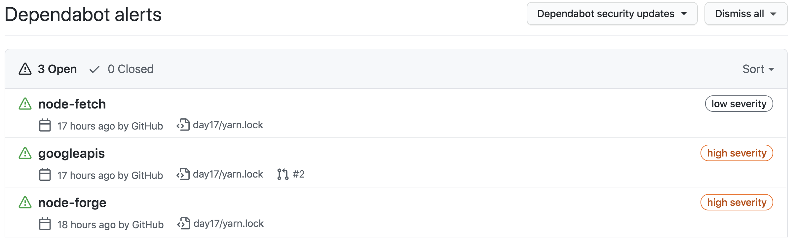
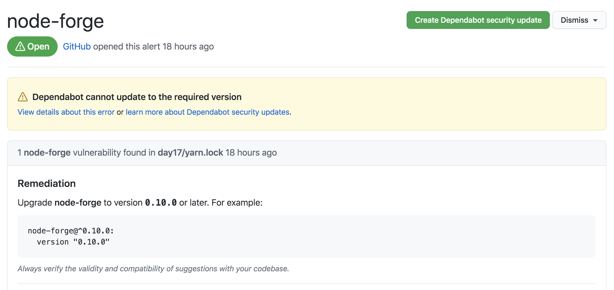
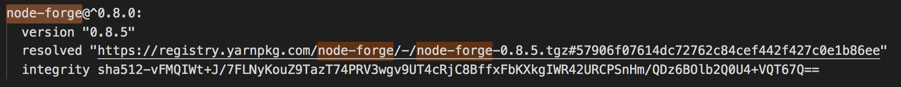
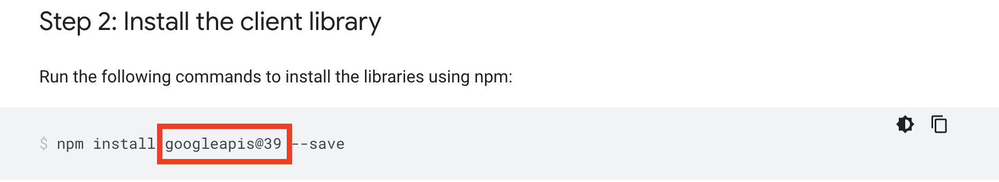
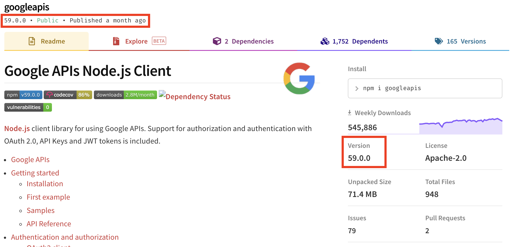
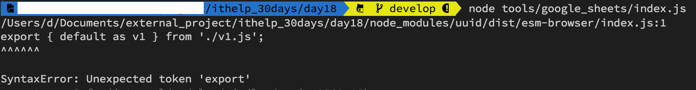
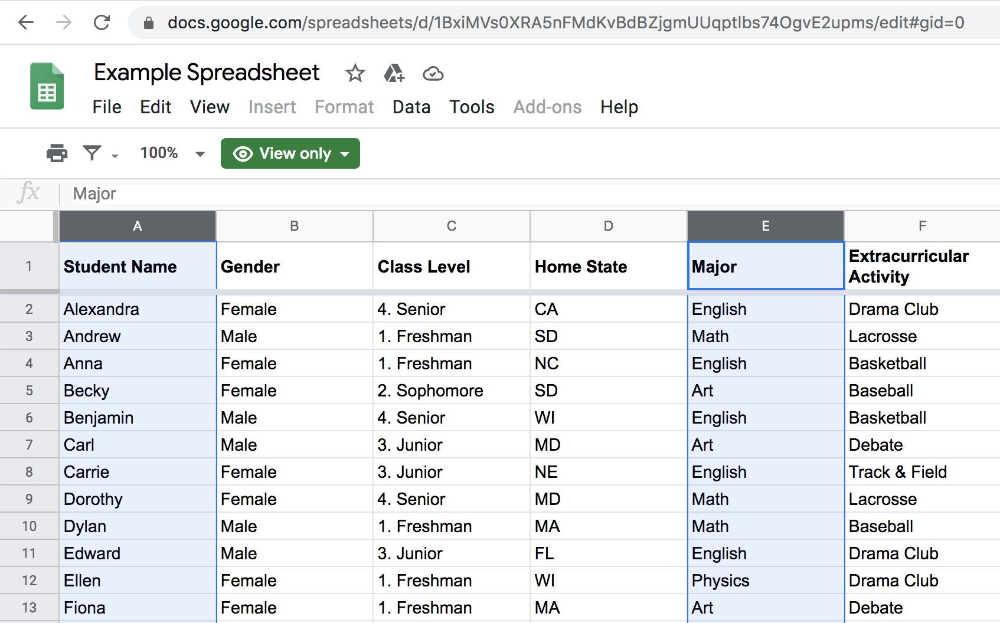
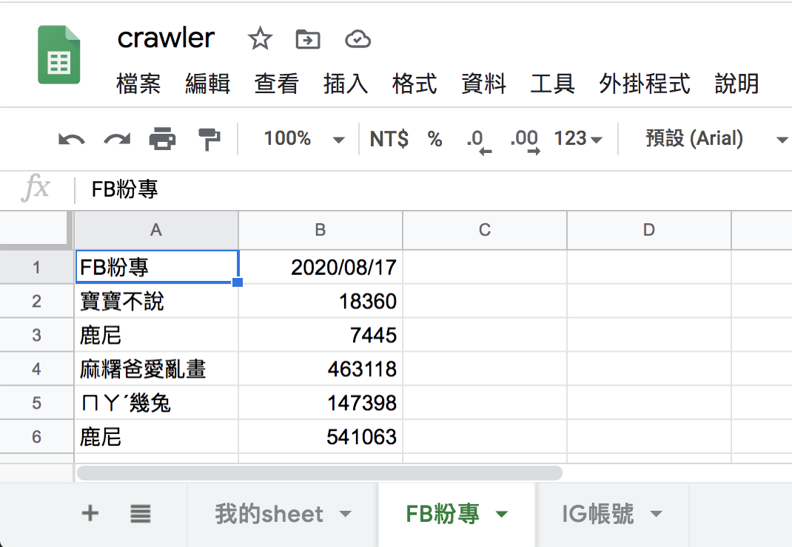
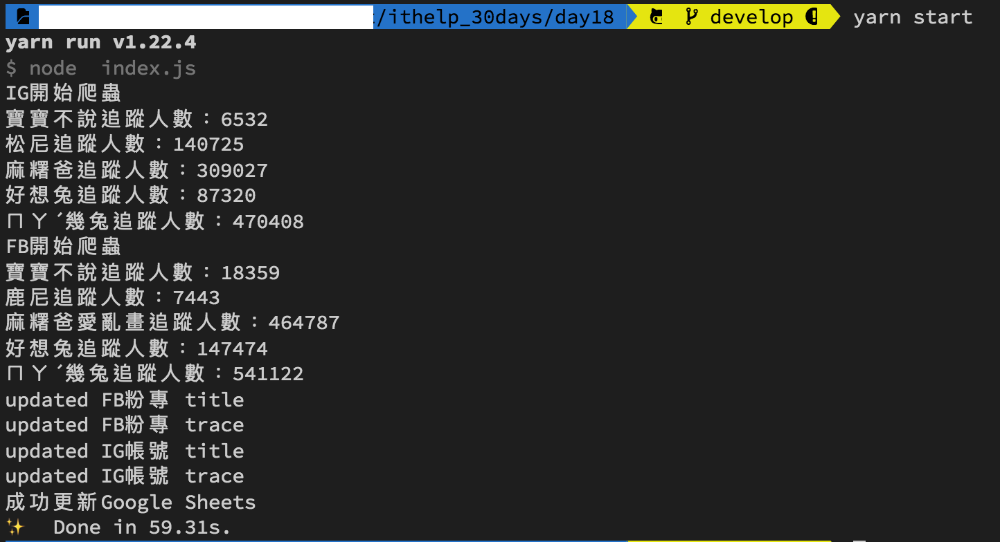

#### [回目錄](../README.md)
## Day18 Google Sheets-讀取自己的sheet

>盡信書不如無書

🤔 你知道官方範例在做什麼事情嗎?
----
在我們跟著官方步驟完成後，有哪些需要注意的事情
1. 我們安裝了什麼套件?
    * 如果你有用git版控在做這份專案，你應該會收到git給你的警告通知，今天會說明如何閱讀這個通知並解決他  
2. 官方的範例程式在做什麼?
    * 會教你如何觀察官方的範例程式，知道他運行的邏輯，學會改寫，拒絕只當copycat

🏆 今日目標
----
1. 了解git警告通知的原因並處理
2. 改寫官方範例讀取自己指定的Google Sheets
    * 分析官方範例程式
    * 取得自己的spreadsheetId並加入程式
    * 撰寫自己的函式(listMySheet)讀取自己的sheet

🤔 了解git警告通知的原因並處理
----
* 昨天雖然我們按照官方給的範例完成了，但你把code上傳到git後應該會收到git給你的警告通知
    
    1. 我們先點開被標注 **high severity(高嚴重性)** 的通知
        
        你會發現這裡面是相依套件版本過低所造成的警告
    2. 接著我們以 **node-forge** 為關鍵字在 **yarn.lock** 檔案裡面搜尋，發現真的版本過低
        
    3. 同時發現這個套件是跟 **google** 有關聯性的，一路順藤摸瓜往上查會發現根源就是昨天安裝的 **googleapis** 這個套件
        
    4. 來回顧一下官方是指定我們安裝`39`這個版本的
        
    5. 接著我們直接搜尋 **googleapis npm** 來看看套件的資訊，你就會發現最新的套件已經來到了`59`這個版本
        
* 官方建議安裝的套件版本跟最新的套件版本**整整差了20個大版**，雖然每次更新版本都會有release note，但我相信會認真看的沒有幾個，所以這20個大版本的變更修復或是新增多少功能也是我們所不清楚的，**固定的版本可以給你穩定的功能，但是潛在的漏洞你無法知曉，所以如果在確認最新版本是穩定的狀態下我會更新套件**
    1. 輸入指令安裝最新版本的googleapis
        ```vim
        yarn add googleapis@59
        ```
    2. 每次更新版本後記得執行程式確認有無異常
        ```vim
        node tools/google_sheets/index.js
        ```
        * 可能遇到的的錯誤
            
        * 在google搜尋 **googleapis export { default as v1 } from './v1.js';** 就能找到問題是出在node版本上面，輸入指令安裝並套用新版本就能解決嚕
            ```vim
            nvm install 14.7
            nvm use 14.7
            ```

分析官方範例程式(tools/google_sheets/index.js)
----
以下說明建議你[打開昨日的範例程式](https://github.com/dean9703111/ithelp_30days/blob/master/day17/tools/google_sheets/index.js)方便相互印證
* 首先要理解Google提供範例程式，理解程式最快的方式的就是從 **輸出結果的位置** 開始回推，所以我反推的順序會是：
    1. **找到輸出結果的console.log()位置** &rarr; *console.log('Name, Major:');*
    2. **這個結果是在哪個function輸出的** &rarr; *listMajors(auth)*
    3. **程式哪裏呼叫了listMajors這個function** &rarr; *authorize(JSON.parse(content), listMajors)*
    4. 於是我們找到程式的根源，**要先要取得憑證才能執行authorize(授權)** &rarr; *fs.readFile('tools/google_sheets/credentials.json'...)*

* 經過分析我們就可了解取得授權後對Google sheets的處理都在 **listMajors** 這個函式，裡面有兩個參數我們要特別注意：  
    1. **spreadsheetId**：你的Google Sheets id
    2. **range**：你指定讀取的範圍

* 知道要處理的參數後我們就能開始改寫了，步驟：
    1. 取得自己的spreadsheetId並加入程式
    2. 撰寫自己的函式(listMySheet)讀取自己的sheet

取得自己的spreadsheetId並加入程式
----
1. 我們先觀察官方對 **listMajors** 這隻函式的註解
    ```js
    /**
     * Prints the names and majors of students in a sample spreadsheet:
    * @see https://docs.google.com/spreadsheets/d/1BxiMVs0XRA5nFMdKvBdBZjgmUUqptlbs74OgvE2upms/edit
    * @param {google.auth.OAuth2} auth The authenticated Google OAuth client.
    */
    ```
2. 再觀察裡面 **spreadsheetId** 的參數
    ```js
    spreadsheetId: '1BxiMVs0XRA5nFMdKvBdBZjgmUUqptlbs74OgvE2upms'  
    ```
    就會發現他是在網址 https://docs.google.com/spreadsheets/d/ `1BxiMVs0XRA5nFMdKvBdBZjgmUUqptlbs74OgvE2upms` /edit 的這個位置
3. 我們建立好Google Sheets後就把spreadsheetId替換成自己的(實際網頁位置如下圖紅框處)  
      
    ```js
    spreadsheetId: process.env.SPREADSHEET_ID
    ```
    * 因為spreadsheetId並不適合公開放到git上面(你應該不會想公布這份Google Sheets給全世界吧)，所以我們要把**spreadsheetId複製起來放到.env裡面設定為環境變數**
        #### .env.exmaple
        ```
        #填寫自己登入IG的真實資訊(建議開小帳號來實驗，因為帳號使用太頻繁會被官方鎖住)
        IG_USERNAME='ig username'
        IG_PASSWORD='ig password'

        #填寫自己登入FB的真實資訊(建議開小帳號來實驗，因為帳號使用太頻繁會被官方鎖住)
        FB_USERNAME='fb username'
        FB_PASSWORD='fb password'

        #填寫你目標放入的spreadsheetId
        SPREADSHEET_ID='your spreadsheetId'
        ```

撰寫自己的函式(listMySheet)讀取自己的sheet
----
* 你可以由官方範例的[Google sheets](https://docs.google.com/spreadsheets/d/1BxiMVs0XRA5nFMdKvBdBZjgmUUqptlbs74OgvE2upms/edit) 發現昨天程式印出來的是這個 Sheets 第一欄跟第五欄的值
      
    * 看看官方範例是如何印出這兩欄的數值
        ```js
        console.log('Name, Major:');
        // Print columns A and E, which correspond to indices 0 and 4.
        rows.map((row) => {
            console.log(`${row[0]}, ${row[4]}`);
        });
        ```  
* 接下來我們把原本Google範例程式的**listMajors()刪除**，**改寫成非同步函式listMySheet()**  
    ```js
    async function listMySheet (auth) {
        const sheets = google.sheets({ version: 'v4', auth });
        const title = '我的sheet'//請你更改成自己設定的sheet(工作表)名稱
        const request = {
            spreadsheetId: process.env.SPREADSHEET_ID,
            range: [
                `'${title}'!A:ZZ`//這是指抓取的範圍，你也可以改寫成A1:A300(抓第1欄的第1列到第300列)
            ],
            valueRenderOption: "FORMULA"//FORMATTED_VALUE|UNFORMATTED_VALUE|FORMULA
        }
        try {
            //這裡改寫為await，之後會有順序執行的需求
            let values = (await sheets.spreadsheets.values.get(request)).data.values;
            console.log(values)
        } catch (err) {
            console.error(err);
        }
    }
    ```
    >**valueRenderOption** 這個參數是把資料抓出來時的類型，感興趣可參考[Google官方文件](https://developers.google.com/sheets/api/reference/rest/v4/ValueRenderOption)  
  

🚀執行程式
----
1. 先在自己的Google Sheets表格上隨機輸入文字
      
2. 在專案資料夾的終端機(Terminal)執行指令
    ```vim
    node tools/google_sheets/index.js
    ```
3. 看看輸出的結果是否與你的Google sheets上的一樣呢～ 
      

ℹ️ 專案原始碼
----
* 今天的完整程式碼可以在[這裡](https://github.com/dean9703111/ithelp_30days/tree/master/day18)找到喔
* 我也貼心地把昨天的把昨天的程式碼打包成[壓縮檔](https://github.com/dean9703111/ithelp_30days/tree/master/sampleCode/day17_sample_code.zip)，你可以用裡面乾淨的環境來實作今天google sheets的起手式喔
    * 請記得在終端機下指令 **yarn** 才會把之前的套件安裝
    * 要在tools/google_sheets資料夾放上自己的憑證，今天的程式才能執行喔

### [Day19 Google Sheets-判斷Sheet存在與否並自動創建](/day19/README.md)