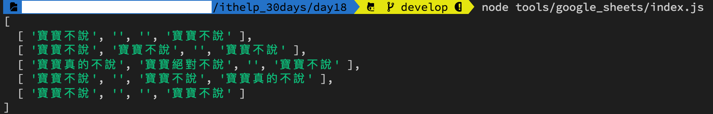

#### [回目錄](../README.md)
## Day18 Google Sheets-讀取自己的sheet

昨天跟著教學做就能讀取到Google提供的範例sheet，而我們今天目標是讓程式讀取自己指定的Google Sheets  

分析官方範例程式
----
首先要理解Google提供範例程式，理解程式最快的方式的就是從 **輸出結果的位置** 開始回推，所以我反推的順序會是：
1. 找到輸出結果的console.log()位置 &rarr; *console.log('Name, Major:');*
2. 確認是用哪個function來輸出 &rarr; *listMajors(auth)*
3. 是誰call這個function &rarr; *authorize(JSON.parse(content), listMajors)*
4. 首先要取得憑證才能夠授權 &rarr; *fs.readFile('credentials/googleSheets.json'*

所以我們可以觀察到程式的邏輯都在 **listMajors** 這個函式中運行，並且可以看到兩個我們要特別注意的參數：  
1. spreadsheetId：你的Google Sheets id
2. range：你指定讀取的範圍

知道我們要處理的元件後我們把今天的實作步驟分為：
1. 取得spreadsheetId
2. 撰寫自己的函式(listMySheet)讀取自己的sheet

取得自己的spreadsheetId並加入程式
----
* 我們先觀察官方對 **listMajors** 這隻函式的註解
  ```js
  /**
   * Prints the names and majors of students in a sample spreadsheet:
   * @see https://docs.google.com/spreadsheets/d/1BxiMVs0XRA5nFMdKvBdBZjgmUUqptlbs74OgvE2upms/edit
   * @param {google.auth.OAuth2} auth The authenticated Google OAuth client.
   */
  ```
* 你對比官方程式 **spreadsheetId** 的的位置
  ```js
  ...
  sheets.spreadsheets.values.get({
    spreadsheetId: '1BxiMVs0XRA5nFMdKvBdBZjgmUUqptlbs74OgvE2upms',
    range: 'Class Data!A2:E',
  }
  ...
  ```
  就會發現他是在 https://docs.google.com/spreadsheets/d/ **1BxiMVs0XRA5nFMdKvBdBZjgmUUqptlbs74OgvE2upms** /edit 這個位置，所以我們建立好Google Sheets後就把spreadsheetId替換成自己的(實際網頁位置如下圖紅框處)  
    
  並且因為spreadsheetId並不適合公開放到git上面(你應該不會想公布這份Google Sheets給全世界吧)，所以我們要把**spreadsheetId複製起來放到.env裡面設定為環境變數**
  #### .env.exmaple
  ```
  #填寫自己登入IG的真實資訊(建議開小帳號來實驗，因為如果爬蟲使用太頻繁你的帳號會受到官方制裁)
  IG_USERNAME='ig username'
  IG_PASSWORD='ig password'

  #填寫自己登入FB的真實資訊(建議開小帳號來實驗，因為如果爬蟲使用太頻繁你的帳號會受到官方制裁)
  FB_USERNAME='fb username'
  FB_PASSWORD='fb password'

  #填寫你目標放入的spreadsheetId
  SPREADSHEET_ID='your spreadsheetId'
  ```

撰寫自己的函式(listMySheet)讀取自己的sheet
----
* 你點擊連結 https://docs.google.com/spreadsheets/d/1BxiMVs0XRA5nFMdKvBdBZjgmUUqptlbs74OgvE2upms/edit 就會發現昨天程式抓的是這個Google Sheets第一欄跟第五欄的值
  
* 可以先看一下官方的撰寫邏輯，接下來我們要將它改成非同步函式的結構
  ```js
  function listMajors(auth) {
  const sheets = google.sheets({version: 'v4', auth});
    sheets.spreadsheets.values.get({
      spreadsheetId: '1BxiMVs0XRA5nFMdKvBdBZjgmUUqptlbs74OgvE2upms',
      range: 'Class Data!A2:E',
    }, (err, res) => {
      if (err) return console.log('The API returned an error: ' + err);
      const rows = res.data.values;
      if (rows.length) {
        console.log('Name, Major:');
        // Print columns A and E, which correspond to indices 0 and 4.
        rows.map((row) => {
          console.log(`${row[0]}, ${row[4]}`);
        });
      } else {
        console.log('No data found.');
      }
    });
  }
  ```
* 在這裡我們把原本Google範例程式的listMajors()刪除，改寫成自己的listMySheet()函式  
  **valueRenderOption** 這個參數是把資料抓出來時的類型，感興趣可參考[Google官方文件](https://developers.google.com/sheets/api/reference/rest/v4/ValueRenderOption)
  ```js
  async function listMySheet (auth) {
    const sheets = google.sheets({ version: 'v4', auth });
    const title = '我的sheet'//請你更改成自己設定的sheet(工作表)名稱
    const request = {
      spreadsheetId: process.env.SPREADSHEET_ID,
      range: [
        `'${title}'!A:ZZ`//這是指抓取的範圍，你也可以改寫成A1:A300(抓第1欄的第1列到第300列)
      ],
      valueRenderOption: "FORMULA"//FORMATTED_VALUE|UNFORMATTED_VALUE|FORMULA
    }
    try {
      //這裡改寫為await，之後會有順序執行的需求
      let values = (await sheets.spreadsheets.values.get(request)).data.values;
      console.log(values)
    } catch (err) {
      console.error(err);
    }
  }
  ```
  上面的程式完成後你可以在自己的Google Sheets上面隨機輸入文字，看看輸出的結果是否符合你的預期～  

執行程式
----
在專案資料夾的終端機(Terminal)執行指令 **node tools/googleSheets.js** 指令，看看輸出的結果是否與你的Google sheets上的一樣呢～ 
  
  

專案原始碼
----
完整的程式碼在[這裡](https://github.com/dean9703111/ithelp_30days/day17)喔
你可以整個專案clone下來  
```
git clone https://github.com/dean9703111/ithelp_30days.git
```
如果你已經clone過了，那你每天pull就能取得更新的資料嚕  
```
git pull origin master
cd day17
yarn
在credentials資料夾放上自己的憑證
node tools/googleSheets.js
```
### [Day19 Google Sheets-判斷Sheet存在與否並自動創建](/day19/README.md)