#### [回目錄](../README.md)
## Day19 Google Sheets-判斷Sheet存在與否並自動創建

>如果說爬蟲是在鍛鍊你分析網頁的能力，那麼Google Sheets就是在教你閱讀官方文件的技巧  

🤔 筆者有話先說
----
使用Google api時你要煩惱的不是沒有功能，而是你找不到功能在哪裡，因為**這份api文件實在是太龐大了**，對新手來說非常容易在文件中迷路...  

接下來的文章會像是拼圖一樣，在列出需求後我們要從官方文件中找出符合需求的資源，`如何從官方文件找出需要的資源是接下來要分享的重點`，我希望這能幫助到剛接觸巨型文件的朋友們

🤔 爬蟲資料如何自動化的塞入Google Sheets?
----
接下來這幾天的目標是將之前的爬蟲資料放入Google Sheets，我們先把這個目標成幾個步驟：
1. 建立放FB粉專、IG粉專爬蟲資料的Sheet
2. 改寫crawlerIG、crawler這兩個爬蟲函式，讓他們依照我們想要格式回傳爬蟲資料
3. 將FB、IG粉專爬蟲資料寫入各自的Sheet
4. 每天執行爬蟲時會分析粉專欄位將新的爬蟲資料放入正確的位置
5. 調整Google Sheets的外觀，讓他閱讀起來更友善

🏆 今日目標
----
* 建立放FB粉專、IG粉專爬蟲資料的Sheet：
    1. 將Google Sheets線上的Sheet全都抓下來
    2. 判斷**FB粉專、IG粉專**是否存在於抓下來的sheet
        * 存在就記錄下來
        * 不存在就新增Sheet
* 重新架構Google Sheets程式
    1. 建立exports函式：**updateGoogleSheets**
    2. 將取得auth(認證)的步驟改寫為函式：**getAuth**


建立放FB粉專、IG粉專爬蟲資料的Sheet
----
### STEP1: 將Google Sheets線上的Sheet全都抓下來：**getSheets**
* 尋找資源的步驟：
    1. 先進入[官方文件](https://developers.google.com/sheets/api/samples)範例的首頁，用關鍵字 **sheet** 搜尋頁面上的資訊
        * **Sheet Operations** 的描述上是比較符合我們需求的，因為我們要找出spreadsheet底下的sheet資訊
        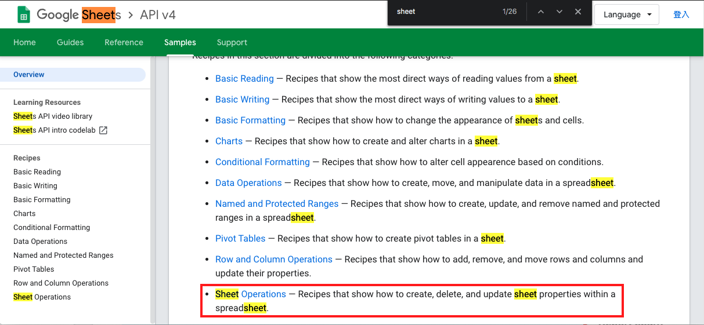
    2. 進入[Sheet Operations](https://developers.google.com/sheets/api/samples/sheet)頁面後，發現標題 **Determine sheet ID and other properties** 像是跟sheet的屬性有關的
        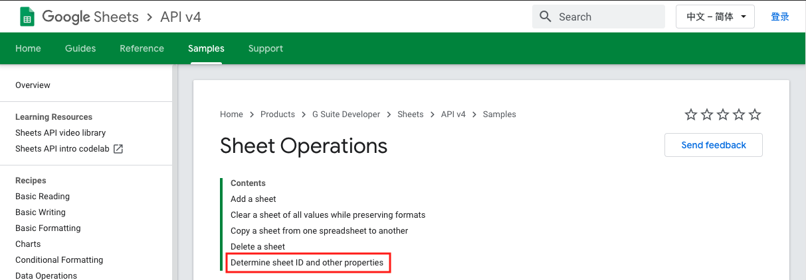
    3. 在[Determine sheet ID and other properties](https://developers.google.com/sheets/api/samples/sheet#determine_sheet_id_and_other_properties)第一段就給了一個連結，並說這個方法能取得特定spreadsheet底下sheet的屬性
        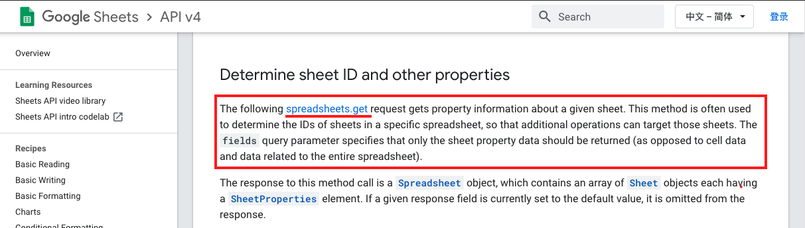
    4. 接著我們就進去看 [spreadsheets.get](https://developers.google.com/sheets/api/reference/rest/v4/spreadsheets/get) 這個方法是不是真的符合我們的需求
        1. 首先我們看到Google非常貼心的有提供線上測試api的地方讓你確認他是否符合符合你的需求
            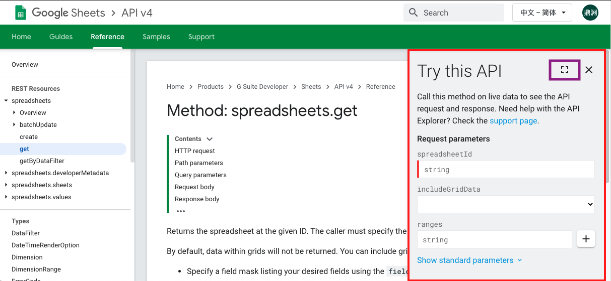
        2. 進入測試api全螢幕模式後，填寫必填資訊如下後按下 **EXCUTE** 即可在右下角看到api的回傳資訊
            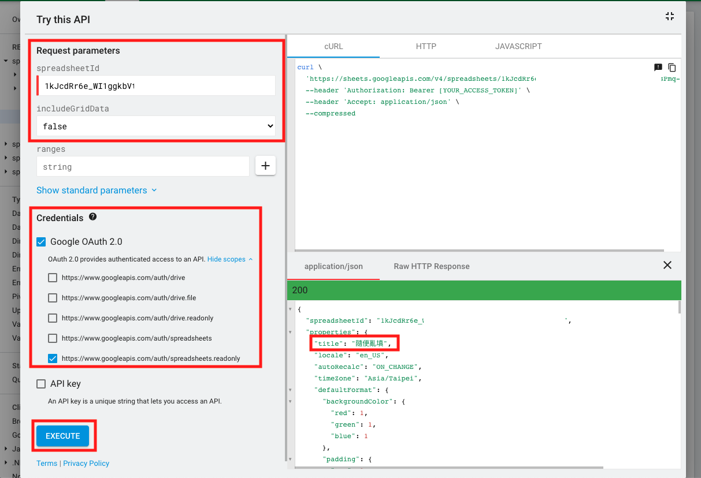
        3. 打開自己的 Google Sheets 來與 api 的回傳資訊做對照
            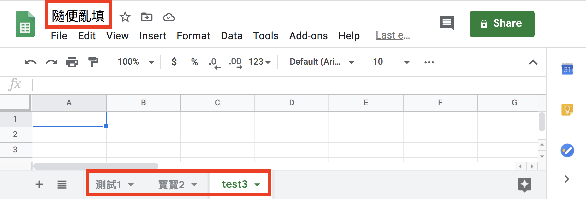
            * 從回傳的json中我們就能知道我們所需要的資訊在哪個位置：sheets[].properties.title
            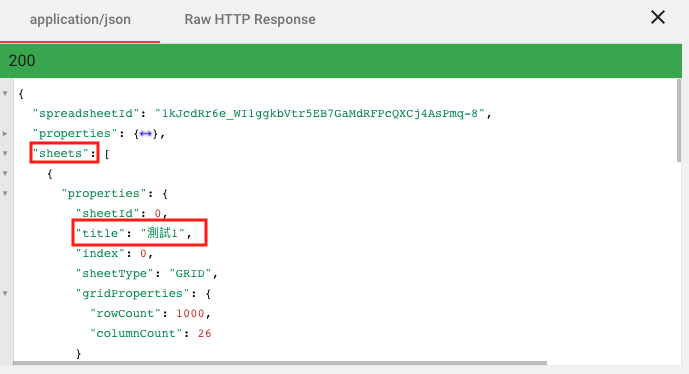
    5. 確認這個api能取得我們所需要的資訊後，我們便可參考官方提供的[Examples](https://developers.google.com/sheets/api/reference/rest/v4/spreadsheets/get#examples)開始實作啦
* `getSheets`：取得spreadsheetId下所有sheets的屬性並回傳
    ```js
    async function getSheets (auth) {//取得Google Sheets所有的sheet
        const sheets = google.sheets({ version: 'v4', auth });
        const request = {
            spreadsheetId: process.env.SPREADSHEET_ID,
            includeGridData: false,
        }
        try {
            let response = (await sheets.spreadsheets.get(request)).data;
            const sheets_info = response.sheets
            return sheets_info
        } catch (err) {
            console.error(err);
        }
    }
    ```
### STEP2: 判斷FB粉專、IG粉專是否存在於抓下來的sheet：**getFBIGSheet**
* `getFBIGSheet`：這隻函式是要取得FB粉專、IG粉專的sheet資訊，會分成三個步驟
    1. 我們要先知道目前已經存在的sheets是否有'FB粉專'、'IG帳號'這兩個，所以要取得線上sheets：`getSheets`
    2. 判斷**FB粉專、IG粉專**是否存在於`getSheets`回傳的資料裡面    
		* 存在就將sheetId資訊儲存
		* 不存在就用函式新增一個Sheet：`addSheet`
    3. 返回最新的sheets參數
    ```js
    async function getFBIGSheet (auth) {// 確認Sheet是否都被建立，如果還沒被建立，就新增
        const sheets = [//我們Google Sheets需要的sheet
            { title: 'FB粉專', id: null },
            { title: 'IG帳號', id: null }
        ]
        const online_sheets = await getSheets(auth)//抓目前存在的sheet

        for (sheet of sheets) {
            online_sheets.forEach(online_sheet => {
                if (sheet.title == online_sheet.properties.title) {// 如果線上已經存在相同的sheet title就直接使用相同id
                    sheet.id = online_sheet.properties.sheetId
                }
            })
            if (sheet.id == null) {//如果該sheet尚未被建立，則建立
                console.log(sheet.title + ':not exsit')
                try {
                    sheet.id = await addSheet(sheet.title, auth)//如果不存在就會新增該sheet        
                } catch (e) {
                    console.error(e)
                }
            }
        }
        return sheets;
    }
    ```
### STEP2-1: 新增Sheet：**addSheet**
* 尋找資源的步驟：
    1. 由STEP1的經驗可以知道想要操作Sheet就要在[Sheet Operations](https://developers.google.com/sheets/api/samples/sheet)這個頁面尋找資源
        * 比起取得所有Sheet屬性而言，新增Sheet的文件非常好找
        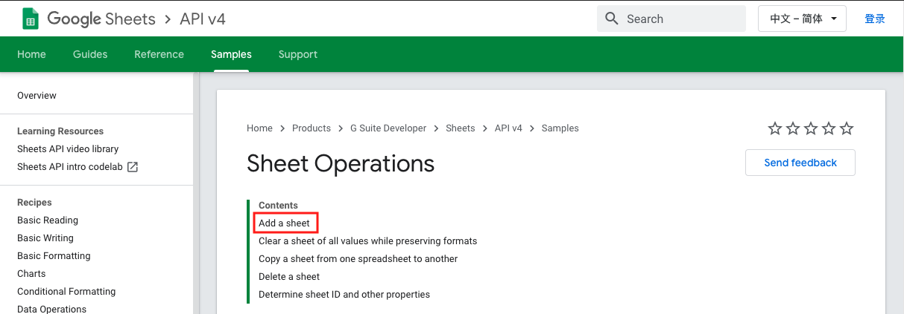
    2. 在[Add a sheet](https://developers.google.com/sheets/api/samples/sheet#add_a_sheet)也在一開始就提供一個連結，並說這方法能新增sheet到spreadsheet，並且在下方提供了request的格式
        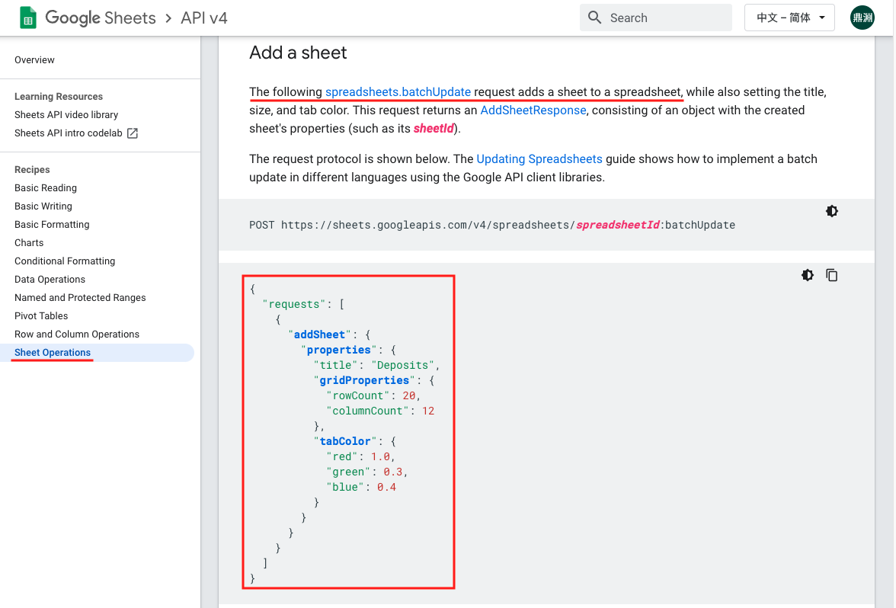
    3. 接著進入[Method: spreadsheets.batchUpdate](https://developers.google.com/sheets/api/reference/rest/v4/spreadsheets/batchUpdate)打開Try this API(在最下方)        
        1. Request body請按造下圖做設定，title的內容可以自行調整
        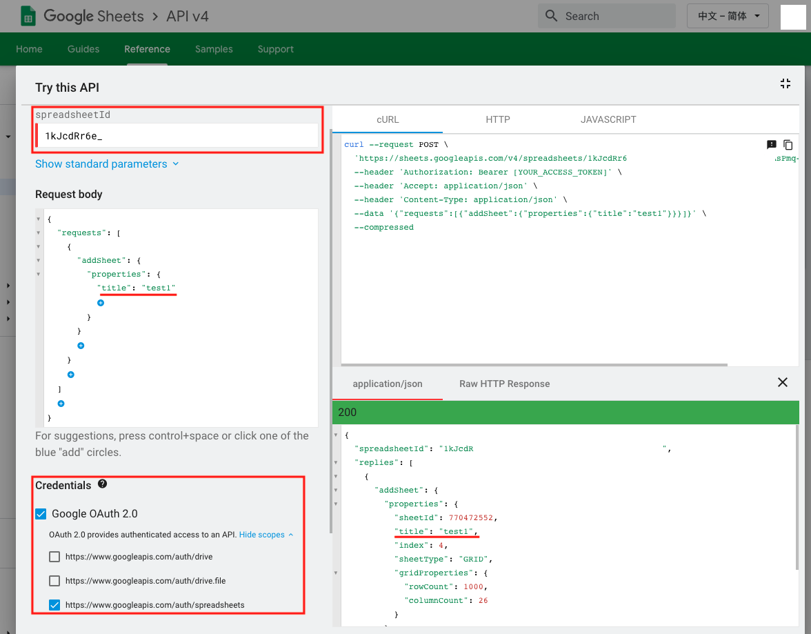
        2. 按下 **EXCUTE** 按鈕後，打開自己的Google Sheets`確認有新增一個title為test1的Sheet`
            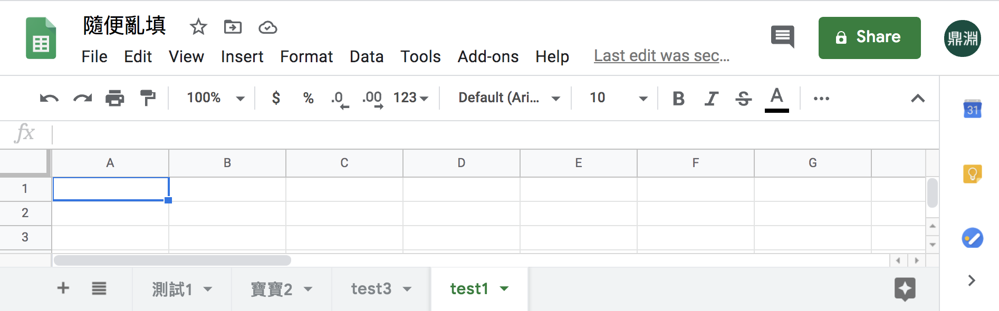
        3. 我們需要找出回傳資料中sheetId的位置：`replies[0].addSheet.properties.sheetId`
            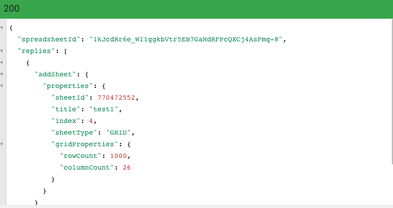
    4. 確認這個api能新增Sheet後，我們便可參考官方提供的[Examples](https://developers.google.com/sheets/api/reference/rest/v4/spreadsheets/batchUpdate#examples)開始實作啦
* `addSheet`：依照提供的title建立一個新的Sheet後回傳他的sheetId
    ```js
    async function addSheet (title, auth) {//新增一個sheet到指定的Google Sheets
        const sheets = google.sheets({ version: 'v4', auth });
        const request = {
            // The ID of the spreadsheet
            "spreadsheetId": process.env.SPREADSHEET_ID,
            "resource": {
                "requests": [{
                    "addSheet": {//這個request的任務是addSheet
                    // 你想給這個sheet的屬性
                    "properties": {
                        "title": title
                    }
                    },
                }]
            }
        };
        try {
            const response = (await sheets.spreadsheets.batchUpdate(request)).data;
            const sheetId = response.replies[0].addSheet.properties.sheetId
            console.log('added sheet:' + title)
            return sheetId
        }
        catch (err) {
            console.log('The API returned an error: ' + err);
        }
    }
    ```

重新架構Google Sheets程式
----
### STEP1: 建立exports函式：**updateGoogleSheets**
* `updateGoogleSheets`：設計給其他程式呼叫來更新GoogleSheets的外部函式模組
    目前這個函式目前要做兩件事：
    1. 取得Google Sheets授權：`getAuth`
    2. 取得FB粉專、IG粉專的sheet資訊：`getFBIGSheet`
  ```js
  exports.updateGoogleSheets = updateGoogleSheets;//讓其他程式在引入時可以使用這個函式
  async function updateGoogleSheets () {
    try {
      const auth = await getAuth()
      let sheets = await getFBIGSheet(auth)//取得線上FB、IG的sheet資訊
      console.log(sheets)
    } catch (err) {
      console.error('更新Google Sheets失敗');
      console.error(err);
    }
  }
  ```

### STEP2: 將取得auth(認證)的步驟改寫為函式：**getAuth**
* `getAuth` : 取得呼叫Google api時需要的auth(認證)
    考慮到每一個Google Sheets的api全部都需要同過憑證取得授權才能操作，所以我把這個步驟獨立成一個函式，由於取得授權這塊採用callback的函式，所以過去使用的await在這裡並不適用，你需要用Promise的方式來處理。
    1. 讀取認證.json檔案
    2. 取得Google Sheets授權
    ```js
    function getAuth () {
      return new Promise((resolve, reject) => {
        try {
          const content = JSON.parse(fs.readFileSync('tools/google_sheets/credentials.json'))
          authorize(content, auth => {
            resolve(auth)
          })
        } catch (err) {
          console.error('憑證錯誤');
          reject(err)
        }
      })
    }
    ```

讓主程式呼叫外部函式updateGoogleSheets
----
* 因為要跟之前的爬蟲程式結合，所以主程式要能呼要google_sheets提供的外部函式updateGoogleSheets()，為了方便測試今天的功能先把爬蟲的功能暫時註解
  #### index.js
  ```js
  require('dotenv').config(); //載入.env環境檔
  const { initDrive } = require("./tools/initDrive.js");
  const { crawlerFB } = require("./tools/crawlerFB.js");
  const { crawlerIG } = require("./tools/crawlerIG.js");
  const { updateGoogleSheets } = require("./tools/google_sheets");

  async function crawler () {
      // const driver = initDrive();
      // if (!driver) {//driver不存在就結束程式
      //     return
      // }
      // //因為有些人是用FB帳號登入IG，為了避免增加FB登出的動作，所以採取先對IG進行爬蟲
      // await crawlerIG(driver)
      // await crawlerFB(driver)
      // driver.quit();
      //處理Google Sheets相關動作
      await updateGoogleSheets()
  }

  crawler()
  ```

🚀 執行程式
----
1. 在專案資料夾的終端機(Terminal)執行指令
    ```vim
    yarn start
    ```
    你會遇到如下的錯誤：
    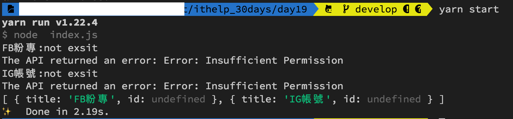
2. **The API returned an error: Error: Insufficient Permission** 的錯誤是因為Google Sheets權限要求不足(原本只有readonly)，所以我們要重新申請token
    1. **刪除原本的token.json** 
    2. 修改憑證的執行權限
        ```js
        // 原本的範本是有readonly，這樣只有讀取權限，將它拿掉後才擁有修改的權限
        // const SCOPES = ['https://www.googleapis.com/auth/spreadsheets.readonly'];
        const SCOPES = ['https://www.googleapis.com/auth/spreadsheets'];
        ```
3. 在專案資料夾的終端機(Terminal)再次執行指令
    ```vim
    yarn start
    ```    
4. Google會要求你再點一次連結重新取得授權碼，貼上後你會看看線上的Google Sheets是否有如你的設定新增sheets了
      
    
5. 如果你重複執行指令 `yarn start` 的話就只會回傳已經建立好sheet的id給你，不會再重新建立  
      

ℹ️ 專案原始碼
----
* 今天的完整程式碼可以在[這裡](https://github.com/dean9703111/ithelp_30days/tree/master/day19)找到喔
* 我也貼心地把昨天的把昨天的程式碼打包成[壓縮檔](https://github.com/dean9703111/ithelp_30days/tree/master/sampleCode/day18_sample_code.zip)，你可以用裡面乾淨的環境來實作今天google sheets的起手式喔
    * 請記得在終端機下指令 **yarn** 才會把之前的套件安裝
    * 要在tools/google_sheets資料夾放上自己的憑證
    * 調整你.env檔填上SPREADSHEET_ID

📖 參考資源
----
[callback、Promise 和 async/await 那些事兒](https://noob.tw/js-async/)
### [Day20 Google Sheets-將爬蟲資料寫入](/day20/README.md)