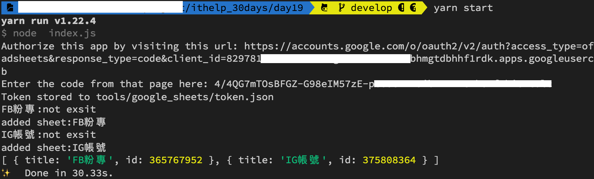
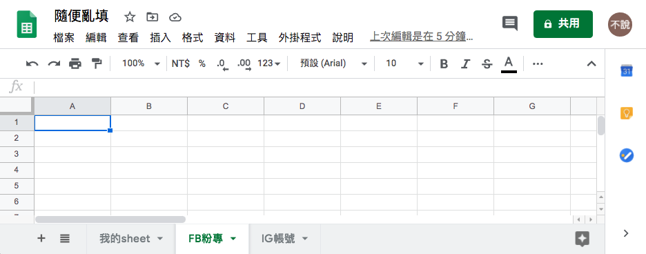
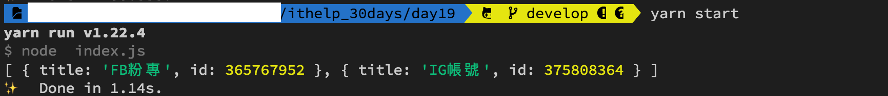

#### [回目錄](../README.md)
## Day19 Google Sheets-判斷Sheet存在與否並自動創建

接下來這幾天的文章都會與之前的爬蟲程式做結合，我們一樣分析一下讓爬蟲自動化的進入Google Sheets的步驟：
1. 爬蟲資料獲取完成(這部分在之前的程式已完成)
2. 因為有FB粉專及IG粉專兩種，所以會有兩個Sheet
3. 將FB粉專、IG粉專各自寫入正確的sheet
4. 每日爬蟲時新的資料能寫入正確位置(如果有json裡面粉專新增或是刪除不會造成Google Sheets內容亂掉)

考慮到專案未來可能會有非常多的sheet，所以我也把這部分的工作自動化了，實踐步驟：
1. 先將Google Sheets線上有的sheet全都抓下來
2. 判斷線上的sheet是否有**FB粉專、IG粉專**這兩個
3. 如果沒有該sheet就產生線上不重複的sheet_id(他是唯一值)
4. 如果沒有該sheet就新增sheet

建議大家在看我的解法前也要學習閱讀[官方的文件](https://developers.google.com/sheets/api/samples/sheet)，裡面有詳細的教學，畢竟不可能隨時都有中文資源讓你閱讀，如果一開始看不懂文件也沒關係，把他的範例程式複製貼上就對了XD，以今天 **addSheet** 的功能來說，你只需要看下面這個函式即可  
```js
async function addSheet (title, sheet_id, auth) {//新增一個sheet到指定的Google Sheets
  const sheets = google.sheets({ version: 'v4', auth });
  const request = {
    // The ID of the spreadsheet
    "spreadsheetId": process.env.SPREADSHEET_ID,
    "resource": {
      "requests": [{
        "addSheet": {//這個request的任務是addSheet
          // 你想給這個sheet的屬性
          "properties": {
            "sheetId": sheet_id,//必須為數字，且這個欄位是唯一值
            "title": title//sheet的名稱，且這個欄位是唯一值
          }
        },
      }]
    }
  };
  try {
    await sheets.spreadsheets.batchUpdate(request)
    console.log('added sheet:' + title)
  }
  catch (err) {
    console.log('The API returned an error: ' + err);
  }
}
```

判斷Sheet存在與否並自動創建
----
下面思路是我考慮到執行時面對的各項可能性，你可以參考我的思路，googleSheets.js導讀如下：
* getAuth : 考慮到每一個Google Sheets的api全部都需要同過憑證取得授權才能操作，所以我把這個步驟獨立成一個函式，由於取得授權這塊採用callback的函式，所以過去使用的await在這裡並不適用，你需要用Promise的方式來處理。他詳細的使用方法以及與async/await的搭配[這篇文章](https://noob.tw/js-async/)寫得非常棒
    1. 讀取認證.json檔案
    2. 取得Google Sheets授權
    ```js
    function getAuth () {
      return new Promise((resolve, reject) => {
        try {
          const content = JSON.parse(fs.readFileSync('tools/google_sheets/credentials.json'))
          authorize(content, auth => {
            resolve(auth)
          })
        } catch (err) {
          console.error('憑證錯誤');
          reject(err)
        }
      })
    }
    ```
* updateGoogleSheets : 我們要設計一個給index.js呼叫來更新GoogleSheets的外部函式模組，這個函式目前要做兩件事
  1. 取得Google Sheets授權
  2. 檢查當前sheet狀態
  ```js
  exports.updateGoogleSheets = updateGoogleSheets;//讓其他程式在引入時可以使用這個函式
  async function updateGoogleSheets () {
    try {
      const auth = await getAuth()
      let sheets = await getFBIGSheet(auth)//取得線上FB、IG的sheet資訊
      console.log(sheets)
    } catch (err) {
      console.error('更新Google Sheets失敗');
      console.error(err);
    }
  }
  ```
* getFBIGSheet : 取得線上FB、IG的sheet會分成三個動作
  1. 我們要先知道目前已經存在的sheets是否有'FB粉專'、'IG帳號'這兩個，所以要取得線上sheets(getSheets)
  2. 判斷sheet是否存在，不存在則產生不重複的id(genSheetId)，並且新增sheet(addSheet)
  3. 返回最新的sheets參數
  ```js
  async function getFBIGSheet (auth) {// 確認Sheet是否都被建立，如果還沒被建立，就新增
    const sheets = [//我們Google Sheets需要的sheet
      { title: 'FB粉專', id: null },
      { title: 'IG帳號', id: null }
    ]
    const online_sheets = await getSheets(auth)//抓目前存在的sheet
    let sheet_id_array = []
    online_sheets.forEach(online_sheet => {//抓出已經存在的sheet_id避免產生出一樣的id
      sheet_id_array.push(online_sheet.properties.sheetId)
    })

    for (sheet of sheets) {
      online_sheets.forEach(online_sheet => {
        if (sheet.title == online_sheet.properties.title) {// 如果線上已經存在相同的sheet title就直接使用相同id
          sheet.id = online_sheet.properties.sheetId
        }
      })
      if (sheet.id == null) {//如果該sheet尚未被建立，則建立
        console.log(sheet.title + ':not exsit')
        let sheet_id = genSheetId(sheet_id_array)
        sheet_id_array.push(sheet_id)
        try {
          await addSheet(sheet.title, sheet_id, auth)//如果不存在就會新增該sheet
          sheet.id = sheet_id
        } catch (e) {
          console.error(e)
        }
      }
    }
    return sheets;
  }
  ```
  * getSheets : 取得Google Sheets所有的sheet
  ```js
  async function getSheets (auth) {//取得Google Sheets所有的sheet
    const sheets = google.sheets({ version: 'v4', auth });
    const request = {
      spreadsheetId: process.env.SPREADSHEET_ID,
      includeGridData: false,
    }
    try {
      let response = (await sheets.spreadsheets.get(request)).data;
      const sheets_info = response.sheets
      return sheets_info
    } catch (err) {
      console.error(err);
    }
  }
  ```
  * genSheetId : 產生不重複id
  ```js
  function genSheetId (sheet_id_array) {
    let sheet_id = parseInt(Math.random() * 10000)
    while (sheet_id_array.includes(sheet_id)) {//如果存在就要在產生一次
      sheet_id = parseInt(Math.random() * 10000)
    }
    return sheet_id
  }
  ```
  * addSheet : 新增一個title與sheetId自訂的sheet
  ```js
  async function addSheet (title, sheet_id, auth) {//新增一個sheet到指定的Google Sheets
    const sheets = google.sheets({ version: 'v4', auth });
    const request = {
      // The ID of the spreadsheet
      "spreadsheetId": process.env.SPREADSHEET_ID,
      "resource": {
        "requests": [{
          "addSheet": {//這個request的任務是addSheet
            // 你想給這個sheet的屬性
            "properties": {
              "sheetId": sheet_id,//必須為數字，且這個欄位是唯一值
              "title": title
            }
          },
        }]
      }
    };
    try {
      await sheets.spreadsheets.batchUpdate(request)
      console.log('added sheet:' + title)
    }
    catch (err) {
      console.log('The API returned an error: ' + err);
    }
  }
  ```
* PS.如果你遇到了 **The API returned an error: Error: Insufficient Permission** 的錯誤是因為你對Google Sheets權限要求不足(原本只有readonly)， **請刪除原本的token.json** ，並且再修改這行後重新執行，Google會要求你再點一次連結重新取得授權碼，貼上後你就會發現sheet新增成功嚕  
  ```js
  // 原本的範本是有readonly，這樣只有讀取權限，拿掉後什麼權限都有了
  const SCOPES = ['https://www.googleapis.com/auth/spreadsheets'];
  ```

* 因為要跟之前的爬蟲程式結合，所以index.js能呼要googleSheets.js提供的外部函式updateGoogleSheets()，為了方便測試今天的功能先把爬蟲的功能暫時註解
  #### index.js
  ```js
  require('dotenv').config(); //載入.env環境檔
  const { initDrive } = require("./tools/initDrive.js");
  const { crawlerFB } = require("./tools/crawlerFB.js");
  const { crawlerIG } = require("./tools/crawlerIG.js");
  const { updateGoogleSheets } = require("./tools/google_sheets");

  async function crawler () {
      // const driver = initDrive();
      // if (!driver) {//driver不存在就結束程式
      //     return
      // }
      // //因為有些人是用FB帳號登入IG，為了避免增加FB登出的動作，所以採取先對IG進行爬蟲
      // await crawlerIG(driver)
      // await crawlerFB(driver)
      // driver.quit();
      //處理Google Sheets相關動作
      await updateGoogleSheets()
  }

  crawler()
  ```
執行程式
----
在專案資料夾的終端機(Terminal)執行指令 **yarn start** 指令，看看線上的Google Sheets是否有如你的設定新增sheets了呢？
  

如果你重複執行指令的話就只會回傳已經建立好sheet的id給你，不會再重新建立  
  

專案原始碼
----
完整的程式碼在[這裡](https://github.com/dean9703111/ithelp_30days/tree/master/day18)喔
你可以整個專案clone下來  
```
git clone https://github.com/dean9703111/ithelp_30days/tree/master.git
```
如果你已經clone過了，那你每天pull就能取得更新的資料嚕  
```
git pull origin master
cd day18
yarn
在credentials資料夾放上自己的憑證
調整你.env檔填上SPREADSHEET_ID
yarn start
```
### [Day20 Google Sheets-將爬蟲資料寫入](/day20/README.md)