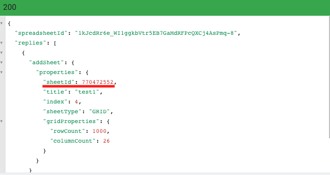

#### [回目錄](../README.md)
## Day19 Google Sheets-你在文件迷路了嗎？用兩個處理Sheet的範例帶你攻略官方文件

>如果說爬蟲是在鍛鍊你分析網頁的能力，那麼Google Sheets就是在教你閱讀官方文件的技巧  

🤔 爬蟲資料如何自動化的塞入Google Sheets?
----
接下來這幾天的目標是將之前的爬蟲資料放入Google Sheets，這個目標會分成幾個步驟：
1. 取得放FB、IG爬蟲資料的Sheet資訊(今日目標)
2. 將FB、IG爬蟲資料寫入各自的Sheet [Day20]
3. 插入新的爬蟲資料前先分析粉專欄位，再將資料放入正確的位置 [Day21]
4. 將新的爬蟲資料改為插入第二欄，日期由近而遠排列 [Day22]
5. 調整Google Sheets的外觀，讓他閱讀起來更友善 [Day23]

----

🤔 筆者有話先說
----
`使用Google api時你要煩惱的不是沒有功能，而是你找不到功能在哪裡`，因為**這份api文件實在是太龐大了**，對新手來說非常容易在文件中迷路...  

所以今天的文章重點在`如何從官方文件找出需要的資源`，我希望這能幫助到剛接觸巨型文件的朋友們

----

🏆 今日目標
----
### 1. 讀取Google Sheets內的Sheet資訊
1.1 在官方文件尋找 **讀取Sheet** 的範例
1.2 調整範例以符合專案需求：`getSheets`

### 2. 取得FB粉專、IG帳號的Sheet資訊：`getFBIGSheet`

### 3. 建立放FB粉專、IG帳號爬蟲資料的Sheet
3.1 在官方文件尋找 **新增Sheet** 的範例
3.2 調整範例以符合專案需求：`addSheets`

### 4. 重新架構Google Sheets程式
4.1 建立外部函式模組：`updateGoogleSheets`
4.2 將取得auth(認證)的步驟改寫為函式：`getAuth`

### 5. 讓主程式呼叫外部函式：`updateGoogleSheets`

----

# 1. 讀取Google Sheets內的Sheet資訊
>建議你所需要的功能都先從`有範例的文件`找起，因為沒範例的文件你還要自己瞎猜程式結構

### 1.1 在官方文件尋找 `讀取Sheet` 的範例
1. 進入官方文件[範例首頁](https://developers.google.com/sheets/api/samples)後 `先觀察大標題的描述`（可用關鍵字 **sheet** 搜尋來輔助）
    * 標題 **Sheet Operations** 的描述上比較符合我們需求，因為我們要`找出spreadsheet底下的sheet資訊`
    
2. 進入[Sheet Operations](https://developers.google.com/sheets/api/samples/sheet)頁面後`一樣先從標題下手`
    * 標題 **Determine sheet ID and other properties** 跟`sheet的詳細資訊`有關
    
3. 看[Determine sheet ID and other properties](https://developers.google.com/sheets/api/samples/sheet#determine_sheet_id_and_other_properties)的描述
    * 第一段給了一個連結，並說`這個方法能取得特定spreadsheet底下sheet的屬性`
    
4. 接下來要確認 [spreadsheets.get](https://developers.google.com/sheets/api/reference/rest/v4/spreadsheets/get) 這個方法是否真的符合我們的需求
    1. 首先我們看到`Google非常貼心提供線上測試api的地方`
        
    2. 進入測試api全螢幕模式後，`填寫自己的spreadsheetId、憑證權限` 接著按下 **EXCUTE** 即可在右下角看到api的回傳資訊
        
    3. 打開自己的 Google Sheets 來與 api 的回傳資訊做對照
        
        * 從回傳的json中我們就能知道我們所需要的資訊在哪個位置：`sheets[].properties.title`
        
5. 確認這個api能取得我們所需要的資訊後，我們便可參考官方提供的[Examples](https://developers.google.com/sheets/api/reference/rest/v4/spreadsheets/get#examples)開始實作啦

### 1.2 調整範例以符合專案需求：`getSheets`
這個函式的目標是 `取得指定spreadsheetId下sheets資訊`，根據上面api回傳的json結構分析，我們所需要的資料就在`response.sheets`裡面

```js
async function getSheets (auth) {//取得Google Sheets所有的sheet
    const sheets = google.sheets({ version: 'v4', auth });
    const request = {
        spreadsheetId: process.env.SPREADSHEET_ID,
        includeGridData: false,
    }
    try {
        let response = (await sheets.spreadsheets.get(request)).data;
        const sheets_info = response.sheets
        return sheets_info
    } catch (err) {
        console.error(err);
    }
}
```

----

# 2. 取得FB粉專、IG帳號的Sheet資訊：`getFBIGSheet`
這隻函式是今天功能的核心，在`取得FB粉專、IG帳號的sheet資訊`上會需要幾個步驟
1. 確認線上的sheets是否有'FB粉專'、'IG帳號'這兩個，所以要取得線上sheets：`getSheets`
2. 判斷'FB粉專'、'IG帳號'是否在`getSheets`回傳的資料裡面    
    * 存在就將sheetId資訊儲存
    * 不存在就用函式新增一個Sheet：`addSheet`
3. 回傳更新後的sheets資訊
```js
async function getFBIGSheet (auth) {// 取得FB粉專、IG帳號的Sheet資訊
    const sheets = [//我們Google Sheets需要的sheet
        { title: 'FB粉專', id: null },
        { title: 'IG帳號', id: null }
    ]
    const online_sheets = await getSheets(auth)//抓目前存在的sheet

    for (sheet of sheets) {
        online_sheets.forEach(online_sheet => {
            if (sheet.title == online_sheet.properties.title) {
                // 如果線上已經存在相同的sheet title就直接使用相同id
                sheet.id = online_sheet.properties.sheetId
            }
        })
        if (sheet.id == null) {//如果該sheet尚未被建立，則建立
            console.log(sheet.title + ':not exsit')
            try {
                sheet.id = await addSheet(sheet.title, auth)
            } catch (e) {
                console.error(e)
            }
        }
    }
    return sheets;
}
```

----

# 3. 建立放FB粉專、IG帳號爬蟲資料的Sheet
### 3.1 在官方文件尋找 `新增Sheet` 的範例
1. 由`讀取Sheet的經驗`可以知道想要操作Sheet就要在[Sheet Operations](https://developers.google.com/sheets/api/samples/sheet)這個頁面尋找資源
    * 標題 **Add a sheet** 超級直觀，就是他惹！
    
2. 看[Add a sheet](https://developers.google.com/sheets/api/samples/sheet#add_a_sheet)的描述
    * 第一段提供一個連結，並說`這方法能新增sheet到spreadsheet`
    * 下方提供了request的範例，讓我們能大概了解`新增Sheet可以調整哪些參數`
    
3. 接著來確認[Method: spreadsheets.batchUpdate](https://developers.google.com/sheets/api/reference/rest/v4/spreadsheets/batchUpdate)是否符合需求
    1. 打開Try this API(在最下方)，`Request body請依下圖設定`，title的內容可以自行調整
        
    2. 按下 **EXCUTE** 按鈕後，確認自己的Google Sheets`真的成功新增一個 title 為 test1 的 Sheet`
        
    3. 從回傳資料中找出sheetId的位置：`replies[0].addSheet.properties.sheetId` 
        
4. 確認這個api能新增Sheet後，我們便可參考官方提供的[Examples](https://developers.google.com/sheets/api/reference/rest/v4/spreadsheets/batchUpdate#examples)開始實作啦

### 3.2 調整範例以符合專案需求：`addSheets`
這個函式的目標是 `用提供的title建立一個新Sheet`，Google Sheets在新增一個Sheet時會自動產生一個不重複的sheetId，我們`將sheetId回傳代表我們新增成功`(sheetId在後面的章節會使用到)
```js
async function addSheet (title, auth) {//新增一個sheet到指定的Google Sheets
    const sheets = google.sheets({ version: 'v4', auth });
    const request = {
        // The ID of the spreadsheet
        "spreadsheetId": process.env.SPREADSHEET_ID,
        "resource": {
            "requests": [{
                "addSheet": {//這個request的任務是addSheet
                // 你想給這個sheet的屬性
                "properties": {
                    "title": title
                }
                },
            }]
        }
    };
    try {
        const response = (await sheets.spreadsheets.batchUpdate(request)).data;
        const sheetId = response.replies[0].addSheet.properties.sheetId
        console.log('added sheet:' + title)
        return sheetId
    }
    catch (err) {
        console.log('The API returned an error: ' + err);
    }
}
```

----

# 4. 重新架構Google Sheets程式
### 4.1 建立外部函式模組：`updateGoogleSheets`
別忘記我們學習Google Sheets是為了寫入爬蟲的資料，所以要建立一個給主程式`用來更新Google Sheets的外部函式模組`，我們先讓這個函式完成今天的需求吧
1. 取得Google Sheets授權：`getAuth`
2. 取得FB粉專、IG帳號的sheet資訊：`getFBIGSheet`
```js
//讓其他程式在引入時可以使用這個函式
exports.updateGoogleSheets = updateGoogleSheets;
async function updateGoogleSheets () {
    try {
        const auth = await getAuth()
        let sheets = await getFBIGSheet(auth)//取得線上FB、IG的sheet資訊
        console.log(sheets)
    } catch (err) {
        console.error('更新Google Sheets失敗');
        console.error(err);
    }
}
```

### 4.2 將取得auth(認證)的步驟改寫為函式：`getAuth`
考慮到`Google Sheets的api都需要通過憑證取得授權才能操作，所以我把這個步驟獨立成一個函式`，由於取得授權這塊採用callback的函式，所以我們要用Promise的方式來處理。
```js
function getAuth () {
    return new Promise((resolve, reject) => {
    try {
        const content = JSON.parse(fs.readFileSync('tools/google_sheets/credentials.json'))
        authorize(content, auth => {
            resolve(auth)
        })
    } catch (err) {
        console.error('憑證錯誤');
        reject(err)
    }
    })
}
```

----

# 5. 讓主程式呼叫外部函式：`updateGoogleSheets`
因為要跟之前的爬蟲程式結合，所以主程式要能`呼叫 google_sheets 提供的外部函式 updateGoogleSheets`
>為了方便測試今天的功能先把爬蟲的功能暫時註解
#### index.js
```js
require('dotenv').config(); //載入.env環境檔
const { initDrive } = require("./tools/initDrive.js");
const { crawlerFB } = require("./tools/crawlerFB.js");
const { crawlerIG } = require("./tools/crawlerIG.js");
const { updateGoogleSheets } = require("./tools/google_sheets");

async function crawler () {
    // const driver = await initDrive();
    // if (!driver) {//driver不存在就結束程式
    //     return
    // }
    // //因為有些人是用FB帳號登入IG，為了避免增加FB登出的動作，所以採取先對IG進行爬蟲
    // await crawlerIG(driver)
    // await crawlerFB(driver)
    // driver.quit();
    //處理Google Sheets相關動作
    await updateGoogleSheets()
}

crawler()
```

----

🚀 執行程式
----
1. 在專案資料夾的終端機(Terminal)執行指令
    ```vim
    yarn start
    ```
    你會遇到如下的錯誤：
    
2. **The API returned an error: Error: Insufficient Permission** 的錯誤是`因為Google Sheets權限不足(原本只有readonly)`，所以我們要重新申請token
    1. **刪除原本的token.json** 
    2. `修改憑證的執行權限`
        ```js
        // 原本的範本是有readonly，這樣只有讀取權限，將它拿掉後才擁有修改的權限
        // const SCOPES = ['https://www.googleapis.com/auth/spreadsheets.readonly'];
        const SCOPES = ['https://www.googleapis.com/auth/spreadsheets'];
        ```
3. 在專案資料夾的終端機(Terminal)再次執行指令
    ```vim
    yarn start
    ```    
4. Google會要求你再點一次連結重新取得授權碼，貼上後你會看到線上的Google Sheets成功新增sheets了
      
    
5. 如果你重複執行指令 `yarn start` ，只會回傳建立好sheet的id給你，不會再重新建立  
      

----

ℹ️ 專案原始碼
----
* 今天的完整程式碼可以在[這裡](https://github.com/dean9703111/ithelp_30days/tree/master/day19)找到喔
* 我也貼心地把昨天的把昨天的程式碼打包成[壓縮檔](https://github.com/dean9703111/ithelp_30days/raw/master/sampleCode/day18_sample_code.zip)，你可以用裡面乾淨的環境來實作今天Google Sheets的Sheet處理喔
    * 請記得在終端機下指令 **yarn** 才會把之前的套件安裝
    * 在tools/google_sheets資料夾放上自己的憑證，申請流程請參考[Day17](/day17/README.md)
    * 調整你.env檔填上SPREADSHEET_ID

----

📖 參考資源
----
[callback、Promise 和 async/await 那些事兒](https://noob.tw/js-async/)
### [Day20 Google Sheets-寫入爬蟲資料，跟 Copy & Paste 的日子說掰掰](/day20/README.md)