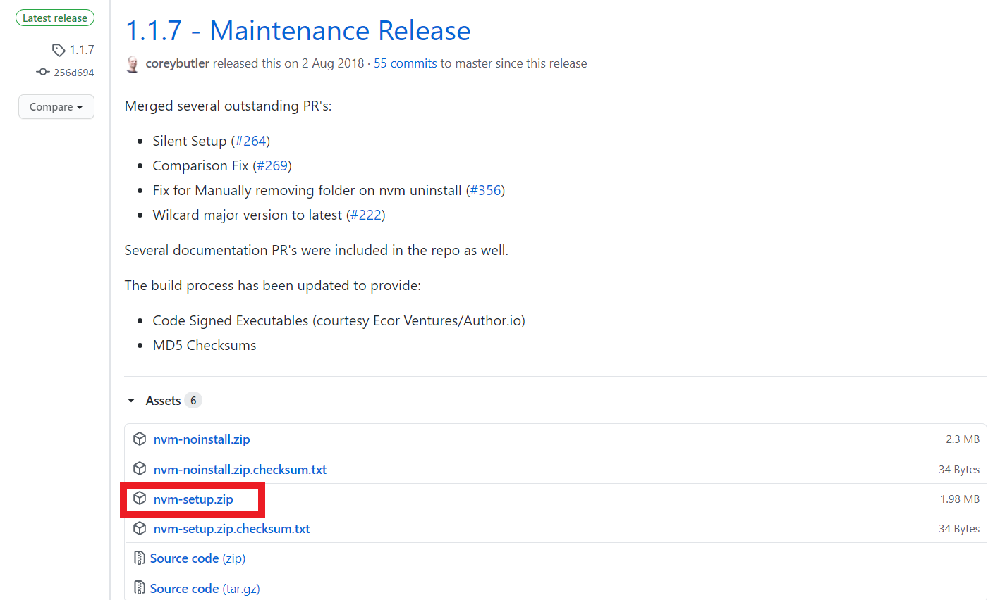
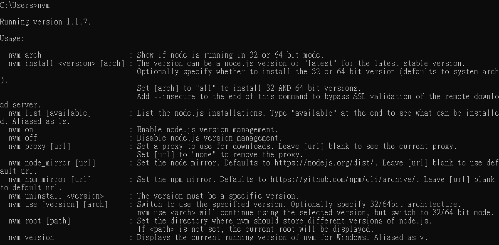
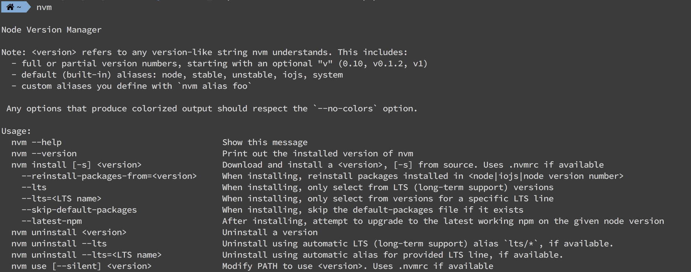

#### [回目錄](../README.md)
## Day2 開發環境大補帖 - Node.js、NVM、git、yarn、VSCode

>工欲善其事，必先利其器
🤔 為什麼寫這篇文章？
----
因為我自己在剛接觸程式時最痛恨的就是環境設定  
不知道是我跟電腦不合還是怎樣，每次我學新東西的時候總是在環境設定這個環節卡的不要不要的  
為了避免讀者們在之後實戰的文章中一邊看一邊心理罵:「為什麼我們程式一模一樣但我的就是會錯?一定是作者的問題!」這樣的憾事發生，所以我決定很詳細的說明這個專案所需要安裝的一切環境，並附上我撰寫時安裝的工具版本，讓大家在日後的文章中可以順利操作與學習  
>你們實際操作時通常都有新的版本了，但如果最新版本有問題可以切換到筆者的版本來做操作

🏆 今日目標
----
1. 了解使用工具的重要性 & 為什麼選擇他
2. 完成開發前環境設定

🛠 使用什麼工具完成
----
說到爬蟲，我想絕大多數的人第一個想到的一定是python  
python是一個很好的語言，但很可惜我對他的鑽研不夠深入  
如果這份外包**使用一個自己不夠熟悉的語言來撰寫那是一個不負責任的行為**  
所以在這裡我選擇的語言是javacscript  

另外我會詳細說明前置環境的設定  
如果每個人的環境設置都不一樣  
那麼我文章的程式可能在許多電腦上都是無法執行的  
所以環境的前置作業這塊包含windows/mac兩個系統的設定  
讓你們了解到為什麼叫使用這些工具  

1. Node.js
2. NVM
3. git
4. yarn
5. VSCode

⚙️ 開發環境介紹 & 設定
----
### Node.js [官網](https://nodejs.org/en/about/)  
  

能夠在 server 端運行 JavaScript 的開放原始碼、跨平台 JavaScript 的執行環境。前端工程師的福音  
>筆者安裝的版本：v12.19.0

### nvm [官網](https://github.com/nvm-sh/nvm)  
由於Node.js更新速度是非常快的，而許多套件有Node.js版本的相依性，透過NVM你可以輕鬆切換Node.js版本來符合不同專案的使用環境  

* windows 安裝步驟
    1. 先進入[windows下載頁面](https://github.com/coreybutler/nvm-windows/releases)
    2. 選擇最新版本的下載 **nvm-setup.zip**(筆者版本為1.1.7，你看到這篇文章時可能有提供更新的版本)
        
    3. 下載後一路瘋狂下一步即可  
    4. 安裝後開啟命令提示字元(CMD)
    5. 在CMD輸入指令確認nvm是否安裝成功  
        ```vim
        nvm
        ```
        
    
* mac 安裝步驟
    1. 打開終端機(Terminal)，以下步驟皆在終端機操作
    1. mac 建議先下載 Homebrew  
        ```vim
        /bin/bash -c "$(curl -fsSL https://raw.githubusercontent.com/Homebrew/install/master/install.sh)"
        ```
    2. 下載後安裝 nvm
        ```vim
        brew install nvm
        ```
    3. 確認nvm是否安裝成功
        ```
        nvm
        ```
        
* 🤖 常用指令
    * 安裝特定Node.js版本
        ```vim
        nvm install [version]
        ```
        請切記要安裝一個Node.js版本(請選用[LTS版本](https://nodejs.org/en/))，不然你寫的程式會沒有可以運行的環境
        ```
        nvm install 12.19.0
        ```
    * 切換Node.js版本
        ```vim
        nvm use [version]
        ```
    * 列出本機(local)已經安裝好的Node.js版本
        ```vim
        nvm list
        ```
    * 顯示當下Node.js版本
        ```vim
        nvm current
        ```
>筆者安裝版本：1.1.7

### git [官網](https://git-scm.com/)


這是對於程式版本控制的工具，透過他你可以輕鬆回到過去，並且在多人協作時也能有效管控
[windows下載頁面](https://git-scm.com/download/win)、[mac下載頁面](https://git-scm.com/download/mac)  
>我有朋友使用windows怎麼樣都無法正常安裝git，如果你也遇到了這個不幸，你還是有[Git桌面板](https://desktop.github.com/)可以選擇的
#### 🤖 常用指令如下：
* 抓取遠端數據庫(僅確認有什麼更新，不合併)
    ```vim
    git fetch
    ```
* 抓取遠端數據庫更新
    ```vim
    git pull 
    ```
* 更新遠端數據庫
    ```vim
    git push 
    ```
>筆者windows安裝版本：2.27.0.windows.1

### yarn [官網](https://classic.yarnpkg.com/zh-Hant/)  


這是專門安裝套件的軟體  
站在巨人的肩膀上你才能看得更遠，妥善運用別人提供的套件，程式的路能走得更遠  
[windows下載頁面](https://classic.yarnpkg.com/zh-Hant/docs/install#windows-stable)、[mac下載頁面](https://classic.yarnpkg.com/zh-Hant/docs/install#mac-stable)

#### 🤖 常用指令如下
1. 依據package.json安裝所有套件  
    ```vim
    yarn
    ```
2. 安裝到dependencies
    ```vim
    yarn add [package]
    ```
3. 安裝到devDependencies
    ```vim
    yarn add [package] –save-dev
    ```
4. 全域安裝套件(使該套件可在電腦任何位置被呼叫)
    ```vim
    yarn global add [package]
    ```
>筆者安裝版本：1.19.2

### VScode [官網](https://code.visualstudio.com/)


現在已經過了用記事本在打程式的年代了，透過IDE(整合開發環境)可以大幅增加你撰寫程式的速度  
[VScode下載頁面](https://code.visualstudio.com/)  
##### 👍 優點
1. 適合新手：不需在終端機(Terminal)安裝及設定各種前置作業，能節省建立開發環境的成本，並加速對開發環境的了解。
2. 執行程式：可以在IDE內直接執行一段程式碼，不需離開編輯器。
3. 程式碼高亮：將原始碼以不同顏色顯現，讓我們閱讀更方便。
4. 程式碼自動格式化：當輸入if或while時，他會自動縮排。
5. 版本控制方便：git add、git commit有GUI可以操作，並且有work tree讓你比對自己更改了哪些地方
6. 功能擴充方便：能透過Extentions來安裝所需要的擴充的套件

#### 🤖 常用快捷鍵如下
PS. 因使用mac較多，windows按鍵請自行轉換：cmd = ctrl, option = alt
* 區塊註解 cmd + k + c
* 區塊取消註解 cmd + k + u
* 區塊縮退 cmd + [
* 區塊縮進、cmd + ]
* 自動整理程式碼 option + shift + f

今天對於專案的前置環境說明到這裡，如果環境設定上有什麼問題的話實屬正常，畢竟每個電腦的環境都有些許不同，可以先用google查詢看看喔～進入工程師的世界後[stackoverflow](http://stackoverflow.com/)會是你最好的朋友

>**筆者碎碎念**  
在文章的最後分享一個心態，無論是面對工作還是外包都一樣  
在面試工作或是談外包時要先衡量一下自己的實力  
如果你即將要面對的工作(外包)已經遠遠超過了你的能力範圍  
強烈建議你拒絕這個機會，不要把工作(外包)當成是一個給你練習基礎的地方  
你的同事跟業主會恨你的  
尤其是外包，如果你的基礎不穩，運氣好你可能會做出一個貌似可以用的專案  
但實際上這個專案充滿著你所不知道的漏洞  
這塊我想只有實際在業界磨練過一段時間才能比較感同身受  


📖參考資源
----
1. [nvm：快速安裝、切換不同版本的 Node.js](https://ithelp.ithome.com.tw/articles/10217858)
2. [連猴子都懂的Git入門指南](https://backlog.com/git-tutorial/tw/intro/intro1_1.html)
3. [Windows 10 安裝並使用 nvm 切換 NodeJS 版本](https://hsiangfeng.github.io/nodejs/20200107/3738078915/)
4. [一應俱全的整合開發環境IDE](https://docs.f5ezcode.in/cs-basic/di-ba-zhang-gong-cheng-de-gong-ju/8.1-zheng-he-jing-ide)
5. [用Yarn取代npm加速開發](https://ithelp.ithome.com.tw/articles/10191745)

### [Day3 努力寫出更好的程式碼，有時你不是一個人在戰鬥](/day3/README.md)
