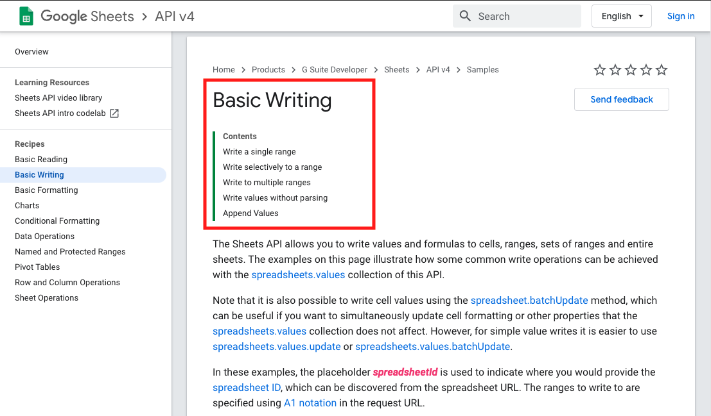
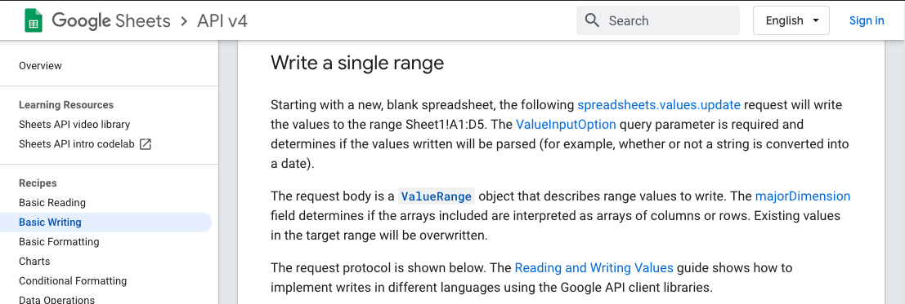
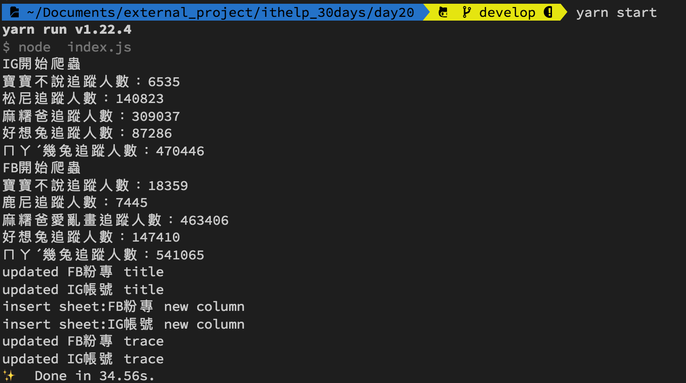
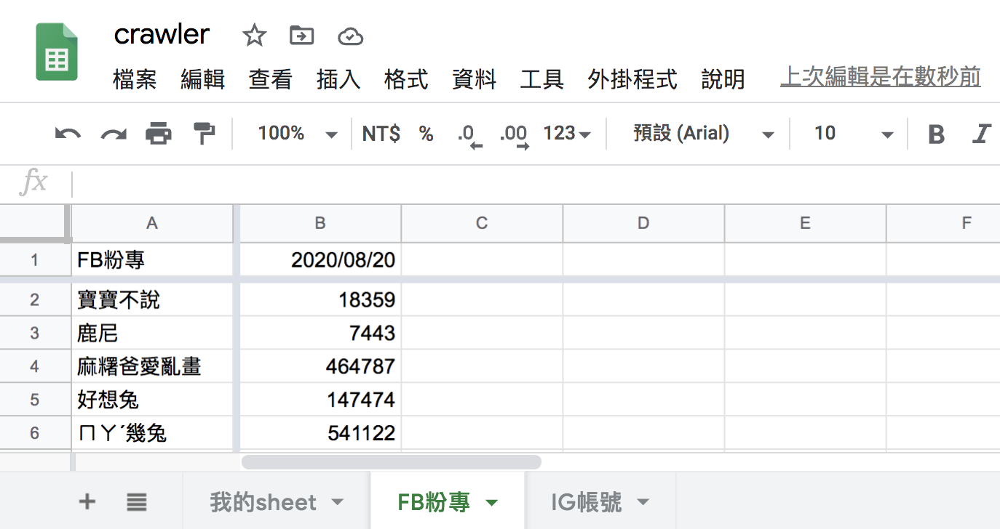

#### [回目錄](../README.md)
## Day20 Google Sheets-匯入爬蟲資料，解放你的繁瑣日常

🤔 筆者有話先說
----
爬蟲是一個技術，他將網頁的數據收集下來
Google Sheets是一個容器，他可以儲存資料並將資料以不同面向做展示
`爬蟲 Ｘ Google Sheets ＝ 你要學習的技術整合`

🏆 今日目標
----
1. 改寫crawlerIG、crawler這兩個爬蟲函式，讓他們依照我們想要格式回傳爬蟲資料
2. 改寫主程式crawler函式，接收上一步爬蟲資料並傳遞到updateGoogleSheets函式
3. 將FB、IG粉專爬蟲資料寫入各自的Sheet
  1. 從Google文件找出寫入Sheet的方法
  2. 第一欄寫入title(粉專名稱)
  3. 取得Sheet最右側第一個空白欄位
  4. 將trace(追蹤人數)資訊寫入最後一欄


# 1. 改寫crawlerIG、crawler這兩個爬蟲函式，讓他們依照我們想要格式回傳爬蟲資料
過去我們只將FB粉專、IG粉專的資訊用console.log輸出，現在我們要把這些資料有結構的存入json物件方便後續使用

1. 先確認Google Sheets需要呈現哪些資料，使用上可能會遇到的問題，這樣我們才知道要回傳哪些的資訊
  * Google Sheets呈現的資料：
    1. 粉專名稱
    2. 追蹤人數
    3. 追蹤日期
  * 可能會遇到的問題：
    1. 重複名稱的粉專
      * 解決方案：粉專名稱有可能重名，但是粉專網址是唯一值，所以使用`粉專名稱+粉專網址作為key`就能解決這個問題，同時也方便使用者可以點擊連結直接前往粉專
  * 總結：
    1. 因為追蹤的FB、IG粉專數量很多，所以 **crawlerFB、crawlerIG** 這兩個函式回傳的最外層用陣列(array)包起來
    2. 根據Google Sheets所需的資料，每個粉專的物件(object)需要有以下內容：
      1. 粉專名稱(title)
      2. 粉專網址(url)
      3. 追蹤人數(trace)
2. 下面以 **crawlerFB** 為範例教你組合回傳的資訊(crawlerIG可以自己練習看看，最下方專案原始碼的地方也有提供喔)
  * `在 try-catch 的後面加上 finally`，finally 代表在 try-catch 結束後會執行的任務
  * 在 finally 才把粉專物件存入 result_array 是因為無論這個粉專爬蟲成功或是失敗我們都要記錄他的數據
  * 當全部粉專爬蟲完成後 return 這個儲存所有粉專資訊的 result_array
  ```js
  async function crawlerFB (driver) {
      const isLogin = await loginFacebook(driver)
      if (isLogin) {//如果登入成功才執行下面的動作
          console.log(`FB開始爬蟲`)
          let result_array = []
          for (fanpage of fanpage_array) {
              let trace
              try {
                  await goFansPage(driver, fanpage.url)
                  await driver.sleep((Math.floor(Math.random()*4)+3)*1000)//每個頁面爬蟲停留3~6秒，不要造成別人的伺服器負擔
                  trace = await getTrace(driver, By, until)
                  if (trace === null) {
                      console.log(`${fanpage.title}無法抓取追蹤人數`)
                  } else {
                      console.log(`${fanpage.title}追蹤人數：${trace}`)
                  }
              } catch (e) {
                  console.error(e);
                  continue;
              } finally {
                  result_array.push({
                      url: fanpage.url,
                      title: fanpage.title,
                      trace: trace
                  })
              }
          }
          return result_array
      }
  }
  ```
# 2. 改寫主程式crawler函式，接收上一步爬蟲資料並傳遞到updateGoogleSheets函式
* 主程式index.js在收到 crawlerIG、crawlerFB 回傳的 result_array 後提供給 updateGoogleSheets 當參數
  ```js
  async function crawler () {
      const driver = initDrive();
      if (!driver) {//driver不存在就結束程式
          return
      }
      //因為有些人是用FB帳號登入IG，為了避免增加FB登出的動作，所以採取先對IG進行爬蟲
      const ig_result_array = await crawlerIG(driver)
      const fb_result_array = await crawlerFB(driver)
      driver.quit();
      //處理Google Sheets相關動作
      await updateGoogleSheets(ig_result_array, fb_result_array)
  }
  ```
# 3. 將FB、IG粉專爬蟲資料寫入各自的Sheet
1. 改寫外部函式模組updateGoogleSheets
    * 接受爬蟲回傳的資料：ig_result_array, fb_result_array
    * 新增函式 `writeSheet` 將收到的爬蟲資料寫入對應的 Sheet
    ```js
    async function updateGoogleSheets (ig_result_array, fb_result_array) {
      try {
        const auth = await getAuth()
        let sheets = await getFBIGSheet(auth)//取得線上FB、IG的sheet資訊
        console.log('FB、IG Sheet資訊:')
        console.log(sheets)

        // 寫入各自的Sheet
        await writeSheet('FB粉專', fb_result_array, auth)
        await writeSheet('IG帳號', ig_result_array, auth)
        console.log('成功更新Google Sheets');
      } catch (err) {
        console.error('更新Google Sheets失敗');
        console.error(err);
      }
    }
    ```
2. 將爬蟲資料寫入Google Sheets
  `writeSheet`程式執行邏輯拆解：
    1. 第一欄寫入 title(粉專名稱)
        1. 把 result_array 中的 title 抽出來變成陣列
        2. 將該 `Sheet的title` 插入到陣列最前面
        3. 執行 `writeTitle` 更新sheet第一欄的資料
    2. 執行 `getLastCol` 取得最右側第一個空白欄位，因為新的追蹤人數要放最後面
    3. 寫入 trace(追蹤人數)
        1. 把 result_array 中的 trace 抽出來變成陣列
        2. 抓`當日時間`插入到陣列最前面   
        3. 執行 `writeTrace` 插入資料到sheet的最後面
    ```js
    async function writeSheet (title, result_array, auth) {
      // 先在第一欄寫入title(粉專名稱)
      let title_array = result_array.map(fanpage => [fanpage.title]);
      // 填上名稱
      title_array.unshift([title])//unshift是指插入陣列開頭
      await writeTitle(title, title_array, auth)

      // 取得目前最後一欄
      let lastCol = await getLastCol(title, auth)

      // 再寫入trace(追蹤人數)
      let trace_array = result_array.map(fanpage => [fanpage.trace]);
      // 抓取當天日期
      const datetime = new Date()
      trace_array.unshift([dateFormat(datetime, "GMT:yyyy/mm/dd")])
      await writeTrace(title, trace_array, lastCol, auth)
    }
    ```
# 3.1 從Google文件找出寫入Sheet的方法
1. 有了昨天的經驗我們可以很容易找到今天所需的資源，像我們這次要做的是**寫入Sheet**，在首頁我們便能找到[Basic Writing](https://developers.google.com/sheets/api/samples/writing)
  
2. 在閱讀標題時我原本覺得[Append Values](https://developers.google.com/sheets/api/samples/writing#append_values)是最好的選擇，但發現他只能插入列(row)，與我們插入欄(col)的需求不符，所以最後選擇使用[Write a single range](https://developers.google.com/sheets/api/samples/writing#write_a_single_range)來對spreadsheet做更新
  
3. 跟著文件繼續前進，他建議我們使用[Method: spreadsheets.values.update](https://developers.google.com/sheets/api/reference/rest/v4/spreadsheets.values/update)來做spreadsheets內容的更新，我們先來看觀察官方範例
  ```js
  async function main () {
    const authClient = await authorize();
    const request = {
      // The ID of the spreadsheet to update.
      spreadsheetId: 'my-spreadsheet-id',  // TODO: Update placeholder value.

      // The A1 notation of the values to update.
      range: 'my-range',  // TODO: Update placeholder value.

      // How the input data should be interpreted.
      valueInputOption: '',  // TODO: Update placeholder value.

      resource: {
        // TODO: Add desired properties to the request body. All existing properties
        // will be replaced.
      },

      auth: authClient,
    };

    try {
      const response = (await sheets.spreadsheets.values.update(request)).data;
      // TODO: Change code below to process the `response` object:
      console.log(JSON.stringify(response, null, 2));
    } catch (err) {
      console.error(err);
    }
  }
  ```
  如果你看不懂官方範例，你可以看看我翻譯過的版本
  ```js
  let title = '你的sheet title'
  //Google Sheets能吃的array格式範例
  let array = [['test1'],['test2'],['test3'],['test4']]
  async function writeSheet (title, array, auth) {//auth為憑證通過後取得
    const sheets = google.sheets({ version: 'v4', auth });
    const request = {
      spreadsheetId: process.env.SPREADSHEET_ID,
      valueInputOption: "USER_ENTERED",//寫入格式的分類有：INPUT_VALUE_OPTION_UNSPECIFIED|RAW|USER_ENTERED
      range: [
        `'${title}'!A:A`//title是sheet的標題，A:A是能寫入的範圍
      ],
      resource: {
        values: array
      }
    }
    try {
      await sheets.spreadsheets.values.update(request);//執行後即完成Google Sheets更新
      console.log(`updated ${title} title`);
    } catch (err) {
      console.error(err);
    }
  }
  ```


# 3.2 第一欄寫入title(粉專名稱)
* `writeTitle`：將粉專名稱寫入第一欄
  ```js
  async function writeTitle (title, title_array, auth) {//title都是寫入第一欄
    const sheets = google.sheets({ version: 'v4', auth });
    const request = {
      spreadsheetId: process.env.SPREADSHEET_ID,
      valueInputOption: "USER_ENTERED",// INPUT_VALUE_OPTION_UNSPECIFIED|RAW|USER_ENTERED
      range: [
        `'${title}'!A:A`
      ],
      resource: {
        values: title_array
      }
    }
    try {
      await sheets.spreadsheets.values.update(request);
      console.log(`updated ${title} title`);
    } catch (err) {
      console.error(err);
    }
  }
  ```
# 3.3 取得Sheet最右側第一個空白欄位
* `getLastCol`：取得Sheet最右側第一個空白欄位
  ```js
  async function getLastCol (title, auth) {
    const sheets = google.sheets({ version: 'v4', auth });
    const request = {
      spreadsheetId: process.env.SPREADSHEET_ID,
      ranges: [
        `'${title}'!A1:ZZ1`
      ],
      majorDimension: "COLUMNS",
    }
    try {
      let values = (await sheets.spreadsheets.values.batchGet(request)).data.valueRanges[0].values;
      // console.log(title + " StartCol: " + toColumnName(values.length + 1))
      return toColumnName(values.length + 1)
    } catch (err) {
      console.error(err);
    }
  }

  function toColumnName (num) {//Google Sheets無法辨認數字欄位，需轉為英文才能使用
    for (var ret = '', a = 1, b = 26; (num -= a) >= 0; a = b, b *= 26) {
      ret = String.fromCharCode(parseInt((num % b) / a) + 65) + ret;
    }
    return ret;
  }
  ```
# 3.4 將trace(追蹤人數)資訊寫入最後一欄
* `writeTrace`：在取得目標寫入的欄位後將追蹤者人數填入
  ```js    
  async function writeTrace (title, trace_array, lastCol, auth) {//填入追蹤者人數
    const sheets = google.sheets({ version: 'v4', auth });
    const request = {
      spreadsheetId: process.env.SPREADSHEET_ID,
      valueInputOption: "USER_ENTERED",// INPUT_VALUE_OPTION_UNSPECIFIED|RAW|USER_ENTERED
      range: [
        `'${title}'!${lastCol}:${lastCol}`
      ],
      resource: {
        values: trace_array
      }
    }
    try {
      await sheets.spreadsheets.values.update(request);
      console.log(`updated ${title} trace`);
    } catch (err) {
      console.error(err);
    }
  }
  ```

🚀 執行程式
----
在專案資料夾的終端機(Terminal)執行指令
```vim
yarn start
```
等待爬蟲跑完後看看線上的Google Sheets是不是也被成功寫入惹～


目前為止將爬蟲寫入Google Sheets的動作已經完成了，大家可以思考一下還有什麼東西是我們忽略的呢？有什麼狀況會造成錯誤？希望大家在下方提供自己的想法喔～  


ℹ️ 專案原始碼
----
* 今天的完整程式碼可以在[這裡](https://github.com/dean9703111/ithelp_30days/tree/master/day19)找到喔
* 我也貼心地把昨天的把昨天的程式碼打包成[壓縮檔](https://github.com/dean9703111/ithelp_30days/raw/master/sampleCode/day18_sample_code.zip)，你可以用裡面乾淨的環境來實作今天Google Sheets的起手式喔
    * 請記得在終端機下指令 **yarn** 才會把之前的套件安裝
    * 要在tools/google_sheets資料夾放上自己的憑證
    * 調整fanspages資料夾內目標爬蟲的粉專網址
    * 調整.env檔
        * 填上FB登入資訊
        * 填上FB版本(classic/new)
        * 填上IG登入資訊
        * 填上SPREADSHEET_ID
    
### [Day21 Google Sheets-咦咦咦？更動了下爬蟲清單怎麼資料塞錯位置了？](/day21/README.md)