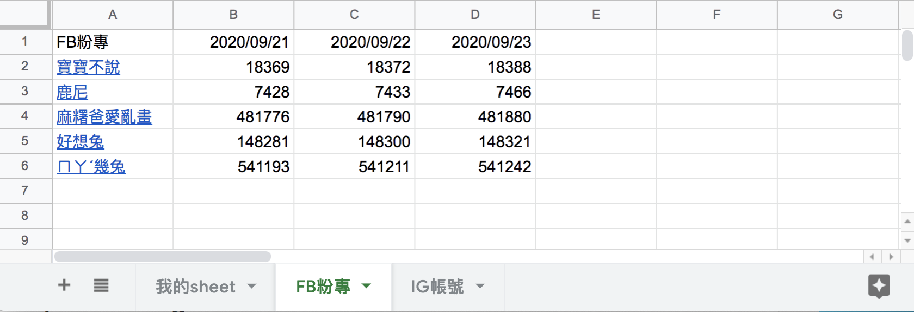

#### [回目錄](../README.md)
## Day20 Google Sheets-寫入爬蟲資料，跟 Copy & Paste 的日子說掰掰

>爬蟲是一個技術，他將網頁的數據收集下來
Google Sheets是一個容器，他可以儲存資料並將資料以不同面向做展示
`爬蟲 Ｘ Google Sheets ＝ 你要學習的技術整合`

🏆 今日目標
----
### 1. 改寫`crawlerIG、crawler`這兩隻函式，讓他們依照我們想要格式回傳爬蟲資料
1.1 分析 Google Sheets上要呈現的資料、寫入時可能遇到的問題
1.2 組合回傳的資訊：以 `crawlerFB` 為範例

### 2. 以主程式當橋樑，將爬蟲資料傳遞到`updateGoogleSheets`
2.1 用`主程式`傳遞爬蟲資料
2.2 改寫 `updateGoogleSheets` 函式來接收並處理爬蟲資料

### 3. 將FB、IG粉專爬蟲資料寫入各自的Sheet
3.1 分析寫入Google Sheets的步驟：`writeSheet`
3.2 在官方文件尋找 **寫入Sheet** 的範例
3.3 第一欄寫入title(粉專名稱)：`writeTitle`
3.4 取得Sheet最後一欄的空白欄位：`getLastCol`
3.5 將trace(追蹤人數)資訊寫入最後一欄：`writeTrace`

----

# 1. 改寫`crawlerIG、crawler`這兩隻函式，讓他們依照我們想要格式回傳爬蟲資料
>過去我們只將FB粉專、IG粉專的資訊用console.log輸出，現在我們要把這些資料有結構的存入json物件方便後續使用

### 1.1 分析 Google Sheets上要呈現的資料、寫入時可能遇到的問題
* Google Sheets呈現的資料：
  1. 粉專名稱
  2. 追蹤人數
  3. 追蹤日期
* 可能會遇到的問題：
  1. 重複名稱的粉專
        * 解決方案：粉專名稱有可能重名，但是`粉專網址是唯一值`，所以使用`粉專名稱+粉專網址作為key`就能解決這個問題，同時也方便使用者可以點擊連結直接前往粉專
* 總結：
  1. 因為追蹤的FB、IG粉專數量很多，所以 **crawlerFB、crawlerIG** 這兩個函式回傳的最外層用陣列(array)包起來
  2. 根據Google Sheets所需的資料，每個粉專的物件(object)需要有以下內容：
        1. 粉專名稱(title)
        2. 粉專網址(url)
        3. 追蹤人數(trace)

### 1.2 組合回傳的資訊：以 `crawlerFB` 為範例
* 在 try-catch 的後面加上 finally，在 finally 階段才把粉專物件存入 result_array 是因為`無論這個粉專爬蟲成功或是失敗我們都要記錄他的數據`
    >finally 代表在 try-catch 結束後會執行的任務，忘記的可以回到[Day14 try-catch-finally 基礎語法說明](/day14/README.md)複習喔
* 當全部粉專爬蟲完成後 return 這個儲存所有粉專資訊的 result_array

```js
async function crawlerFB (driver) {
    const isLogin = await loginFacebook(driver)
    if (isLogin) {
        console.log(`FB開始爬蟲`)
        let result_array = []
        for (fanpage of fanpage_array) {
            let trace = null
            try {
                const isGoFansPage = await goFansPage(driver, fanpage.url)
                if (isGoFansPage) {
                    await driver.sleep((Math.floor(Math.random() * 4) + 3) * 1000)//每個頁面爬蟲停留3~6秒，不要造成別人的伺服器負擔
                    trace = await getTrace(driver, By, until)
                }
                if (trace === null) {
                    console.log(`${fanpage.title}無法抓取追蹤人數`)
                } else {
                    console.log(`${fanpage.title}追蹤人數：${trace}`)
                }
            } catch (e) {
                console.error(e);
                continue;
            } finally {// 將粉專的資訊塞入物件
                result_array.push({
                    url: fanpage.url,
                    title: fanpage.title,
                    trace: trace
                })
            }
        }
        // 回傳FB粉專爬蟲資料
        return result_array
    }
}
```

----

# 2. 以主程式當橋樑，將爬蟲資料傳遞到`updateGoogleSheets`
### 2.1 用`主程式`傳遞爬蟲資料
主程式在收到 crawlerIG、crawlerFB 回傳的爬蟲資訊後提供給 updateGoogleSheets 當參數
```js
async function crawler () {
    const driver = initDrive();
    if (!driver) {
        return
    }
    //取得回傳的爬蟲資料
    const ig_result_array = await crawlerIG(driver)
    const fb_result_array = await crawlerFB(driver)
    driver.quit();
    //將回傳的爬蟲資料傳遞給Google Sheets處理
    await updateGoogleSheets(ig_result_array, fb_result_array)
}
```
### 2.2 改寫 `updateGoogleSheets` 函式來接收並處理爬蟲資料
* 接受爬蟲回傳的資料：ig_result_array, fb_result_array
* 新增函式 `writeSheet` 將收到的爬蟲資料寫入對應的 Sheet
* 最後印出Google Sheets的網址方便查看
```js
async function updateGoogleSheets (ig_result_array, fb_result_array) {
    try {
        const auth = await getAuth()
        let sheets = await getFBIGSheet(auth)
        console.log('FB、IG Sheet資訊:')
        console.log(sheets)

        // 將爬蟲資料寫入各自的Sheet
        await writeSheet('FB粉專', fb_result_array, auth)
        await writeSheet('IG帳號', ig_result_array, auth)
        console.log(`成功更新Google Sheets：https://docs.google.com/spreadsheets/d/${process.env.SPREADSHEET_ID}`);
    } catch (err) {
        console.error('更新Google Sheets失敗');
        console.error(err);
    }
}
```

----

# 3. 將FB、IG粉專爬蟲資料寫入各自的Sheet

### 3.1 分析寫入Google Sheets的步驟：`writeSheet`
**目標**：希望寫入的Google Sheets長得像下圖：


**我們先將想要完成的功能羅列出來，再一個個去實現：**
1. 第一欄為 `粉專名稱+粉專網址` 組合的 **HYPERLINK**，每次執行爬蟲時我們會用 `writeTitle` 這個函式來更新第一欄的資料
2. 因為希望新的爬蟲紀錄會記錄到下一欄，所以我們寫一個函式 `getLastCol` 來取得Sheet最後一欄的空白欄位
3. 取得目標寫入欄位後，我們用函式 `writeTrace` 把爬蟲下來的追蹤人數寫入就完成嚕
```js
async function writeSheet (title, result_array, auth) {
    // title可以直接超連結到粉專
    let title_array = result_array.map(fanpage => [`=HYPERLINK("${fanpage.url}","${fanpage.title}")`]);
    // 開頭填入填上FB粉專/IG帳號
    title_array.unshift([title])//unshift是指插入陣列開頭
    // 在第一欄寫入title(粉專名稱)
    await writeTitle(title, title_array, auth)

    // 取得目前最後一欄
    let lastCol = await getLastCol(title, auth)

    
    let trace_array = result_array.map(fanpage => [fanpage.trace]);
    // 抓取當天日期
    const datetime = new Date()
    trace_array.unshift([dateFormat(datetime, "GMT:yyyy/mm/dd")])
    // 再寫入trace(追蹤人數)
    await writeTrace(title, trace_array, lastCol, auth)
}
```


### 3.2 在官方文件尋找 `寫入Sheet` 的範例
1. 有了`昨天的經驗`我們可以很容易找到今天所需的資源，在範例首頁的大標題[Basic Writing](https://developers.google.com/sheets/api/samples/writing)就符合今天的需求
  
2. 在閱讀 **Basic Writing** 描述時有兩個標題吸引我的注意
    * [Append Values](https://developers.google.com/sheets/api/samples/writing#append_values)：在閱讀標題時我原本覺得是最好的選擇，但發現他只能插入列(row)，與我們插入欄(col)的需求不符
    * [Write a single range](https://developers.google.com/sheets/api/samples/writing#write_a_single_range)：在開頭便提供了一個連結，並說`這個方法能寫入指定Sheet範圍內的資料`
  
3. 接著你可以用`Try this API`來確認[Method: spreadsheets.values.update](https://developers.google.com/sheets/api/reference/rest/v4/spreadsheets.values/update)是否能正確更新Sheet的內容，相關操作方式[昨天的文章](/day19/README.md)有示範，這裡就不再贅述了，下面我把官方範例翻譯了一下，讓大家更清楚使用的方法
    ```js
    let title = '你的sheet title'
    //Google Sheets能吃的array格式範例
    let array = [['test1'],['test2'],['test3'],['test4']]
    async function writeSheet (title, array, auth) {//auth為憑證通過後取得
        const sheets = google.sheets({ version: 'v4', auth });
        const request = {
        spreadsheetId: process.env.SPREADSHEET_ID,
        valueInputOption: "USER_ENTERED",//寫入格式的分類有：INPUT_VALUE_OPTION_UNSPECIFIED|RAW|USER_ENTERED
        range: [
            `'${title}'!A:A`//title是sheet的標題，A:A是能寫入的範圍
        ],
        resource: {
            values: array
        }
        }
        try {
        await sheets.spreadsheets.values.update(request);//執行後即完成Google Sheets更新
        console.log(`updated ${title} title`);
        } catch (err) {
        console.error(err);
        }
    }
    ```


### 3.3 第一欄寫入title(粉專名稱)：`writeTitle`
```js
async function writeTitle (title, title_array, auth) {
const sheets = google.sheets({ version: 'v4', auth });
const request = {
    spreadsheetId: process.env.SPREADSHEET_ID,
    valueInputOption: "USER_ENTERED",
    range: [
    `'${title}'!A:A` // 這是寫入第一欄的意思
    ],
    resource: {
    values: title_array
    }
}
try {
    await sheets.spreadsheets.values.update(request);
    console.log(`updated ${title} title`);
} catch (err) {
    console.error(err);
}
}
```


### 3.4 取得Sheet最後一欄的空白欄位：`getLastCol`
* 在這個函式中我們取得了目標Sheet的第一列來做分析，詳細的文件請參考[官方說明](https://developers.google.com/sheets/api/reference/rest/v4/spreadsheets.values/batchGet)
* 同事我們也需要用函式 `toColumnName` 來把取得的欄位名稱轉換為英文，這樣Google Sheets才知道要寫入的欄位
```js
async function getLastCol (title, auth) {
    const sheets = google.sheets({ version: 'v4', auth });
    const request = {
        spreadsheetId: process.env.SPREADSHEET_ID,
        ranges: [
        `'${title}'!A1:ZZ1`
        ],
        majorDimension: "COLUMNS",
    }
    try {
        let values = (await sheets.spreadsheets.values.batchGet(request)).data.valueRanges[0].values;
        // console.log(title + " StartCol: " + toColumnName(values.length + 1))
        return toColumnName(values.length + 1)
    } catch (err) {
        console.error(err);
    }
}

function toColumnName (num) {//Google Sheets無法辨認數字欄位，需轉為英文才能使用
    for (var ret = '', a = 1, b = 26; (num -= a) >= 0; a = b, b *= 26) {
        ret = String.fromCharCode(parseInt((num % b) / a) + 65) + ret;
    }
    return ret;
}
```


### 3.5 將trace(追蹤人數)資訊寫入最後一欄：`writeTrace`
```js    
async function writeTrace (title, trace_array, lastCol, auth) {
    const sheets = google.sheets({ version: 'v4', auth });
    const request = {
        spreadsheetId: process.env.SPREADSHEET_ID,
        valueInputOption: "USER_ENTERED",
        range: [
        `'${title}'!${lastCol}:${lastCol}`//將追蹤人數填入最後一欄
        ],
        resource: {
        values: trace_array
        }
    }
    try {
        await sheets.spreadsheets.values.update(request);
        console.log(`updated ${title} trace`);
    } catch (err) {
        console.error(err);
    }
}
```

----

🚀 執行程式
----
在專案資料夾的終端機(Terminal)執行指令
```vim
yarn start
```
等待爬蟲跑完後看看線上的Google Sheets是不是也被成功寫入惹～


目前為止將爬蟲寫入Google Sheets的動作已經完成了，大家可以思考一下還有什麼東西是我們忽略的呢？有什麼狀況會造成錯誤？希望大家在下方提供自己的想法喔～  

----

ℹ️ 專案原始碼
----
* 今天的完整程式碼可以在[這裡](https://github.com/dean9703111/ithelp_30days/tree/master/day20)找到喔
* 我也貼心地把昨天的把昨天的程式碼打包成[壓縮檔](https://github.com/dean9703111/ithelp_30days/raw/master/sampleCode/day19_sample_code.zip)，你可以用裡面乾淨的環境來實作今天Google Sheets的爬蟲資料寫入喔
    * 請記得在終端機下指令 **yarn** 才會把之前的套件安裝
    * 要在tools/google_sheets資料夾放上自己的憑證
    * 調整fanspages資料夾內目標爬蟲的粉專網址
    * 調整.env檔
        * 填上FB登入資訊
        * 填上FB版本(classic/new)
        * 填上IG登入資訊
        * 填上SPREADSHEET_ID
    
### [Day21 Google Sheets-BUG!爬蟲資料塞錯位置 & 專案出包怎麼辦？](/day21/README.md)