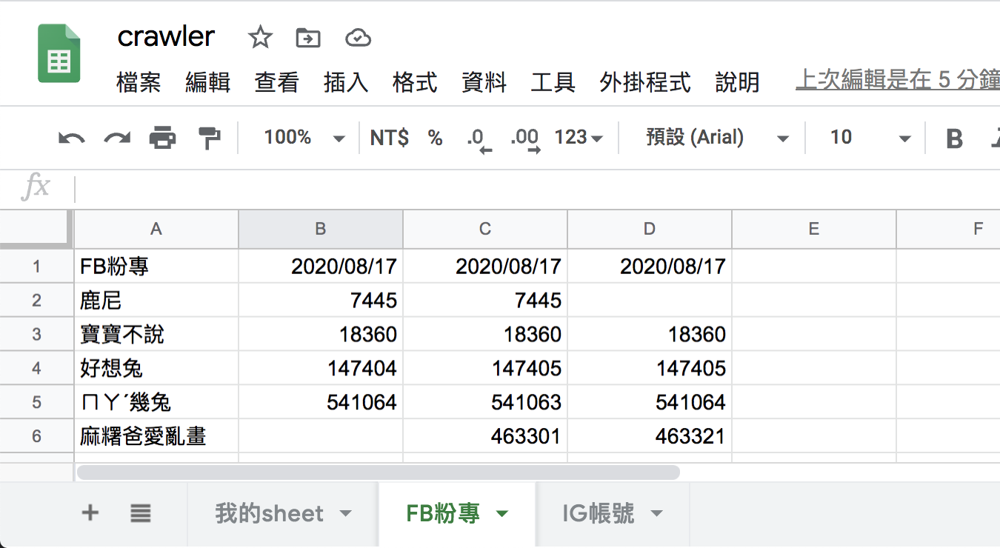

#### [回目錄](../README.md)
## Day20 Google Sheets-倒序插入

雖然截至上一篇我們已經完成了專案在Google sheet的基本需求，但是在給業主實際測試的時候常常會多出一些現實面會需要的功能  

>**筆者碎碎念**  
對於這些開發過程中多出來的功能我一律列入**需求變更**，這塊就是我在[Day 1](/day1/README.md)提到需求規格的重要性，如果你一開始沒先說好需求規格，那麼之後追加的功能你很有可能會變成免費勞工，畢竟這沒有白紙黑字  

回到今天業主要求的功能是倒敘插入追蹤資訊，簡單來說他希望我們是可以把最新的追蹤資訊插到粉專資訊的下一欄，實作步驟我拆解如下：
1. 插入一個空白欄位
2. 把空白欄位更新成最新的追蹤資訊


插入一個空白欄位
----
對於插入空白欄位的部分一樣先提供[官方的文件](https://developers.google.com/sheets/api/reference/rest/v4/spreadsheets/request#insertdimensionrequest)給大家，下面是我對這個功能的範例解說  
```js
async function insertEmptyCol (title, sheet_id, auth) {//插入空白欄位
  const sheets = google.sheets({ version: 'v4', auth });
  const request = {
    // The ID of the spreadsheet
    "spreadsheetId": process.env.SPREADSHEET_ID,
    "resource": {
      "requests": [{
        "insertDimension": {//插入新欄位
          "range": {
            "sheetId": sheet_id,
            "dimension": "COLUMNS",
            "startIndex": 1,//代表插入範圍從第一欄開始到第二欄結束
            "endIndex": 2
          },
          "inheritFromBefore": true
        },
      }]
    }
  };
  try {
    await sheets.spreadsheets.batchUpdate(request)
    console.log('insert sheet:' + title + ' new column')
  }
  catch (err) {
    console.log('The API returned an error: ' + err);
  }
}
```
把空白欄位更新成最新的追蹤資訊
------------------------
這裡我們就有一些細節要做調整
* 因為插入空白欄位(insertEmptyCol)這個函式需要用到用到sheetId的參數
    1. updateGoogleSheets : 調整writeSheet函式傳入參數
        ```js
        writeSheet(sheet.title, sheet.id, fb_result_array, auth)
        ```
    2. writeSheet : 移除廢棄函式(getLastCol)，並調整相應參數
        1. 函數新增sheet_id參數
            ```js
            async function writeSheet (title, sheet_id, result_array, auth)
            ```
        2. 在寫入追蹤人數之前先插入空白欄位，將取得最後一欄函式刪除，且一並移除lastCol的參數
            ```js
            // 插入空欄位
            await insertEmptyCol(title, sheet_id, auth)
            // 寫入追蹤人數
            await writeTrace(title, trace_array, auth)
            ```
執行程式
----
在專案資料夾的終端機(Terminal)執行指令 **yarn start** 指令，看看線上的Google Sheets是否有正確插入第一欄呢？  
大家可以看看終端機輸出的資訊是否與Google Sheets上的資訊吻合(下圖)  
  
  

專案原始碼
----
完整的程式碼在[這裡](https://github.com/dean9703111/ithelp_30days/day20)喔
你可以整個專案clone下來  
```
git clone https://github.com/dean9703111/ithelp_30days.git
```
如果你已經clone過了，那你每天pull就能取得更新的資料嚕  
```
git pull origin master
cd day20
yarn
調整你.env檔填上 FB & IG 登入資訊、SPREADSHEET_ID
在credentials資料夾放上自己的憑證
yarn start
```
### [Day21 google sheets-窗口凍結 & 欄位寬度調整](/day21/README.md)