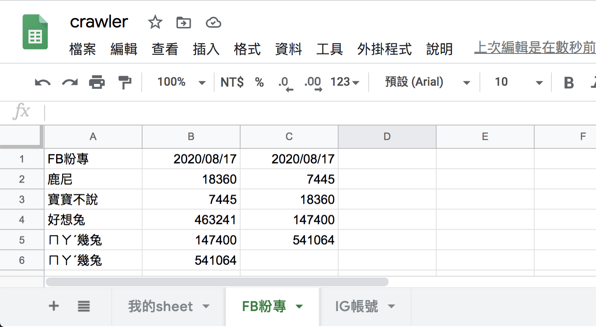
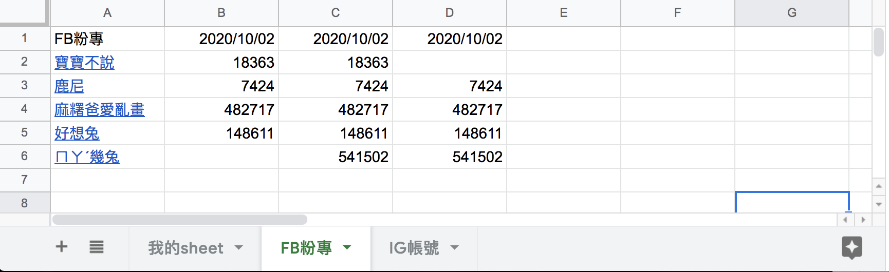

#### [回目錄](../README.md)
## Day21 Google Sheets-爬蟲資料塞錯位置了! & 與客戶溝通bug的技巧

>客戶的操作跟你想的不一樣

🤔 為什麼寫這篇文章？
----
其實這份專案完成到昨天的進度時就給業主做功能上的確認準備結案了  
但一個案子通常很難一次就通過，`無論這隻程式在你電腦上執行的多麼穩定，放到別人的電腦上總會冒出大大小小的bug`，我大概歸類成以下幾種：
1. 作業系統不同導致的
    * Windows、MacOS、Ubuntu Linux (ex：爬蟲時需要設定各自的 webdriver)
2. 套件版本不同導致
    * Node.js版本、npm 套件 (ex：有些 npm套件只能在特定 Node.js版本運行)
3. 電腦運行環境
    * 網路速度、硬體規格... (ex：如果你的網路環境太差需要去調整爬蟲元件的極限等待時間)
4. `客戶的操作跟你預想的不一樣`

第 1、2、3 點的問題我在之前文章實作碰到時有提到過，今天來講講`實際上你會最崩潰的第 4 點`

----

🏆 今日目標
----
### 1. 將客戶發的bug做基礎分類
### 2. 引導客戶說出bug發生原因及提出解決方案的小技巧
### 3. 重現客戶發生的bug
### 4. 改寫程式讓新的爬蟲資料塞入正確位置
4.1 取得Google Sheets第一欄的粉專名稱：`readTitle`
4.2 讓新的爬蟲資料正確寫入Google Sheets：`writeSheet`

----

# 1. 將客戶發的bug做基礎分類
與你合作的客戶通常不是資工相關背景，他們所提出來的bug有時也會讓你啼笑皆非，我個人會將他們提出的 bug分成 3 種
* **明顯的bug**：客戶一報bug你就知道哪個環節出問題了，就認命地解決吧 (ex：臉書的爬蟲登入後就卡住不動了)
* **需要討論的bug**：`客戶報bug時你不確定是哪個環節出了問題，需要與客戶討論發生bug的操作流程`
* **不合理的bug**：明顯不合理的要求 (ex：程式執行到一半使用者把電腦關機問你爬蟲資料為什麼沒有寫入Google Sheets)

----

# 2. 引導客戶說出bug發生原因及提出解決方案的小技巧
很多時候客戶對於bug的陳述是很模糊的，所以你**需要與客戶溝通，引導他們說出自己的操作流程**，以今天發出的Bug做舉例：

**客戶**：今天爬蟲資料寫入 Google Sheets表單時塞錯位置了！
**我**：請問這個問題是今天突然發生的，還是過去幾天也發生過通樣的問題呢？（`釐清bug發生的時間點`）
**客戶**：是今天才發生的
**我**：那今天你在跑爬蟲前有做過什麼調整嗎？ (`確認是什麼樣的操作導致bug`)
**客戶**：我在爬蟲的json檔裡面新增了幾個粉專，然後把Google Sheets上面一些沒有在維護的粉專給砍掉
**我**：了解，我這邊會先重複一遍您的操作來釐清問題，最晚會在兩天後給您答覆 (`自己操作一遍確認有這個bug`)
===我是正在重現bug的分隔線===
**我**：我這邊依照您的方式做了操作，確實遇到這個問題；這邊我提出一個解決方案，採用這個方案你新增的爬蟲粉專會寫入Google Sheets表單的最下面，且追蹤人數都會填入正確欄位，詳細邏輯你可以參考下方說明 (`自己提出解決方案，千萬別讓客戶天馬行空亂提`)
>* 導致錯誤發生的操作：
    1. 人工整理 Google Sheets粉專名稱的欄位：刪除、上下置換
    2. 調整爬蟲json內容：新增/刪除/上下置換
>* 解決錯誤的方式：
    1. 粉專名稱：寫入前將Google Sheets上粉專名稱的欄位與爬蟲json比對，如果 **爬蟲json裡面有新的粉專就會新增到最下面，不改變Google Sheets上粉專名稱原有排列順序**
    2. 追蹤人數：以 **粉專名稱+粉專網址作為寫入追蹤人數欄位的判斷**

**客戶**：好的先這樣做吧，你什麼時候能改好？
**我**：預計三個工作天，如果提早完成會儘早與您聯繫 (`說一個你絕對能完成功能的時間，並表達積極性`)

----

# 3. 重現客戶發生的bug
>這個步驟非常重要，`如果bug無法在自己的環境重現時你會超級頭大`，因為站在客戶的角度就是認為你沒有完成專案，這會導致你結案的日子變得遙遙無期...

這個問題重現起來非常簡單，建議讀者自己實驗看看
1. 將 fb.json 中的'麻糬爸愛亂畫'刪除，然後把'寶寶不說'移到第二個
    ```json
    [
        
        {
            "title": "鹿尼",
            "url": "https://www.facebook.com/%E9%B9%BF%E5%B0%BC-260670294340690/"
        },
        {
            "title": "寶寶不說",
            "url": "https://www.facebook.com/baobaonevertell/"
        },
        {
            "title": "好想兔",
            "url": "https://www.facebook.com/chien760608/"
        },
        {
            "title": "ㄇㄚˊ幾兔",
            "url": "https://www.facebook.com/machiko324/"
        }
    ]
    ```
2. 執行程式 **yarn start** 後你就會發現excel的表格亂掉了  
      

----

# 4. 改寫程式讓新的爬蟲資料塞入正確位置
### 4.1 取得Google Sheets第一欄的粉專名稱：`readTitle`
* 當這個sheet全新的時候內容是 undefine，但是因為我們等等再做對比時用的格式為array，所以要給他一個初始型別
```js
async function readTitle (title, auth) {
    const sheets = google.sheets({ version: 'v4', auth });
    const request = {
    spreadsheetId: process.env.SPREADSHEET_ID,
    ranges: [
        `'${title}'!A:A`
    ],
    valueRenderOption: "FORMULA"
    }
    try {
    let title_array = []
    let values = (await sheets.spreadsheets.values.batchGet(request)).data.valueRanges[0].values;
    if (values) {//如果沒資料values會是undefine，所以我們只在有資料時塞入
        title_array = values.map(value => value[0]);
    }
    // console.log(title_array)
    return title_array
    } catch (err) {
    console.error(err);
    }
}
```
### 4.2 讓新的爬蟲資料正確寫入Google Sheets：`writeSheet`
我們依照客戶接受的`解決方案`來調整這隻函式
* 將爬蟲json 中新增的粉專`補到 Google Sheets最後面`
* 追蹤人數用`粉專名稱+粉專網址`來塞入對應的位置
```js
async function writeSheet (title, result_array, auth) {
  // 取得線上第一欄的粉專名稱
  let online_title_array = await readTitle(title, auth)
  // 如果json檔有新增的粉專就補到最後面
  result_array.forEach(fanpage => {
    if (!online_title_array.includes(`=HYPERLINK("${fanpage.url}","${fanpage.title}")`)) {
      online_title_array.push(`=HYPERLINK("${fanpage.url}","${fanpage.title}")`)
    }
  });

  // "粉專名稱+粉專網址"作為寫入追蹤人數欄位的判斷
  let trace_array = []
  online_title_array.forEach(title => {
    let fanpage = result_array.find(fanpage => `=HYPERLINK("${fanpage.url}","${fanpage.title}")` == title)
    if (fanpage) {
      trace_array.push([fanpage.trace])
    } else {
      trace_array.push([])
    }
  });

  const datetime = new Date()
  if (online_title_array[0] !== title) {//如果是全新的sheet就會在開頭插入
    online_title_array.unshift(title)
    trace_array.unshift([dateFormat(datetime, "GMT:yyyy/mm/dd")])
  } else {//如果不是全新就取代
    trace_array[0] = [dateFormat(datetime, "GMT:yyyy/mm/dd")]
  }
  
  await writeTitle(title, online_title_array.map(title => [title]), auth)
  let lastCol = await getLastCol(title, auth)
  await writeTrace(title, trace_array, lastCol, auth)
}
```

----

🚀 執行程式
----
本次目標需多次執行程式你才能確保程式運作正確
1. 依照自己的想法去編修線上的Google Sheets、調整爬蟲json內容
2. 在專案資料夾的終端機(Terminal)執行指令
    ```vim
    yarn start
    ```
3. 在爬蟲跑完後看看線上的Google Sheets是否有依照你的更改正確寫入

* 下圖是我多次修改 fb.json 後執行爬蟲的結果  
    

----

ℹ️ 專案原始碼
----
* 今天的完整程式碼可以在[這裡](https://github.com/dean9703111/ithelp_30days/tree/master/day21)找到喔
* 我也貼心地把昨天的把昨天的程式碼打包成[壓縮檔](https://github.com/dean9703111/ithelp_30days/raw/master/sampleCode/day18_sample_code.zip)，你可以用裡面乾淨的環境來實作今天Google Sheets的起手式喔
    * 請記得在終端機下指令 **yarn** 才會把之前的套件安裝
    * 要在tools/google_sheets資料夾放上自己的憑證
    * 調整fanspages資料夾內目標爬蟲的粉專網址
    * 調整.env檔
        * 填上FB登入資訊
        * 填上FB版本(classic/new)
        * 填上IG登入資訊
        * 填上SPREADSHEET_ID
        
### [Day22 Google Sheets-業主：我希望新資料插在最前面 & 談需求變更](/day22/README.md)