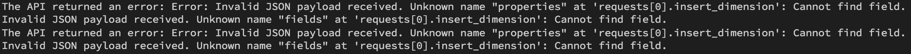
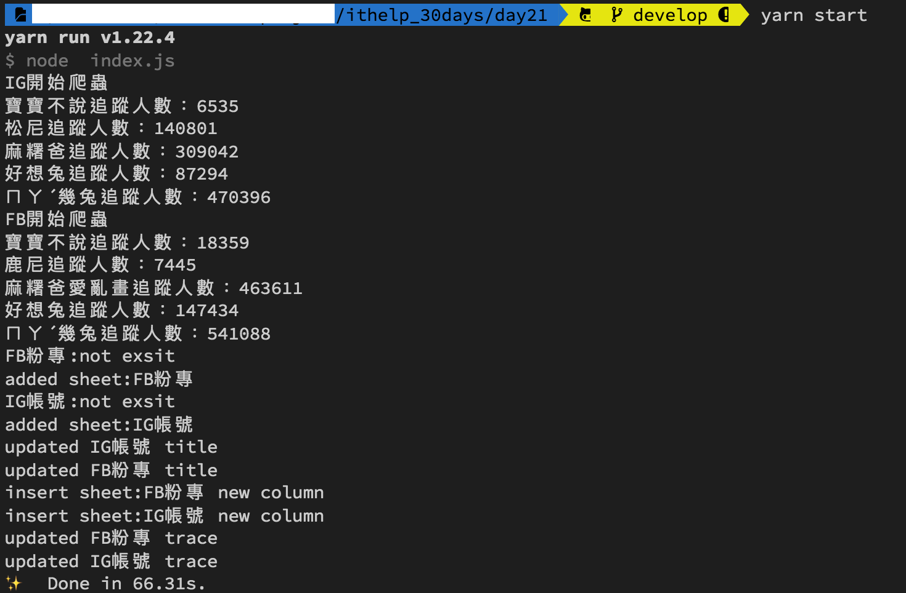
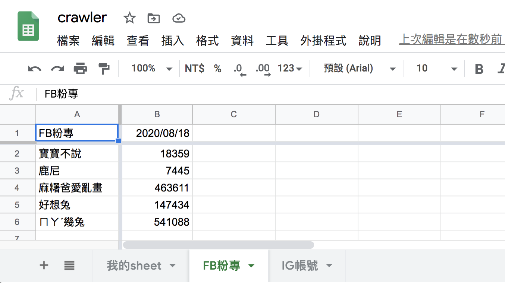

#### [回目錄](../README.md)
## Day21 Google Sheets-窗口凍結 & 欄位寬度調整

就如標題所述，為了提升Google Sheets閱讀上的體驗，他新增了兩個要求：  
1. 窗口凍結：最上方的爬蟲日期、左方的粉專名稱在瀏覽時凍結
2. 欄位寬度調整：減少追蹤人數的欄位寬度，這樣才能一次看比較多資訊

建議大家可以先看官方文件說明：[窗口凍結](https://developers.google.com/sheets/api/reference/rest/v4/spreadsheets#gridproperties)、
[欄位寬度調整](https://developers.google.com/sheets/api/reference/rest/v4/spreadsheets/request#UpdateDimensionPropertiesRequest)  
* 原則上對Google Sheets的任何動作，只要你能夠手動操作的他都有提供api給你使用，所以強烈建議日後想要用api操作Google Sheets的朋友們一定要練習看懂官方文檔  

窗口凍結
------------------------
我將這個功能合併到創建sheet的函式(addSheet)，從邏輯上來說他只需要在建立sheet時執行一次就夠了
```js
async function addSheet (title, sheet_id, auth) {//新增一個sheet到指定的Google Sheets
  const sheets = google.sheets({ version: 'v4', auth });
  const request = {
    // The ID of the spreadsheet
    "spreadsheetId": process.env.SPREADSHEET_ID,
    "resource": {
      "requests": [{
        "addSheet": {//這個request的任務是addSheet
          // 你想給這個sheet的屬性
          "properties": {
            "sheetId": sheet_id,//必須為數字，且這個欄位是唯一值
            "title": title,
            "gridProperties": {
              "frozenRowCount": 1,//我將最上面那一列設定為凍結
              "frozenColumnCount": 1//我將最左邊那一欄設定為凍結
            },
          }
        },
      }]
    }
  };
  try {
    await sheets.spreadsheets.batchUpdate(request)
    console.log('added sheet:' + title)
  }
  catch (err) {
    console.log('The API returned an error: ' + err);
  }
}
```

欄位寬度調整
------------------------
經過實驗後發現如果是新插入的欄位都會是預設的欄位寬度，所以我在插入新欄位的函式(insertEmptyCol)新增了調整欄位寬度的功能  
* 在這個Google Sheets的request中你可以發現他是可以同時執行多個要求的(insertDimension、updateDimensionProperties)，原本我打算要把這兩個request合併到一起，但實際執行會跳出錯誤如下圖，官方文件沒有提供的功能就不要想太多了，老老實實分成兩個步驟執行吧  

      
```js
async function insertEmptyCol (title, sheet_id, auth) {//插入空白欄位
  const sheets = google.sheets({ version: 'v4', auth });
  const request = {
    // The ID of the spreadsheet
    "spreadsheetId": process.env.SPREADSHEET_ID,
    "resource": {
      "requests": [{
        "insertDimension": {//插入新欄位
          "range": {
            "sheetId": sheet_id,
            "dimension": "COLUMNS",
            "startIndex": 1,//代表插入範圍從第一欄開始到第二欄結束
            "endIndex": 2
          },
          "inheritFromBefore": true
        }
      },
      {
        "updateDimensionProperties": {//這裡是為了修正欄寬
          "range": {
            "sheetId": sheet_id,
            "dimension": "COLUMNS",
            "startIndex": 1,
            "endIndex": 2//只需要首欄
          },
          "properties": {
            "pixelSize": 85
          },
          "fields": "pixelSize"
        }
      }]
    }
  };
  try {
    await sheets.spreadsheets.batchUpdate(request)
    console.log('insert sheet:' + title + ' new column')
  }
  catch (err) {
    console.log('The API returned an error: ' + err);
  }
}
```

執行程式
----
* 在執行程式之前請先把Google Sheets的'FB粉專'、'IG帳號'這兩個sheet刪除喔，因為addSheet函式要觸發才會有窗口凍結的功能  

刪除sheet後在專案資料夾的終端機(Terminal)執行指令 **yarn start** 指令，看看線上的Google Sheets是否有符合今天設定的格式呢？  
  
  

下個階段
------------------------
Google Sheets系列文章到這裡告一個段落，接下來我們會討論**排程自動化**的部分，敬請期待

專案原始碼
----
完整的程式碼在[這裡](https://github.com/dean9703111/ithelp_30days/day21)喔
你可以整個專案clone下來  
```
git clone https://github.com/dean9703111/ithelp_30days.git
```
如果你已經clone過了，那你每天pull就能取得更新的資料嚕  
```
git pull origin master
cd day21
yarn
調整你.env檔填上 FB & IG 登入資訊、SPREADSHEET_ID
在credentials資料夾放上自己的憑證
yarn start
```
### [Day22 排程設定](/day22/README.md)