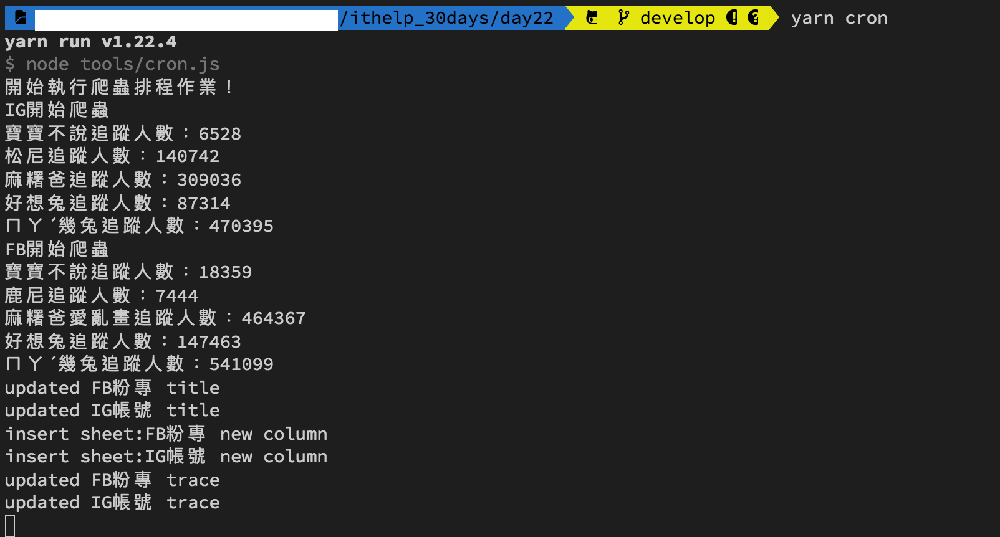
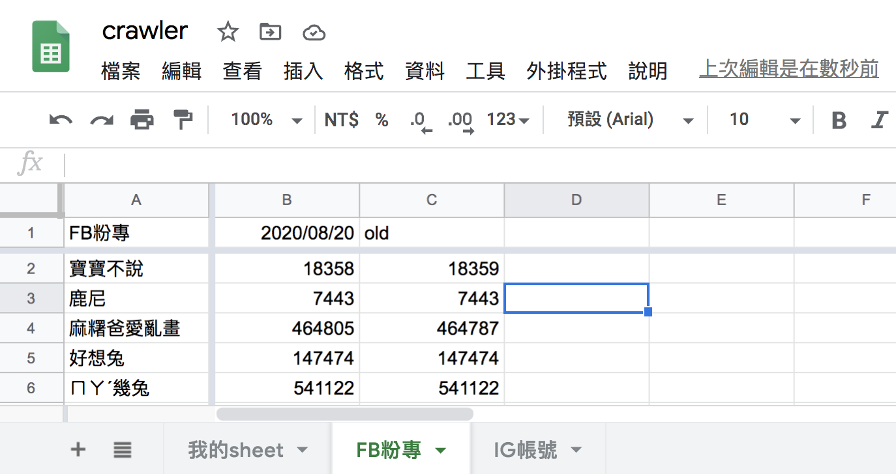

#### [回目錄](../README.md)
## Day22 Google Sheets-業主：我希望新資料插在最前面 & 談需求變更

>在驗收階段你就知道一個好的需求規格書有多麼重要

🏆 今日目標
----
#### 1. 了解驗收過程中需求規格書的重要性
#### 2. 談需求變更
#### 3. 將新的爬蟲資料寫到最前面，日期為由近而遠的排序
3.1 插入一個空白欄位
3.2 把空白欄位更新成最新的追蹤人數資訊

----

# 1. 了解驗收過程中需求規格書的重要性
驗收的過程就是按造需求規格上的驗收項目一一測試，所以`如果沒有需求規格書或是需求規格書寫得太不完善，你在驗收的過程會一直被凹新功能`，而這些功能基本上只能忍氣吞聲吃下去，畢竟這是因為你在一開始沒談好規格的歷史業障，這就是我在[Day 1](/day1/README.md)提到需求規格書的重要性

----

# 2. 談需求變更
反過來如果你需求規格寫得夠好，在驗收的階段你會有很多賺外快的機會，`因為大部分的客戶在驗收階段才想到他們實際上還需要哪些功能`
對於這些多出來的功能我一律列入**需求變更**，因為這些需求並不在原合約內所以你可以`將客戶的新需求記錄下來依功能報價讓客戶自己決定需要新增哪些功能`
根據個人經驗，在結案後你會發現這些多出來的`需求變更可能占總外包費的20%~40%不等`，所以各位在接案時千萬不要因為覺得麻煩沒有好好寫需求規格書啊！你這樣的做法完全在跟自己的錢包過不去，讓自己成為免費勞工。下面我用今天要完成的需求變更做舉例：

**客戶**：我測試了幾天覺得爬蟲蠻穩定的，但最新的爬蟲資料都寫在最後面，這讓我要滑到最後面才知道最新資料，他能不能新資料都寫在最前面啊 `(客戶提出需求變更)`
**我**：您的意思是要**將新的爬蟲資料寫到最前面，Google Sheet上呈現的是日期由近而遠的排序**嗎？ `(確認需求變更的邏輯)`
**客戶**：對，麻煩了
**我**：不過這項需求並不在原本的需求規格書上面，原本的需求規格書只提到**爬蟲日期為欄，粉專標題為列**，並沒提到排序方面的需求；經過評估這個功能需要額外的費用XXX，您可以接受嗎？ `(提出需求規格書上面的規格做佐證，並說明這個新功能需要加收多少費用)`
**客戶**：恩...可以
**我**：我把這項規則加到需求規格書的後面，您確認完後我就會開始實作 `(讓客戶確認規格及價格後在開始實作)`


----

# 3. 將新的爬蟲資料寫到最前面，日期為由近而遠的排序
想要完成這個需求，我個人的解法是拆解成兩個步驟：
1. 先在第二欄插入一個空白欄位
2. 把空白欄位更新成最新的追蹤人數資訊

### 3.1 插入一個空白欄位
在Google Sheets中插入空白欄位的部分請參考[官方的文件](https://developers.google.com/sheets/api/reference/rest/v4/spreadsheets/request#insertdimensionrequest)，這裡有個個需要注意的點：
* 我們觀察到 range 需要提供`sheet_id`，而呼叫他的`writeSheet`函式並沒有這個參數
```js
async function insertEmptyCol (title, sheet_id, auth) {//插入空白欄位
  const sheets = google.sheets({ version: 'v4', auth });
  const request = {
    // The ID of the spreadsheet
    "spreadsheetId": process.env.SPREADSHEET_ID,
    "resource": {
      "requests": [{
        "insertDimension": {//插入新欄位
          "range": {
            "sheetId": sheet_id,
            "dimension": "COLUMNS",
            "startIndex": 1,//代表插入範圍從第一欄開始到第二欄結束
            "endIndex": 2
          },
          "inheritFromBefore": true
        },
      }]
    }
  };
  try {
    await sheets.spreadsheets.batchUpdate(request)
    console.log('update sheet:' + title + ' new column')
  }
  catch (err) {
    console.log('The API returned an error: ' + err);
  }
}
```

### 3.2 把空白欄位更新成最新的追蹤人數資訊
根據上面提出的問題，我們需要對程式做如下調整
* 因為`insertEmptyCol`這個函式需要用到用到 **sheetId** 的參數
    1. `updateGoogleSheets`：調整`writeSheet`函式傳入參數改用`getFBIGSheet`回傳的sheets資料
        ```js
        const sheets = await getFBIGSheet(auth)//取得線上FB、IG的sheet資訊

        // 寫入各自的Sheet
        for (sheet of sheets) {
          if (sheet.title === 'FB粉專') {
            await writeSheet(sheet.title, sheet.id, fb_result_array, auth)
          } else if (sheet.title === 'IG帳號') {
            await writeSheet(sheet.title, sheet.id, ig_result_array, auth)
          }
        }
        ```
    2. `writeSheet` : 
        1. 函數`新增sheet_id`參數
            ```js
            async function writeSheet (title, sheet_id, result_array, auth)
            ```
        2. 在寫入追蹤人數之前先插入空白欄位`(insertEmptyCol)`，故將取得最後一欄相關函式`getLastCol`、`toColumnName`刪除，並移除`writeTrace`中lastCol的參數
            ```js
            // 插入空欄位
            await insertEmptyCol(title, sheet_id, auth)
            // 寫入追蹤人數
            await writeTrace(title, trace_array, auth)
            ```

----

🚀 執行程式
----
在專案資料夾的終端機(Terminal)執行指令
```vim
yarn start
```
大家可以看看終端機輸出的資訊是否與Google Sheets第二欄的資訊符合～
  
  
>如果你在同一天測試，你可以把之前爬蟲日期改成`old`方便辨識

----

ℹ️ 專案原始碼
----
* 今天的完整程式碼可以在[這裡](https://github.com/dean9703111/ithelp_30days/tree/master/day22)找到喔
* 我也貼心地把昨天的把昨天的程式碼打包成[壓縮檔](https://github.com/dean9703111/ithelp_30days/raw/master/sampleCode/day21_sample_code.zip)，你可以用裡面乾淨的環境來完成業主要求的需求變更吧
    * 請記得在終端機下指令 **yarn** 才會把之前的套件安裝
    * windows需下載與你chrome版本相同的[chrome driver](http://chromedriver.storage.googleapis.com/index.html)放在專案根目錄
    * 要在tools/google_sheets資料夾放上自己的憑證
    * 調整fanspages資料夾內目標爬蟲的粉專網址
    * 調整.env檔
        * 填上FB登入資訊
        * 填上FB版本(classic/new)
        * 填上IG登入資訊
        * 填上SPREADSHEET_ID

### [Day23 Google Sheets-優化格式，滿足客戶需求 & 談使用者體驗](/day23/README.md)