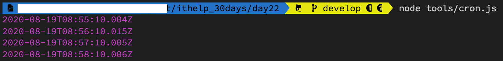
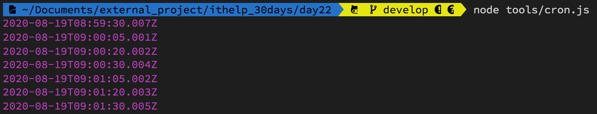

#### [回目錄](../README.md)
## Day22 排程設定

我是一個懶人，同時也不是一個記性很好的人，如果每天都要在某個時間打開專案執行 **yarn start** 然後等數據跑完，這對我來說實在是一件很容易忘記且沒有效率的事情，我認為**電腦可以做到事情那就交給電腦去做**，所以我今天我要跟大家分享我是如何偷懶的

排程套件 - Cron
----
這裡我們需要安裝一個套件 **cron** ，他可以在你指定的時間執行你希望他幫你做的事情，這是他的[官方文檔](https://www.npmjs.com/package/cron)，下面我會詳細介紹他的功能(因為我自己也很常使用XD)  
```
yarn add cron
```
* 測試官方程式
    1. 先在tools的資料夾裡面新增一個cron.js的檔案
    2. 複製下方的官方範例
        ```js
        var CronJob = require('cron').CronJob;
        var job = new CronJob('* * * * * *', function() {
          console.log('You will see this message every second');
        }, null, true, 'America/Los_Angeles');
        job.start();
        ```
    3. 在專案資料夾執行 **node tools/cron.js**
        * 如果終端機(Terminal)每秒鐘都印出 **You will see this message every second** 就代表套件運行成功
* api架構
    ```js
    constructor(cronTime, onTick, onComplete, start, timezone, context, runOnInit, unrefTimeout)
    ```
    * cronTime [必填] 設定定時任務時間
    * onTick [必填] 定時任務要執行的函式
    * onComplete [選填] 完成定時任務後要執行的函式
    * Start [選填] 是否自動啟動job，默認為false
    * timeZone [選填] - 指定執行的時區，莫認為當前時區，關於時區代碼可參考[網站](https://www.zeitverschiebung.net/en/)
* cronTime語法
    * 總共分為六個區塊：秒 分鐘 小時 天 月份 星期幾
        ```
        秒：0-59
        分鐘：0-59
        小時：0-23
        天：1-31
        月份：0-11（1~12月，特別注意月份是從0開始）
        星期幾：0-6（星期日~星期六，Sun~Sat）
        ```
    * 語法範例
        * *全部
            * 每秒都執行(官方範例)
                ```
                * * * * * *
                ```
            * 每分鐘的第10秒執行
                ```
                10 * * * * *
                ```
            * 每天晚上10點30分10秒時執行
                ```
                10 30 22 * * *
                ```
        * -時間區間
            * 每天早上9點到12點的整點執行
                ```
                0 0 9-12 * * *
                ```
        * ,分隔符號，可以輸入多個數值
            * 每分鐘的第5,20,30秒執行
                ```
                5,20,30 * * * * *
                ```
        *  /間隔多少時間執行
            * 每3分鐘執行一次
                ```
                * */3 * * * *
                ```
* 範例
    * 每分鐘的第10秒執行
        ```js
        var CronJob = require('cron').CronJob;
        new CronJob('10 * * * * *', function () {
            const datetime = new Date();
            console.log(datetime);
        }, null, true);
        ```        
        
    * 每分鐘的第5,20,30秒執行
        ```js
        var CronJob = require('cron').CronJob;
        new CronJob('5,20,30 * * * * *', function () {
            const datetime = new Date();
            console.log(datetime);
        }, null, true);
        ```
        

把排程加入爬蟲
----
我想上面這麼詳細的套件說明以及範例，這段程式大家應該可以輕鬆寫出來XD  


執行程式
----

專案原始碼
----
完整的程式碼在[這裡](https://github.com/dean9703111/ithelp_30days/day21)喔
你可以整個專案clone下來  
```
git clone https://github.com/dean9703111/ithelp_30days.git
```
如果你已經clone過了，那你每天pull就能取得更新的資料嚕  
```
git pull origin master
cd day22
yarn
調整你.env檔填上 FB & IG 登入資訊、SPREADSHEET_ID、爬蟲執行時間
在credentials資料夾放上自己的憑證
yarn start
```
### [Day23 排程永久背景執行?json改了沒反應?](/day23/README.md)