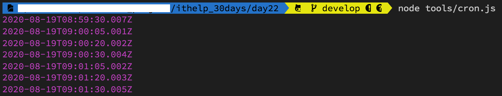

#### [回目錄](../README.md)
## Day22 排程設定

我是一個懶人，同時也不是一個記性很好的人，如果每天都要在某個時間打開專案執行 **yarn start** 然後等數據跑完，這對我來說實在是一件很容易忘記且沒有效率的事情，我認為**電腦可以做到事情那就交給電腦去做**，所以我今天我要跟大家分享我是如何偷懶的

排程套件 - Cron
----
這裡我們需要安裝一個套件 **cron** ，他可以在你指定的時間執行你希望他幫你做的事情，這是他的[官方文檔](https://www.npmjs.com/package/cron)，下面我會詳細介紹他的功能(因為我自己也很常使用XD)  
```
yarn add cron
```
* 測試官方程式
    1. 先在tools的資料夾裡面新增一個cron.js的檔案
    2. 複製下方的官方範例
        ```js
        var CronJob = require('cron').CronJob;
        var job = new CronJob('* * * * * *', function() {
          console.log('You will see this message every second');
        }, null, true, 'America/Los_Angeles');
        job.start();
        ```
    3. 在專案資料夾執行 **node tools/cron.js**
        * 如果終端機(Terminal)每秒鐘都印出 **You will see this message every second** 就代表套件運行成功
* api架構
    ```js
    constructor(cronTime, onTick, onComplete, start, timezone, context, runOnInit, unrefTimeout)
    ```
    * cronTime [必填] 設定定時任務時間
    * onTick [必填] 定時任務要執行的函式
    * onComplete [選填] 完成定時任務後要執行的函式
    * Start [選填] 是否自動啟動job，默認為false
    * timeZone [選填] - 指定執行的時區，莫認為當前時區，關於時區代碼可參考[網站](https://www.zeitverschiebung.net/en/)
* cronTime語法
    * 總共分為六個區塊：秒 分鐘 小時 天 月份 星期幾
        ```
        秒：0-59
        分鐘：0-59
        小時：0-23
        天：1-31
        月份：0-11（1~12月，特別注意月份是從0開始）
        星期幾：0-6（星期日~星期六，Sun~Sat）
        ```
    * 語法範例
        * *全部
            * 每秒都執行(官方範例)
                ```
                * * * * * *
                ```
            * 每分鐘的第10秒執行
                ```
                10 * * * * *
                ```
            * 每天晚上10點30分10秒時執行
                ```
                10 30 22 * * *
                ```
        * -時間區間
            * 每天早上9點到12點的整點執行
                ```
                0 0 9-12 * * *
                ```
        * ,分隔符號，可以輸入多個數值
            * 每分鐘的第5,20,30秒執行
                ```
                5,20,30 * * * * *
                ```
        *  /間隔多少時間執行
            * 每3分鐘執行一次
                ```
                * */3 * * * *
                ```
* 範例
    * 每分鐘的第10秒執行
        ```js
        var CronJob = require('cron').CronJob;
        new CronJob('10 * * * * *', function () {
            const datetime = new Date();
            console.log(datetime);
        }, null, true);
        ```        
        
    * 每分鐘的第5,20,30秒執行
        ```js
        var CronJob = require('cron').CronJob;
        new CronJob('5,20,30 * * * * *', function () {
            const datetime = new Date();
            console.log(datetime);
        }, null, true);
        ```
        

把排程加入爬蟲
----
我們今天要調整三個檔案來符合爬蟲的需求  
1. 主程式把crawler函式變成模組允許外部引用，因避免被引用時自動觸發crawler函式，故將下方觸發用的crawler()移除
    #### index.js
    ```js
    require('dotenv').config(); //載入.env環境檔
    const { initDrive } = require("./tools/initDrive.js");
    const { crawlerFB } = require("./tools/crawlerFB.js");
    const { crawlerIG } = require("./tools/crawlerIG.js");
    const { updateGoogleSheets } = require("./tools/googleSheets.js");
    exports.crawler = crawler;//讓其他程式在引入時可以使用這個函式

    async function crawler () {
        const { driver, By, until } = initDrive();
        //因為有些人是用FB帳號登入IG，為了避免增加FB登出的動作，所以採取先對IG進行爬蟲
        const ig_result_array = await crawlerIG(driver, By, until)
        const fb_result_array = await crawlerFB(driver, By, until)
        driver.quit();
        //處理Google Sheets相關動作
        await updateGoogleSheets(ig_result_array, fb_result_array)
    }
    ```
2. 我直接用constructor的概念來寫排程程式，這樣在日後維護時比較了解每個參數的意義
    * 請編輯.env檔填上自己的爬蟲時段(CRONJOB_TIME)
    #### cron.js
    ```js
    const CronJob = require('cron').CronJob;
    const { crawler } = require("../index.js");
    new CronJob({
        cronTime: process.env.CRONJOB_TIME,//請編輯.env檔填上自己的爬蟲時段喔
        onTick: async function () {
            console.log('開始執行爬蟲排程作業！');
            await crawler()
            console.log('排程作業執行完畢！');
        },
        start: true,
        timeZone: 'Asia/Taipei'
    });
    ```
3. 調整package.json的scripts
    針對 node 如何執行 js 指定 function 的指令寫法可以參考這篇[文章](https://stackoverflow.com/questions/30782693/run-function-in-script-from-command-line-node-js)
    * start : mac執行單次爬蟲時使用的
    * win_start : windows執行單次爬蟲時使用的(需要將單引號與雙引號反過來，因為windows只會將單引號內的資訊印除來而不會去執行)
    * cron : 排程執行爬蟲時使用的
    ```js
    {
      "name": "crawler",
      "version": "0.0.1",
      "description": "FB & IG 爬蟲30天鐵人文章",
      "author": "dean lin",
      "dependencies": {
        "cron": "^1.8.2",
        "dateformat": "^3.0.3",
        "dotenv": "^8.2.0",
        "googleapis": "39",
        "selenium-webdriver": "^4.0.0-alpha.7"
      },
      "devDependencies": {},
      "scripts": {
        "start": "node  -e 'require(\"./index\").crawler()'",
        "win_start": "node  -e \"require('./index').crawler()\"",
        "cron":"node tools/cron.js"
      },
      "main": "index.js",
      "license": "ISC"
    }
    ```

執行程式
----
在專案資料夾的終端機(Terminal)執行指令 **yarn cron** 指令，確認爬蟲程式是否依照你設定的時間執行，因為排程的程式會一直執行，所以你不會看到以往Done in xxs的訊息，如果想要中斷終端機(Terminal)執行的程式，可以用下面按鍵組合:
* Windows: Ctrl + c
* Mac: cmd + c  


專案原始碼
----
完整的程式碼在[這裡](https://github.com/dean9703111/ithelp_30days/day22)喔
你可以整個專案clone下來  
```
git clone https://github.com/dean9703111/ithelp_30days.git
```
如果你已經clone過了，那你每天pull就能取得更新的資料嚕  
```
git pull origin master
cd day22
yarn
調整你.env檔填上 FB & IG 登入資訊、SPREADSHEET_ID、爬蟲執行時間
在credentials資料夾放上自己的憑證
yarn cron
```
### [Day23 排程永久背景執行?json改了沒反應?](/day23/README.md)