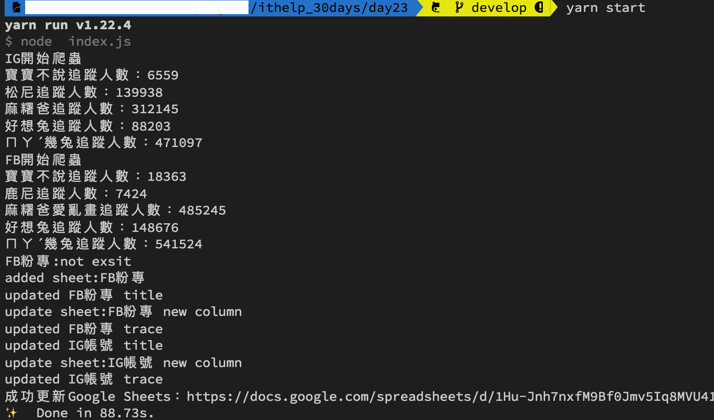
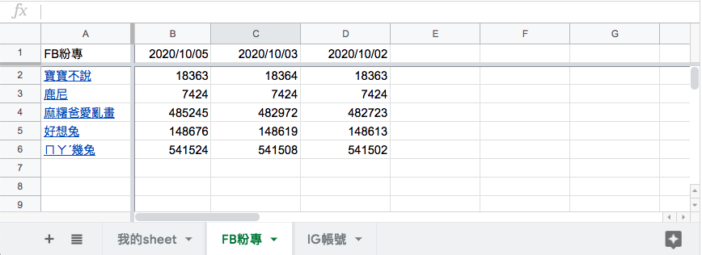

#### [回目錄](../README.md)
## Day23 Google Sheets-優化格式，滿足客戶需求 & 談使用者體驗

>你是做好一件作品，還是完成一項任務

🏆 今日目標
----
### 1. 了解使用者體驗為什麼重要
1.1 那些不堪回首的共同回憶
1.2 是什麼原因製造出這些體驗的
1.3 有在使用產品的人才會給你最真實的回饋，專案還有哪些地方要改善呢？

### 2. 優化`用手機來看Google Sheets的爬蟲資料`的體驗
2.1 如何優化`用手機來看Google Sheets的爬蟲資料`
2.2 窗口凍結：將最上方的爬蟲日期、左方的粉專名稱欄位凍結
2.3 欄位寬度調整：減少追蹤人數的欄位寬度

----

# 1. 了解使用者體驗為什麼重要
>讓客戶用的開心他們才會買單

### 1.1 那些不堪回首的共同回憶
我想每個人都有過類似經驗：
1. **操作系統時讓你感到焦慮**
    * 我Ｘ，到底這個系統要怎麼操作啊？為什麼按下去沒反應？到底哪裡弄錯了？
    * 卡在loading的畫面已經10分鐘，所以我要繼續等嗎？
2. **你想要用的功能會隱身術**
    * 我想要用XXX功能，到底他在哪裡才能操作？
    * 為什麼要改版啦？功能都不知道跑去哪了？
3. **每個按鈕都像定時炸彈**
    * 所以這個按鈕是什麼意思？是下一步還是送出？
    * 痾...下單了？這不是加入購物車嗎？
4. **懷疑設計者是不是嗑藥**
    * 簡訊的驗證碼有6碼，可是眼前能輸入的欄位只有4碼，是在哈嚕？
    * 線上填完表格後不能儲存只能下載列印後寄給主辦單位，如果要用郵件寄出幹嘛設計成網頁?


### 1.2 是什麼原因製造出這些體驗的
相信遇到這些經驗的時候大家心裡都會想：`這麼爛的東西到底是誰設計出來的啊？他自己真的有用過嗎？`

總結發生這些不好的經驗通常都是因為：
1. **沒有了解使用者真正的需求**：這是許多外包案的真實狀況，工程師的目標是驗收通過，而承包商也只是為了把事情做完有績效，當`甲乙方都不在乎終端使用者的需求時，完成的產品通常不堪入目`
2. **經驗不足**：很多時候有些報價比較低的案子會交給公司的新人，如果公司也沒有讓前輩在旁邊給予指導會讓這個`產品有非常多的漏洞`
3. **沒有足夠的測試**：有些案子時程非常的趕，在這樣的狀態下通常`產品的穩定度很低，且操作時也很容易發生錯誤`
4. **經費不足**：花大錢的案子不一定做得好，但是錢少的案子基本上都不太好，一分錢一分貨，`壓價格的時候一定會喪失品質`

### 1.3 有在使用產品的人才會給你最真實的回饋，專案還有哪些地方要改善呢？
沒有一開始就完美的專案，`客戶的需求會在使用的過程中慢慢增加`，這個專案也在業主使用的過程中增加了一些需求：
1. 下班後會`用手機來看Google Sheets的爬蟲資料`，操作起來不是很順，想問有沒有好的建議
2. 上班太忙會忘記跑爬蟲程式，能不能`指定爬蟲程式在某個時間點自動執行`
3. 因為執行爬蟲程式的時候我也要做事情，能不能`有個通知提醒我爬蟲執行的狀況`

今天會先講 **第一點** 的優化方案，讓我們一起將這個專案變得更好用吧！

----

# 2. 優化`用手機來看Google Sheets的爬蟲資料`的體驗
>原則上你想對Google Sheets的任何操作官方都有提供api給你，如果你時常會使用到的話請一定要讀懂官方文件，關於官方文件的閱讀可以複習[這篇文章](/day19/README.md)喔

### 2.1 如何優化`用手機來看Google Sheets的爬蟲資料`
這個問題分析起來很簡單，主要就是下面兩點：
1. 因為資料存在Google sheets上面，資料量一大就很難觀看
2. 手機螢幕小，能呈現的資料不多

後來再跟客戶討論的過程中發現`這個問題在使用電腦時也會有，但是使用手機時問題更嚴重`，於是我再看他Google Sheets的爬蟲資料時提出了優化方案，讓他在使用上方便許多：
1. **將最上方的爬蟲日期、左方的粉專名稱欄位凍結**
  * 這樣在瀏覽時就不需要一直往上確認日期、往左確認他是哪個粉專了
2. **減少追蹤人數的欄位寬度**
  * 我們無法改變手機的螢幕寬度，但是改變資料欄位的寬度能讓一個螢幕能呈現更多的資訊


### 2.2 窗口凍結：將最上方的爬蟲日期、左方的粉專名稱欄位凍結
我將這個功能合併到創建sheet的函式`addSheet`，窗口凍結這件事在`建立sheet時執行一次就夠了`
>詳細的官方文件請參考[窗口凍結](https://developers.google.com/sheets/api/reference/rest/v4/spreadsheets#gridproperties)
```js
async function addSheet (title, sheet_id, auth) {
  const sheets = google.sheets({ version: 'v4', auth });
  const request = {
    "spreadsheetId": process.env.SPREADSHEET_ID,
    "resource": {
      "requests": [{
        "addSheet": {
          "properties": {
            "title": title,
            "gridProperties": {
              "frozenRowCount": 1,//最上面那一列(爬蟲日期)設定為凍結
              "frozenColumnCount": 1//最左邊那一欄(粉專名稱)設定為凍結
            },
          }
        },
      }]
    }
  };
  try {
    await sheets.spreadsheets.batchUpdate(request)
    console.log('added sheet:' + title)
  }
  catch (err) {
    console.log('The API returned an error: ' + err);
  }
}
```

### 2.3 欄位寬度調整：減少追蹤人數的欄位寬度
為了能容納能多的資訊量，所以我們要在在插入新欄位`insertEmptyCol`時給他一個合適的欄位寬度
* 在下方範例程式中你可以發現 Google Sheets 的 `requests 內是可以執行多個要求的(insertDimension、updateDimensionProperties)`
>詳細的官方文件請參考[欄位寬度調整](https://developers.google.com/sheets/api/reference/rest/v4/spreadsheets/request#UpdateDimensionPropertiesRequest)  
```js
async function insertEmptyCol (title, sheet_id, auth) {
  const sheets = google.sheets({ version: 'v4', auth });
  const request = {
    "spreadsheetId": process.env.SPREADSHEET_ID,
    "resource": {
      "requests": [{
        "insertDimension": {
          "range": {
            "sheetId": sheet_id,
            "dimension": "COLUMNS",
            "startIndex": 1,
            "endIndex": 2
          },
          "inheritFromBefore": true
        }
      },
      {
        "updateDimensionProperties": {//這裡是為了修正欄寬
          "range": {
            "sheetId": sheet_id,
            "dimension": "COLUMNS",
            "startIndex": 1,//只需要首欄
            "endIndex": 2
          },
          "properties": {
            "pixelSize": 85//欄位寬度
          },
          "fields": "pixelSize"
        }
      }]
    }
  };
  try {
    await sheets.spreadsheets.batchUpdate(request)
    console.log('update sheet:' + title + ' new column')
  }
  catch (err) {
    console.log('The API returned an error: ' + err);
  }
}
```

----

執行程式
----
1. 在執行程式之前請先把Google Sheets的'FB粉專'、'IG帳號'這兩個sheet刪除，因為`addSheet函式要觸發才會有窗口凍結`的功能  
2. 刪除sheet後 在專案資料夾的終端機(Terminal)執行指令
```vim
yarn start
```
3. 看看線上的Google Sheets是否有符合今天設定的格式：窗口凍結、欄位寬度調整
  
  

----

⏭️ 下個階段
------------------------
Google Sheets系列文章到這裡告一個段落，接下來我們依照今天提到專案要改善的地方繼續前進，接著來聊聊`把排程加入爬蟲專案`這個主題吧

----

ℹ️ 專案原始碼
----
* 今天的完整程式碼可以在[這裡](https://github.com/dean9703111/ithelp_30days/tree/master/day23)找到喔
* 我也貼心地把昨天的把昨天的程式碼打包成[壓縮檔](https://github.com/dean9703111/ithelp_30days/raw/master/sampleCode/day22_sample_code.zip)，你可以用裡面乾淨的環境來完成業主要求的需求變更吧
    * 請記得在終端機下指令 **yarn** 才會把之前的套件安裝
    * 要在tools/google_sheets資料夾放上自己的憑證
    * 調整fanspages資料夾內目標爬蟲的粉專網址
    * 調整.env檔
        * 填上FB登入資訊
        * 填上FB版本(classic/new)
        * 填上IG登入資訊
        * 填上SPREADSHEET_ID

📖 參考資源
----
1. [了解使用者體驗 (UX) 的第一堂課](https://designtongue.me/%E4%BA%86%E8%A7%A3%E4%BD%BF%E7%94%A8%E8%80%85%E9%AB%94%E9%A9%97-ux-%E7%9A%84%E7%AC%AC%E4%B8%80%E5%A0%82%E8%AA%B2/)
### [Day24 排程-Cron套件超詳解，讓爬蟲自己動起來](/day24/README.md)