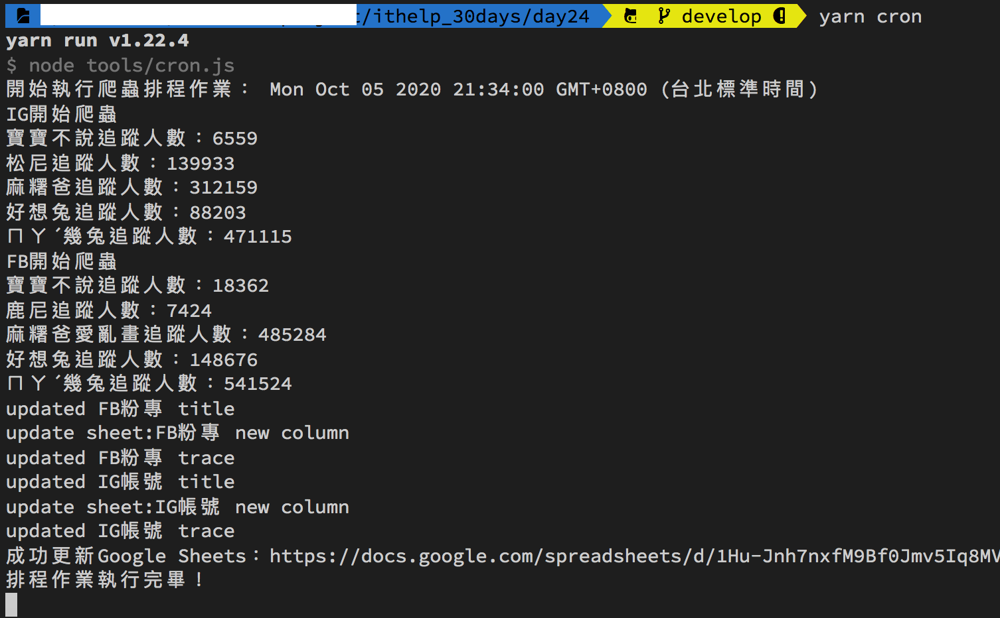
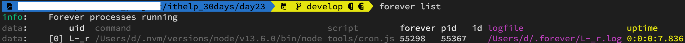

#### [回目錄](../README.md)
## Day24 windows & mac 手把手教你排程設定


執行程式
----
在專案資料夾的終端機(Terminal)執行指令 **yarn forever** 指令啟動程式  
  
然後再執行指令 **forever list** 確認程式正在背景運行  
  


專案原始碼
----
完整的程式碼在[這裡](https://github.com/dean9703111/ithelp_30days/day24)喔
你可以整個專案clone下來  
```
git clone https://github.com/dean9703111/ithelp_30days.git
```
如果你已經clone過了，那你每天pull就能取得更新的資料嚕  
```
git pull origin master
cd day24
yarn
yarn add global forever
調整你.env檔填上 FB & IG 登入資訊、SPREADSHEET_ID、爬蟲執行時間
在credentials資料夾放上自己的憑證
yarn forever
```
### [Day25 LINE權杖取得，用POSTMAN測試](/day25/README.md)