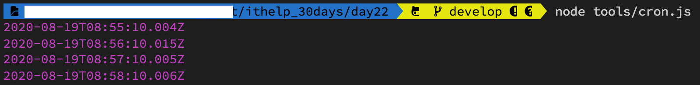
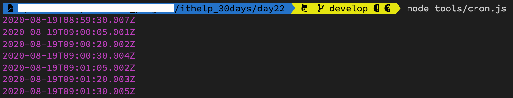

#### [回目錄](../README.md)
## Day24 排程-Cron套件超詳解，讓爬蟲自己動起來

>電腦能夠記住的任務就讓電腦來做吧，把腦容量留給更重要的任務

🤔 為什麼要學習排程？
----
在客戶要求這個功能之前其實我就把他的雛型完成了，`因為我是一個懶人，同時也不是一個記性很好的人`，如果每天都要在某個時間打開專案執行 **yarn start** 然後等數據跑完，這對我來說實在是一件很容易忘記且沒有效率的事情，我認為`電腦可以做到事情那就交給電腦去做`，所以`接下來幾天就來跟大家分享我是如何~~偷懶~~使用排程的`

----

🏆 今日目標
----
### 1. 排程套件 - Cron
1.1 測試官方程式
1.2 api架構
1.3 cronTime語法
1.4 範例

### 2. 把排程加入爬蟲
2.1 將主程式的函式`crawler`設定成外部函式，供排程呼叫
2.2 建立專門管控排程的程式：`cron.js`
2.3 調整`package.json`，建立專門跑排程的scripts

----

# 1. 排程套件 - Cron
----
這裡我們需要安裝一個套件 **cron** ，他可以在你指定的時間執行你希望他幫你做的事情，這是他的[官方文檔](https://www.npmjs.com/package/cron)，下面我會詳細介紹他的功能(因為我自己也很常使用XD)  
```
yarn add cron
```
### 1.1 測試官方程式
1. 先在tools的資料夾裡面新增一個cron.js的檔案
2. 複製下方的官方範例
    ```js
    var CronJob = require('cron').CronJob;
    var job = new CronJob('* * * * * *', function() {
        console.log('You will see this message every second');
    }, null, true, 'America/Los_Angeles');
    job.start();
    ```
3. 在專案資料夾執行 **node tools/cron.js**
    * 如果終端機(Terminal)每秒鐘都印出 **You will see this message every second** 就代表套件運行成功

### 1.2 api架構
```js
constructor(cronTime, onTick, onComplete, start, timezone, context, runOnInit, unrefTimeout)
```
* cronTime [必填] 設定定時任務時間
* onTick [必填] 定時任務要執行的函式
* onComplete [選填] 完成定時任務後要執行的函式
* Start [選填] 是否自動啟動job，默認為false
* timeZone [選填] - 指定執行的時區，莫認為當前時區，關於時區代碼可參考[網站](https://www.zeitverschiebung.net/en/)

### 1.3 cronTime語法
* 總共分為六個區塊：秒 分鐘 小時 天 月份 星期幾
    ```
    秒：0-59
    分鐘：0-59
    小時：0-23
    天：1-31
    月份：0-11（1~12月，特別注意月份是從0開始）
    星期幾：0-6（星期日~星期六，Sun~Sat）
    ```
* 語法範例
    * *全部
        * 每秒都執行(官方範例)
            ```
            * * * * * *
            ```
        * 每分鐘的第10秒執行
            ```
            10 * * * * *
            ```
        * 每天晚上10點30分10秒時執行
            ```
            10 30 22 * * *
            ```
    * -時間區間
        * 每天早上9點到12點的整點執行
            ```
            0 0 9-12 * * *
            ```
    * ,分隔符號，可以輸入多個數值
        * 每分鐘的第5,20,30秒執行
            ```
            5,20,30 * * * * *
            ```
    *  /間隔多少時間執行
        * 每3分鐘執行一次
            ```
            * */3 * * * *
            ```
### 1.4 範例
* 每分鐘的第10秒執行
    ```js
    var CronJob = require('cron').CronJob;
    new CronJob('10 * * * * *', function () {
        const datetime = new Date();
        console.log(datetime);
    }, null, true);
    ```        
    
* 每分鐘的第5,20,30秒執行
    ```js
    var CronJob = require('cron').CronJob;
    new CronJob('5,20,30 * * * * *', function () {
        const datetime = new Date();
        console.log(datetime);
    }, null, true);
    ```
    

----

# 2. 把排程加入爬蟲
我們要調整三個檔案來符合爬蟲的需求
### 2.1 將主程式的函式`crawler`設定成外部函式，供排程呼叫
* 因避免被引用時自動觸發`crawler`函式，故將下方觸發用的crawler()移除
#### index.js
```js
require('dotenv').config(); 
const { initDrive } = require("./tools/initDrive.js");
const { crawlerFB } = require("./tools/crawlerFB.js");
const { crawlerIG } = require("./tools/crawlerIG.js");
const { updateGoogleSheets } = require("./tools/google_sheets");
exports.crawler = crawler; //讓其他程式在引入時可以使用這個函式

async function crawler () {
    const driver = await initDrive();
    if (!driver) {
        return
    }
    const ig_result_array = await crawlerIG(driver)
    const fb_result_array = await crawlerFB(driver)
    driver.quit();
    await updateGoogleSheets(ig_result_array, fb_result_array)
}
```

### 2.2 建立專門管控排程的程式：`cron.js`
* 我將CronJob的參數都帶出來，這樣在`日後維護時比較了解每個參數的意義`
* 請編輯.env檔填上自己的爬蟲時段(CRONJOB_TIME)
#### cron.js
```js
const CronJob = require('cron').CronJob;
const { crawler } = require("../index.js");
new CronJob({
    cronTime: process.env.CRONJOB_TIME,//請編輯.env檔填上自己的爬蟲時段喔
    onTick: async function () {
        console.log(`開始執行爬蟲排程作業： ${new Date()}`);
        await crawler()
        console.log('排程作業執行完畢！');
    },
    start: true,
    timeZone: 'Asia/Taipei'
});
```

### 2.3 調整`package.json`，建立專門跑排程的scripts
針對 node 如何執行 js 指定 function 的指令寫法可以參考這篇[文章](https://stackoverflow.com/questions/30782693/run-function-in-script-from-command-line-node-js)
* start : mac執行單次爬蟲時使用的
* win_start : windows執行單次爬蟲時使用的(需要將單引號與雙引號反過來，因為windows只會將單引號內的資訊印除來而不會去執行)
* cron : mac、linux排程執行爬蟲時使用的
```js
{
    "name": "crawler",
    "version": "0.0.1",
    "description": "FB & IG 爬蟲30天鐵人文章",
    "author": "dean lin",
    "dependencies": {
        "cron": "^1.8.2",
        "dateformat": "^3.0.3",
        "dotenv": "^8.2.0",
        "googleapis": "59",
        "selenium-webdriver": "^4.0.0-alpha.7"
    },
    "devDependencies": {},
    "scripts": {
        "start": "node  -e 'require(\"./index\").crawler()'",
        "win_start": "node  -e \"require('./index').crawler()\"",
        "cron":"node tools/cron.js"
    },
    "main": "index.js",
    "license": "MIT"
}
```

----

🚀 執行程式
----
1. 建議將 .env 檔中 CRONJOB_TIME 的時間調整成 3 分鐘後的時間比較好測試
2. 在專案資料夾的終端機(Terminal)執行指令
    ```vim
    yarn start
    ```
3. 確認爬蟲程式是否依照你設定的時間開始執行
    
4. 因為`排程的程式會一直執行，所以你不會看到以往 Done in xxs 的訊息`，如果想要中斷終端機(Terminal)執行的程式，可以用下面按鍵組合:
    * Windows: Ctrl + c
    * Mac: control + c  


ℹ️ 專案原始碼
----
* 今天的完整程式碼可以在[這裡](https://github.com/dean9703111/ithelp_30days/tree/master/day24)找到喔
* 我也貼心地把昨天的把昨天的程式碼打包成[壓縮檔](https://github.com/dean9703111/ithelp_30days/raw/master/sampleCode/day23_sample_code.zip)，你可以用裡面乾淨的環境來試著加入排程吧
    * 請記得在終端機下指令 **yarn** 才會把之前的套件安裝
    * windows需下載與你chrome版本相同的[chrome driver](http://chromedriver.storage.googleapis.com/index.html)放在專案根目錄
    * 在tools/google_sheets資料夾放上自己的憑證，申請流程請參考[Day17](/day17/README.md)
    * 調整fanspages資料夾內目標爬蟲的粉專網址
    * 調整.env檔
        * 填上FB登入資訊
        * 填上FB版本(classic/new)
        * 填上IG登入資訊
        * 填上SPREADSHEET_ID
        * 填上爬蟲執行時間(CRONJOB_TIME)

📖 參考資源
----
1. [Run function in script from command line (Node JS)](https://stackoverflow.com/questions/30782693/run-function-in-script-from-command-line-node-js)
### [Day25 排程-用forever套件來控管排程，背景執行才是王道！](/day25/README.md)