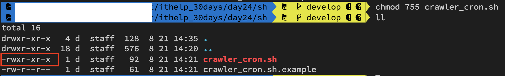
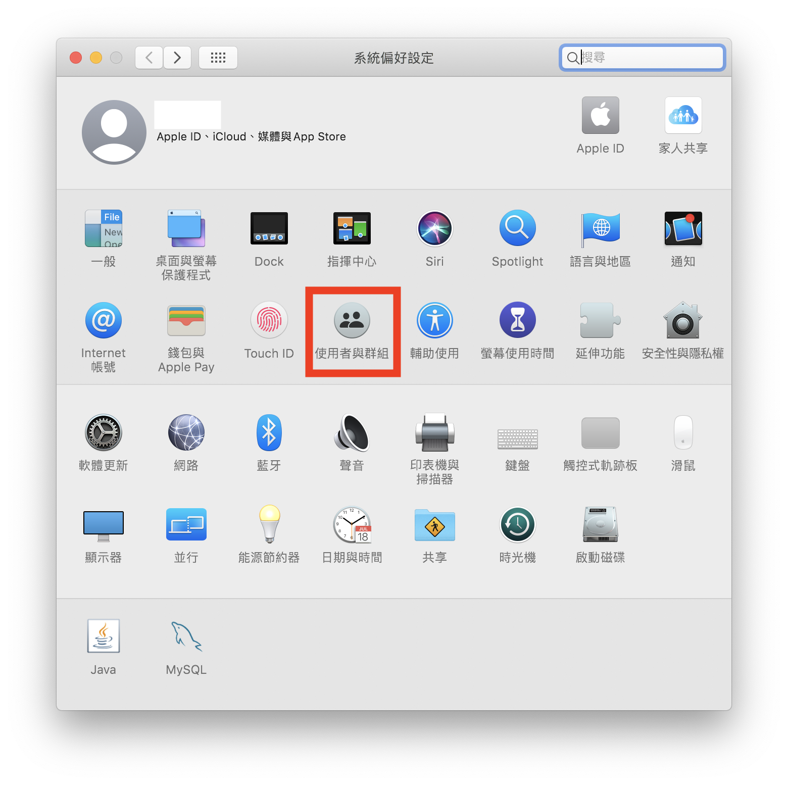

#### [回目錄](../README.md)
## Day24 windows & mac 手把手教你排程設定

昨天的教學讓你的排程穩定的在背景執行，但是你重開機在終端機(Terminal)輸入 **forever list** 的指令你會發現程式不見了QQ  
所以我們要設計一個電腦一開機就觸發的事件讓你的排程穩定運行，這塊因為windows跟mac的設定上差異很大，所以我會分開說明  

mac
----
排程設定步驟如下：
1. 我這裡會設計一個讓電腦執行排程的.sh執行檔
    * 專案目錄下建立 **sh** 資料夾，並新增一個 **crawler_cron.sh** 
        * .sh檔案寫法很簡單，平常你怎麼在終端機下指令就怎麼寫
        * 記得將your_path改為自己真正專案放置的位置
        #### crawler_cron.sh
        ```sh
        # 啟動排程服務
        cd /your_path/FB_IG_crawler
        yarn forever
        ```
2. 一開始建立的檔案只有讀寫功能，我們要將此.sh檔案設定為可以被執行
    1. 我們先觀察crawler_cron.sh的權限
        ```sh
        # 進入資料夾
        cd sh
        # 列出資料夾地下檔案權限
        ll
        ```
        
    2. 目前crawler_cron.sh的權限是 -rw-r--r-- 
        * 權限要把他切分成3段來看：owner/group/others，所以代表檔案的owner有讀(r)寫(w)的權限，而group/others只有讀(r)的權限
        * 而我們要讓這個檔案可以被執行(x)需要下指令更改權限  
            ```sh
            chmod 755 crawler_cron.sh
            ```
            
        想要深入了解chmod檔案權限概念的請參考[這篇文章](https://shian420.pixnet.net/blog/post/344938711-%5Blinux%5D-chmod-%E6%AA%94%E6%A1%88%E6%AC%8A%E9%99%90%E5%A4%A7%E7%B5%B1%E6%95%B4!)
4. 在使用者登入後執行crawler_cron.sh
    * 先打開資料夾並設定好該.sh的屬性
        
    * 將打開檔案的應用程式設定成iTerm，漏掉這個步驟可能使mac重開機時沒有觸發，因為他並不是用iTerm方式打開.sh檔
        
    * 最後增加使用者在登入後會自動執行.sh的指令
        
        
        
        

### windows
排程設定步驟如下 :
1. 進入排程設定頁面
    * 在鍵盤同時按下 : WIN + R
    * 輸入 : taskschd.msc
2. 設定觸發條件 : 
    * 建立工作
    
    * 選擇以最高權限執行，同時設定一開機立刻執行
    
    * 在這裡設定為每次開機都會觸發工作
    
    * 動作的部分有幾個需要注意
        * 程式或指令碼 : 你要找到當初安裝yarn的路徑，及yarn.cmd的檔案
        * 新增引數 : 填上 **forever** ，因為我們是用 yarn forever啟動程式的
        * 開始位置 : 你專案在哪裡就把路徑複製上去即可
    
3. 請注意因為使用的是最高權限執行forever程式，所以你在cmd裡面用 **forever list** 是看不到的，必須要用**系統管理員身分執行** **cmd** 再輸入指令 **forever list** 才能看的到這個排程
4. windows請打開歷程紀錄否則不會執行該排程，詳細操作流程請參考[文章](https://cjy998.pixnet.net/blog/post/63190869-%E5%B7%A5%E4%BD%9C%E6%8E%92%E7%A8%8B%E5%99%A8-%E5%95%9F%E7%94%A8%E6%AD%B7%E7%A8%8B%E8%A8%98%E9%8C%84-%E5%8E%9F%E9%A1%AF%E7%A4%BA%28%E5%B7%B2%E5%81%9C%E7%94%A8%29--win)  

執行程式
----
### mac
請你電腦重新開機在終端機(Trerminal)輸入 **forever list** 的指令確認是否正常運行


### windows
請你電腦重新開機後以系統管理權限打開cmd並輸入 **forever list** 的指令確認是否正常運行


專案原始碼
----
完整的程式碼在[這裡](https://github.com/dean9703111/ithelp_30days/day24)喔
你可以整個專案clone下來  
```
git clone https://github.com/dean9703111/ithelp_30days.git
```
如果你已經clone過了，那你每天pull就能取得更新的資料嚕  
```
git pull origin master
cd day24
yarn
yarn add global forever
調整你.env檔填上 FB & IG 登入資訊、SPREADSHEET_ID、爬蟲執行時間
在credentials資料夾放上自己的憑證
yarn forever
```
### [Day25 LINE權杖取得，用POSTMAN測試](/day25/README.md)