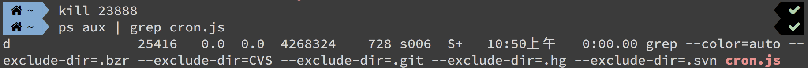
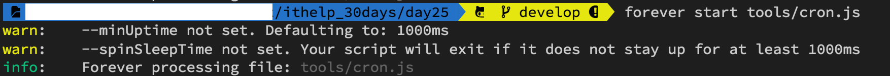
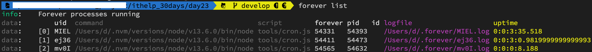
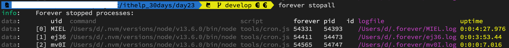
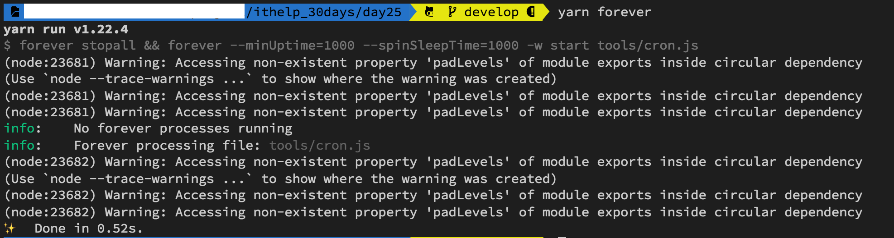
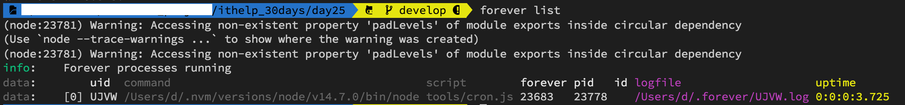

#### [回目錄](../README.md)
## Day25 排程-用forever套件來控管排程，背景執行才是王道！

>如果一個套件無法解決問題，那就用兩個吧！

🤔 思考一下昨天的排程有什麼缺點
----
**昨天完成的排程其實有幾個缺點：**
1. 在終端機(Terminal)執行排程後你`必須保持開啟`的狀態你才知道他有沒有正確執行
2. 如果不小心把執行中的終端機(Terminal)關掉你會很困擾，因為你關掉的是終端機不是排程，需要用`麻煩的辦法才能砍掉這個排程`
3. 管理困難，`啟動、停止、重啟你都要在專案資料夾`下處理
4. 如果運行過程中程式`意外關閉需要手動重開`
5. 在排程`運行中你修改爬蟲json裡面的粉絲專頁列表是無效的`，你會發現觸發爬蟲時他跑的是舊版的粉絲列表

----

🏆 今日目標
----
1. 砍掉執行中的排程
2. 使用套件 `forever` 來管理排程
3. 在 package.json 中加入驅動 forever 的 scripts

----

# 1. 砍掉執行中的排程
我想很多人跟我一樣不小心順手把終端機(Terminal)給關了 (或是很乾脆地把VScode關了)，但是`視窗關閉後排程其實在背景還是在持續運行的`，下面提供一個快速的解決方案：
```vim
ps aux | grep [搜尋關鍵字]
kill [程式的PID]
```

##### ps (process status) 顯示進程狀態的指令
* 參數說明
    * a : 列出所有使用者與terminal無關的所有process
    * u : 以使用者名稱顯示的格式
    * x : 列出與terminal有關的所有process(通常與a搭配使用)
* 顯示欄位 : USER PID %CPU %MEM VSZ RSS TTY STAT START TIME COMMAND  

##### kill - 刪除執行中的 process
我們需要找到執行程式的 process PID 才能將其刪除，`PID 就在第二個欄位`，複製起來執行下面指令就能刪除嚕
```vim
kill [程式的PID]
```

### 實際操作範例
1. 先找出正在進行的排程
    ```vim
    ps aux | grep cron.js
    ```    
    
2. 你可以看到執行排程的 PID 是 49915，把他複製起來用 kill 指令刪除
    ```vim
    kill 49915
    ```
    刪除完後再次確認是否刪除成功
    ```vim
    ps aux | grep cron.js
    ```
    

----

# 2. 使用套件 `forever` 來管理排程
因為單純使用 cron套件 會讓你遇到開頭所說的各種問題，所以遇到過這個問題的高手們也寫了一個`在 Node.js 中專門管理排程的的套件：forever`，這個套件操作極其簡單，不僅能讓排程在背景穩定執行，還能在終端機的任何位置做管理
* 首先要請你`全域安裝`這個套件，這樣才能在任何一個位置執行它  
    ```vim
    yarn add global forever
    ```
* 基礎指令(以本專案cron.js為範例)
    * **啟動程式**
        ```vim
        forever --minUptime=1000 --spinSleepTime=1000 start tools/cron.js
        ```
        > 如果你沒加上 `--minUptime=1000 --spinSleepTime=1000` 的參數 會有警告如下圖
            
    * **監聽檔案更動並自動重啟**
        ```vim
        forever --minUptime=1000 --spinSleepTime=1000 -w start tools/cron.js
        ```
        * 這個指令可以`監控檔案的變更`，解決過去爬蟲json資料變更但是執行時跑舊資料的問題
        * 專案資料夾底下`新增 .foreverignore 的檔案`，不需要去偵測這些檔案/資料夾的變更  
            #### .foreverignore
            ```
            node_modules
            .env
            chromedriver.exe
            debug.log
            ```
    * **顯示所有運行的狀態**
        ```
        forever list
        ```
        
        * 可以在 `logfile` 裡面看到排程執行的狀況
    * **關閉所有排程**
        ```
        forever stopall
        ```
          
    * **重新啟動程式**
        * 請注意如果你 `修改了 .env 裡面的資料，則必須要重啟才會生效`
        ```
        forever restart tools/cron.js
        ```
* 執行 forever 時會遇到警告的原因
    如果你的 Node.js 版本升級到 v14 之後會發現這個套件執行的時候會有警告如下：
    ```
    (node:30512) Warning: Accessing non-existent property 'padLevels' of module exports inside circular dependency
    ```
    * 這個警告是因為 forever 有相依套件在 node v14 之後不再支援，`但這些警告不影響套件運行`
    * Node.js 的版本更新的非常快速，許多套件都可能在更新後不支援，`所以更新版本後請切記要運行一次確保正常`
    
    >筆者寫這份專案的時候 node 版本才 12.6，沒幾個月就出到 14 版，也許未來某一天有人看到這篇文章的時候 node 版本就破 20 了
----

# 3. 在 package.json 中加入驅動 forever 的 scripts
將昨天 cron 的 scripts 改為使用 forever 的版本
* 為了避免重複啟動，所以我採取先暫停所有運行的forever程式，然後再啟動程式
```json
"forever":"forever stopall && forever --minUptime=1000 --spinSleepTime=1000 -w start tools/cron.js"
```

----

🚀 執行程式
----
1. 在專案資料夾的終端機(Terminal)執行指令啟動排程
    ```vim
    yarn forever
    ```
      
2. 然後再執行指令 **forever list** 確認排程正在背景運行  
      

----

ℹ️ 專案原始碼
----
* 今天的完整程式碼可以在[這裡](https://github.com/dean9703111/ithelp_30days/tree/master/day25)找到喔
* 我也貼心地把昨天的把昨天的程式碼打包成[壓縮檔](https://github.com/dean9703111/ithelp_30days/raw/master/sampleCode/day24_sample_code.zip)，你可已在乾淨的環境嘗試用forever來控管排程吧
    * 請記得在終端機下指令 **yarn** 才會把之前的套件安裝
    * 要在tools/google_sheets資料夾放上自己的憑證
    * 調整fanspages資料夾內目標爬蟲的粉專網址
    * 調整.env檔
        * 填上FB登入資訊
        * 填上FB版本(classic/new)
        * 填上IG登入資訊
        * 填上SPREADSHEET_ID
        * 填上爬蟲執行時間(CRONJOB_TIME)
    * 在終端機下指令 **yarn add global forever** ，讓你在終端機的任何位置都能管控排程

📖 參考資源
----
1. [如果ctrl + c沒法終止怎麼辦?](https://medium.com/mess-up/%E5%A6%82%E6%9E%9Cctrl-c%E6%B2%92%E6%B3%95%E7%B5%82%E6%AD%A2%E6%80%8E%E9%BA%BC%E8%BE%A6-5e720fd66e32)
2. [Linux 程序管理 ( ps -l / ps aux / ps axjf )](http://puremonkey2010.blogspot.com/2011/02/linux-linux-ps-l-ps-aux-ps-axjf.html)
3. [[Node.js打造API] 使用forever運行API永遠不停止](https://andy6804tw.github.io/2018/01/17/api-forever/)

### [Day26 排程-重開機後排程不見惹？簡單幾個步驟，從此以後完全自動](/day26/README.md)