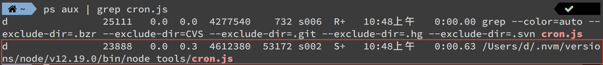
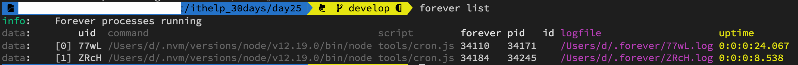
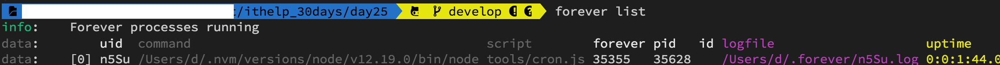

#### [回目錄](../README.md)
## Day25 排程永久背景執行?json改了沒反應?

昨天完成的排程其實有幾個缺點：
1. 需要把終端機(Terminal)打開觀察是否有執行
2. 如果不小心把執行中的終端機(Terminal)關掉你會很困擾，需要用比較麻煩的辦法才能砍掉這個排程    
3. 管理上比較困難(啟動、停止、重啟)
4. 如果運行過程中程式崩潰你需要手動再打開
5. 如果排程運行中你修改json裡面的粉絲專頁列表，你會發現觸發爬蟲時他跑的是舊版的粉絲列表

如何砍掉執行中的排程
------------------------
先討論已經發生的問題如何解決，我想很多人跟我一樣不小心順手把終端機(Terminal)給關了，但是視窗關閉後他其實在背景還是在持續運行的，下面提供一個快速的解決方案  
```
ps aux | grep [搜尋關鍵字]
kill [程式的PID]
```
##### ps (process status) 顯示進程狀態的指令
* 參數說明
    * a : 列出所有使用者與terminal無關的所有process
    * u : 以使用者名稱顯示的格式
    * x : 列出與terminal有關的所有process(通常與a搭配使用)
* 顯示欄位 : USER PID %CPU %MEM VSZ RSS TTY STAT START TIME COMMAND  
如果你有興趣身如研究ps指令可把[文章1](https://medium.com/mess-up/%E5%A6%82%E6%9E%9Cctrl-c%E6%B2%92%E6%B3%95%E7%B5%82%E6%AD%A2%E6%80%8E%E9%BA%BC%E8%BE%A6-5e720fd66e32)、[文章2](http://puremonkey2010.blogspot.com/2011/02/linux-linux-ps-l-ps-aux-ps-axjf.html)交叉的看喔

##### kill - 刪除執行中的process
我們需要找到執行程式的process PID才能將其刪除，PID就在USER後面，複製起來執行下面指令就能刪除嚕
```
kill [程式的PID]
```
### 實際操作範例
1. 先找出正在進行的排程
    ```
    ps aux | grep cron.js
    ```    
    
2. 你可以看到執行排程的PID是49915，把他複製起來用kill指令刪除
    ```
    kill 49915
    ```
    確認是否刪除成功
    ```
    ps aux | grep cron.js
    ```
    

forever : 神套件讓排程穩定背景執行且方便管理
----
因為單純使用cron會讓你遇到開頭所說的各種問題，所以在這裡跟大家介紹一個讓Node.js程式穩定運行的套件，靠他就能解決開頭的問題
* 首先要請你全域安裝這個套件，這樣你可以在任何一個位置執行它  
    ```
    yarn add global forever
    ```
* 基礎指令(以本專案cron.js為範例)
    * 啟動程式
        ```
        forever --minUptime=1000 --spinSleepTime=1000 start tools/cron.js
        ```
        * 如果你沒加上--minUptime=1000 --spinSleepTime=1000參數會有警告如圖片
            
    * 監聽檔案更動自動重啟
        ```
        forever --minUptime=1000 --spinSleepTime=1000 -w start tools/cron.js
        ```
        * 這個指令可以監控檔案的變更，解決過去json資料變更但是爬蟲時跑舊資料的問題
        * 專案資料夾底下需要新增.foreverignore的檔案，不需要去偵測這些檔案的變更   
    * 顯示所有forever程式運行狀態
        ```
        forever list
        ```
        
        * 你可以在logfile裡面看到排程執行的狀況
    * 關閉所有程式
        ```
        forever stopall
        ```
          
    * 重新啟動程式
        * 請注意如果你**修改了 .env 裡面的資料，則必須要重啟才會生效**
        ```
        forever restart tools/cron.js
        ```
如果你想要深入研究這個套件可參考[這篇文章](https://andy6804tw.github.io/2018/01/17/api-forever/)

改寫專案package.json的scripts
----------------------------------------------------------------
將昨天cron的scripts改為使用forever的版本
* 為了避免重複啟動，所以我採取先暫停所有運行的forever程式，然後再啟動程式
```json
"forever":"forever stopall && forever --minUptime=1000 --spinSleepTime=1000 -w start tools/cron.js"
```

執行程式
----
在專案資料夾的終端機(Terminal)執行指令 **yarn forever** 指令啟動程式  
  
然後再執行指令 **forever list** 確認程式正在背景運行  
  


專案原始碼
----
完整的程式碼在[這裡](https://github.com/dean9703111/ithelp_30days/tree/master/day24)喔
你可以整個專案clone下來  
```
git clone https://github.com/dean9703111/ithelp_30days/tree/master.git
```
如果你已經clone過了，那你每天pull就能取得更新的資料嚕  
```
git pull origin master
cd day24
yarn
yarn add global forever
調整你.env檔填上 FB & IG 登入資訊、SPREADSHEET_ID、爬蟲執行時間
在credentials資料夾放上自己的憑證
yarn forever
```
### [Day26 windows & mac 手把手排程設定](/day26/README.md)