#### [回目錄](../README.md)
## Day26 排程-重開機後排程不見惹？簡單幾個步驟，從此以後完全自動

>解決問題的方法 ≠ 最好的方法

🤔 為什麼寫這篇文章
----
昨天的教學讓你的排程穩定的在背景執行，但是你重開機在終端機(Terminal)輸入 **forever list** 的指令你會發現 `forever根本沒有forever`   

為了決這個問題，今天會教你如何在`電腦重啟時觸發 forever 程式`的方法，這塊我會分成 windows 跟 mac 來說明，請大家安心服用

----

🏆 今日目標
----
### 1. 設定 mac 排程
1.1 撰寫執行排程的 shell script ：`crawler_cron.sh`
1.2 將 crawler_cron.sh 設定為可以被執行
1.3 設定 crawler_cron.sh 在使用者登入後自動執行
1.4 重新登入確認 crawler_cron.sh 是否執行

### 2. 設定 windows 排程
2.1 進入排程設定頁面
2.2 設定觸發條件
2.3 打開 windows 歷程紀錄
2.4 重開機確認 crawler_cron.sh 是否執行

----

# 1. 設定 mac 排程
### 1.1 撰寫執行排程的 shell script ：`crawler_cron.sh`
1. 在專案目錄下建立存放 shell script 的 `sh 資料夾`，並`新增 crawler_cron.sh`
    * shell script 寫法很簡單，平常你怎麼在終端機下指令就怎麼寫
    * 專案資料夾路徑可用 `pwd` 指令取得
        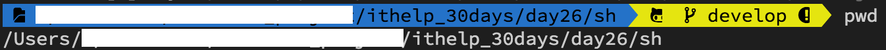
    #### crawler_cron.sh
    ```vim
    # 進入專案資料夾
    cd /專案資料夾路徑

    # 啟動排程服務
    yarn forever
    ```    
2. 執行 crawler_cron.sh 確認正常運作
    ```vim
    sh crawler_cron.sh 
    ```
    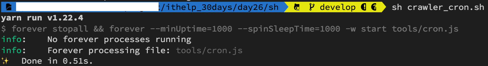
### 1.2 將 crawler_cron.sh 設定為可以被執行
建立的檔案`一開始只有讀寫功能`，我們要將此 .sh 檔案設定為`可以被執行`
1. 我們先觀察 **crawler_cron.sh** 的權限
    ```vim
    # 進入資料夾
    cd sh
    # 列出資料夾地下檔案權限
    ll
    ```
    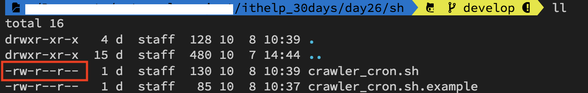
2. 目前 crawler_cron.sh 的權限是 `-rw-r--r-- `
    * 權限要把他切分成 3 段來看：owner/group/others，所以代表檔案的owner有讀(r)寫(w)的權限，而group/others只有讀(r)的權限
    * 而我們要讓這個檔案可以被執行(x)需要下指令更改權限  
        ```vim
        chmod 755 crawler_cron.sh
        ```
        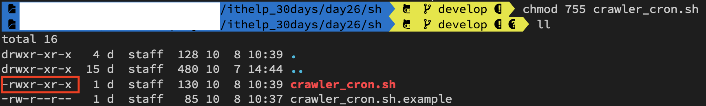
    > 想要深入了解 chmod 檔案權限概念的請參考[這篇文章](https://shian420.pixnet.net/blog/post/344938711-%5Blinux%5D-chmod-%E6%AA%94%E6%A1%88%E6%AC%8A%E9%99%90%E5%A4%A7%E7%B5%B1%E6%95%B4!)

### 1.3 設定 crawler_cron.sh 在使用者登入後自動執行
1. 我們要先確認 crawler_cron.sh 的檔案資訊
    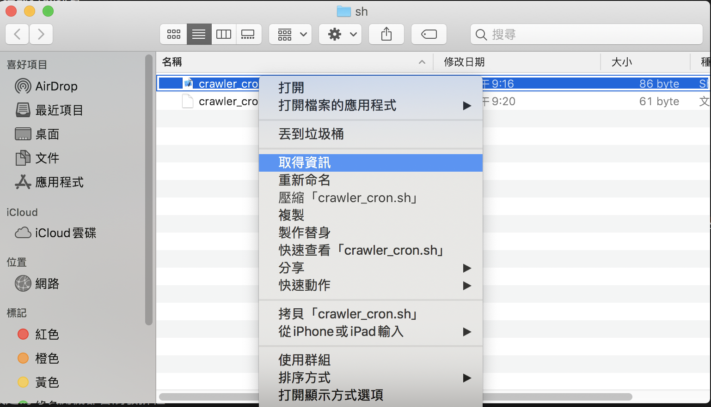
2. 將打開檔案的應用程式設定成 iTerm，`漏掉這個步驟會使 mac 觸發失敗，因為他並不是用 iTerm 方式執行 crawler_cron.sh 檔`
    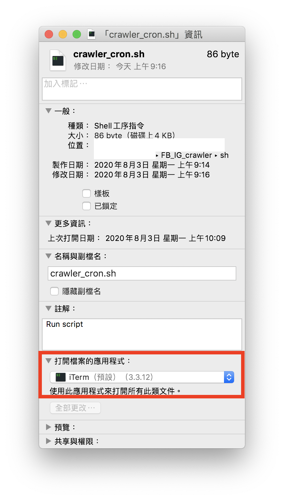
3. 設定 crawler_cron.sh 在使用者登入後自動執行 
    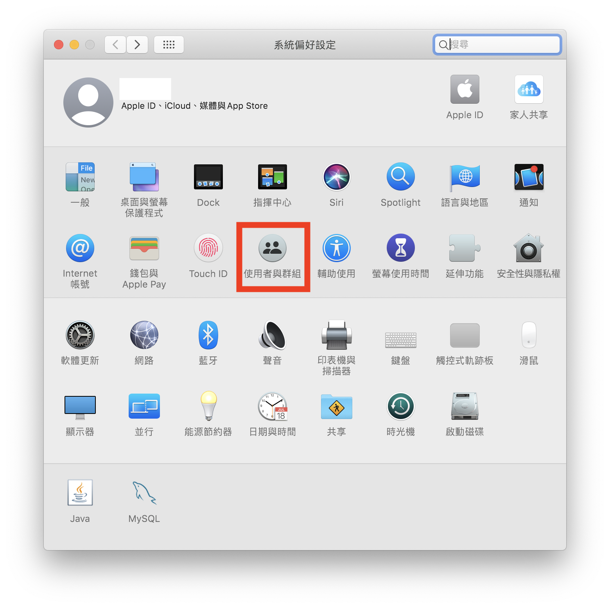
    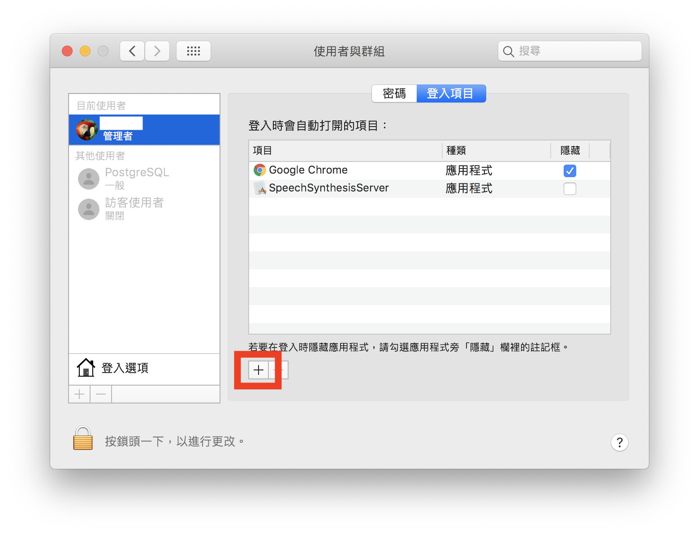
    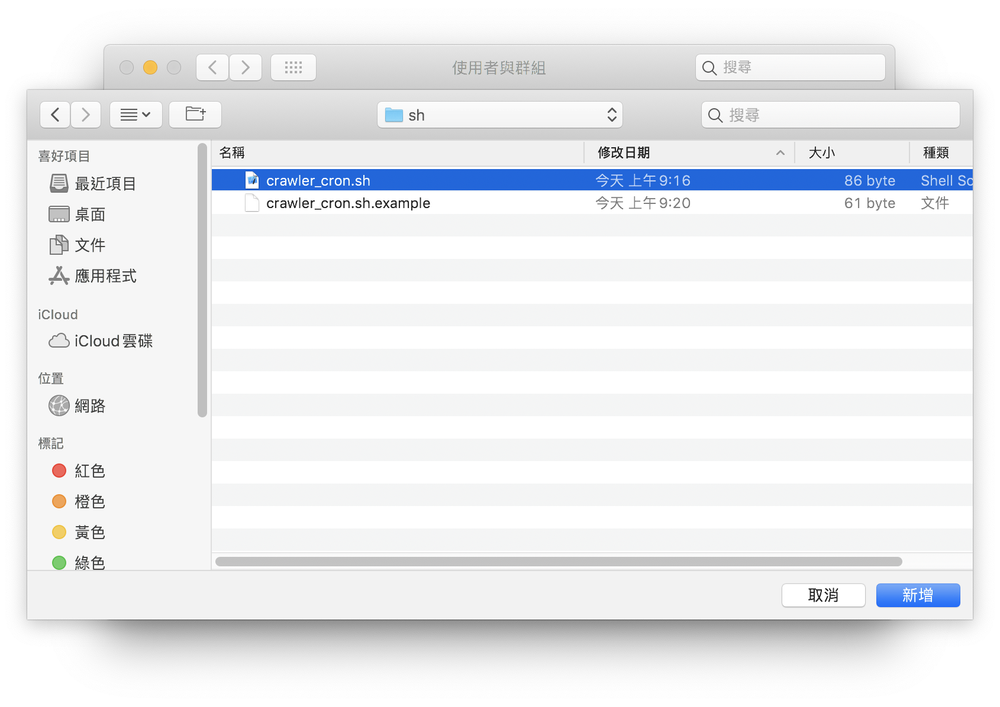
    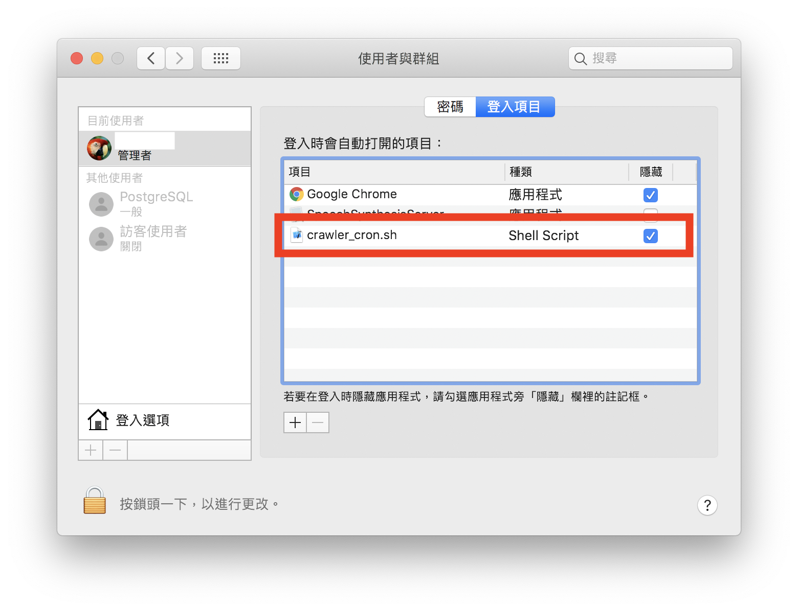

### 1.4 重新登入確認 crawler_cron.sh 是否執行
請你重新登入後在終端機(Trerminal)輸入 **forever list** 的指令確認是否正常運行
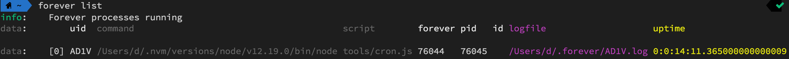

----

# 2. 設定 windows 排程
### 2.1 進入排程設定頁面
* 在鍵盤同時按下 : WIN + R
* 輸入 : taskschd.msc
    

### 2.2 設定觸發條件
* 建立工作
    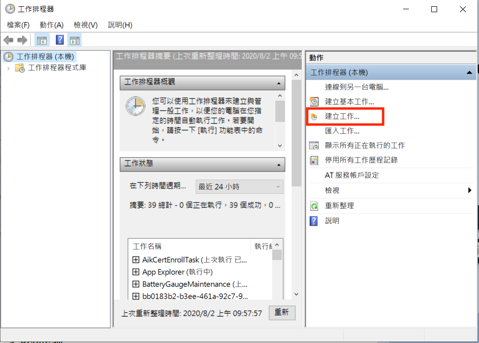
* 選擇以`最高權限執行`，同時設定一開機立刻執行
    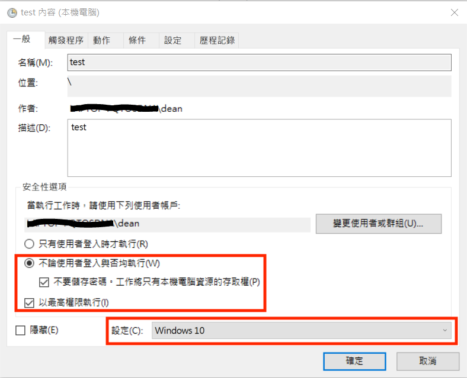
* 在這裡設定為`每次開機`都會觸發工作
    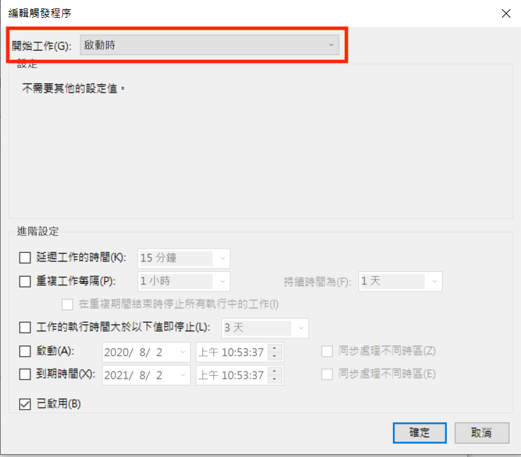
* 編輯動作的部分有幾個需要注意
    * 程式或指令碼 : 你要找到當初安裝 yarn 的路徑，及 yarn.cmd 的檔案  
    * 新增引數 : 填上 **forever** ，因為我們是用 yarn forever啟動程式的  
    * 開始位置 : 把專案的路徑複製上去即可  
    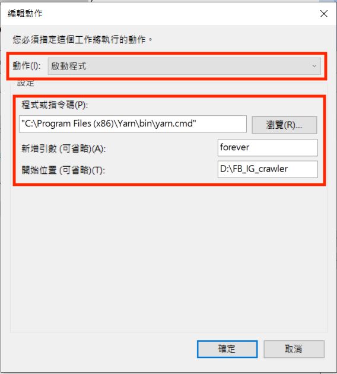

### 2.3 打開 windows 歷程紀錄
windows請打開歷程紀錄否則不會執行該排程
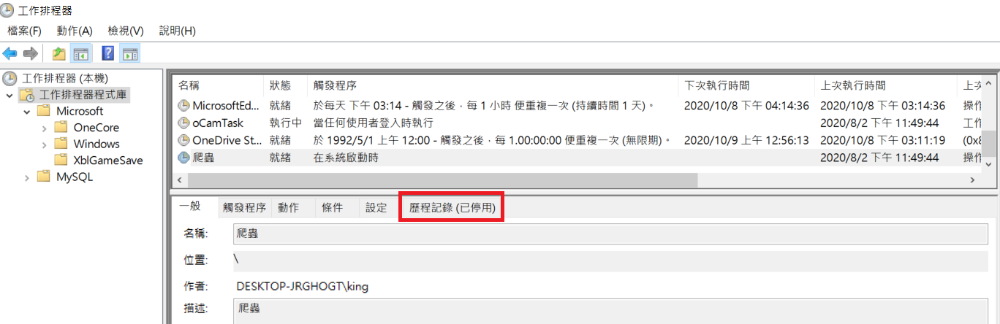
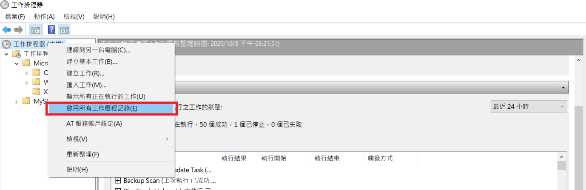


### 2.4 重開機確認 crawler_cron.sh 是否執行
請注意因為使用的是最高權限執行 **yarn forever**，所以你在 cmd 裡面用 **forever list** 是看不到的
1. 必須要用`系統管理員身分執行 cmd`
    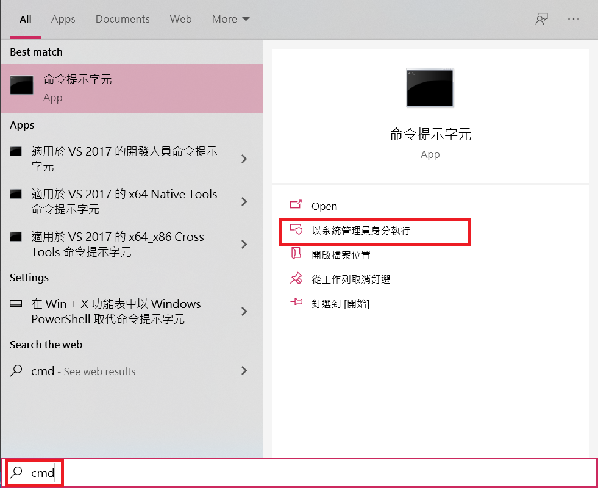
2. 在這個權限下輸入指令 **forever list** 才能確認是否正常運行    
    

ℹ️ 專案原始碼
----
* 今天的完整程式碼可以在[這裡](https://github.com/dean9703111/ithelp_30days/tree/master/day26)找到喔
* 我昨天的把昨天的程式碼打包成[壓縮檔](https://github.com/dean9703111/ithelp_30days/raw/master/sampleCode/day25_sample_code.zip)，你可以在乾淨的環境試試看排程是不是重開機後依舊存在呢~
    * 請記得在終端機下指令 **yarn** 才會把之前的套件安裝
    * 要在tools/google_sheets資料夾放上自己的憑證
    * 調整fanspages資料夾內目標爬蟲的粉專網址
    * 調整.env檔
        * 填上FB登入資訊
        * 填上FB版本(classic/new)
        * 填上IG登入資訊
        * 填上SPREADSHEET_ID
        * 填上爬蟲執行時間(CRONJOB_TIME)
    * 在終端機下指令 **npm install forever -g** ，讓你在終端機的任何位置都能管控排程
    * 在sh資料夾中設定執行排程的shell script

📖 參考資源
----
1. [[LINUX] chmod 檔案權限大統整](https://shian420.pixnet.net/blog/post/344938711-%5Blinux%5D-chmod-%E6%AA%94%E6%A1%88%E6%AC%8A%E9%99%90%E5%A4%A7%E7%B5%B1%E6%95%B4!)
2. [工作排程器 啟用歷程記錄 原顯示(已停用) windows 2012](https://cjy998.pixnet.net/blog/post/63190869-%E5%B7%A5%E4%BD%9C%E6%8E%92%E7%A8%8B%E5%99%A8-%E5%95%9F%E7%94%A8%E6%AD%B7%E7%A8%8B%E8%A8%98%E9%8C%84-%E5%8E%9F%E9%A1%AF%E7%A4%BA(%E5%B7%B2%E5%81%9C%E7%94%A8)--win)

### [Day27 為爬蟲加上通知 - 透過 POSTMAN 了解 LINE Notify 如何使用](/day27/README.md)