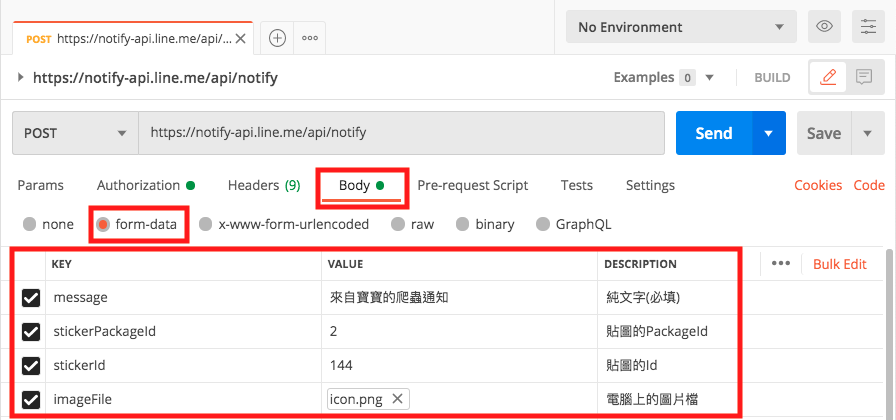

#### [回目錄](../README.md)
## Day27 為爬蟲加上通知 - 透過 POSTMAN 了解 LINE Notify 如何使用

現在爬蟲已經完全自動化了，接下來幾天我們就來實作爬蟲專案的最後階段：`在爬蟲執行完成後發出本次爬蟲的摘要訊息`

在訊息通知這個部分我`選擇使用 LINE Notify` 作為範例，你在了解邏輯後也可以自己改為用 Slack、Wechat、Messager... 等通訊軟體來通知喔

----

🏆 今日目標
----
### 1. 取得 LINE Notify 權杖
### 2. 使用 POSTMAN 測試 LINE Notify
2.1 為什麼要先用 POSTMAN 測試 LINE Notify 呢？
2.2 用 POSTMAN 發出 LINE 的訊息
2.3 透過 POSTMAN 傳送錯誤參數來了解 HTTP狀態碼的意思

----

# 1. 取得 LINE Notify 權杖
1. 請以 LINE 帳號[登入 LINE Notify](https://notify-bot.line.me/zh_TW/)，登入後選擇 `個人頁面`
    
2. 為了要獲得控制 LINE Notify 發訊息的權限，我們要 `發行權杖`
    
3. 在發行權杖的彈窗中，權杖名稱請`填寫與功能相關的名稱`，接收通知的聊天室可選擇 `1對1`、`任意聊天室` 這兩種，確認無誤後按 `發行`
    
4. 接著我們要將這組權杖(Token)複製下來
    
5. 關閉彈窗後能看到 **已連動的服務中** 有我們剛剛新增的服務
    
6. 同時你收到 LINE Notify 帳號啟用權杖的訊息
    
7. 將發行的權杖(Token)加入 **.env** 環境檔，在明天的教學會使用到
    ##### .env.exmaple
    ```
    #放LINE Notify申請的權杖
    LINE_TOKEN='XXXXXX'
    ```    

----

# 2. 使用 POSTMAN 測試 LINE Notify
### 2.1 為什麼要先用 POSTMAN 測試 LINE Notify 呢？
說明這個問題之前，我們先來探討為什麼 POSTMAN 會這麼被工程師推崇，這裡我以個人經驗歸納成以下幾點：
1. 對 **後端工程師** 而言，可以向合作夥伴證明自己寫的 api 沒有在唬爛，真的可以 work
2. 對 **前端工程師、App工程師** 來說，能在串接 api 前先用 POSTMAN 確認後端工程師的 api 真的可以 work
3. 有了這個工具作輔助，我們就能`將前後端責任歸屬的很清楚`，ex：如果 POSTMAN 上面可以正常 work，那就是前端要去思考自己 api 哪裡沒串好
4. `工具操作難度極低`，只需要對網路的世界有基礎的認知就能快速上手

所以我們先用 POSTMAN 測試 LINE Notify 的理由是：
1. 確保 LINE Notify api `執行所需的 Request 參數、Respone的結果與說明書一致`（這點非常重要，因為我看過很多 api 回傳的結構跟說明書完全不一樣）
2. `在一行程式都不用寫`的狀態下測試所有的可能性
3. 在 POSTMAN 驗證後就能專心寫程式，因為`如果程式無法發出 LINE 的通知一定是自己的問題`

> #### 補充：
>* **POSTMAN** 在工程師的世界中素有 `API測試神器`之稱，如果你對 POSTMAN 一無所知的話你可以先透過[這篇文章](https://tw.alphacamp.co/blog/postman-api-tutorial-for-beginners)了解一下他是做什麼的
>* 他可以直接用 Gmail帳號登入在[網頁使用](https://www.postman.com/)，也能[下載桌面版 App](https://www.postman.com/downloads/)，相同帳號的操作記錄在兩邊會同步

### 2.2 用 POSTMAN 發出 LINE 的訊息
1. 設定 Request 的參數
    * **URL**：https://notify-api.line.me/api/notify
    * **Method**：POST
    * **Authorization**： 
        * **TYPE**：Bearer Token
        * **Token**：填入你剛剛在 LINE Notify 申請的權杖
        > 
    * **Body**：
        * **form-data**：
            key|value|DESCRIPTION
            ---|---|---
            message|來自寶寶的爬蟲通知|純文字(必填)
            stickerPackageId|2|貼圖的PackageId
            stickerId|144|貼圖的Id
            imageFile|icon.png|電腦上的圖片檔
        > 
        DESCRIPTION 是我對參數描述，實作上可以不避填
        如果你想深入的了解可以參考[官方文件](https://notify-bot.line.me/doc/en/)
2. 完成 Request 參數填寫後按下 `Send` 發出 LINE 訊息
    * 看到 Response 的結果，status 為 200 代表傳送成功
        
    * 在發行權杖的聊天室中，看到 POSTMAN 傳送的 **訊息、貼圖、圖片**
        


### 2.3 透過 POSTMAN 傳送錯誤參數來了解 HTTP狀態碼的意思
我們剛剛在 POSTMAN 看到 HTTP狀態碼為 200，接下來我們故意做一些錯誤測試來看看會有什麼樣的 Response
>請注意並不是每隻 api 都會回傳 status 這個參數，用 HTTP狀態碼判斷最安全
>
1. 不填寫 LINE Notify 的權杖
    * HTTP狀態碼為 401，代表需要授權才能使用
    
2. 在 Body 中不填寫 message 的參數
    * HTTP狀態碼為 400，意味伺服器收到無效的語法
    

透過上面的範例我們能回傳的資訊上面了解到不同 HTTP狀態碼的意思：`200 代表成功、400可能是參數錯誤、401是沒有授權`，當然 HTTP狀態碼不只這些，如果你想更深入的了解可以參考[這篇文章](https://blog.poychang.net/http-status-code/)

----

📖 參考資源
----
1. [[API連線測試]使用Postman測試LINE Notify的訊息推送](https://dotblogs.com.tw/TingI/2019/02/12/182723)
2. [LINE Notify API Document](https://notify-bot.line.me/doc/en/)
3. [Postman 新手教學](https://tw.alphacamp.co/blog/postman-api-tutorial-for-beginners)
4. [HTTP 狀態碼一覽表](https://blog.poychang.net/http-status-code/)

### [Day28 為爬蟲加上通知 - 用 axois 發出 LINE 通知](/day28/README.md)