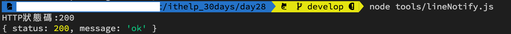
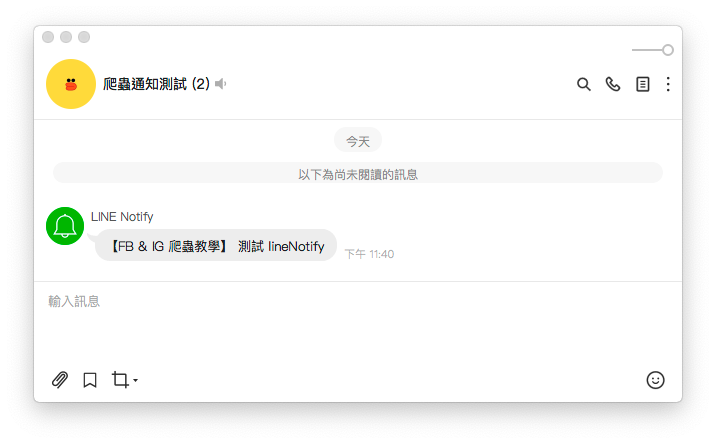

#### [回目錄](../README.md)
## Day28 為爬蟲加上通知 - 用 axois 發出 LINE 通知

>成功要選人少的路走，套件要選人多的來用

 如何選擇 Node.js 中發出 Request 的套件？
----
雖然眾多的套件都能實現這個目標，但我還是做個簡單的區分：
1. 古老且沒再更新的套件：[https](https://www.npmjs.com/package/https)、[xmlhttprequest](https://www.npmjs.com/package/xmlhttprequest)、[request](https://github.com/request/request)(這個套件在今年二月宣告廢棄)
2. 使用人數眾多且持續更新的套件：[superagent](https://www.npmjs.com/package/superagent)、[node-fetch](https://www.npmjs.com/package/node-fetch)、[got](https://www.npmjs.com/package/got)、[axios](https://www.npmjs.com/package/axios)

原則上選擇`使用人數眾多且持續更新的套件最安全`，因為古老的套件通常文件不齊全且無人維護，如果某一天宣告廢棄你的專案就要大量改寫了

> 本專案採用 `axios` 來實現這個需求，如果你有興趣你也能嘗試不同的套件來完成今天的功能

----

🏆 今日目標
----
### 1. axois 基礎介紹
1.1 安裝 / GET / POST 基礎用法
1.2 請求配置說明
### 2. 用 axois 發出 LINE 通知 

----

# 1. axois 基礎介紹

### 1.1 安裝 / GET / POST 基礎用法
* **安裝**
    ```vim
    npm install axios
    yarn add axios
    ```
* **GET 基礎用法**
    ```js
    const axios = require('axios'); // 引入套件
    axios.get('url/users', { // 填入 api 網址
        params: { // 傳入 params 物件
            ID: 12345
        }
    })
    .then(function (response) { 
        // 處理成功後要做的事
        console.log(response);
    })
    .catch(function (error) {
        // 發生意外地處理
        console.log(error);
    })
    ```
* **POST 基礎用法**
    ```js
    axios.post('url/users', { // 要傳送的資料由後方物件帶入
        firstName: 'Fred',
        lastName: 'Flintstone'
    })
    .then(function (response) {
        console.log(response);
    })
    .catch(function (error) {
        console.log(error);
    });
    ```
### 1.2 請求配置說明
* **axios 的組成結構**：
    ```js
    axios.(config 物件)
    .then(function (response) {})
    .catch(function (error) {});
    ```
* `config 物件`：發出 Request 的配置選項，其中只有 url 為必填
    ```js
    {
        // url 為必填
        url: '/users',

        // method 是發出 Request 時使用的方法
        method: 'get', // 默認為 get

        // baseURL 如果填寫就會被添加到 url 前面，除非 url 為絕對路徑
        baseURL: 'https://some-domain.com/api/',

        // 你可以在這個地方定義自己的 headers
        // 通常會拿來設定 Authorization、Content-Type
        headers: {'Content-Type': 'application/json'},

        // params 通常跟著 GET method 一起使用
        // 這裡填寫的參數會帶入 url 後面，ex : .../user?ID=123
        params: {
            ID: 123
        },

        // data 只適用於 POST、PUT、PATCH 這幾個 method
        // 主要作為 Request 傳送的資料
        data: {
            firstName: 'Fred'
        },

        // Request 時間超過 1000毫秒(1秒)後會被中止
        timeout: 1000,

        // 選項: 'arraybuffer', 'document', 'json', 'text', 'stream'
        // 瀏覽器才有 'blob'
        responseType: 'json', // 默認為 json

         // 限制 http 回應時的內容大小
        maxContentLength: 2000,
    }
    ```
    > 這裡只列出常用的配置選項，如果你有興趣深入研究請參考[官方文件](https://www.npmjs.com/package/axios#request-config)
* **使用 then 時，會得到如下回應**
    ```js
    axios.get('/users/123')
    .then(function(response) {
        console.log(response.data); // api 回傳的資料會在這裡
        console.log(response.status); // 這個是 HTTP狀態碼
        console.log(response.config); // 這個 Request 的 config
    });
    ```

----

# 2. 用 axois 發出 LINE 通知
在對 axois 有基礎了解後我們就把昨日在 POSTMAN 設定 Request 的參數搬移到專案程式吧，`在專案 tools 資料夾內新增 lineNotify.js`，今天我們要用這隻程式發出 LINE 通知
* 因為傳送 data 的資料格式為 form-data ，所以請先下指令 `yarn add form-data` 安裝套件喔
#### tools/lineNotify.js
```js
const axios = require('axios')
var FormData = require('form-data');
require('dotenv').config();

function lineNotify () {
    const token = process.env.LINE_TOKEN;
    
    // 使用 form-data 傳遞資料
    const form_data = new FormData();
    form_data.append("message", '測試 lineNotify');

    // 設定 LINE Notify 的 權杖 & form-data
    const headers = Object.assign({
        'Authorization': `Bearer ${token}`
    }, form_data.getHeaders());
    
    axios({
        method: 'post',
        url: 'https://notify-api.line.me/api/notify',
        data: form_data,
        headers: headers
    }).then(function (response) {
        // HTTP狀態碼 200 代表成功
        console.log("HTTP狀態碼:" + response.status);
        // 觀察回傳的資料是否與 POSTMAN 測試一致
        console.log(response.data);
    }).catch(function (error) {
        console.error("LINE通知發送失敗");
        if (error.response) { // 顯示錯誤原因            
            console.error("HTTP狀態碼:" + error.response.status);
            console.error(error.response.data);
        } else {
            console.error(error);
        }
    });
}
lineNotify() 
```

----

🚀 執行程式
----
1. 在專案資料夾的終端機(Terminal)執行指令
    ```vim
    node tools/lineNotify.js
    ```
2. 確認印出的 HTTP狀態碼 & 回傳的資料與 POSTMAN 測試結果一致
    
3. 如果你的 LINE 收到發出的通知就代表你成功嚕！
    

----

ℹ️ 專案原始碼
----
* 今天的完整程式碼可以在[這裡](https://github.com/dean9703111/ithelp_30days/tree/master/day28)找到喔
* 我昨天的把昨天的程式碼打包成[壓縮檔](https://github.com/dean9703111/ithelp_30days/raw/master/sampleCode/day27_sample_code.zip)，你可以在乾淨的環境為專案加入發出LINE通知的功能
    * 請記得在終端機下指令 **yarn** 才會把之前的套件安裝
    * windows需下載與你chrome版本相同的[chrome driver](http://chromedriver.storage.googleapis.com/index.html)放在專案根目錄
    * 要在tools/google_sheets資料夾放上自己的憑證
    * 調整fanspages資料夾內目標爬蟲的粉專網址
    * 調整.env檔
        * 填上FB登入資訊
        * 填上FB版本(classic/new)
        * 填上IG登入資訊
        * 填上SPREADSHEET_ID
        * 填上爬蟲執行時間(CRONJOB_TIME)
        * 填上LINE Notify申請的權杖(LINE_TOKEN)
    * 在終端機下指令 **npm install forever -g** ，讓你在終端機的任何位置都能管控排程
    * 在sh資料夾中設定執行排程的shell script

----

📖 參考資源
----
1. [由前端request 的幾種方法](https://medium.com/dot-js/%E7%94%B1%E5%89%8D%E7%AB%AFrequest-%E7%9A%84%E5%B9%BE%E7%A8%AE%E6%96%B9%E6%B3%95-fbf8a0b4023a)
2. [5 Ways to Make HTTP Requests in Node.js](https://www.twilio.com/blog/2017/08/http-requests-in-node-js.html)
3. [axios 基本使用 & Config](https://ithelp.ithome.com.tw/articles/10212120)

### [Day29 為爬蟲加上通知 - 成功收到 LINE 通知爬蟲摘要訊息，專案大功告成！](/day29/README.md)