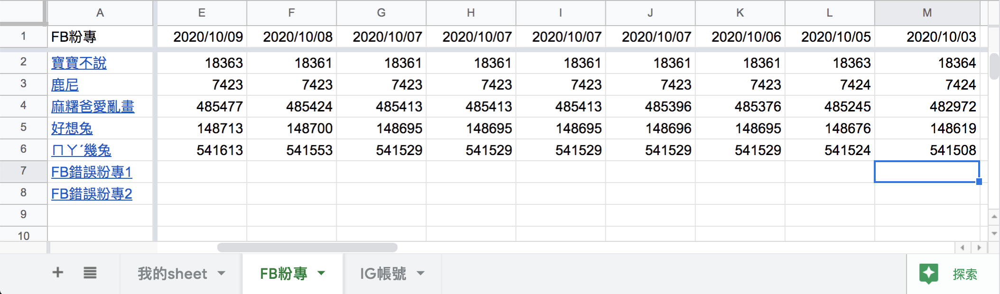
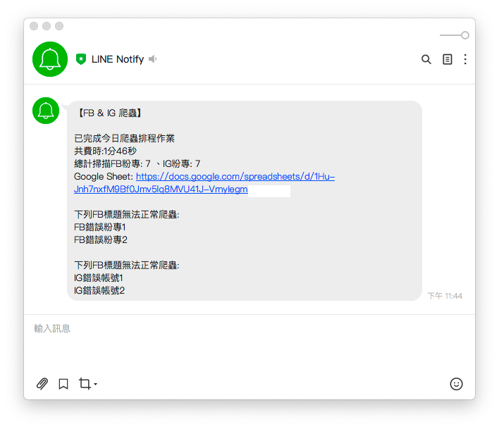

#### [回目錄](../README.md)
## Day29 為爬蟲加上通知 - 成功收到 LINE 通知爬蟲摘要訊息，專案大功告成！
> 除了要有專業外，你更要有技術整合的能力

🤔 筆者有話先說
----
我個人覺得這份爬蟲專案所用到的各種技術都不難，難的是`將這些技術整合成一個能讓客戶買單的專案`；當時在跟工程師朋友分享這個專案的技術組成時他們都覺得很是獵奇，沒想到爬蟲專案還能用如此`低成本`的方式完成，而且真的能`幫客戶解決問題`

話不多說，今天就讓我們把爬蟲執行時的資訊做成一份摘要，透過 LINE 發送給使用者吧！

----

🏆 今日目標
----
1. 分析爬蟲摘要訊息來源
2. 調整爬蟲函式回傳的資料結構
3. 調整主程式傳遞 lineNotify 所需的參數
4. 在 `lineNotify` 函式中整合摘要訊息

----

# 1. 分析爬蟲摘要訊息來源
根據需求規格書，在摘要中需包含以下訊息：
1. **爬蟲總費時**：於主程式執行爬蟲時開始計算
2. **總計掃描FB粉專、IG帳號數量**：使用 crawlerIG、crawlerFB 回傳的 result_array 長度即可
3. **Google Sheets 連結**：依照 .env 環境檔中的 SPREADSHEET_ID 組成連結
4. **無法爬蟲的FB粉專、IG帳號名稱**：調整 crawlerIG、crawlerFB 回傳的資料結構（以 error_title_array 參數來記錄）

----

# 2. 調整爬蟲函式回傳資料結構(以 CrawlerFB 為例)
* 使用 `error_title_array` 來紀錄無法爬蟲的標題
* 完成爬蟲後回傳 **爬蟲結果(result_array)、無法爬蟲的粉專標題(error_title_array)** ，讓後續 Google Sheet 更新、LINE Notify 傳送通知時使用

```js
async function crawlerFB (driver) {
    const isLogin = await loginFacebook(driver)
    if (isLogin) {
        console.log(`FB開始爬蟲`)
        let result_array = [], error_title_array = []// 紀錄無法爬蟲的標題
        for (fanpage of fanpage_array) {
            let trace = null
            try {
                const isGoFansPage = await goFansPage(driver, fanpage.url)
                if (isGoFansPage) {
                    await driver.sleep((Math.floor(Math.random() * 4) + 3) * 1000)
                    trace = await getTrace(driver, By, until)
                }
                if (trace === null) {// 將無法爬蟲的標題放入陣列
                    error_title_array.push(fanpage.title)
                    console.log(`${fanpage.title}無法抓取追蹤人數`)
                } else {
                    console.log(`${fanpage.title}追蹤人數：${trace}`)
                }

            } catch (e) {
                console.error(e);
                continue;
            } finally {
                result_array.push({
                    url: fanpage.url,
                    title: fanpage.title,
                    trace: trace
                })
            }
        }
        // 回傳爬蟲結果、無法爬蟲的粉專標題
        return { "result_array": result_array, "error_title_array": error_title_array }
    }
}
```

----

# 3. 調整主程式傳遞 lineNotify 所需的參數
* **爬蟲總費時**：取得爬蟲開始、結束時間後我們用 `spendTime` 函式把時間差`轉換成時分秒`的格式
    > 因為朋友數百個品牌爬蟲總費時快兩小時，如果用秒數呈現實在太不人性化了
* 整合 `lineNotify` 所需的參數： **爬蟲總費時(spend_time)**、**總計掃描FB粉專、IG帳號數量(result_array.length)**、**無法爬蟲的FB粉專、IG帳號名稱(error_title_array)**

#### index.js
```js
require('dotenv').config();
const { initDrive } = require("./tools/initDrive.js");
const { crawlerFB } = require("./tools/crawlerFB.js");
const { crawlerIG } = require("./tools/crawlerIG.js");
const { updateGoogleSheets } = require("./tools/google_sheets");
const { lineNotify } = require("./tools/lineNotify.js");
exports.crawler = crawler;

async function crawler () {
    const start_time = new Date(); // 取得開始時間
    const driver = initDrive();
    if (!driver) {
        return
    }
    // 分別取出爬蟲結果、無法爬蟲的粉專標題
    const { "result_array": ig_result_array, "error_title_array": ig_error_title_array } = await crawlerIG(driver)
    const { "result_array": fb_result_array, "error_title_array": fb_error_title_array } = await crawlerFB(driver)
    driver.quit();

    await updateGoogleSheets(ig_result_array, fb_result_array)
    const end_time = new Date(); // 取得結束時間
    // 計算爬蟲作業總費時
    const spend_time = spendTime(start_time, end_time)

    // 執行完畢後用 lineNotify 回報爬蟲狀況
    lineNotify(spend_time, ig_result_array.length, fb_result_array.length, ig_error_title_array, fb_error_title_array)
}

function spendTime (start_time, end_time) {
    const milisecond = end_time.getTime() - start_time.getTime()  //時間差的毫秒數  
    //計算出相差天數  
    const days = Math.floor(milisecond / (24 * 3600 * 1000))
    //計算出小時數  
    const leave1 = milisecond % (24 * 3600 * 1000)// 計算天數後剩余的毫秒數  
    const hours = Math.floor(leave1 / (3600 * 1000))
    //計算相差分鐘數  
    const leave2 = leave1 % (3600 * 1000)// 計算小時數後剩余的毫秒數  
    const minutes = Math.floor(leave2 / (60 * 1000))
    //計算相差秒數  
    const leave3 = leave2 % (60 * 1000)// 計算分鐘數後剩余的毫秒數  
    const seconds = Math.round(leave3 / 1000)

    let time_msg = ""
    if (days !== 0)
        time_msg = time_msg + days + '天'
    if (hours !== 0)
        time_msg = time_msg + hours + '小時'
    if (minutes !== 0)
        time_msg = time_msg + minutes + '分'
    if (seconds !== 0)
        time_msg = time_msg + seconds + '秒'
    return time_msg
}
```

----

# 4. 在 `lineNotify` 中整合摘要訊息
* 使用 `combineErrMsg` 將無法爬蟲的FB粉專、IG帳號名稱整合
* 將最終要傳送的訊息組合在 `message` 變數中
```js
const axios = require('axios')
var FormData = require('form-data');
require('dotenv').config();
module.exports.lineNotify = lineNotify;
async function combineErrMsg (error_title_array, type) {
    let error_msg = ""
    for (const error_title of error_title_array) {
        error_msg = error_msg + '\n' + error_title
    }
    if (error_msg !== "") {
        error_msg = `\n\n下列${type}標題無法正常爬蟲:` + error_msg
    }
    return error_msg
}
async function lineNotify (time, ig_total_page, fb_total_page, ig_error_title_array, fb_error_title_array) {
    const token = process.env.LINE_TOKEN;
    // 無法爬蟲的FB粉專、IG帳號名稱整合
    const fb_error_msg = await combineErrMsg(fb_error_title_array, "FB")
    const ig_error_msg = await combineErrMsg(ig_error_title_array, "IG")
    let error_msg = fb_error_msg + ig_error_msg

    // 組合傳送訊息
    const message =
        `\n\n已完成今日爬蟲排程作業` +
        `\n共費時:${time}` +
        `\n總計掃描FB粉專: ${fb_total_page} 、IG帳號: ${ig_total_page}` +
        `\nGoogle Sheet: https://docs.google.com/spreadsheets/d/${process.env.SPREADSHEET_ID}` +
        error_msg;
    
    const form_data = new FormData();
    form_data.append("message", message);

    const headers = Object.assign({
        'Authorization': `Bearer ${token}`
    }, form_data.getHeaders());

    axios({
        method: 'post',
        url: 'https://notify-api.line.me/api/notify',
        data: form_data,
        headers: headers
    }).then(function (response) {
        // HTTP狀態碼 200 代表成功
        console.log("HTTP狀態碼:" + response.status);
        // 觀察回傳的資料是否與 POSTMAN 測試一致
        console.log(response.data);
    }).catch(function (error) {
        console.error("LINE通知發送失敗");
        if (error.response) { // 顯示錯誤原因            
            console.error("HTTP狀態碼:" + error.response.status);
            console.error(error.response.data);
        } else {
            console.error(error);
        }
    });
}
```

----

🚀 執行程式
----
1. 為了確認我們爬蟲摘要能紀錄無法爬蟲的頁面，`我在 ig.json、fb.json 裡面各新增了兩個無效的粉專網址`
2. 在專案資料夾的終端機(Terminal)執行指令
    ```vim
    yarn start
    ```
3. 程式執行完畢後確認 Google Sheets 的資料有正確寫入
    
4. 同時收到 LINE 通知爬蟲摘要訊息就代表大功告成啦！！！
    

----

ℹ️ 專案原始碼
----
* 今天的完整程式碼可以在[這裡](https://github.com/dean9703111/ithelp_30days/tree/master/day29)找到喔
* 我昨天的把昨天的程式碼打包成[壓縮檔](https://github.com/dean9703111/ithelp_30days/raw/master/sampleCode/day28_sample_code.zip)，你可以在乾淨的環境完成專案的最後一步：發出LINE通知讓使用者知道這次爬蟲的情況
    * 請記得在終端機下指令 **yarn** 才會把之前的套件安裝
    * windows需下載與你chrome版本相同的[chrome driver](http://chromedriver.storage.googleapis.com/index.html)放在專案根目錄
    * 要在tools/google_sheets資料夾放上自己的憑證
    * 調整fanspages資料夾內目標爬蟲的粉專網址
    * 調整.env檔
        * 填上FB登入資訊
        * 填上FB版本(classic/new)
        * 填上IG登入資訊
        * 填上SPREADSHEET_ID
        * 填上爬蟲執行時間(CRONJOB_TIME)
    * 在終端機下指令 **npm install forever -g** ，讓你在終端機的任何位置都能管控排程
    * 在sh資料夾中設定執行排程的shell script

### [Day30 時間只是考驗，心中信念絲毫未減](/day30/README.md)