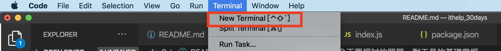

#### [回目錄](../README.md)
### Day3 對工具的基礎掌握

相信大家應該都已經準備好開發的環境了  
在開始前我會建議你在[github官網](https://github.com/)上面開一個帳號，這個網站會是一個讓你管理專案非常方便的工具，透過版本控管，你可以很清楚自己每天做了什麼事情，詳細的教學可以看參考[開始使用 GitHub， 註冊與建立repo](https://progressbar.tw/posts/3)這篇文章，裡面說的很詳細  

接下來讓我們開始今天要探討的問題，**對工具的基礎掌握**  
你可以經由過去學習的經驗來思考，你對一個東西了解到什麼程度你覺得算是基礎掌握  

----
我相信每個人都有自己的答案，對我來說
高效能演算法與複雜的語法並不是我所追求的東西  
我比較在意寫出來的程式給另一個人看的時候能不能讓他一看就懂  
如果他可以輕易理解，那麼我覺得就是基礎掌握  

這個探討的就是clean code(無暇的程式碼)裡面幾個重要的點我列在下方，有興趣的朋友可以參考[大神所寫的文章](https://medium.com/%E6%89%8B%E5%AF%AB%E7%AD%86%E8%A8%98/clean-code-index-51e209cc47db)
1. 有意義的命名
2. 沒有重複的程式碼
3. 大眾都能理解的邏輯
4. 好的註解
5. 錯誤處理

上面每一個都是困擾工程師的日常，我每天也還在為了達到這些目標而努力  
而想要掌握clean code最快的方法就是實戰，你實戰的經驗越多，你的程式也會越朝著clean code前進，所以接下來我們先從Hello world這個簡單到爆炸的範例帶你進入nodejs的世界吧  

第一個nodejs專案
----
請你先建立好專案的資料夾，並使用VScode打開它  
接著新增一個**index.js**的檔案，內容如下
```js
function helloWorld () { // 創建函式
    const content = 'helloWorld' // 給變數內容
    console.log(content) // 用日誌將內容印出來
}
helloWorld() // 一進入就觸發
```
在這短短5行的程式裡面其實就有很多需要注意的事情
1. 函式命名規則
2. 變數命名規則
3. 變數宣告
4. 程式日誌
5. 註解
在[這篇文章](https://eyesofkids.gitbooks.io/javascript-start-from-es6/content/part3/var_const_naming.html)中有非常深入的探討這些問題，他能幫助你對程式的基礎有更深刻的理解  

新增完檔案後打開終端機(Termial)如下圖

接著在終端機(Terminal)輸入下面command來執行這個程式
```
node index.js
```
如果有印出helloWorld的字串那就代表你踏出成功的第一步了

package.json讓你站在巨人的肩膀 
----
在昨天的文章有提到**不要重複造輪子**，多使用別人已經完善的套件  
請輸入指令來建立package.json，裡面會問你一些問題，你可以自由填寫，這些內容之後都可以修改
```
npm init
```
下面是建立好的範例pacakge.json，我簡單說明幾個重要的參數(真實的package.json不可以用//來當備註喔，下面範例加上備註只是為了讓大家方便理解)
```js
{
  "name": "crawler",// 專案名稱，全部小寫，不允許空格
  "version": "0.0.1",// 須符合x.x.x的格式
  "description": "FB & IG 爬蟲30天鐵人文章",//專案描述
  "author": "dean lin",//作者名字
  "dependencies": {},//在正式環境中會用到的pacakge
  "devDependencies": {},//在開發、測試環境中會用到的pacakge
  "scripts": {//支援的command
    "start": "node index.js"
  },
  "main": "index.js",//入口檔案
  "license": "ISC"//協議
}
```
license有區分成很多種，如果有興趣的朋友可以參考[文章1](https://www.jianshu.com/p/86251523e898)(簡中)、[文章2](https://medium.com/@yo8568/git-%E5%B0%8F%E7%AD%86%E8%A8%98-github-%E4%B8%8A-commit-fdc95aaf3099)裡面講解的很詳細喔

我想聰明的讀者們應該注意到我在scripts裡面寫 **"start": "node index.js"** 這段指令了  
scripts可以讓你自由定義這個專案底下的command，以這個package.json為範例，你可以改用如下指令來執行index.js
```
npm run start
```
如果你有乖乖安裝yarn的環境，也可以用如下指令執行
```
yarn start
```

上面這些專案的程式碼可以在[這裡](https://github.com/dean9703111/ithelp_30days/day3)找到喔，或是你可以整個專案clone下來
```
git clone https://github.com/dean9703111/ithelp_30days.git
cd ithelp_30days/day3
yarn start
```

如果大家對於文章的內容有任何想法歡迎討論，希望這片文章有給正在學習程式的人一些幫助與方向
### [Day4 程式的環境變數](../day4/README.md)