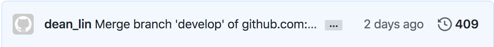

#### [回目錄](../README.md)
## Day30 時間只是考驗，心中信念絲毫未減

>當你停止拿著別人的地圖走在自己的人生道路上，那你的人生才算真正的開始。-Peter Su

專案總結
----
1. 鐵人賽的收穫
2. 在鐵人賽過程中遇到的挑戰
3. 完整專案程式碼
4. 致謝

----

# 1. 鐵人賽的收穫
### 了解技術文章與技術文件的差異
在鐵人賽開賽前我其實已經備了 26 天的草稿放在 github 上請朋友幫忙給意見，除了一些技術上的漏洞外，最多人給的想法就是：
1. 你分享的技術很有趣，但我有點消化不良
2. 我現在還在上班嗎？你這根本是技術文件吧？
3. 排版好亂，閱讀起來有障礙

收到這些回饋時我超級崩潰，過去自己寫的是技術文件，能讓合作夥伴看懂就好了；但是分享到一個平台上你除了要讓人看懂外，你還要讓人看得下去，與朋友深聊之後對文章做了以下改進：
1. 加入個人經驗分享讓文章多一點人味
2. 在實作的段落加上一些與讀者的對話
3. 多看別人的文章吸收經驗，調整排版讓閱讀變得舒適

### 深刻體會到自己以前寫的程式有多爛
原本我以為這次鐵人賽會非常輕鬆，因為我是把以前寫的專案拿出來分享；但開始寫文章的時候我就發現自己錯的很離譜，當認真思考每一行程式的意義時真的懷疑當時的自己是不是喝多了：
1. 變數都在亂宣告
2. 程式中有許多不必要的判斷式
3. 失憶症發作，看不懂以前自己在寫什麼

> 針對這些問題，我有統整成一篇 [Day3 努力寫出更好的程式碼，有時你不是一個人在戰鬥](/day3/README.md) 給大家參考

因為是以專案的架構來寫這系列鐵人文章，所以我需要在每天都進行各種測試，並且深入的了解官方文件，在這個過程中我深深感受到以前專案的缺點：
1. 程式穩定性不夠，遇到錯誤時容易崩潰
2. 對官方文件理解不足，導致執行程式時多了很多不必要的步驟

> 錯誤處理的部分可以參考 [Day14 程式又又又崩潰了嗎？來點try-catch吧](/day14/README.md) 這篇喔

### 突破自己許多程式的盲點
過去的我認為學習新技術、多寫一些專案可以讓自己的程式進步，但經過這 30 天的鐵人賽磨練後我發現精煉自己的程式可以學到更多東西：
1. 當你每天都在看一樣的程式時你才會去思考要如何讓它變得更好，而你這些思考與嘗試的過程會讓你日後撰寫程式時多一點 sense
2. 因為不停的思考與嘗試，你可能會發現有些工具打從一開始就選錯了；像是 Node.js 發出 request 這個部分我原本是用[xmlhttprequest](https://www.npmjs.com/package/xmlhttprequest)來完成，但撰寫文章時才驚覺自己當時選了一個古老的套件，一開始寫程式的時候完全沒意思到這件事

----

# 2. 在鐵人賽過程中遇到的挑戰
### 在週末跟連假期發文
當身旁所有人都在吃喝玩樂的時候要能克制自己的慾望，這時把專注力放在撰寫文章上真的很違反人性，在這種內心鬥爭的階段我會選擇聽一些勵志的歌曲來提神：

> 每次聽到 `“我不怕千萬人阻擋，只怕自己投降”` 這段，我整個人就燃起來了！

### 發現有專案有 bug，而這個 bug 在好幾天前的文章就有了
說出來不知道該是驕傲還是怕被人笑，我每篇文章撰寫時間大約落在 4 ~ 20 小時，之所以會花這麼長的時間很大的部分就是在處理之前的歷史業障，這導致很多天的 sample code 都需要修改，而且修改幅度不一，不是用 replace 就能解決的，而且修改後你還要全部測試一遍確保都能正常運行

每次遇到這種 bug 的時候真的是萬分想讓人棄賽...真的改到懷疑人生

> 截至今天完賽，我的 github 已經有 400 多次的 commit

### 瀏覽人數太低，沒人在你的文章留言跟按 LIKE
我認為這是心理層面的挑戰，當你用盡全力寫文章而無人關注時你會開始自我懷疑，懷疑是不是自己寫的不好、思考難道是因為自己選錯題目才沒人看嗎？
我想這種負面想法應該在不少參賽者心中出現過，我也曾經自我懷疑了好一段時間，但後來想了想我們應該要把重點放在改善自己文章的內容，如果沒人來看那一定是什麼地方出了問題，`把重點放在提升自己而不是自己懷疑`
> 花若盛開蝴蝶自來，人若精彩天自安排

----

3. 完整專案程式碼
下載這個[壓縮檔](https://github.com/dean9703111/ithelp_30days/raw/master/sampleCode/day29_sample_code.zip)後，你只要依照下方的提示完成設定就能夠體驗爬蟲的樂趣嚕
* 請記得在終端機下指令 **yarn** 才會把之前的套件安裝
* windows需下載與你chrome版本相同的[chrome driver](http://chromedriver.storage.googleapis.com/index.html)放在專案根目錄
* 要在tools/google_sheets資料夾放上自己的憑證
* 調整fanspages資料夾內目標爬蟲的粉專網址
* 調整.env檔
    * 填上FB登入資訊
    * 填上FB版本(classic/new)
    * 填上IG登入資訊
    * 填上SPREADSHEET_ID
    * 填上爬蟲執行時間(CRONJOB_TIME)
    * 填上LINE Notify申請的權杖(LINE_TOKEN)
LINE_TOKEN='XXXXXX'
* 在終端機下指令 **npm install forever -g** ，讓你在終端機的任何位置都能管控排程
* 在sh資料夾中設定執行排程的shell script

----

# 4. 致謝
首先感謝 **iT邦幫忙** 舉辦一個這麼有意義的比賽讓各路好手分享自己的經驗
感謝給我這份專案靈感起源的朋友：Ray chen
感謝願意看我那不堪入目草稿並給予意見的朋友：永遠給予支持的凱霖學長、魔術讀書會超強筆記男、娃娃臉前同事
感謝不停被我騷擾詢問排版問題的朋友：真正的鐵人-部落格男
感謝陪伴在我身旁給我標題靈感的可愛女友

參考資源：
1. [技術寫作六步驟 讓工程師撰寫流暢的技術部落格](https://tw.alphacamp.co/blog/2018-06-14-18352)