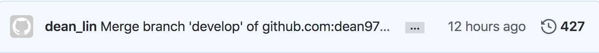

#### [回目錄](../README.md)
## Day30 時間只是考驗，心中信念絲毫未減

>當你停止拿著別人的地圖走在自己的人生道路上，那你的人生才算真正的開始。-Peter Su

專案總結
----
### 1. 鐵人賽的收穫
1.1 了解技術文章與技術文件的差異
1.2 深刻體會以前寫的程式有多爛
1.3 突破過去程式的盲點

### 2. 在鐵人賽過程中遇到的挑戰
2.1 在週末跟連假期發文
2.2 發現有專案有 bug，而這個 bug 在好幾天前的文章就有了
2.3 瀏覽人數太低，沒人在你的文章留言跟按 LIKE

### 3. 完整專案程式碼

----

# 1. 鐵人賽的收穫
### 1.1 了解技術文章與技術文件的差異
在開賽前兩週我將完成的 26 天的備稿放在 github 上請朋友幫忙給意見，除了技術上的漏洞外，**下面這些回饋讓我一度思考到底要不要參加這個比賽**：
1. 你分享的技術很有趣，但我有點消化不良
2. 我現在還在上班嗎？你這根本是技術文件吧？
3. 排版好亂，閱讀起來有障礙
4. 你這個是草稿沒錯吧？

感謝身旁願意說真話的朋友們，是你們讓我意識到：`過去自己寫的是技術文件，能讓合作夥伴看懂就好了；但是分享到一個平台上你除了要讓人看懂外，你還要讓人看得下去`，與朋友深聊之後對文章做了以下改進：
1. 加入個人經驗分享讓文章多一點人味
2. 在實作的段落加上一些與讀者的對話
3. 多看別人的文章吸收經驗，調整排版讓閱讀變得舒適

> 關於這方面的技巧大家可以參考[技術寫作六步驟 讓工程師撰寫流暢的技術部落格](https://tw.alphacamp.co/blog/2018-06-14-18352)

### 1.2 深刻體會以前寫的程式有多爛
原本我以為這次鐵人賽會非常輕鬆，因為我是把以前寫的專案拿出來分享；但開始寫文章的時候我就發現自己錯的很離譜，當我去思考程式每一行的意義時真的**覺得當時的自己是個廢物**：
1. 變數都在亂宣告
2. 程式中有許多不必要的判斷式
3. 超冗長與意義不明的函式
4. 突然失憶症發作，看不懂以前自己為什麼這樣寫

> 針對這些問題，我有統整成一篇 [Day3 努力寫出更好的程式碼，有時你不是一個人在戰鬥](/day3/README.md) 給大家參考

因為是以專案的架構來寫這系列鐵人文章，所以我需要在每天都進行各種測試，並且深入的了解官方文件，在這個過程中我深深感受到以前專案的缺點：
1. 程式穩定性不夠，遇到錯誤時容易崩潰
2. 對官方文件理解不足，導致執行程式時多了很多不必要的步驟

> 錯誤處理的部分可以參考 [Day14 爬蟲執行時又又又崩潰了嗎？來點 try-catch 吧](/day14/README.md) 這篇喔

### 1.3 突破過去程式的盲點
過去的我認為學習新技術、多寫一些專案可以讓自己的程式進步，但經過這 30 天的鐵人賽磨練後我發現`精煉自己的程式可以學到更多東西`：
1. 當你**每天都在看一樣的程式時你才會去思考要如何讓它變得更好**，而你這些思考與嘗試的過程會讓你日後撰寫程式時多一點 sense
2. 因為不停的思考與嘗試，你可能**會發現有些工具打從一開始就選錯了**；像是 Node.js 發出 request 這個功能我原本是用[xmlhttprequest](https://www.npmjs.com/package/xmlhttprequest)來完成，但撰寫文章時才驚覺當時選了一個古老的套件，**只為了快速完成功能容易造成決策上的錯誤**

----

# 2. 在鐵人賽過程中遇到的挑戰
### 2.1 在週末跟連假期發文
當身旁所有人都在吃喝玩樂的時候要能克制自己的慾望，這時把專注力放在撰寫文章上真的很違反人性，在這種內心鬥爭的階段我會選擇聽一些勵志的歌曲來提神：  

> 每次聽到 `“我不怕千萬人阻擋，只怕自己投降”` 這段，我寫文的速度跟意志力就爆發惹！

### 2.2 發現有專案有 bug，而這個 bug 在好幾天前的文章就有了
說出來不知道該是驕傲還是怕被人笑，我每篇文章撰寫時間大約落在 4 ~ 20 小時，之所以會花這麼長的時間是為了處理之前的歷史業障，我是一個有點偏執狂的人，所以我會把每天的文章跟 sample code 全部看一遍重新校訂，並且全部測試一遍確保都能正常運行

`專案的架構使得每篇文章關聯性太大，遇到這種 bug 的時候真的是萬分想讓人棄賽...`

> 截至今天完賽，我的 github 已經有 400 多次的 commit，這系列的文章真的是我心血之作

### 2.3 瀏覽人數太低，沒人在你的文章留言跟按 LIKE
我認為這是心理層面的挑戰，`當你用盡全力寫文章而無人關注時你會開始自我懷疑`：懷疑是不是自己寫的不好、思考難道自己選錯題目了嗎？   

我想這種負面想法應該在不少參賽者心中出現過，玻璃心的我也曾經自我懷疑了好一段時間，但最後我選擇`把自我懷疑的情緒轉化成改善文章的動力`，如果文章夠好一定會有人來看並樂於分享，如果沒人關注那一定是有什麼不足的地方
> 花若盛開蝴蝶自來，人若精彩天自安排

----

# 3. 完整專案程式碼
在文章的最後放上這次專案的完整程式碼，你只要下載這個[壓縮檔](https://github.com/dean9703111/ithelp_30days/raw/master/sampleCode/day29_sample_code.zip)並依照下方的提示完成設定就能體驗爬蟲的樂趣嚕
* 在終端機下指令 **yarn** 安裝套件
* windows需下載與你chrome版本相同的[chrome driver](http://chromedriver.storage.googleapis.com/index.html)放在專案根目錄
* 要在tools/google_sheets資料夾放上Google sheets的憑證，[申請位置](https://developers.google.com/sheets/api/quickstart/nodejs) 
* 調整fanspages資料夾內目標爬蟲的粉專網址
* 調整.env檔
    * 填上FB登入資訊
    * 填上FB版本(classic/new)
    * 填上IG登入資訊
    * 填上SPREADSHEET_ID
    * 填上爬蟲執行時間(CRONJOB_TIME)
    * 填上LINE Notify申請的權杖(LINE_TOKEN)
* 在終端機下指令 **yarn start** 執行專案(windows為 **yarn win_start**)
> 如果想幫專案加上排程請閱讀[Day24](/day24/README.md)～[Day26](/day26/README.md)的文章喔

----

# 致謝
首先要感謝的是願意讓我分享這份專案的老朋友：**Ray**，沒有他就不會有這 30 天的系列文章，更無法讓我重新審視自己程式的缺點

接著感謝願意看我那不堪入目的備稿並給予意見的工程師們：**永遠給予支持的凱霖學長、讀書會的超強筆記男、愛用好想兔貼圖的前同事...**，你們給的建議讓我撰寫技術文章的能力上升了一個台階，至少現在讀起來不會反胃了吧XD

特別感謝在撰寫文章過程給我排版建議的朋友：**部落格男**，他是我心中真正的鐵人，已經堅持每天寫一篇部落格超過 400 天

其實我原本是打算一個人參賽的，但在報名後看到團體組列表中有[北科大計算機](https://ithelp.ithome.com.tw/2020-12th-ironman/signup/team/96)，就向[團長Peter學程式](https://ithelp.ithome.com.tw/users/20110850)詢問我能不能+1，感謝團長的收留，自從大學畢業後就沒有這種組隊參賽的熱血了

最後感謝比賽期間陪伴在我身旁的**可愛女友**，擁有行銷專業的她給我許多下標題的建議

雖然鐵人賽在這裡告了一段落，但對我來說`這裡是技術分享的起點`