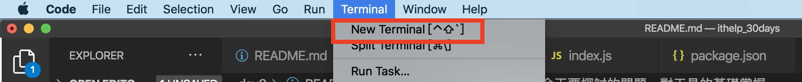
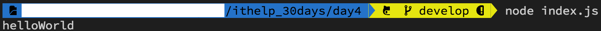
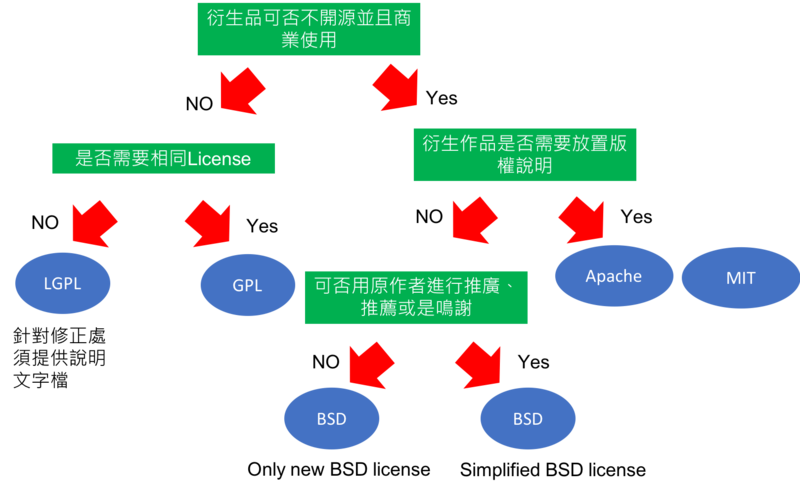

#### [回目錄](../README.md)
## Day4 開始Node.js旅程

🤔 前情提要
----
前幾天都在分享一些概念以及開發環境的設定，今天我們要正式開始寫程式惹～  
在開始前我會建議你在[github官網](https://github.com/)上面開一個帳號，這個網站是一個管理專案非常方便的工具，透過版本控管，你可以很清楚自己每天做了什麼事情，如果commit寫得詳細一點會讓你未來想要復活某一個已經刪除的功能時有很大幫助(或是找出bug兇手時很有用XD)  

昨天所提到clean code的議題是困擾工程師的日常，我每天也還在為了達到這些目標而努力  
而想要掌握clean code最快的方法就是實戰，你實戰的經驗越多，你的程式也會越朝著clean code前進  

🏆 今日目標
----
1. 建立node.js專案
2. 學會如何在終端機下指令執行node.js
3. 了解package.json各項參數的意義，並且會使用scipts來執行node.js

👉 第一個nodejs專案
----
1. 請你先建立好專案的資料夾，並使用VScode打開它  
2. 接著新增一個 **index.js** 的檔案，內容如下
    ```js
    function helloWorld () { // 創建函式
        const content = 'helloWorld' // 給變數內容
        console.log(content) // 用日誌將內容印出來
    }
    helloWorld() // 觸發
    ```

🚀 執行程式
----
1. 新增完檔案後打開終端機(Termial)如下圖
      

2. 在專案資料夾的終端機(Terminal)輸入指令並按下 Enter 執行  
    ```sh
    node index.js
    ```
3. 如果有印出 **helloWorld** 的字串那就代表你踏出成功的第一步了
      

🤔 package.json能做什麼?
----
你可以理解為他是一種描述你專案的檔案，裡面包含你專案的各項資訊(名稱、描述、版本、作者、協議...)  
在昨天的文章有提到**不要重複造輪子**，多使用別人已經完善的套件，一個專案除了你自己的程式外通常還需要大量引入其他人寫的程式，package.json就是**管理這些套件版本**的檔案(明天文章在安裝套件時會再詳細說明)  

* 初始化package.json
    請打開terminal輸入如下指令，裡面會問你一些問題，你可以自由填寫，這些內容之後都可以修改
    ```sh
    npm init
    ```
* 參數說明
    PS.真實的package.json不可以用//來當備註喔，下面範例加上備註只是為了讓大家方便理解
    ```js
    {
    "name": "crawler",// 專案名稱，全部小寫，不允許空格
    "version": "0.0.1",// 須符合x.x.x的格式
    "description": "FB & IG 爬蟲30天鐵人文章",//專案描述
    "author": "dean lin",//作者名字
    "dependencies": {},//在正式環境中會用到的pacakge
    "devDependencies": {},//在開發、測試環境中會用到的pacakge
    "scripts": {//支援的command
        "start": "node index.js"
    },
    "main": "index.js",//入口檔案
    "license": "MIT"//協議
    }
    ```
    * license
        這裡特別說明一下license，因為他會影響到這份專案的使用權益
        1. 你可以依據流程圖釐清自己的需求來做選擇，[圖片來源](https://progressbar.tw/posts/61)  
            

        2. 或者用表格看是否符合需求，[表格來源](https://noob.tw/open-source-licenses/)  
            |條款             |GPL|LGPL|BSD|APACHE|MIT|
            |---|---|---|---|---|---|
            |公開原始碼        |✓  |✓   |		|       |  |	
            |以同樣方式授權     |✓  |✓   |	 |       |	|	
            |標註修改的部分     |✓  |✓   |	 |✓      |  |
            |必須包含 Copyright|✓  |✓   |✓	|✓      |✓ |
            |必須包含 License  |✓  |✓   |		|✓      |✓ |


📜 善用scripts(腳本)執行程式
----
隨著專案的成長，執行程式需要輸入的指令會越來越複雜，但記住這些指令並且正確無誤的輸入實在太考驗人類的記憶力了；我們應該要善用scripts的功能，有了他我們可以把精力放在寫程式而不是浪費時間在記住、輸入指令上面  
<br>
下面是筆者前端網頁在與同事merge branch時所需要下的指令，我想如果是人工來下應該會崩潰吧？  
* 執行內容：移除local端套件&rarr;重新安裝套件&rarr;更新套件&rarr;根據開發環境執行
    ```sh
    rm -rf node_modules package-lock.json .nuxt yarn.lock yarn-error.log && yarn && yarn upgrade && yarn dev
    ```
我想聰明的讀者們應該注意到我在scripts裡面寫 **"start": "node index.js"** 這段指令了，scripts可以讓你自由定義這個專案底下的command，以這個package.json為範例，你可以在終端機(Termial)改用如下指令來執行index.js
```sh
npm start
```
如果你有乖乖安裝yarn的環境，也可以用如下指令執行
```sh
yarn start
```
了解package.json的scripts怎麼使用後，未來遇到超長的指令也不用害怕呢～


ℹ️ 專案原始碼
----
今天的完整程式碼可以在[這裡](https://github.com/dean9703111/ithelp_30days/day4)找到喔

>如果大家對於文章的內容有任何想法歡迎討論，希望這篇文章有給正在學習程式的人一些幫助與方向  

參考資源:
1. [開始使用 GitHub， 註冊與建立repo](https://progressbar.tw/posts/3)
2. [Choose an open source license](https://choosealicense.com/)
3. [常見的五個開源專案授權條款，使用軟體更自由](https://noob.tw/open-source-licenses/)
4. [在開源時代的興起下，如何透過License共享並保有權益](https://progressbar.tw/posts/61)
5. [如何使用 npm script 變成你的建立工具](http://jamestw.logdown.com/posts/1378697-egghead-how-to-use-npm-scripts-as-your-build-tool)
### [Day5 yarn-讓全世界的大神幫你一把，如何安裝及控管套件](/day5/README.md)