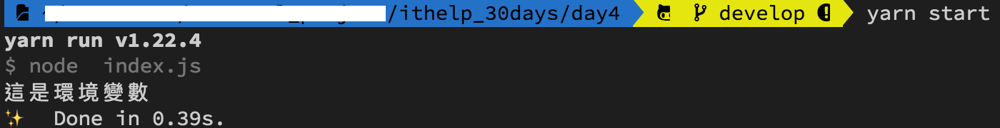

#### [回目錄](../README.md)
## Day5 env-程式的環境變數

如果你曾經有撰寫網頁端的經驗，你也許體會過以下狀況
1. 某些function只能在測試環境中使用，正式環境禁止執行
2. 資料庫搬移到新環境，ip、username、password都需要修正
3. 這份專案由多人維護，每個人都有個別的設定
4. 專案在不同伺服器儲存的位置不一樣
5. ...
如果這些參數都分散在各個檔案，你在不同環境發佈的時候會改到很想死...

所以環境變數的功能就是把這些**散佈在各個檔案且會在不同環境需要調整的參數集合到一個檔案**裡面，這樣就能讓你的程式在不同環境中快速發布   
常用情境如下：
1. 用來區分正式/測試環境
2. 設定重要不得外流的資料(資料庫帳號、密碼，使用者權杖...)
3. 需要統一設定的變數內容(系統ip、網址、port...)

不過今天講的是爬蟲，所以大家可以想一下以爬蟲來說有哪些資訊是需要放在環境變數的呢？  

環境變數使用時機 & 範例
----

以下是需要放進環境變數的資料  
1. **FB & IG的帳號密碼**
原本我想要使用 FB & IG 提供的 api 來抓取我想要的追蹤者人數即每日發文篇數等等資訊，但實際研究後發現由於隱私安全相關問題，所以他們提供的api只能查自己有權限的粉專，所以我**放棄使用官方api 改用 selenium 網頁模擬器**來做爬蟲，在實際操作中發現以下規則，所以只能使用真實存在的帳戶來作為爬蟲帳戶:
    + FB 部分粉專必須要登入後才能觀看
    + IG則是全部都要登入，部分粉專要按追蹤才能觀看    
2. **google sheet的id**
比起產生一份excel文件，我認為雲端的google sheet是更好的方法，因為你可以隨時隨地觀看
3. **執行爬蟲時間**
因為執行爬蟲時間可能每個人都不一樣，所以把他列為可變參數

以下為環境變數的範例檔
##### .env.exmaple
```
#填寫你目標放入的sheet id
SPREADSHEET_ID='your sheet id'

#你FB及IG的帳號密碼(建議用小帳號)
IG_USERNAME='ig username'
IG_PASSWORD='ig password'
FB_USERNAME='fb username'
FB_PASSWORD='fb password'

#這是設定排程的時間參數(目前預設每日22:30準時執行)
CRONJOB_TIME='0 30 20 * * *'
```
實作上你需要將他複製一份到.env檔到你的專案資料夾，並填上自己正確的資訊(但這份檔案千萬不要上傳到git上面，如何操作再下一篇會有詳細說明)

在node.js專案讀取.env的資料
----
我們需要安裝一個 **dotenv** 的套件來抓.env的資料
```
yarn add dotenv
```
透過這個套件，我們便可以在程式中以 **process.env.xxx(xxx是你的命名)** 來讀取環境變數
##### index.js
```js
require('dotenv').config(); //載入.env環境檔
function getEnvVariable () {
    const env_variable= process.env.YOUR_VARIABLE // 取出環境變數
    console.log(env_variable)
}
getEnvVariable()
```
設定環境檔內容
##### .env
```
YOUR_VARIABLE='這是環境變數'
```
執行程式
----
在專案資料夾的終端機(Terminal)執行指令 **yarn start** 如果有輸出"這是環境變數"的字串就代表你成功嚕～
  

專案原始碼
----
上面這的程式碼可以在[這裡](https://github.com/dean9703111/ithelp_30days/day5)找到喔
你可以整個專案clone下來  
```
git clone https://github.com/dean9703111/ithelp_30days.git
```
如果你已經clone過了，那你每天pull就能取得更新的資料嚕  
```
git pull origin master
cd day5
yarn start
```
### [Day6 gitignore-請勿上傳敏感、主程式以外的資料](/day6/README.md)