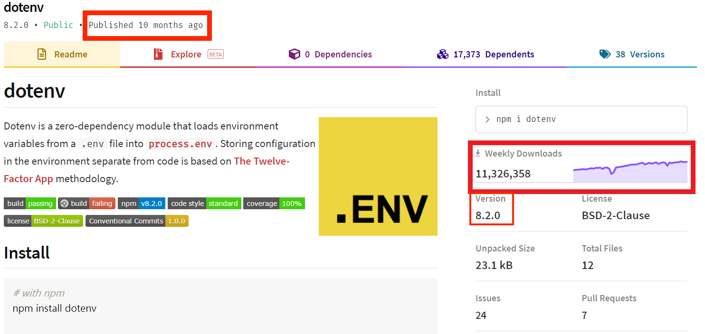

#### [回目錄](../README.md)
## Day5 使用yarn安裝及控管套件 & 善用關鍵字讓全世界的大神幫你一把

🤔 為什麼寫這篇文章？
----
我周圍有些人在面對需求時很喜歡寫一些市面上已經提供的套件而不是直接使用它(而且他們寫出來的套件bug通常比原版多很多...)  
在個人的開發經驗中有97%以上的套件我是看過說明文檔就去使用，只有3%會去看這份套件到底怎麼寫  
會去看他怎麼寫通常不是因為他寫的太好，而是他寫的很爛bug一堆影響到功能需要去修正或者評估使用其他解法

**請不要重複造輪子**，這是我今天這篇文章要表達的核心意義，解決問題的效率才是最重要的  
EX:你需要了解怎麼使用電腦，但你不需要去學習怎麼做出一台電腦

🤔 這篇文章除了套件安裝跟版控外，我還能學到什麼?
----
我們身處在一個開源工具大爆炸的時代，每天都有無數個程式大神寫好套件公開在網路平台供大家使用，所以當我們想要做某些功能的時候我們可以先找找看有沒有好心的前輩們幫我們完成這些功能了  
但同時正因為開源工具爆炸，我們面對的不是沒有工具而是工具太多不知道怎麼選，所以在了解套件的重要性後更重要的是選出合適的套件  

🏆 今日目標
----
1. 了解套件對專案幫助有多大
2. 如何找出適合的套件
3. 學會安裝套件
4. 學會控制套件版本範圍
5. 知道如何下關鍵字找工具

🎉 套件對專案的幫助
----
身為一個工程師，比起撰寫一個新功能，我更多的時間在研究如何使一個套件，下面我來舉例說明套件對於專案的幫助：
1. 能夠快速評估專案功能的可行性
2. 可以更準確預估每個功能的完成時間
3. 節省大量自己重頭寫功能的時間
4. 你可以更專心地維護自己寫的程式邏輯
5. 避免專案主程式肥大

🤔 如何找出適合的套件
----
由於套件的資源實在是太多了，不管是大神還是新手都可以發布套件，這造成了套件本身的良莠不齊，我這裡提供幾個幫助你判斷套件是否符合你需求以及功能品的方法：
1. 我會先用下面幾個最基礎的指標來做判斷
    * **套件最後發布時間**：太久沒維護的套件請謹慎選用
    * **每週下載次數**：越多人下載的套件穩定性越高
    * **版本**：一般來說 1.0.0 以前的版本通常穩定性上有疑慮，盡可能避免使用
2. 有時候你需要的功能有很多個套件可以完成，這時上面的指標便可成為我們選用的依據
    * 我們在提供[npm套件的網頁搜尋env](https://www.npmjs.com/search?q=env)就出現了高達149頁的套件
        
    * 我們點開前兩個套件：[env](https://www.npmjs.com/package/env)、[dotenv](https://www.npmjs.com/package/dotenv)來做比較，你就很清楚選哪個是比較有保障的了
        |套件|env|dotenv|
        |---|---|---|
        |最後發布時間|9 years ago|10 months ago|
        |每週下載次數|2,171|11,326,358|
        |版本|0.0.2|8.2.0|
        
        

3. 你同時要`關心該套件的issues數量`，如果太多建議你點進去看看open issues，因為有些套件很久沒維護了
    * 點擊issues的數字便可跳到github的頁面來看 **open issues** 與 **closed issues** 的數量
        
        
4. 先透過閱讀套件的文件來第一步確認是否有你想要的功能
    * 點擊Homepage下方連結會導向該套件的說明文件(也有可能是套件官網)
        
        
5. 大部分的套件都有提供 sample code，`建議把套件加入專案前先用 sample code 測試來確認這個套件是否符合你的需求`


🤔 如何安裝套件，以及安裝後目錄結構的變化
----
在這裡我們以明天要講的主題：**環境變數**為範例，在node.js專案要讀取.env的資料需要安裝一個 **dotenv** 的套件來抓.env的資料，安裝套件時請輸入指令
```vim
yarn add dotenv
```
安裝完後你會發現專案目錄下多了一些東西
* **node_modules** 資料夾：他會儲存你所安裝的套件
* **yarn.lock** 檔案：為了保證在不同機器上能得到一樣的結果，所以需要這個檔案儲存每個相依性所安裝的確切的版本  
      

* 同時 **package.json** 檔案內容也有變化  
      

你會發現在 **dependencies** 中多了你剛剛安裝的套件 **dotenv** 版本為 **"^8.2.0"**

😵 套件不是安裝完就沒事了，你得學會控制套件版本範圍
----
因為部分套件有版本相依性，所以你需要學會如何控制套件的版本
* 套件更新到最新版本後壞掉是常有的事
* 有些套件甚至是在某個框架下只有某幾個版本能用
#### 所以我們需要了解如何`透過版號控制專案下的套件版本`

版本格式：**主版號.次版號.修訂號**
* 1.0.0.
    * 指定版本，限定只使用 1.0.0 版本
* ^1.0.0
    * 可使用 >=1.0.0 且 <(1+1).0.0 的版本
    * 範例：
        * ^1.2.3 版本範圍 >=1.2.3 <2.0.0
        * ^0.2.3 版本範圍 >=0.2.3 <0.3.0
* latest
    * 當前發布的版本，使用 npm install 所安裝的套件就是標記 latest 的版本    
* ~0.1.1
    * 可使用 >=0.1.1 且 <0.(1+1).0 的版本
    * 範例：
        * ~1.2.3  版本範圍  >=1.2.3 <1.3.0
        * ~0.2  版本範圍  >=0.2.0 <0.3.0
* git://github.com/user/project.git#commit-ish
    * 直接使用 Git URL 的套件
>建議你去調整專案 package.json 的套件版本做練習，在專案資料夾的終端機(Terminal)執行指令 yarn 就會依照你的設定安裝，藉此觀察下載的套件版本是否都在你的掌握之中

🤔 如何下關鍵字找工具
----
我個人的找資料的方向是：  
* 查官方資源提供的方法：因為通常資料及提供的方法最齊全
* 看網路資源：是否有前輩做過相同的事情並提供範例
* 查詢npm套件：有人已經將他的經驗無私的打包成套件讓大家直接使用了

在這我以本次的專案功能為例，我是以下面這些關鍵字來找需要的資源(通常用英文較容易找到)：
1. FB、IG爬蟲
    * 官方資源：FB api、IG api
    * 網路經驗：FB crawler、IG crawler
    * 換成更廣義的方式找工具：網頁爬蟲、web crawler
2. excel處理
    * 官方資源：excel api、google sheet api
    * 套件資源：excel npm、google sheet npm
3. 排程
    * 套件資源：cron npm
4. LINE通知
    * 官方資源：LINE api
    * 套件資源：LINE npm  

基本上靠著這些關鍵字就能找出你所需要的資源了，我會測試過這些工具提供的sample code符合我的需求後才會正式接案，雖然多花了一份工，但卻可以保證你結案的穩定性；歡迎大家在下方留言分享自己找工具的方法喔～  

📖 參考資源
----
1. [yarn.lock](https://classic.yarnpkg.com/zh-Hant/docs/yarn-lock/)
2. [package.json 套件版本控制](https://blog.poychang.net/package-json-version/)
3. [npm-semver](https://docs.npmjs.com/misc/semver)
### [Day6 env-善用環境變數幫你做到快速遷移專案](/day6/README.md)