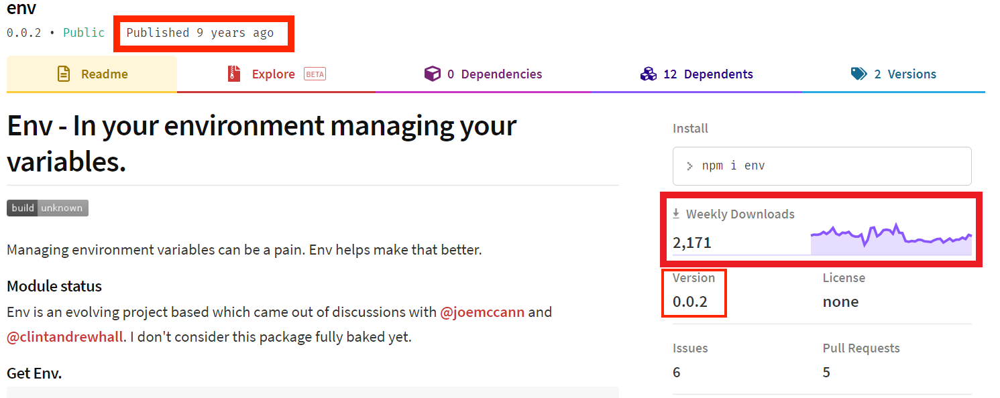

#### [回目錄](../README.md)
## Day5 yarn-讓全世界的大神幫你一把，如何安裝及控管套件

就像前面文章提到的**請不要重複造輪子**，我們身處在一個開源工具大爆炸的時代，每天都有無數個程式大神寫好套件公開在網路平台供大家使用，所以當我們想要做某些功能的時候我們可以先找找看有沒有好心的前輩們幫我們完成這些功能了

今日目標
----
1. 了解套件對於專案的重要性
2. 如何找出適合的套件
3. 學會安裝套件
4. 學會控制套件版本範圍

套件對於專案的重要性
----
身為一個工程師，比起撰寫一個新功能，我更多的時間在研究如何使一個套件，下面我來舉例說明套件對於專案的幫助：
1. 能夠快速評估專案功能的可行性
2. 可以更準確預估每個功能的完成時間
3. 節省大量自己重頭寫功能的時間
4. 你可以更專心地維護自己寫的程式邏輯
5. 避免專案主程式肥大

如何找出適合的套件
----
由於套件的資源實在是太多了，不管是大神還是新手都可以發布套件，這造成了套件本身的良莠不齊，我這裡提供幾個幫助你判斷套件是否符合你需求以及功能品的方法：
1. 有時候你需要的功能有很多個套件可以完成，建議你選擇**被最多人使用**的
    * 我們在提供npm套件的網頁搜尋env就出現了高達149頁的套件
        
    * 你點開幾個便會發現使用套件的人數差異很大，就算功能一樣基本上選人多的比較安全
        
        

2. 你同時要關心該套件的issues數量，如果太多建議你點進去看看open issues，因為有些套件很久沒維護了
    * 點擊issues的數字便可跳到github的頁面來看open issues與closed issues的數量
        
        
3. 先透過閱讀套件的文件來第一步確認是否有你想要的功能
    * 點擊Homepage下方連結會導向該套件的說明文件(也有可能是套件官網)
        
        
4. 大部分的套件都有提供sample code，你可以先用這些sample code來確認這個套件是否符合你的需求


安裝套件
----
在這裡我們以明天要講的主題：**環境變數**為範例，在node.js專案要讀取.env的資料需要安裝一個 **dotenv** 的套件來抓.env的資料，安裝套件時請輸入指令
```sh
yarn add dotenv
```
安裝完後你會發現專案目錄下多了一些東西
* **node_modules** 資料夾：他會儲存你所安裝的套件
* **yarn.lock** 檔案：為了保證在不同機器上能得到一樣的結果，所以需要這個檔案儲存每個相依性所安裝的確切的版本  
  

同時在package.json檔案中也有變化  
  

你會發現在 **dependencies** 中多了你剛剛安裝的套件 **dotenv** 版本為 **"^8.2.0"**

控制套件版本範圍
----
因為部分套件有版本相依性，所以你需要學會如何控制套件的版本
* 套件更新到最新版本後壞掉是常有的事
* 有些套件甚至是在某個框架下只有某幾個版本能用

版本格式：**主版號.次版號.修訂號**
* 1.0.0.
    * 指定版本，限定只使用 1.0.0 版本
* ^1.0.0
    * 可使用 >=1.0.0 且 <(1+1).0.0 的版本
    * 範例：
        * ^1.2.3 版本範圍 >=1.2.3 <2.0.0
        * ^0.2.3 版本範圍 >=0.2.3 <0.3.0
* latest
    * 當前發布的版本，使用 npm install 所安裝的套件就是標記 latest 的版本    
* ~0.1.1
    * 可使用 >=0.1.1 且 <0.(1+1).0 的版本
    * 範例：
        * ~1.2.3  版本範圍  >=1.2.3 <1.3.0
        * ~0.2  版本範圍  >=0.2.0 <0.3.0
* git://github.com/user/project.git#commit-ish
    * 直接使用 Git URL 的套件

經驗補充
----
以這次30天要完成的專案來說，我就會在接案前先評估市面上有沒有下列工具(有時官方會提供api，所以不一定都是套件)：
1. 網頁爬蟲
2. excel編輯
3. 排程
4. LINE通知  
我會在確認有這些工具並且測試過sample code之後我才會正式接案，雖然多花了一份工，但卻可以保證你結案的穩定性

參考資源：
1. [yarn.lock](https://classic.yarnpkg.com/zh-Hant/docs/yarn-lock/)
2. [package.json 套件版本控制](https://blog.poychang.net/package-json-version/)
3. [npm-semver](https://docs.npmjs.com/misc/semver)
### [Day6 env-善用環境變數幫你做到快速遷移專案](/day6/README.md)