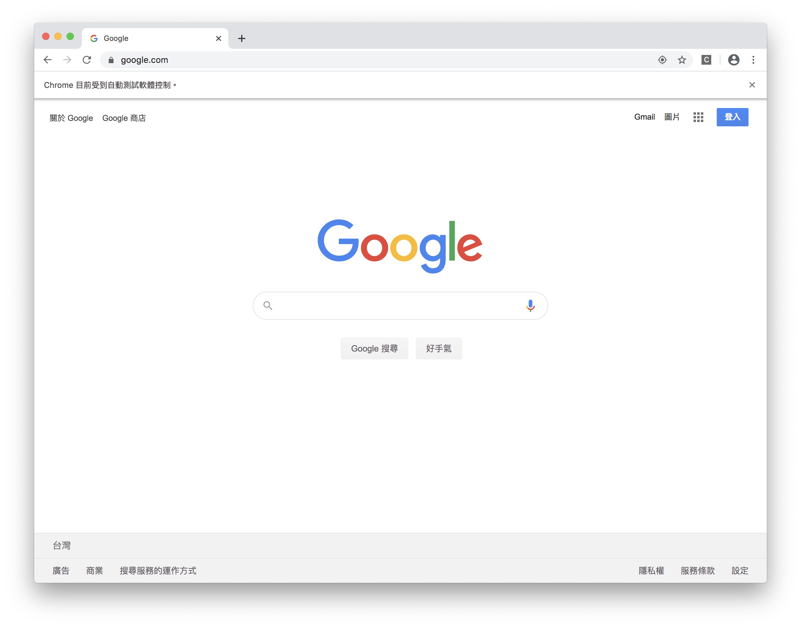

#### [回目錄](../README.md)
### Day6 爬蟲起手式selenium

先前說過由於 FB & IG 的隱私權政策導致我們無法透過api直接取得我們所想要的資訊  
所以我們需要借助**selenium-webdriver**這個套件來開啟專門爬蟲的網頁
我的文章會慢慢使用到它的各種功能，如果有迫不及待的小夥伴也可以先去[官網](https://www.selenium.dev/documentation/en/)來更深刻的了解他  

先在terminal下指令安裝他  
```
yarn add selenium-webdriver
```
因為本專案使用的模擬器是chrome，電腦還沒裝的請先[下載](https://www.google.com/intl/zh-TW/chrome/)
因為跑selenium需要用到driver，大家可以依照自己的作業系統做設定
+ mac 作業系統
    如果你用的電腦是mac，恭喜你，不要需要額外下載chrome driver就能夠直接寫使用  
+ windows 作業系統
    請下載[chrome driver](http://chromedriver.storage.googleapis.com/index.html)
    這個driver需要跟你的[chrome版本相同](chrome://settings/help)
    將這個chromedriver.exe放到專案根目錄下即可

將chromedriver.exe放到根目錄後記得在.gitignore把它加進去忽略清單喔，他不屬於需要版控的檔案
#### .gitignore
```
node_modules
.env
chromedriver.exe
```

接下來就可以嘗試用selenium-webdriver打開爬蟲用網頁了
#### index.js
```js
require('dotenv').config(); //載入.env環境檔
var webdriver = require('selenium-webdriver') // 加入虛擬網頁套件
function openCrawlerWeb () {
    var driver = new webdriver.Builder().forBrowser("chrome").build();// 建立這個broswer的類型
    const web = 'https://www.google.com/';//填寫你想要前往的網站
    driver.get(web)//透國這個driver打開網頁
}
openCrawlerWeb()//打開爬蟲網頁
```
如果一切順利，你應該會看到一個chrome的應用程式打開並且進入google的首頁  



上面這的程式碼可以在[這裡](https://github.com/dean9703111/ithelp_30days)找到喔，或是你可以整個專案clone下來
```
git clone https://github.com/dean9703111/ithelp_30days.git
cd ithelp_30days/day6
yarn start
```