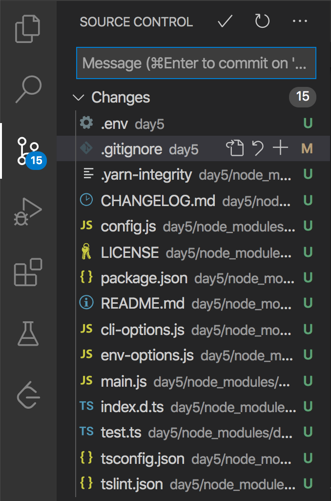
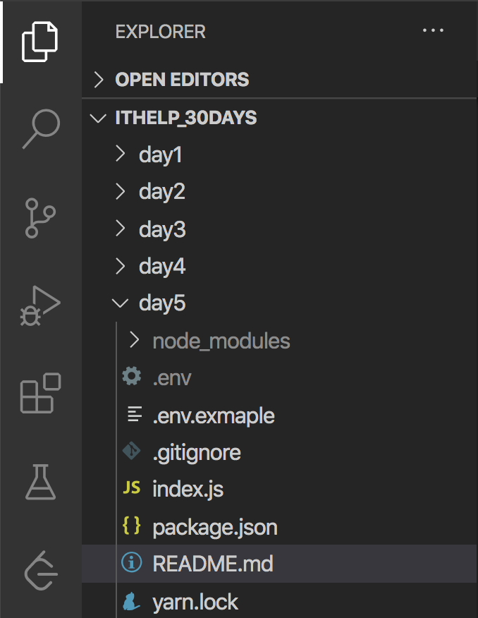

#### [回目錄](../README.md)
## Day6 gitignore-請勿上傳敏感、主程式以外的資料

昨天我們說到.env裡面存放的資料有許多都不適合公開(ex:資料庫帳號密碼、token...)，這些資料外流出去我想就不是檢討報告能解決的問題惹，為了避免誤傳檔案，今天我來介紹一個好用的東西 **.gitignore**，他是一份忽略清單，忽略清單上的都是不需要加入版本控制的檔案

今日目標
----
1. 了解哪些檔案/資料夾不需要放入版控
2. 如何使用.gitignore


哪些檔案/資料夾不需要放入版控
----
常見在忽略清單的檔案類型如下：
1. 機敏性資料(資料庫帳號密碼、存取權限的權杖(token)、憑證(credentials)...)
2. 環境變數(.env檔，裡面通常存有ip、port...等環境參數)
3. 套件資料夾(node_module、vendor...)
4. 日誌檔案(.log相關紀錄)
5. 程式編譯時產生的檔案(快取檔案、暫存檔案、編譯結果)

透過這份清單，大家可以想一下昨天的專案有哪些檔案/資料夾是要加入這份忽略清單的呢  

在專案加入.gitignore
----

1. 上一篇有提到我們這次的爬蟲會用FB & IG 的帳號及密碼還有你google sheet的id，**這些資訊我們統一設定在.env環境變數裡面**，我相信大家都不希望把這些機敏資訊放到git外流出去  
2. 另外我們**透過yarn安裝的dotenv套件也產生了一個node_modules的資料夾**，從經以後你所安裝的套件都會儲存到這個資料夾裡面，通常一個中型專案套件他的大小都高達300MB以上，所以這個node_modules的資料夾是不適合上傳到到git的(這些套件到新環境下指令yarn就能安裝)  

整理一下你的忽略清單會長這樣
#### .gitignore
```
node_modules
.env
```

VSCode觀察.gitignore調整前後
----
如果你也是用VSCode當成編輯器，你可以觀察使用.gitignore的前後變化
* 使用.gitignore前.env及node_modules會被列入變更(綠色的字代表有新增的檔案，棕色的字代表有改變的檔案)  
    
      

* 使用.gitignore後.env及node_modules會變成淺灰色，代表不會被列入變更  
      

**這份忽略清單會隨著你專案的變動而調整**，如果你在撰寫其他種類程式語言可以參考[github的官網](https://github.com/github/gitignore)來調整自己的.gitignore  

對於.env的補充說明
----
今天我們把.env放入.gitignore中讓他不會加入版控，但是為了上版的方便，我會建立一個 **.env.example** 的檔案，他是環境變數的範例檔，這樣你在新環境只需要將他複製一份到.env檔填上自己的參數就能完成環境設定了，下面是本專案未來會用到的環境變數
##### .env.exmaple
```env
#填寫你目標放入的sheet id
SPREADSHEET_ID='your sheet id'

#你FB及IG的帳號密碼(建議用小帳號)
IG_USERNAME='ig username'
IG_PASSWORD='ig password'
FB_USERNAME='fb username'
FB_PASSWORD='fb password'

#這是設定排程的時間參數(目前預設每日22:30準時執行)
CRONJOB_TIME='0 30 22 * * *'
```


>**筆者碎碎念**   
在文章的最後我分享一下.gitignore的重要性  
我目前在公司兼職MIS，公司內部有架一個gitlab提供內部使用  
但每個人對git使用的習慣相差很大，有個部門的同事根本就沒在管什麼.gitignore，每次push都上傳一大包(各種執行檔、暫存檔全部上傳，根本把git當成NAS在用...)  
因為git版本控管的特性，他的專案在gitlab就越來越肥  
儘管跟他溝通很多次這樣程式的寫法很有問題但都被當成耳邊風   
直到有一天gitlab的硬碟終於被他用完了...(他一個專案就用了15GB的容量)他才開始正視.gitignore的重要性  
請正確的使用git來做版本控管，不要上傳多餘的資料到git上面，他們只會造成你觀察每個版本變更時的閱讀障礙  


下個階段
----
關於撰寫程式的一些基礎工具就介紹到今天，從明天會開始**撰寫爬蟲**，這裡先跟各位說明一下我執行專案的思考邏輯以及技術文章未來的規劃

* 哪個功能項目需要最先研究
    我們先前列出很多功能項目，我個人對於研究的前後順序是**先把不熟悉的完成**，因為他通常會花你最多時間  
    如果中間有遇到無法解決的問題，最慘的結果就是你必須放棄這個專案，所以我建議這個不熟悉的東西你最好再接案前要事先做一下功課，確認是可以完成的，這就是你從最難的部分開始實作的好處：及時止損，避免你完成大部分功能最後因為卡在一個關鍵功能無法完成交付  
* 這個專案的撰寫順序
    我會按照我當時撰寫的思路完整的呈現給大家，目前的順序是：
    爬蟲功能 &rarr; 儲存到雲端Google Sheets &rarr; 電腦自動排程執行 &rarr; LINE通知提醒執行結果  


專案原始碼
----
上面這的程式碼可以在[這裡](https://github.com/dean9703111/ithelp_30days/day6)找到喔
你可以整個專案clone下來  
```
git clone https://github.com/dean9703111/ithelp_30days.git
```
如果你已經clone過了，那你每天pull就能取得更新的資料嚕  
```
git pull origin master
cd day6
yarn start
```
### [Day7 selenium-爬蟲起手式](/day7/README.md)