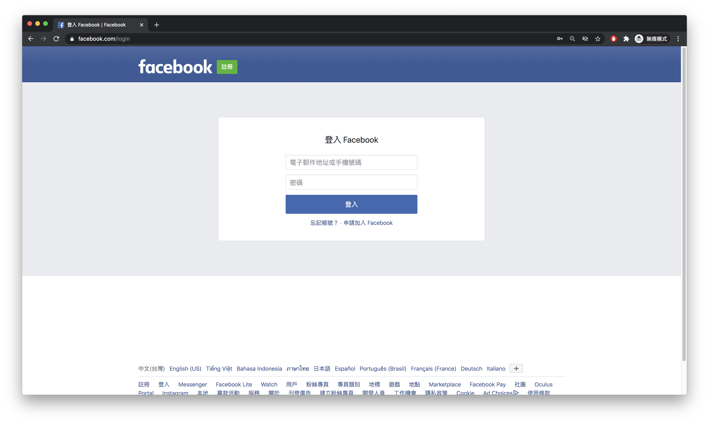
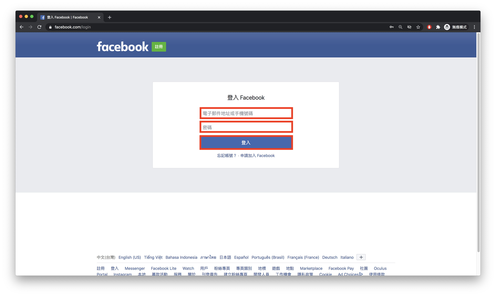
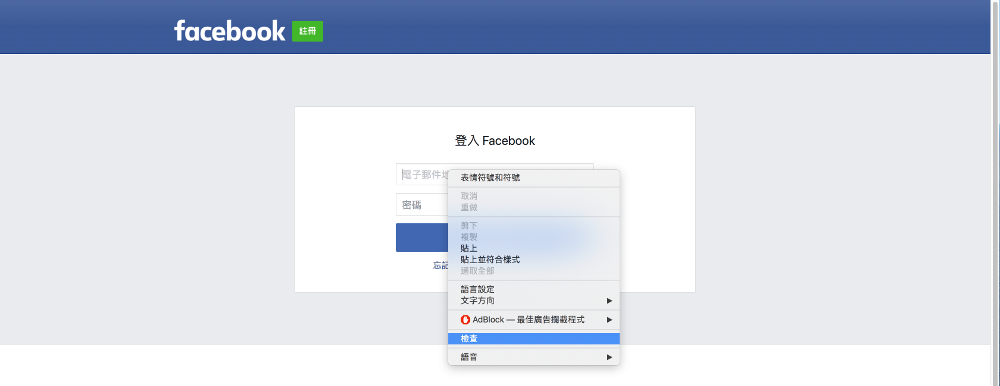
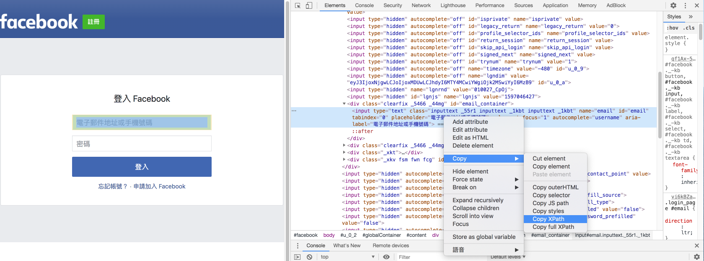

#### [回目錄](../README.md)
### Day7 分析Facebook網頁結構，打造自動登入FaceBook的機器人

如果昨天大家都能順利地啟動chrome前往自己想要去的網頁  
那今天我們來談你要如何拆解網頁的結構，今天所講的東西請一定要自己實作過一遍，因為FB更改網頁結構的速度很快，請培養自己解析網頁的能力  

分析Facebook網頁結構
----
* 先請大家用chrome無痕模式打開[FB](https://www.facebook.com/login)  
  

* 打開後會進入FB的登入畫面  


* 接下來我們便可以真的來做結構的分析了，把你平常登入FB的動作分成幾個步驟：
    1. 輸入電子郵件或電話
    2. 輸入密碼
    3. 按下登入按鈕

* 步驟出來後我們需要知道他在FB的哪些位置(以紅框標示處)  

* 接著對元件按下滑鼠右鍵點擊檢查進入開發者的介面

* 然後你就會看到一堆不友善的程式碼，這個時候別緊張，我們原則上不需要理解他們在寫什麼，我們只要知他他在什麼位置就好

* 想知道他位置的方法也很簡單，對開發者頁面的那個程式碼按右鍵->Copy->Copy Xpath

    你就會得到 **電子郵件或電話** 元件在這個頁面的位置如下
    ```
    //*[@id="email"]
    ```
    重複上面的步驟你面可以取得 **密碼** 元件的位置
    ```
    //*[@id="pass"]
    ```
    以及 **登入按鈕** 元件的位置
    ```
    //*[@id="loginbutton"]
    ```
    取得這三個元件後我們便可以開始撰寫程式  

打造自動登入FaceBook的機器人
----
1. 先填寫好自己.env的參數提供主程式使用
```js
require('dotenv').config(); //載入.env環境檔

//請在.env檔案填寫自己登入FB的真實資訊(建議開小帳號，因為如果爬蟲使用太頻繁你的帳號會被鎖住)
const fb_username = process.env.FB_USERNAME
const fb_userpass = process.env.FB_PASSWORD
```
2. 將套件中會使用到的函式引入
```js
const webdriver = require('selenium-webdriver'), // 加入虛擬網頁套件
    By = webdriver.By,//你想要透過什麼方式來抓取元件，通常使用xpath、css
    until = webdriver.until;//直接抓到這個元件
const chrome = require('selenium-webdriver/chrome');
const path = require('path');//載入路徑
const fs = require("fs");//讀取檔案用
```
3. 把主程式邏輯加上去
```js
async function loginFacebook () {
    
    checkDriver()// 檢查Driver是否是設定

    let driver = new webdriver.Builder().forBrowser("chrome").build();// 建立這個broswer的類型
    const web = 'https://www.facebook.com/login';//我們要前往FB
    await driver.get(web)//在這裡要用await確保打開完網頁後才能繼續動作

    //填入fb登入資訊
    //使用until是要求直到網頁顯示了這個元件才能執行下一步
    const fb_email_ele = await driver.wait(until.elementLocated(By.xpath(`//*[@id="email"]`)));//找出填寫email的元件
    fb_email_ele.sendKeys(fb_username)//將使用者的資訊填入
    const fb_pass_ele = await driver.wait(until.elementLocated(By.xpath(`//*[@id="pass"]`)));
    fb_pass_ele.sendKeys(fb_userpass)
    
    //抓到登入按鈕然後點擊
    const login_elem = await driver.wait(until.elementLocated(By.xpath(`//*[@id="loginbutton"]`)))
    login_elem.click()
}
loginFacebook()//登入FB
```
因為javascript本身是非同步語言，所以我們必須很明確地告訴程式他要執行的順序(**在async的函式中用await標明必須等待這項工作完成才能進入下一步**)，否則他實際跑起來的邏輯完全是隨機的，這部分可以參考這兩篇[文章1](https://ithelp.ithome.com.tw/articles/10194569)、[文章2](https://wcc723.github.io/javascript/2017/12/30/javascript-async-await/)來深入理解  

如果模擬器讓你成功登入FB可以在下方留言讓我知道喔，登入成功的瞬間有沒有充滿成就感呢？

上面這的程式碼可以在[這裡](https://github.com/dean9703111/ithelp_30days/day7)找到喔
你可以整個專案clone下來  
```
git clone https://github.com/dean9703111/ithelp_30days.git
```
如果你已經clone過了，那你每天pull就能取得更新的資料嚕  
```
git pull origin master
cd day7
調整你.env檔填上FB登入資訊
yarn
yarn start
```
### [Day8 關閉擾人彈窗，分析FB粉專結構並取得追蹤人數資訊](../day8/README.md)