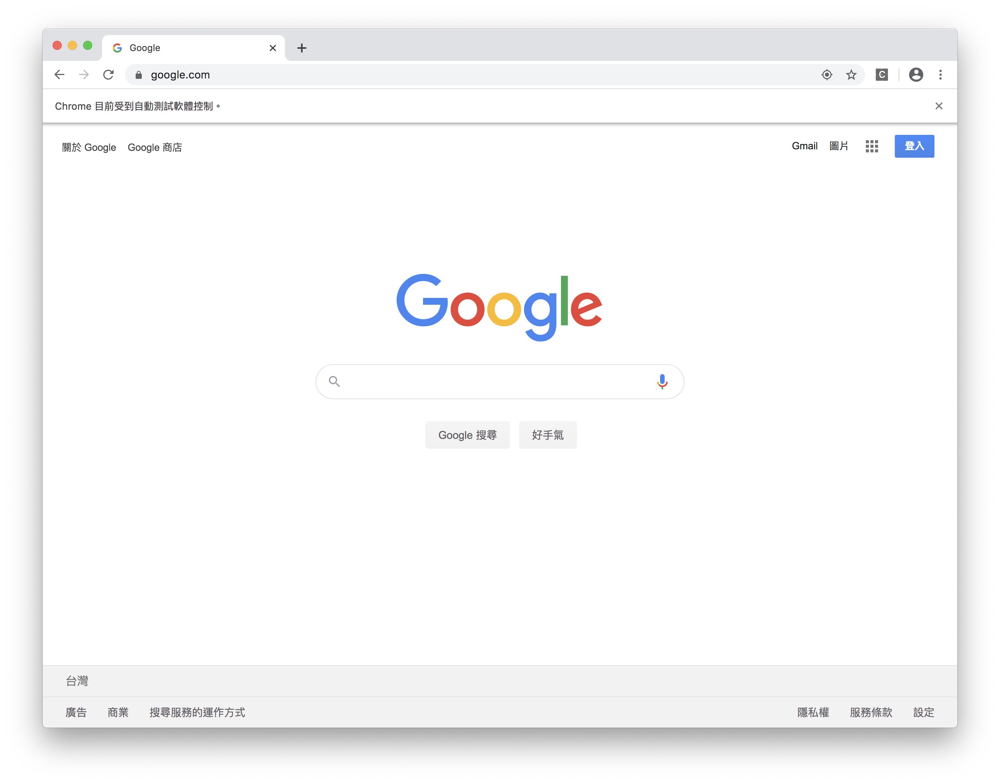

#### [回目錄](../README.md)
## Day8 selenium-爬蟲起手式

由於近年 FB & IG 的api改版頻繁，加上各式各樣權限的限制導致我們連公開資料都無法得到，所以在這裡我們放棄使用官方提供的api  
就像[Day5](/day5/README.md)所提到尋找工具的方法，如果無法使用官方資源，那我們可以從網路上尋找能夠符合我們需求的工具

今日目標
----
1. 知道如何選擇適合的爬蟲工具
2. 使用selenium-webdriver開啟瀏覽器
3. 解決windows無法自動讀取chromedriver.exe路徑的問題

爬蟲工具
----
網路上有非常多爬蟲的工具，以下我介紹幾個常用的
1. request & cheerio
    這應該是你下關鍵字候第一個找到的資源，他非常適合網頁工程師來使用，也能爬取絕大多數的網頁；但他在 FB、IG 面前毫無用武之地，可以說是完全無法使用(因為FB會偵測你使用的瀏覽器，他在那關就陣亡了)
2. selenium-webdriver
    這個是最土法煉鋼的爬蟲方式，但卻是最直覺好用的方法，他是直接開啟一個網頁，然後模擬人類真實的操作每個步驟，所以效率很差，但學習非常容易且直覺，所以這是我專案最後選擇的工具

selenium-webdriver
----
先前說過由於 FB & IG 的隱私權政策導致我們無法透過api直接取得我們所想要的資訊  
所以我們需要借助 **selenium-webdriver** 這個套件來開啟並執行你想要對網頁做的事情
我的文章會慢慢使用到它的各種功能，如果有迫不及待的小夥伴也可以先去[官網](https://www.selenium.dev/documentation/en/)來更深刻的了解他  

先在終端機(Terminal)下指令安裝他  
```
yarn add selenium-webdriver
```
因為本專案使用的模擬器是chrome，電腦還沒裝的請先[下載](https://www.google.com/intl/zh-TW/chrome/)
因為跑selenium需要用到driver，大家可以依照自己的作業系統做設定
+ mac 作業系統  
    * 如果你用的電腦是mac，恭喜你，不要需要額外下載chrome driver就能夠直接寫使用(不過chrome還是要下載)  
+ windows 作業系統  
    * 請下載[chrome driver](http://chromedriver.storage.googleapis.com/index.html)  
    * 這個driver需要跟你的[chrome版本相同](chrome://settings/help)  
    * 請將將這個**chromedriver.exe放到專案根目錄下**  

接下來就可以嘗試用selenium-webdriver打開爬蟲用網頁了
#### index.js
```js
require('dotenv').config(); //載入.env環境檔
const webdriver = require('selenium-webdriver') // 加入虛擬網頁套件

function openCrawlerWeb() {
    
    // 建立這個broswer的類型
    let driver = new webdriver.Builder().forBrowser("chrome").build();
    const web = 'https://www.google.com/';//填寫你想要前往的網站
    driver.get(web)//透國這個driver打開網頁
}
openCrawlerWeb()//打開爬蟲網頁
```
執行程式
----
在專案資料夾的終端機(Terminal)執行指令 **yarn start** ，如果執行順利，你會看到chrome的應用程式自動打開並且進入google的首頁  



如果windows無法自動讀取chromedriver.exe路徑
----
因為有人回報部分windows就算把chromedriver.exe放在專案根目錄也讀不到，所以特別寫了一個函式來自定義讀取chromedriver.exe的路徑  

* try-catch顧名思義就是先try，如果發生問題就會catch並執行錯誤處理；如果你有興趣可以先看這篇[文章](https://pjchender.blogspot.com/2017/12/js-error-handling.html)  
* **__dirname** 這個變數為目前檔案所在的資料夾路徑  
```js
const chrome = require('selenium-webdriver/chrome');
const path = require('path');//用於處理文件路徑的小工具
const fs = require("fs");//讀取檔案用

function checkDriver () {
    try {
        chrome.getDefaultService()//確認是否有預設        
    } catch {
        console.log('找不到預設driver!');
        const file_path = '../chromedriver.exe'//'../chromedriver.exe'是我的路徑
        console.log(path.join(__dirname, file_path));//請確認印出來日誌中的位置是否與你路徑相同
        if (fs.existsSync(path.join(__dirname, file_path))) {//確認路徑下chromedriver.exe是否存在            
            const service = new chrome.ServiceBuilder(path.join(__dirname, file_path)).build();//設定driver路徑
            chrome.setDefaultService(service);
            console.log('設定driver路徑');
        } else {
            console.log('無法設定driver路徑');
        }
    }
}
```

#### 將chromedriver.exe放到根目錄後記得在.gitignore把它加進去忽略清單喔，他不屬於需要版控的檔案
#### .gitignore
```
node_modules
.env
chromedriver.exe
```

與原程式統整
----
加入 **檢查Driver是否是設定的函式** 是比較完整的程式規劃，因為他能明確的告訴你執行錯誤的位置，之後會有文章來討論try-catch的重要性，統整後程式如下
#### index.js
```js
require('dotenv').config(); //載入.env環境檔
const webdriver = require('selenium-webdriver') // 加入虛擬網頁套件
const chrome = require('selenium-webdriver/chrome');
const path = require('path');//用於處理文件路徑的小工具
const fs = require("fs");//讀取檔案用

function checkDriver () {
    try {
        chrome.getDefaultService()//確認是否有預設        
    } catch {
        console.log('找不到預設driver!');
        const file_path = '../chromedriver.exe'//'../chromedriver.exe'是我的路徑
        console.log(path.join(__dirname, file_path));//請確認印出來日誌中的位置是否與你路徑相同
        if (fs.existsSync(path.join(__dirname, file_path))) {//確認路徑下chromedriver.exe是否存在            
            const service = new chrome.ServiceBuilder(path.join(__dirname, file_path)).build();//設定driver路徑
            chrome.setDefaultService(service);
            console.log('設定driver路徑');
        } else {
            console.log('無法設定driver路徑');
        }
    }
}

function openCrawlerWeb() {

    checkDriver()// 檢查Driver是否是設定
    
    // 建立這個broswer的類型
    let driver = new webdriver.Builder().forBrowser("chrome").build();
    const web = 'https://www.google.com/';//填寫你想要前往的網站
    driver.get(web)//透國這個driver打開網頁
}
openCrawlerWeb()//打開爬蟲網頁
```


專案原始碼
----
完整的程式碼可以在[這裡](https://github.com/dean9703111/ithelp_30days/day7)找到喔
你可以整個專案clone下來  
```
git clone https://github.com/dean9703111/ithelp_30days.git
```
如果你已經clone過了，那你每天pull就能取得更新的資料嚕  
```
git pull origin master
cd day7
yarn
yarn start
```
### [Day9 分析Facebook網頁結構，打造自動登入FaceBook的機器人](/day9/README.md)