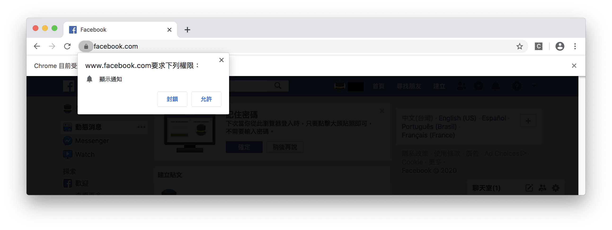
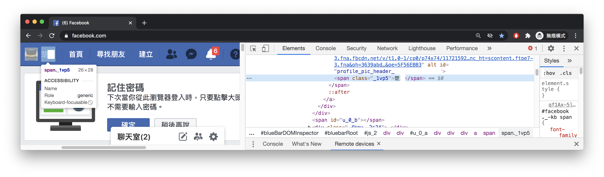
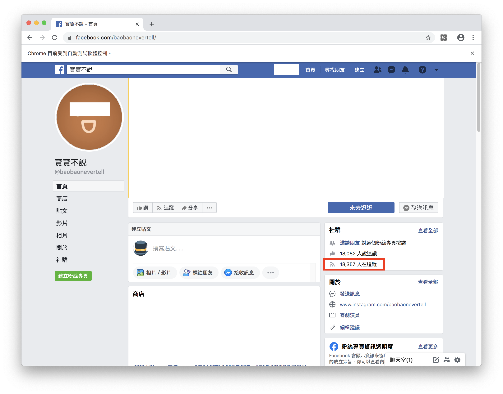
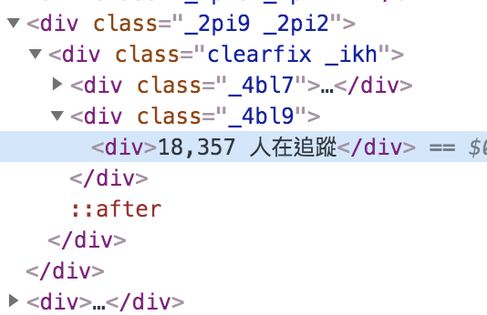

#### [回目錄](../README.md)
### Day8 關閉擾人彈窗，分析FB粉專結構並取得追蹤人數資訊


關閉擾人彈窗
----
昨天完成登入FB的時候應該大部分的人畫面都會長這樣  
  

這個彈窗會干擾到你的爬蟲的操作(你會無法抓取元件)，所以你必須要關閉這個彈窗  
請將下面的程式加入函式上方宣告
```js
const chrome = require('selenium-webdriver/chrome');
let options = new chrome.Options();
options.setUserPreferences({ 'profile.default_content_setting_values.notifications': 1 });//因為FB會有notifications干擾到爬蟲，所以要先把它關閉
```
加入上面對瀏覽器的設定後執行 **yarn start** 你會發現彈窗提示不見了

分析FB粉專結構並取得追蹤人數資訊
------------------------
* 我們同樣也將粉絲團取資料分成幾個步驟：
    1. 進入粉絲團網頁
    2. 找出追蹤者人數的元件位置
    3. 關閉瀏覽器

大家可以自己先按照昨天所說的方法來實做看看會遇到什麼樣的問題，下面我會把我鎖  
1. **進入粉絲團網頁**
登入後導向網頁到粉絲專頁非常簡單，兩行程式碼就解決
```js
//登入成功後要前往粉專頁面
const fanpage = "https://www.facebook.com/baobaonevertell/" // 筆者是寶寶不說的狂熱愛好者
await driver.get(fanpage)
```
但實際執行你會發現很詭異的事情，就是在你登入成功前你的網頁就直接導向到粉絲專頁了  
這是因為FB在執行登入作業時需要等待server回應資料確認使用者身份，所以你在按下登入的按鈕後要先給瀏覽器一些時間回應  
所以我們要先**找出登入後才會有的元件**，判斷這個元件已經存在我們才能入下個步驟(本專案以右上角名字區塊做為判定)  
  
```js
//因為登入這件事情要等server回應，你直接跳轉粉絲專頁會導致登入失敗
await driver.wait(until.elementLocated(By.xpath(`//*[contains(@class,"_1vp5")]`)))//登入後才會有右上角的名字，我們以這個來判斷是否登入

//登入成功後要前往粉專頁面
const fanpage = "https://www.facebook.com/baobaonevertell/" // 筆者是寶寶不說的狂熱愛好者
await driver.get(fanpage)
```
2. **找出追蹤者人數的元件位置**
  
你把紅框位置的Xpath複製出來會長這樣
```
//*[@id="PagesProfileHomeSecondaryColumnPagelet"]/div/div[1]/div/div[1]/div[4]/div/div[2]/div
```
如果你只要爬這個粉絲團的話用這個Xpath就足夠了，但你如果常逛粉絲團，你會發現每個粉絲團顯示追蹤人數的Xpath位置都不一樣  
下面提供幾個粉絲團網址你可以點進去試試看  
[小姐非常有事](https://www.facebook.com/missunexpected2015/)
```
//*[@id="PagesProfileHomeSecondaryColumnPagelet"]/div/div[1]/div/div[2]/div[4]/div/div[2]/div
```
[人類圖澳洲](https://www.facebook.com/HumanDesignAu/)
```
//*[@id="PagesProfileHomeSecondaryColumnPagelet"]/div/div[3]/div/div[2]/div[4]/div/div[2]/div
```
你仔細看會發現每個Xpath都會有細微的不同，所以昨天教的Xpath在這裡就失靈了，我們需要換一個方法來判斷，也就是該元件的class結構  
下面的幾張圖你可以觀察到這個追蹤者的資訊都在相同的 **class="_4bl9"** 之下  


  
但是有很多的元件都共用這些class所以我們需要把所有符合的class都抓下來，透過分析字串來抓取正確的資訊

#### index.js
```js
...
let fb_trace = 0;//這是紀錄FB追蹤人數
//因為考慮到登入之後每個粉專顯示追蹤人數的位置都不一樣，所以就採用全抓在分析
const fb_trace_xpath = `//*[@id="PagesProfileHomeSecondaryColumnPagelet"]//*[contains(@class,"_4bl9")]`
const fb_trace_eles = await driver.wait(until.elementsLocated(By.xpath(fb_trace_xpath)), 5000)//我們採取5秒內如果抓不到該元件就跳出的條件
for (const fb_trace_ele of fb_trace_eles) {
    const fb_text = await fb_trace_ele.getText()
    if (fb_text.includes('人在追蹤')) {
        fb_trace = fb_text
        break
    }
}
console.log(`追蹤人數：${fb_trace}`)
...
```
這裡使用的是 **for/of迴圈** ，特別說明一下[foreach裡面是不能用await去跑的](https://stackoverflow.com/questions/37576685/using-async-await-with-a-foreach-loop)，這裡有[介紹各種for迴圈的文章](https://www.jishuwen.com/d/2M0c/zh-tw)歡迎參考  

接下來在終端機輸入 **yarn start** 指令，如果能正確輸出該粉專的追蹤人數你就成功嚕～  

3. **關閉瀏覽器**
如果你執行完後想要關閉瀏覽器只需要加入這行程式  
```js
driver.quit();
```

相信到這裡大家都能成功地抓出粉專的追蹤者人數了，相信大家對於這個爬蟲專案應該充滿了信心吧！

上面這的程式碼可以在[這裡](https://github.com/dean9703111/ithelp_30days/day8)找到喔
你可以整個專案clone下來  
```
git clone https://github.com/dean9703111/ithelp_30days.git
```
如果你已經clone過了，那你每天pull就能取得更新的資料嚕  
```
git pull origin master
cd day8
調整你.env檔填上FB登入資訊
yarn
yarn start
```
### [Day9 依樣畫葫蘆，完成Instagram登入並取得追蹤人數](../day9/README.md)