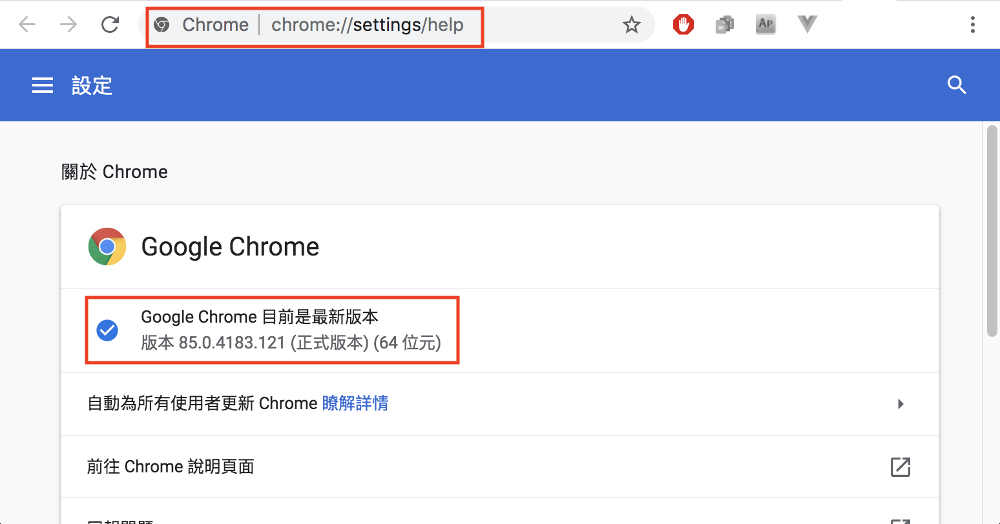
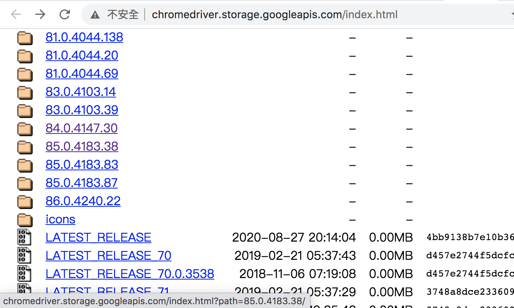
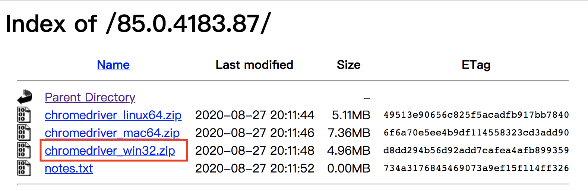

#### [回目錄](../README.md)
## Day8 selenium-webdriver：爬蟲起手式，帶你認識所見即所得的爬蟲工具

🤔 為什麼選爬蟲作為主題?
----
在決定以爬蟲作為主題時有朋友勸我不要寫這類有爭議的主題，但因為以下幾點我還是選了這個主題：
1. **爬蟲道德觀**：有些網路文章道德觀崩壞，把一個好的技術變成智慧財產的盜賊
2. **中文資源缺乏，技術過時**：中文的教學文章較少，許多範例的技術到今天已經無法使用了
3. **缺乏系統性的整合**：網路上的資源相對零碎，學習上缺乏系統性，容易在學習過程中遇到問題而半途而廢

🤔 學習爬蟲對我有什麼好處?
----
* **如果你是工程師**
    1. 最直接的好處就是讓你在`未來職涯上有更多的選擇`
    2. 可以大量`訓練你對網頁架構的認知`
    3. 當你學會爬蟲時，你就能寫出相對來說`反爬蟲的網頁`了
* **如果你是行銷廣告、電商小編**
    1. 你可以透過爬蟲來`了解網路世界在資料這塊的邏輯`
    2. 就算你看完文章後還是無法完全掌握，但當你請工程師來撰寫爬蟲時，你能很具體地`說出你的需求並與工程師溝通順暢`
    3. 我認為掌握`分析資料能力`的人才最有機會做出能說服公司的策略


🏆 今日目標
----
1. 知道如何選擇適合的爬蟲工具
2. 使用selenium-webdriver開啟瀏覽器
3. 解決windows無法自動讀取chromedriver.exe路徑的問題
    * 寫判斷Driver是否設定的函式

🤔 如何選擇適合的爬蟲工具?
----
在[Day5](/day5/README.md)我們有提到尋找工具的方法，現在我們依序的來說明:
1. 官方資源
    * 由於近年 FB & IG 的api改版頻繁，加上各式各樣權限的限制導致我們連公開資料都無法得到，所以在這裡我們放棄使用官方提供的api  
2. 網路資源
    * 透過下關鍵字我們可以看到很多人分享相關爬蟲的經驗，我們可以先把這些範例用到的套件記錄下來
3. 查詢npm套件
    * 我們已經透過網路資源搜索到很多看起來能使用的套件，但能否應用在我們的實際需求就需要近一步透過實際測試來確認，以下是我當時找到的資源並附上時測後的分析:
        1. request & cheerio
            * 下關鍵字候第一個找到的資源，使用範例程式測試後確認他可以透過網址抓到網頁元素並進行分析
            * but...他在 FB、IG 面前毫無用武之地，因為FB會偵測你使用的瀏覽器，所以在第一關他就陣亡了
        2. selenium-webdriver
            * 基本上他是一個無論是什麼網頁都能夠爬蟲的工具了，我認為非常適合新手使用
            * 工具執行時會開啟一個網頁，然後模擬人類真實的操作每個步驟，所以效率相對差
            * 所見即所得，看得到的資訊都能夠抓下來，學習起來非常容易且直覺，所以這是`本專案最後選擇的工具`
        3. Puppeteer(邦友補充)
            * 操作邏輯與 selenium-webdriver 非常類似
            * 預設附帶 Chronium 瀏覽器，不會有瀏覽器匹配問題(但是只能用這個瀏覽器QQ)
            * 只能使用 Node.js 撰寫，不像 selenium-webdriver 有多種語言的 binding


🔧 使用selenium-webdriver開啟瀏覽器
----
我的文章會會依據需求使用到它的各種功能，如果有迫不及待的小夥伴也可以先去[官網](https://www.selenium.dev/documentation/en/)來更深刻的了解他  

1. 前置環境安裝
    * 先在終端機(Terminal)下指令安裝他  
        ```
        yarn add selenium-webdriver
        ```
    * 本專案使用的模擬器是chrome，電腦還沒裝的請先[下載](https://www.google.com/intl/zh-TW/chrome/)
    * 因為跑selenium需要用到driver，大家可以依照自己的作業系統做設定
        + **mac 作業系統**  
            * 如果你用的電腦是mac，恭喜你，不要需要額外下載chrome driver就能夠直接寫使用(不過chrome還是要下載)  
        + **windows 作業系統**
            1. **先確認自己chrome版本**：將`chrome://settings/help`貼到你的網址列
                
            2. 下載`與你chrome版本相同`的[chrome driver](http://chromedriver.storage.googleapis.com/index.html)  
                
                
            * 下載的壓縮檔解壓縮後把`chromedriver.exe放到專案根目錄下`

2. 嘗試用selenium-webdriver打開爬蟲用網頁
    #### index.js
    ```js
    require('dotenv').config(); //載入.env環境檔
    const webdriver = require('selenium-webdriver') // 加入虛擬網頁套件

    function openCrawlerWeb() {
        
        // 建立這個broswer的類型
        let driver = new webdriver.Builder().forBrowser("chrome").build();
        const web = 'https://www.google.com/';//填寫你想要前往的網站
        driver.get(web)//透國這個driver打開網頁
    }
    openCrawlerWeb()//打開爬蟲網頁
    ```

🚀 執行程式
----
在專案資料夾的終端機(Terminal)執行指令
```vim
yarn start
```
如果執行順利，你會看到chrome的應用程式自動打開並且進入google的首頁  


😭 解決windows無法自動讀取chromedriver.exe路徑
----
因為有人回報部分windows就算把chromedriver.exe放在專案根目錄也讀不到，所以特別寫了一個 **checkDriver** 的函式，邏輯如下：
* 判斷是否有預設的chromedriver
    * Yes &rarr; 無須設定
    * No &rarr; 確認路徑下是否有 **chromedriver.exe** 的檔案
        * Yes  &rarr; 設定driver路徑
        * No &rarr; 無法設定driver路徑回傳false

* 備註
    * try-catch顧名思義就是先try，如果發生問題就會catch並執行錯誤處理
    * **__dirname** 這個變數為目前檔案所在的資料夾路徑  
```js
const chrome = require('selenium-webdriver/chrome');
const path = require('path');//用於處理文件路徑的小工具
const fs = require("fs");//讀取檔案用

function checkDriver() {
    try {
        chrome.getDefaultService()//確認是否有預設
    } catch {
        console.log('找不到預設driver!');
        const file_path = '../chromedriver.exe'//'../chromedriver.exe'記得調整成自己的路徑
        console.log(path.join(__dirname, file_path));//請確認印出來日誌中的位置是否與你路徑相同
        if (fs.existsSync(path.join(__dirname, file_path))) {//確認路徑下chromedriver.exe是否存在            
            const service = new chrome.ServiceBuilder(path.join(__dirname, file_path)).build();//設定driver路徑
            chrome.setDefaultService(service);
            console.log('設定driver路徑');
        } else {
            console.log('無法設定driver路徑');
            return false
        }
    }
    return true
}
```

* 將chromedriver.exe放到根目錄後記得在.gitignore把它加進去忽略清單喔，他不屬於需要版控的檔案
    #### .gitignore
    ```
    node_modules
    .env
    chromedriver.exe
    ```

🔀 與原程式統整
----
加入 **checkDriver** 函式來檢查Driver是否是設定是比較完整的程式規劃，因為他能明確的告訴你執行錯誤的位置，之後會有文章來討論try-catch的重要性，統整後程式如下
#### index.js
```js
require('dotenv').config(); //載入.env環境檔
const webdriver = require('selenium-webdriver') // 加入虛擬網頁套件
const chrome = require('selenium-webdriver/chrome');
const path = require('path');//用於處理文件路徑的小工具
const fs = require("fs");//讀取檔案用

function checkDriver() {
    try {
        chrome.getDefaultService()//確認是否有預設
    } catch {
        console.log('找不到預設driver!');
        const file_path = '../chromedriver.exe'//'../chromedriver.exe'記得調整成自己的路徑
        console.log(path.join(__dirname, file_path));//請確認印出來日誌中的位置是否與你路徑相同
        if (fs.existsSync(path.join(__dirname, file_path))) {//確認路徑下chromedriver.exe是否存在            
            const service = new chrome.ServiceBuilder(path.join(__dirname, file_path)).build();//設定driver路徑
            chrome.setDefaultService(service);
            console.log('設定driver路徑');
        } else {
            console.log('無法設定driver路徑');
            return false
        }
    }
    return true
}

function openCrawlerWeb() {

    if (!checkDriver()) {// 檢查Driver是否是設定，如果無法設定就結束程式
        return
    }
    
    // 建立這個broswer的類型
    let driver = new webdriver.Builder().forBrowser("chrome").build();
    const web = 'https://www.google.com/';//填寫你想要前往的網站
    driver.get(web)//透國這個driver打開網頁
}
openCrawlerWeb()//打開爬蟲網頁
```

ℹ️ 專案原始碼
----
* 今天的完整程式碼可以在[這裡](https://github.com/dean9703111/ithelp_30days/tree/master/day8)找到喔
* 我也貼心地把昨天的把昨天的程式碼打包成[壓縮檔](https://github.com/dean9703111/ithelp_30days/raw/master/sampleCode/day7_sample_code.zip)，你可以用裡面乾淨的環境來實作今天的功能喔
    * 請記得在終端機下指令 **yarn** 才會把之前的套件安裝

📖 參考資源
----
1. [\[JS\] 談談 JavaScript 中的錯誤處理 Error Handling](https://pjchender.blogspot.com/2017/12/js-error-handling.html)
2. [為什麼用 (或不用) Puppeteer](https://michaelchen.tech/puppeteer/why-or-why-not-puppeteer/)
<br>

>*免責聲明:文章技術僅抓取公開數據作爲研究，任何組織和個人不得以此技術盜取他人智慧財產、造成網站損害，否則一切后果由該組織或個人承擔。作者不承擔任何法律及連帶責任！*
### [Day9 爬蟲第一步，FB先登入](/day9/README.md)